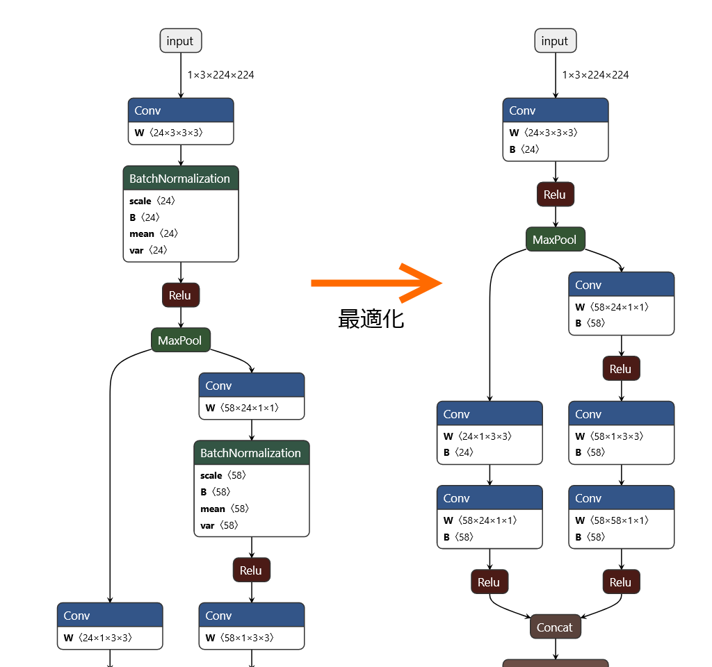

# ONNX : 公式オプティマイザの限界と自力最適化

# ONNX : 公式オプティマイザの限界と自力最適化

[](https://medium.com/@mogi_15387?source=post_page---byline--ee5bab607d7b---------------------------------------)

[MOGI Kazuhiro](https://medium.com/@mogi_15387?source=post_page---byline--ee5bab607d7b---------------------------------------)

7 min read

·

Apr 14, 2020

--

Share

エッジ向け推論フレームワークである[ailia SDK](https://ailia.jp/)ではONNXを使用してGPUを使用した高速な推論を行うことができます。この記事では、[ailia SDK](https://ailia.jp/)の開発の過程で得られたONNXのモデル最適化の知見を紹介します。

[前回](https://medium.com/axinc/onnx-%E3%83%A2%E3%83%87%E3%83%AB%E3%81%AE%E6%9C%80%E9%81%A9%E5%8C%96-%E5%85%AC%E5%BC%8F%E3%82%AA%E3%83%97%E3%83%86%E3%82%A3%E3%83%9E%E3%82%A4%E3%82%B6%E3%81%AE%E6%B4%BB%E7%94%A8-a9b6c8302374)記述したように ONNX 公式のオプティマイザを使うことで ONNX 形式モデルの推論向け最適化を行うことが可能なのですが、残念なことに ONNX 公式オプティマイザは万能ではありません。

ONNX 公式オプティマイザには、入力モデルによってはエラーで処理を中断したり、壊れたモデルファイルを出力することがあります。 この不具合は GitHub で issue [[1](https://github.com/onnx/onnx/issues/2417) | [2](https://github.com/onnx/onnx/issues/1385)] も作成されているのですが、長期間放置されています。

今回は ONNX 形式モデルの最適化を ONNX 公式オプティマイザを利用せずに行うとしたら、どうすればよいかを解説します。

### 今回の最適化対象

[ONNX Model Zoo](https://github.com/onnx/models) にある [sufflenet v2](https://github.com/onnx/models/tree/master/vision/classification/shufflenet_v2) の最適化を考えます。このモデルに対して ONNX 公式オプティマイザで最適化を行うと、次のエラーが表示され最適化に失敗します。

```
Traceback (most recent call last):  
  File "official_optimize.py", line 41, in <module>  
    model = onnx.optimizer.optimize(model, ['fuse_bn_into_conv'] )  
  File "C:\opt\Python36\lib\site-packages\onnx\optimizer.py", line 55, in optimize  
    optimized_model_str = C.optimize(model_str, passes)  
IndexError: invalid unordered_map<K, T> key
```

このモデルを python スクリプトのみで onnx.optimizer を利用せずに最適化することを考えます。

### 最適化スクリプト

sufflenet に対してそのまま適用可能な最適化スクリプトは次のリンクから取得可能です。

このスクリプトを実行すると、次の最適化前後の画像のように BatchNormalization を Conv に還元して最適化することができます。

Press enter or click to view image in full size



### 動作確認環境

このスクリプトは次の環境で動作確認を行いました。

- Windows 10
- Python 3.6.6
- numpy 1.18.1
- onnx 1.6.0
- [sufflenet v2 2019/3/10 版](https://github.com/onnx/models/tree/fef7d85d8b186dbff3ba42f79479829125d36630/vision/classification/shufflenet_v2)

### 最適化処理基本構成

python スクリプトで ONNX 形式モデルの最適化を行う場合、基本的な処理の流れは次の形になります。

1. ONNX 形式モデルを読み込む
2. 読み込んだモデルのノード構成やパラメータを変更する
3. 変更したノード構成とパラメータを元に新しいモデルを作成する
4. 変更後のモデルを保存する

1番目と4番目の ONNX 形式モデルの読み込みと保存には python の onnx ライブラリで提供されている機能を利用します。3番目の新しいモデルの作成には python の onnx.helper ライブラリの機能を利用します。

2番目のノード構成とパラメータの変更が最適化処理の実体です。ここでBatchNormalization のパラメータと Conv のパラメータの変換処理を行うのですが、この演算には python の numpy ライブラリを使います。

ただし、 onnx ライブラリでロードしたモデルのパラメータは onnx.TensorProto という形式で読み込まれています。これは直接 numpy の ndarray 形式として扱うことができません。TensorProto と ndarray の相互変換を行い numpy での演算が可能にするために onnx.numpy\_helper ライブラリを利用します。

## Get MOGI Kazuhiro’s stories in your inbox

Join Medium for free to get updates from this writer.

Subscribe

Subscribe

Remember me for faster sign in

これらの ONNX が提供しているライブラリ API の詳細は ONNX の Python API Overview ドキュメントに記述されています。

[## onnx/onnx

### Runnable IPython notebooks: Runnable IPython notebooks: Runnable IPython notebooks: Runnable IPython notebooks…

github.com](https://github.com/onnx/onnx/blob/master/docs/PythonAPIOverview.md?source=post_page-----ee5bab607d7b---------------------------------------)

### BatchNormalization の Conv への還元

BatchNormalization には次のパラメータが存在します。

1. scale
2. bias
3. mean
4. var

Conv には次のパラメータが存在します。

1. weight
2. bias

BatchNormalization の実際の演算は次の疑似コードで示す内容です。

このコードは次の形に変更することが可能です。

上記疑似コードで [A] / [B] として示した scale\_dash / bias\_dash は Conv のパラメータの weight / bias に次のように還元することが可能です。

C/C++ 風味の疑似コードで記述すると上の形になりますが、python の numpy には要素単位処理とブロードキャストという機能があるのでより簡潔に記述することができます。python 風味の疑似コードで同じ処理を書くと次の形になります。

BatchNormalization のパラメータを Conv のパラメータに変換する処理はこれだけです。後は次の処理を行えばノード＆パラメータの書き換え処理は完了です。

1. 変更したパラメータを Initialier としてモデルに埋め込む
2. 利用しなくなったパラメータを Initializaer から削除する
3. 埋め込んだ Initializer を参照するように当該 Conv を書き換える
4. 不要になった BatchNormalization を削除する
5. 削除した BatchNormalization の出力を参照している入力を、Conv の出力を参照するように書き換える

こうした処理と、これらに付随する細々とした処理を行うのが、今回の最適化スクリプトです。あらためてリンクを提示します。

### 今回の最適化の効果

残念ながら最適化前後のモデルで ONNX Runtime を利用して推論を回してみたのですが、元々のモデルが十分高速なためか、実行時間に差を観測することができませんでした。このため、最適化の効果は省略します。

最適化前後のモデルで推論結果が変化しないことは確認しており、Netron でモデルの変換が意図通りに行われていることも確認できているため問題ないと判断しています。

### まとめ

このように、ONNX 公式オプティマイザでエラーとなり最適化できない ONNX 形式モデルであっても、python の onnx ライブラリが提供する helper 機能を利用し個別にモデルを書き換えることで ONNX 公式オプティマイザと同じ最適化を行うことができます。

ax株式会社はAIを実用化する会社として、クロスプラットフォームでGPUを使用した高速な推論を行うことができるailia SDKを開発しています。ax株式会社ではコンサルティングからモデル作成、SDKの提供、AIを利用したアプリ・システム開発、サポートまで、 AIに関するトータルソリューションを提供していますのでお気軽に[お問い合わせ](https://axinc.jp/)ください。