# InceptionV3 : 画像に何が映っているかを判定する

# **InceptionV3 : 画像に何が映っているかを判定する**

[Tsukasa Sekiya](/@sekiya_99379?source=post_page---byline--b39dd43f285d---------------------------------------)

Apr 28, 2020

--

Share

[ailia SDK](https://ailia.jp/)で使用できる機械学習モデルである「InceptionV3」のご紹介です。エッジ向け推論フレームワークである[ailia SDK](https://ailia.jp/)と[ailia MODELS](https://github.com/axinc-ai/ailia-models)に公開されている機械学習モデルを使用することで、簡単にAIの機能をアプリケーションに実装することができます。

---

## InceptionV3とは

InceptionV3はGoogleが開発したImageNetの1000クラス分類向けのネットワークアーキテクチャです。InceptionV3では、読み込まれた画像の中になにが含まれているか判定することができます。

[## axinc-ai/ailia-models

### Ailia input shape: (1,3,299,299) Range: [0.0, 255.0] class\_count=3 + idx=0 category=409[ analog clock ]…

github.com](https://github.com/axinc-ai/ailia-models/tree/master/image_classification/inceptionv3?source=post_page-----b39dd43f285d---------------------------------------)

このモデルは、画像ファイルを入力として、[1000のカテゴリ](https://gist.github.com/yrevar/942d3a0ac09ec9e5eb3a)の中から何が最もふさわしいかを確率順に表示します。

例として、ルリノジコ(indigo)を読み込ませてみようと思います。

Press enter or click to view image in full size

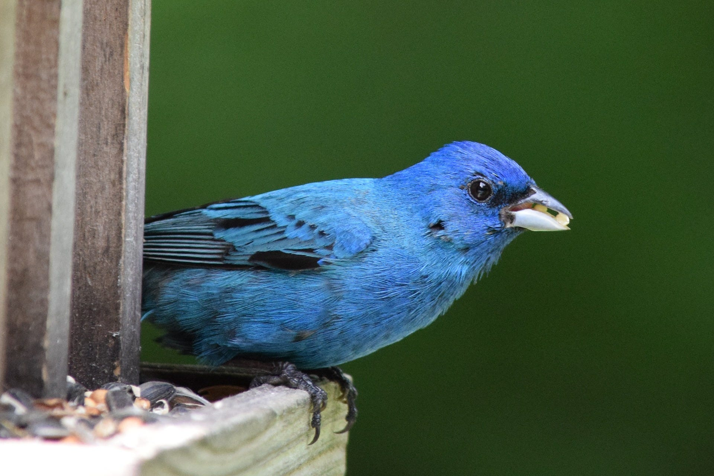

読み込ませるルリノジコの画像 ([pixaboy](https://pixabay.com/ja/photos/%E8%97%8D-%E4%B8%87%E5%9B%BD%E6%97%97-%E9%B3%A5-%E3%82%B7%E3%83%BC%E3%83%89-%E9%9D%92-3590762/))

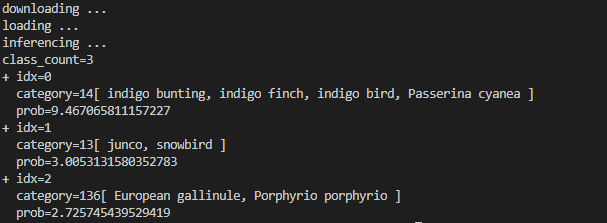

実行結果

このように、一番上のカテゴリの中にindigo bunting, indigo finch, indigo bird, Passerina cyaneaと表示されました。indigoはルリノジコのことなので、この画像の認識は成功です。

次に画像を取り替えて赤単色で表現されたルリノジコの画像を読み込ませてみましょう。

読み込ませるルリノジコの画像

Press enter or click to view image in full size

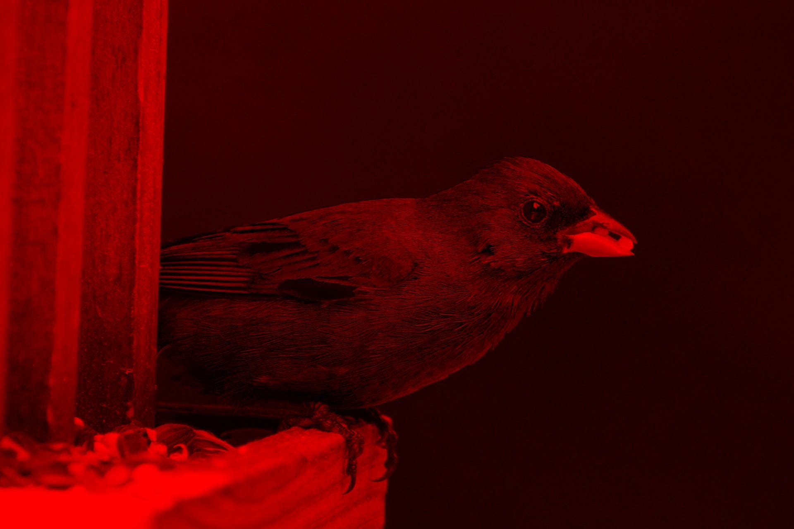

赤以外の色の要素を０にしたもの

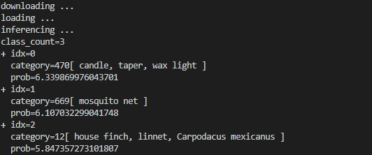

実行結果

実行結果は、candle,taper,wax light、とすべて「ろうそく」のことを示しています。赤以外の色の要素が抜けたことによって判別ができなくなっていると思われます。

次に、ルリノジコに多く使われる青単色の画像を読み込ませて結果を出力してみようと思います。

読み込ませるルリノジコの画像

Press enter or click to view image in full size

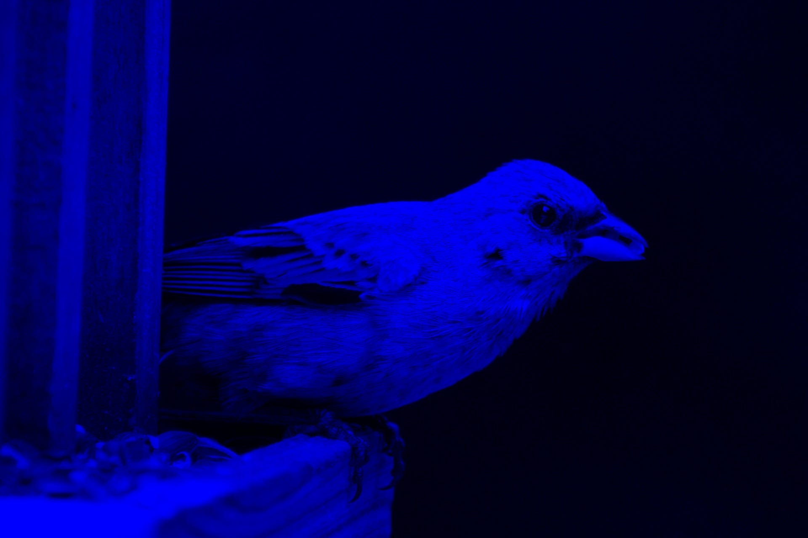

青以外の要素を０にしたもの

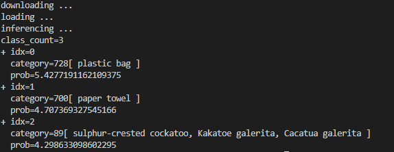

実行結果

第一候補にplastic bag（ビニール袋）と表示されました。おそらく、ルリノジコの青と左側にある木の中の要素の青が合致したため、ビニール袋という結果が表示されたと思われます。

次に赤の要素のみを無くした青と緑の２色で表現されたルリノジコの画像を読み込ませてみましょう。

読み込ませたルリノジコの画像

Press enter or click to view image in full size

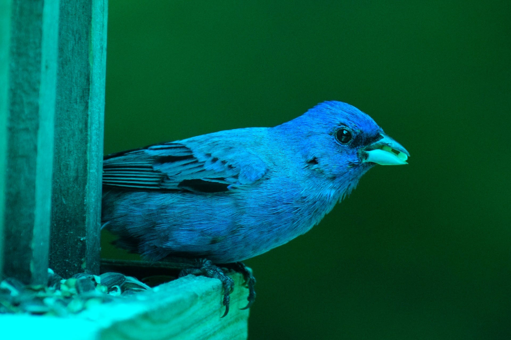

青と緑で表現されたルリノジコ

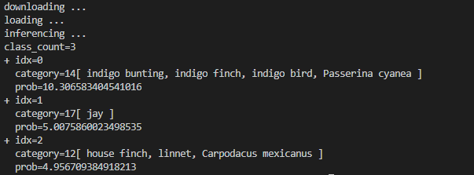

実行結果

実行結果はもとの画像を読み込ませたときと同じになりましたした。最初の実行結果とprobの値が異なるのは、ルリノジコの要素である青が強く反映されたため、青と緑の二色で表現されたほうが合致率が上がりました。余計な赤の要素がなくなったためと思われます。

## InceptionV3のモデルアーキテクチャ

InceptionV3はGoogLeNetのInceptionモジュールにスケーラビリティをもたせたモデルアーキテクチャになっています。

[## Rethinking the Inception Architecture for Computer Vision

### Convolutional networks are at the core of most state-of-the-art computer vision solutions for a wide variety of tasks…

arxiv.org](https://arxiv.org/abs/1512.00567?source=post_page-----b39dd43f285d---------------------------------------)

> 2012年に登場したAlexNetがImageNetで劇的な性能改善を見せてから、CNNはオブジェクトディテクション、セグメンテーション、ヒューマンポーズエスティメーション、ビデオクラシフィケーション、オブジェクトトラッキング、スーパーレゾリューションと、成功例を広げてきました。これらは、高性能なCNNのモデルアーキテクチャの探索に拍車をかけました。2013年には、VGGNetやGoogLeNetが提案されました。
>
> VGGNetはシンプルなアーキテクチャですが演算量が大きいという問題があります。GoogLeNetのInceptionアーキテクチャはメモリと演算量を抑制します。具体的に、5 millionのパラメータであり、AlexNetの60 millionのパラメータに比べて12倍、効率的です。VGGNetはAlexNetの3倍のパラメータが必要です。Inceptionの演算量はVGGNetに比べて効率的であり、特にモバイルにおいては重要です。
>
> しかし、ネットワークアーキテクチャを単純にスケールアップすると、演算量の優位性は失われていまします。例えば、より大きな問題を解くために、Inception-styleのモデルのフィルタバンクを2倍にすると、演算量とパラメータの数は4倍になります。この論文では、スケーリングアップを効率的にする方法を説明するとともに、Inceptionモジュールにフレキシビリティを与えます。
>
> （出典：<https://arxiv.org/abs/1512.00567>）

GoogLeNetのInceptionモジュールは下記の構造になっています。直線的なVGGに比べて、入力が横に広がって、集約されるという構造を持っています。

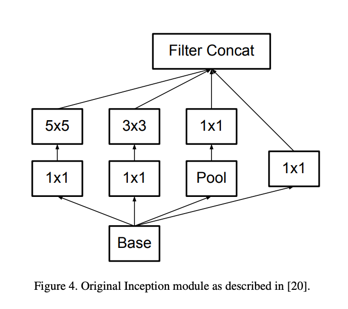

（出典：<https://arxiv.org/abs/1512.00567>）

InceptionV3ではカーネルサイズ5のConvolutionを、カーネルサイズ3のConvolutionを2段に置き換えています。

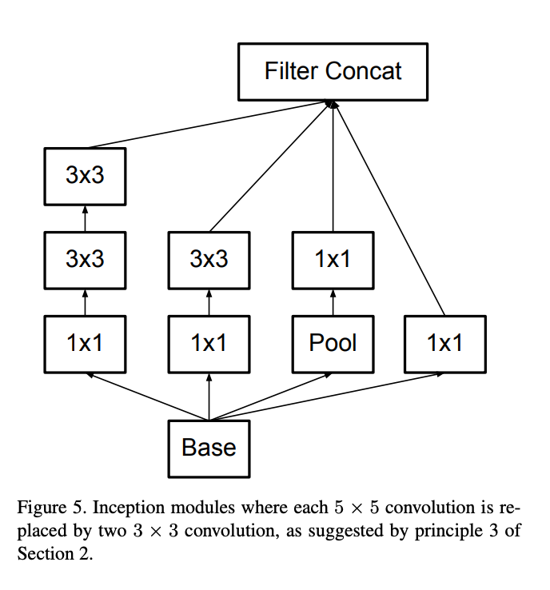

（出典：<https://arxiv.org/abs/1512.00567>）

また、カーネルサイズをnとしてInceptionモジュールを一般化しています。

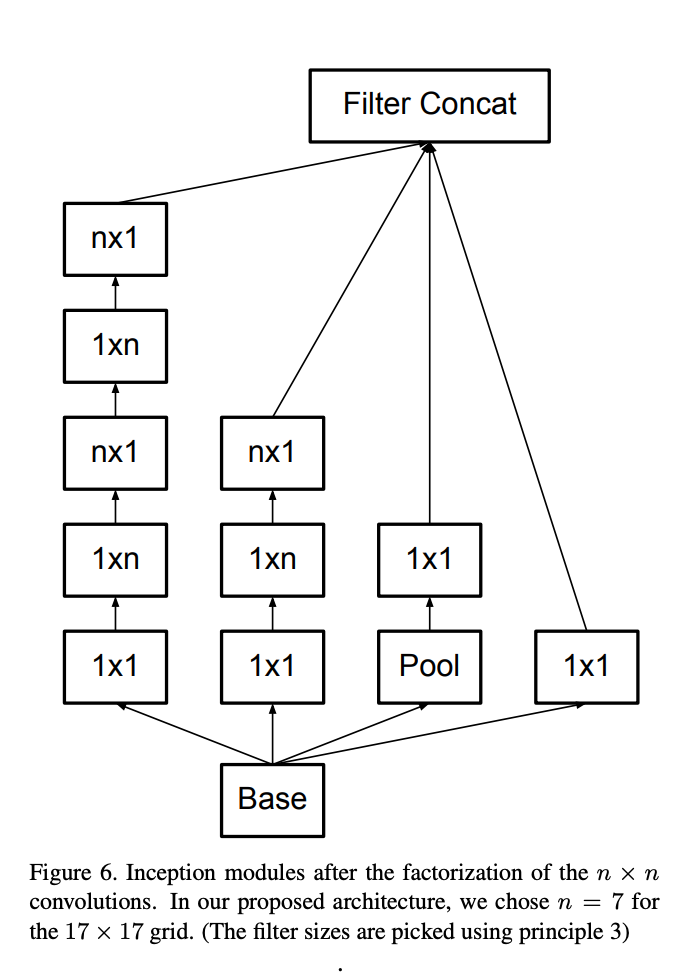

（出典：<https://arxiv.org/abs/1512.00567>）

---

ax株式会社はAIを実用化する会社として、クロスプラットフォームでGPUを使用した高速な推論を行うことができるailia SDKを開発しています。ax株式会社ではコンサルティングからモデル作成、SDKの提供、AIを利用したアプリ・システム開発、サポートまで、 AIに関するトータルソリューションを提供していますのでお気軽に[お問い合わせ](https://axinc.jp/)ください。