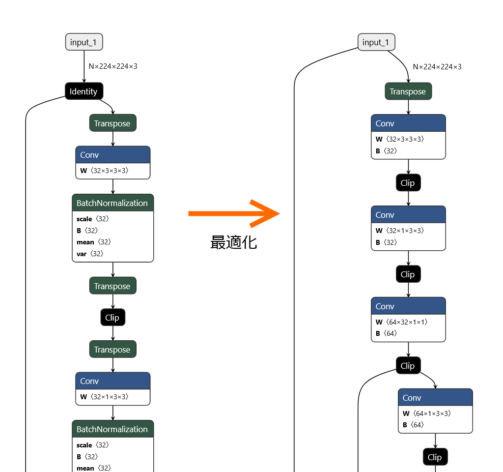
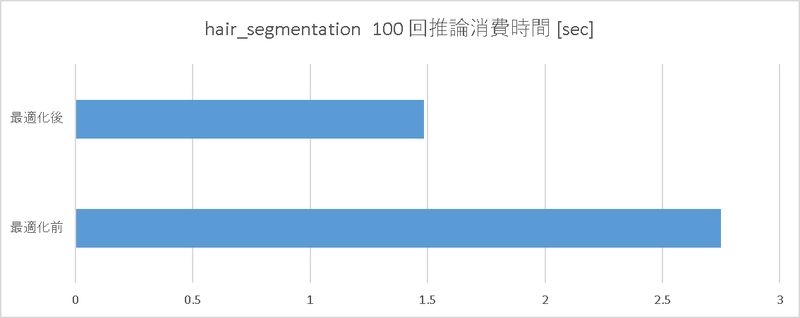
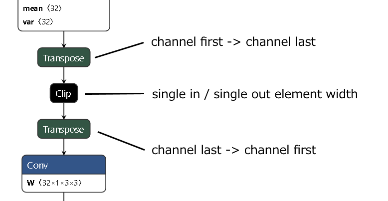

# Keras から変換したONNXモデルに含まれる Transpose の除去

# Keras から変換したONNXモデルに含まれる Transpose の除去

[MOGI Kazuhiro](https://medium.com/@mogi_15387?source=post_page---byline--9ec88b9ddc46---------------------------------------)

6 min read

·

Jul 13, 2020

--

Share

エッジ向け推論フレームワークである[ailia SDK](https://ailia.jp/)ではONNXを使用してGPUを使用した高速な推論を行うことができます。この記事では、[ailia SDK](https://ailia.jp/)の開発の過程で得られたONNXのモデル最適化の知見を紹介します。

今回は [ailia-models](https://github.com/axinc-ai/ailia-models) に掲載している hair\_segmentation モデルの最適化手法を紹介します。

[## axinc-ai/ailia-models

### (from https://github.com/thangtran480/hair-segmentation/tree/master/assets) Ailia input shape(1, 224, 224, 3) Range:[0…

github.com](https://github.com/axinc-ai/ailia-models/tree/master/image_segmentation/hair_segmentation?source=post_page-----9ec88b9ddc46---------------------------------------)

こちらのモデルは Keras で学習されたものを ax 株式会社にて ONNX 形式にコンバートしたものです。ONNX 形式モデルとして、Keras からコンバートしたそのままのファイルと、コンバート後に最適化を実行したものの二つが用意されています。

### 最適化内容

最適化前後の二つのモデルを [Netron](https://github.com/lutzroeder/netron) で表示して比較すると、次のようになります。

Press enter or click to view image in full size

最適化前のモデルでは Clip の前後に Transpose が入っています。これらの Transpose のうち Clip の前に挿入されているのが channel first (N, C, H, W) のデータを channel last (N, H, W, C) に変換するもので、Clip の後に挿入されているものが channel last から channel first に戻すものです。

一方、最適化後のモデルでは Clip の前後にあった Transpose は削除され、Conv 直後の BatchNormalization も Conv と統合されています。

### 最適化の効果

ailia SDK 1.2.2 で backend に Vulkan を利用し、Windows 10 PC (GPU NVIDIA GTX 1650) 環境で 100 回推論を回した際の消費時間は、最適化前のモデルでは約 2.75 秒だったのに対して最適化後のモデルでは約 1.49 秒でした。約45%の処理時間削減に成功しています。

Press enter or click to view image in full size

### Kerasからの変換モデルで Transpose が多用される理由

ONNX の Conv や BatchNormalization は channel first (N, C, H, W) 形式を前提としているのに対して、Keras は channel last (N, H, W, C) 形式を採用するフレームワークです。

## Get MOGI Kazuhiro’s stories in your inbox

Join Medium for free to get updates from this writer.

Subscribe

Subscribe

Remember me for faster sign in

keras2onnx は ONNX モデルを出力する際、保守的に Conv / BatchNormalization の前後に Transpose を挿入して channel first / channel last の変換を行うことで channel order の相違を解消するため、Keras からの変換モデルには Transpose が頻出します。

### 最適化で Transpose を消せる理由

今回の最適化処理対象のコア部分を抽出すると次の画像になります。

Press enter or click to view image in full size

そもそもこの二つの Transpose の間に Clip が挟まっていない場合であれば、変更して元に戻すだけの何もしない処理に該当するので、対消滅させてしまってもモデルの処理結果は変わらないことを理解いただけるはずです。

ここで考えているモデルは間に Clip が挟まっているとはいえ、この Clip は単一入力かつ単一出力で要素単位で処理するだけのノードです。channel first でデータを入力されても、channel last でデータを入力されても要素単位で考えれば結果には影響しません。つまり Clip を残して前後の Transpose を対消滅させてもモデルの処理結果は変わらないのです。

### Transpose の削除を Python スクリプトで実装する方法

Transpose を対消滅させる場合、ノードの入力として供給されるパラメータを解釈する必要はなく、次の判定を行うだけで削除対象とすることが可能か判定できます。

1. channel order 変更の Transpose であり、ノードの処理順の後ろで元に戻す Trnaspose も存在する
2. 二つの Transpose の間に何も挟まっていないか、あるいは単一入力・単一出力の要素単位処理しか挟まっていない

この二つの条件を満たす Transpose をペアで削除対象として、後は他のノードの入出力を Transpose を削除しても矛盾がないように辻褄をあわせて繋ぎ合わせるだけです。[前回](https://medium.com/axinc/onnx-%E5%85%AC%E5%BC%8F%E3%82%AA%E3%83%97%E3%83%86%E3%82%A3%E3%83%9E%E3%82%A4%E3%82%B6%E3%81%AE%E9%99%90%E7%95%8C%E3%81%A8%E8%87%AA%E5%8A%9B%E6%9C%80%E9%81%A9%E5%8C%96-ee5bab607d7b)の記事で解説した Conv と BatchNormalization の融合よりも容易に作成可能です。前回の内容を理解できた方であれば実装も簡単です。

### まとめ

この記事では Keras から ONNX 形式に変換したモデルに含まれる Transpose の中には不要なものもあり、モデル内から不要な Transpose を削除することで推論の高速化が可能なことを紹介しました。

### ailia SDKの無償評価版について

Transposeの除去を含むONNXの最適化スクリプトはailia SDKの無償評価版に同梱されています。ぜひ、ailia SDKの無償評価版をお試しください。

[## ailia SDK（アイリア）- ディープラーニングフレームワーク -

### 物体検出・画像分類・特徴抽出。 クラウドで学習したモデルを簡単にアプリに組み込み。 高速なディープラーニングがあなたの手に。 エッジ(端末)側での推論に特化したディープラーニングミドルウェア…

ailia.jp](https://ailia.jp/?source=post_page-----9ec88b9ddc46---------------------------------------)

ax株式会社はAIを実用化する会社として、クロスプラットフォームでGPUを使用した高速な推論を行うことができるailia SDKを開発しています。ax株式会社ではコンサルティングからモデル作成、SDKの提供、AIを利用したアプリ・システム開発、サポートまで、 AIに関するトータルソリューションを提供していますのでお気軽に[お問い合わせ](https://axinc.jp/)ください。