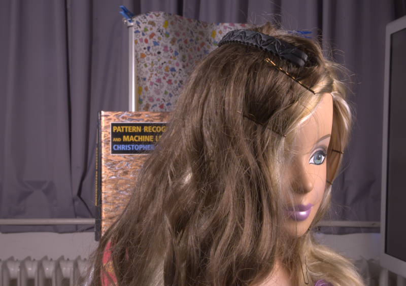
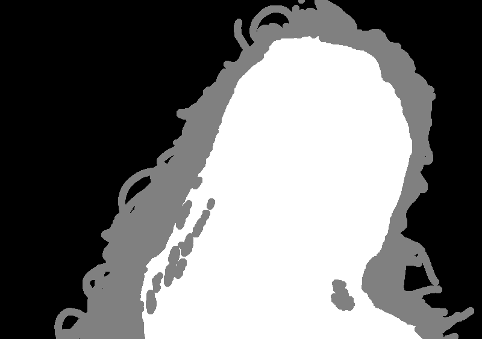
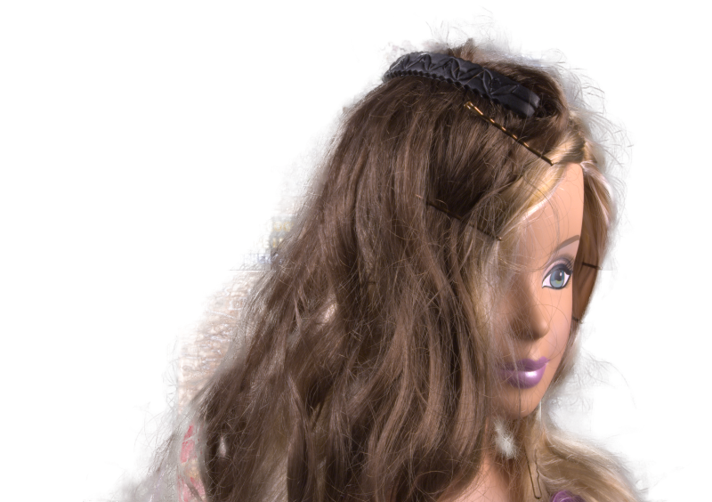
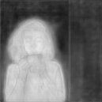

# Deep Image Matting : 物体の切り抜きを高精度化する機械学習モデル

# Deep Image Matting : 物体の切り抜きを高精度化する機械学習モデル

[Kazuki Kyakuno](https://kyakuno.medium.com/?source=post_page---byline--45580882966f---------------------------------------)

6 min read

·

Jul 26, 2020

--

Share

[ailia SDK](https://ailia.jp/)で使用できる機械学習モデルである「Deep Image Matting」のご紹介です。エッジ向け推論フレームワークである[ailia SDK](https://ailia.jp/)と[ailia MODELS](https://github.com/axinc-ai/ailia-models)に公開されている機械学習モデルを使用することで、簡単にAIの機能をアプリケーションに実装することができます。

## Deep Image Mattingの概要

Deep Image Mattingは2017年4月に発表された物体の切り抜きを高精度化する機械学習モデルです。

[## Deep Image Matting

### Image matting is a fundamental computer vision problem and has many applications. Previous algorithms have poor…

arxiv.org](https://arxiv.org/abs/1703.03872?source=post_page-----45580882966f---------------------------------------)

Deep Image Mattingでは、RGB画像とTRIMAP画像を入力として、高精度に物体の切り抜きを行うことができます。TRIMAPは、物体には255、背景には0、物体か背景か不明な場所には127を書き込んだ画像です。

TRIMAPは、手作業もしくはデプスカメラから作成する方法が一般的ですが、近年はセグメンテーションモデルで生成することもできます。

## Deep Image Mattingのバージョン

Deep Image MattingにはKerasを使用したバージョン1と、Pytorchを使用したバージョン2の二種類があります。

KerasではBGRを入力とします。Keras版は320x320の解像度で学習しており、320x320以上の画像の場合は、入力画像をタイル化して、320x320ごとに処理します。

[## foamliu/Deep-Image-Matting

### Just in case you are interested, Deep Image Matting v2 is an upgraded version of this. This repository is to reproduce…

github.com](https://github.com/foamliu/Deep-Image-Matting?source=post_page-----45580882966f---------------------------------------)

PytorchではRGBを入力とします。Pytorch版は入力解像度を可変にすることができ、タイル化は不要です。

[## foamliu/Deep-Image-Matting-PyTorch

### Deep Image Matting implementation in PyTorch. Contribute to foamliu/Deep-Image-Matting-PyTorch development by creating…

github.com](https://github.com/foamliu/Deep-Image-Matting-PyTorch?source=post_page-----45580882966f---------------------------------------)

AIモデルの入力は、RGB 3チャンネル + TRIMAP 1チャンネルの合計で4チャンネルを与えます。入力のレンジは0〜1に正規化して与えます。

## Get Kazuki Kyakuno’s stories in your inbox

Join Medium for free to get updates from this writer.

Subscribe

Subscribe

Remember me for faster sign in

AIモデルの出力はアルファチャンネルとなります。TRIMAPが0の領域は0、255の領域は1.0、127の領域は出力されたアルファチャンネルを使用するように加工して使用します。

## Deep Image Mattingの入力と出力

入力画像

Press enter or click to view image in full size

（出典：<https://github.com/foamliu/Deep-Image-Matting/tree/master/images>）

TRIMAP

Press enter or click to view image in full size

（出典：<https://github.com/foamliu/Deep-Image-Matting/tree/master/images>）

出力画像

Press enter or click to view image in full size

Deep Image Mattingの出力

## ailia SDKでの実行

ailia SDKで使用できるサンプルは下記となります。

[## ailia-models/background\_removal/deep-image-matting at master · axinc-ai/ailia-models

### input image input trimap (from…

github.com](https://github.com/axinc-ai/ailia-models/tree/master/background_removal/deep-image-matting?source=post_page-----45580882966f---------------------------------------)

RGB画像とTRIMAP画像を引数に与えることで、アルファチャンネル付きのPNGを出力します。デフォルトでKerasです。

> python3 deep-image-matting.py -i image.png -t trimap.png

## セグメンテーションとの併用

セグメンテーションモデルと併用することで、TRIMAPの生成を自動化し、RGB画像のみからMattingを実行することができます。ailia SDKのサンプルでは、TRIMAPに空文字列を与えることで、セグメンテーションモデルの併用が可能です。

> python3 deep-image-matting.py -i pixaboy.jpg -t “”

入力

（出典：<https://pixabay.com/ja/photos/%E5%A5%B3%E6%80%A7-%E8%82%96%E5%83%8F%E7%94%BB-%E8%8C%B6-%E3%82%AB%E3%83%83%E3%83%97-%E6%84%9B-5393941/>）

セグメンテーション出力（DeeplabV3）

セグメンテーションを2値化

cv2.erodeとcv2.dilateによるTRIMAP生成

deep-image-mattingの適用

ax株式会社はAIを実用化する会社として、クロスプラットフォームでGPUを使用した高速な推論を行うことができるailia SDKを開発しています。ax株式会社ではコンサルティングからモデル作成、SDKの提供、AIを利用したアプリ・システム開発、サポートまで、 AIに関するトータルソリューションを提供していますのでお気軽に[お問い合わせ](https://axinc.jp/)ください。