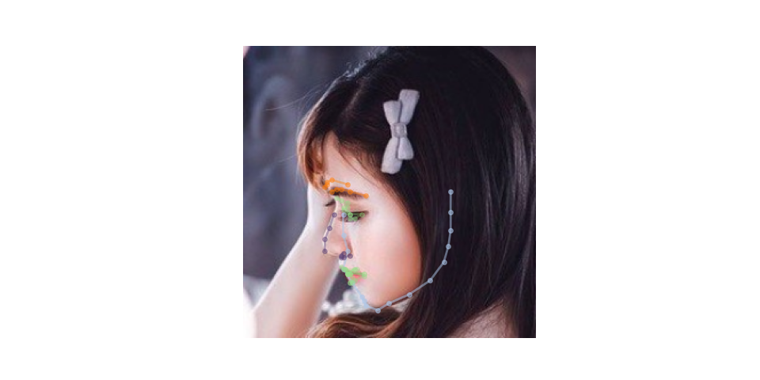
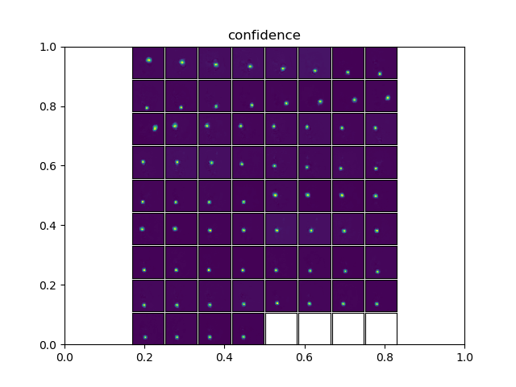

# FaceAlignment : 顔のキーポイントを認識する機械学習モデル

# FaceAlignment : 顔のキーポイントを認識する機械学習モデル

[Kazuki Kyakuno](https://kyakuno.medium.com/?source=post_page---byline--a46654c4da14---------------------------------------)

Sep 16, 2020

--

Share

[ailia SDK](https://ailia.jp/)で使用できる機械学習モデルである「FaceAlignment」のご紹介です。エッジ向け推論フレームワークである[ailia SDK](https://ailia.jp/)と[ailia MODELS](https://github.com/axinc-ai/ailia-models)に公開されている機械学習モデルを使用することで、簡単にAIの機能をアプリケーションに実装することができます。

## FaceAlignmentの概要

FaceAlignmentは顔画像を入力とし、68のキーポイントを出力します。入力解像度は(1,3,256,256)で、モデルの出力は(1,68,64,64)のヒートマップになります。68の各キーポイントに対して、(64,64)解像度の確信度が出力されます。入力画像はBGR順で(0–1.0)に正規化されています。

[## How far are we from solving the 2D & 3D Face Alignment problem? (and a dataset of 230,000 3D facial…

### Abstract This paper investigates how far a very deep neural network is from attaining close to saturating performance…

www.adrianbulat.com](https://www.adrianbulat.com/face-alignment?source=post_page-----a46654c4da14---------------------------------------)

## FaceAlignmentの実行結果

今回使用する入力画像は下記になります。

出典：<https://pixabay.com/ja/photos/%E3%83%95%E3%82%A1%E3%83%83%E3%82%B7%E3%83%A7%E3%83%B3-%E3%82%A2%E3%82%B8%E3%82%A2-%E6%97%A5%E6%9C%AC-3179178/>

FaceAlignmentは顔の領域に対して処理を行うため、顔の領域を切り出したあと、認識処理を行います。

入力する顔画像

FaceAlignmentは横顔でも高精度に2Dのキーポイントを抽出することができます。

Press enter or click to view image in full size

FaceAlignmentの出力（2D）

また、3Dモードを使用することで3Dのキーポイントを抽出することができます。

Press enter or click to view image in full size

FaceAlignmentの出力（3D）

モデルの出力は下記のようなヒートマップになります。

FaceAlignmentnのモデルの出力

各ヒートマップ画像の最大値を検出することで、キーポイントの座標に変換しています。

3Dのキーポイントの計算では、最初に2Dのキーポイントのヒートマップを計算します。その後、入力画像の3チャンネルと2Dのキーポイントのヒートマップの68チャンネルをConcatした(71,256,256)をデプス推定モデルに入力します。デプス推定モデルの出力は(1,68)のZ値となります。

## Get Kazuki Kyakuno’s stories in your inbox

Join Medium for free to get updates from this writer.

Subscribe

Subscribe

Remember me for faster sign in

68のキーポイントの割り当てはMulti-PIEのフォーマットに準拠しています。

The 68 Multi-PIE landmarks scheme and the landmarks selected for our method marked by the circles.（出典：<https://www.researchgate.net/publication/311741971_Automatic_cheek_detection_in_digital_images>）

## FaceAlignmentのアーキテクチャ

FaceAlignmentはThe Face Alignment Network (FAN)を使用しており、構造としてはHG（Hourglass）をスタックしたものになります。

Press enter or click to view image in full size

出典：<https://www.adrianbulat.com/downloads/FaceAlignment/FaceAlignment.pdf>

## ailia SDKからFaceAlignmentを使用する

ailia SDKで使用するサンプルは下記になります。

[## axinc-ai/ailia-models

### (from https://github.com/1adrianb/face-alignment/tree/master/test/assets) Ailia input shape : (1, 3, 256, 256) Range …

github.com](https://github.com/axinc-ai/ailia-models/tree/master/face_recognition/face_alignment?source=post_page-----a46654c4da14---------------------------------------)

下記のコマンドで任意の画像に対して顔の2Dキーポイントを取得可能です。

> python3 face\_alignment.py -i input.png -s output.png

下記のコマンドで任意の画像に対して顔の3Dキーポイントを取得可能です。

> python3 face\_alignment.py -i input.png -s output.png — active-3d

ax株式会社はAIを実用化する会社として、クロスプラットフォームでGPUを使用した高速な推論を行うことができるailia SDKを開発しています。ax株式会社ではコンサルティングからモデル作成、SDKの提供、AIを利用したアプリ・システム開発、サポートまで、 AIに関するトータルソリューションを提供していますのでお気軽にお問い合わせください。