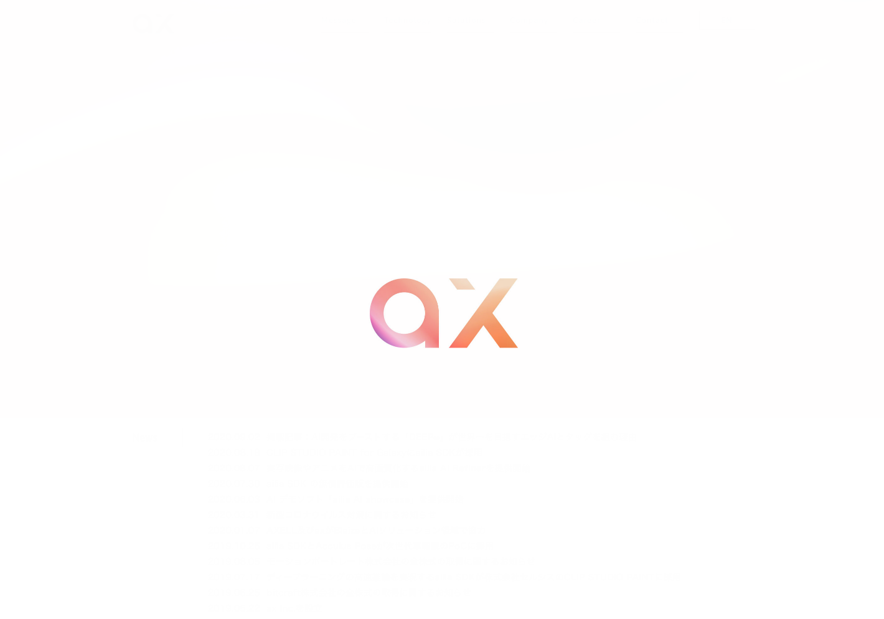

# ax株式会社のAIに関する講演記事まとめ

# ax株式会社のAIに関する講演記事まとめ

[Kazuki Kyakuno](https://kyakuno.medium.com/?source=post_page---byline--e715f5032aea---------------------------------------)

Sep 17, 2020

--

Share

ax株式会社ではDeep Learning LabやCEDEC、UniteなどでAIに関する講演を行っています。本記事では、ax株式会社のAIに関する講演の概要とスライドを紹介します。

Press enter or click to view image in full size

### KhronosVirtualOpenHouseJapan「Vulkanを活用した高速AIフレームワーク実装 〜ailia SDKでの事例〜」

Vulkanを使用したAIの高速推論フレームワークであるailia SDKの実装事例を紹介しました。Vulkanを使用することで、デバイスやOSを選ばないAIの高速推論を行うことが可能になります。

### CEDEC2020「最新AIモデル10選～超解像からアバター生成まで～」

物体検出、物体追跡、骨格検出、手検出、背景切り抜き、顔認証、バーチャル試着、バーチャル化粧、超解像、3Dメッシュ推定によるアバター生成など、最新AIモデルで何ができるのか、どこまで使えるのかを紹介しました。

### Deep Learning Digital Conference 2020「Tensorflow Liteの量子化アーキテクチャ」

Tensorflow Liteを例に機械学習モデルの量子化のアーキテクチャを紹介しました。Post training quantization (full integer quantization)を軸に、Int8での演算方式を解説します。

## Get Kazuki Kyakuno’s stories in your inbox

Join Medium for free to get updates from this writer.

Subscribe

Subscribe

Remember me for faster sign in

8

### Deep Learning Lab EngineerDays 2019「ONNX Export & Optimize」

ONNXの内部構造と、各種フレームワークからのエクスポート方法、最適化方法を紹介しました。

[## DLLAB Engineer Days Day2: Conference (2019/10/07 11:30〜)

### Deep Learning Lab ...

dllab.connpass.com](https://dllab.connpass.com/event/144647/?source=post_page-----e715f5032aea---------------------------------------)

### CEDEC2019「AIはクリエイターの創作をどう助けるか？「CLIP STUDIO PAINT」の機能に見るAI活用事例」

株式会社セルシス様と共同でCLIP STUDIO PAINTにおけるAI活用事例の紹介を行いました。

[## AIはクリエイターの創作をどう助けるか？「CLIP STUDIO PAINT」の機能に見るAI活用事例【CEDEC 2019】 | GameBusiness.jp

### 「CLIP STUDIO PAINT」に魅力的な新機能を提供したAIフレームワーク「ailia SDK」とは？ 「CEDEC 2019」のセミナー「CLIP STUDIO…

www.gamebusiness.jp](https://www.gamebusiness.jp/article/2019/09/25/16233.html?source=post_page-----e715f5032aea---------------------------------------)

### Unite 2019 「Unityで手軽に使えるAIエンジンailia SDK」

Unityで手軽に使えるAIエンジンであるailia SDKの紹介を行いました。

[## Unityで手軽に使えるAIエンジンailia SDK | Unity Learning Materials

### AIミドルウェアであるailiaで準備されているUnity PlugInを使って、手軽にアプリへAI機能を実装出来るデモを行います。...

learning.unity3d.jp](https://learning.unity3d.jp/3231/?source=post_page-----e715f5032aea---------------------------------------)

ax株式会社はAIを実用化する会社として、クロスプラットフォームでGPUを使用した高速な推論を行うことができるailia SDKを開発しています。ax株式会社ではコンサルティングからモデル作成、SDKの提供、AIを利用したアプリ・システム開発、サポートまで、 AIに関するトータルソリューションを提供していますのでお気軽に[お問い合わせ](https://axinc.jp/)ください。