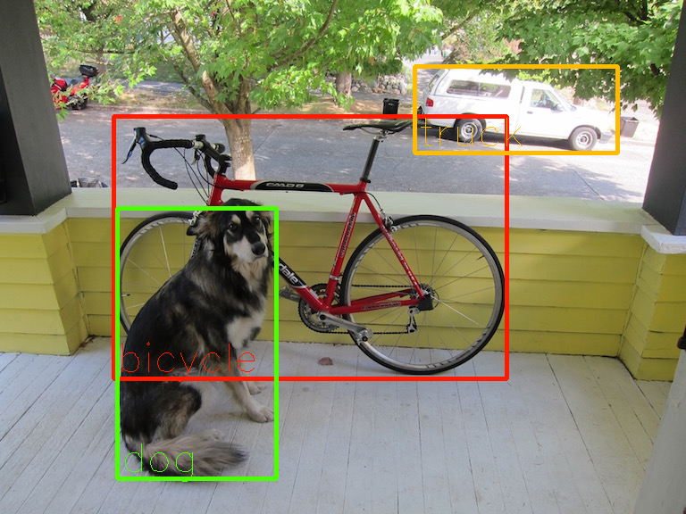
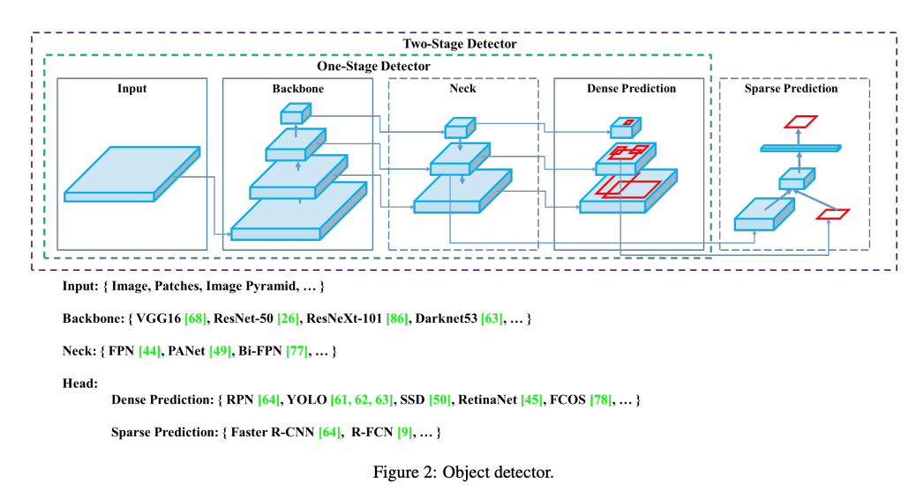
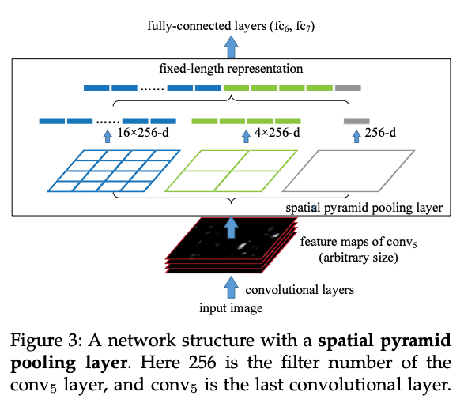

# YOLOv4 : 物体を検出する機械学習モデル

# YOLOv4 : 物体を検出する機械学習モデル

[](https://kyakuno.medium.com/?source=post_page---byline--480f0a635317---------------------------------------)

[Kazuki Kyakuno](https://kyakuno.medium.com/?source=post_page---byline--480f0a635317---------------------------------------)

7 min read

·

Oct 12, 2020

--

Share

[ailia SDK](https://ailia.jp/)で使用できる機械学習モデルである「YOLOv4」のご紹介です。エッジ向け推論フレームワークである[ailia SDK](https://ailia.jp/)と[ailia MODELS](https://github.com/axinc-ai/ailia-models)に公開されている機械学習モデルを使用することで、簡単にAIの機能をアプリケーションに実装することができます。

## YOLOv4の概要

YOLOv4はシングルショットで物体を検出するYOLOシリーズの最新版です。YOLOv3までの作者のJoseph Redmonは2020年2月に開発終了を発表しており、YOLOv4はDarknetのWindows版を開発しているAlexey Bochkovskyによって開発されました。

Press enter or click to view image in full size



出典：<https://github.com/Tianxiaomo/pytorch-YOLOv4/blob/master/data/dog.jpg>

[## YOLOv4: Optimal Speed and Accuracy of Object Detection

### There are a huge number of features which are said to improve Convolutional Neural Network (CNN) accuracy. Practical…

arxiv.org](https://arxiv.org/abs/2004.10934?source=post_page-----480f0a635317---------------------------------------)

[## Tianxiaomo/pytorch-YOLOv4

### A minimal PyTorch implementation of YOLOv4.

github.com](https://github.com/Tianxiaomo/pytorch-YOLOv4?source=post_page-----480f0a635317---------------------------------------)

## YOLOv4のアーキテクチャ

YOLOv4は近年の研究成果を統合する形で設計されており、BackboneにCSPDarknet53、NeckにSPP（Spatial pyramid pooling）、PAN（Path Aggregation Network）、HeadにYOLOv3を使用しています。

Press enter or click to view image in full size



出典：<https://arxiv.org/pdf/2004.10934.pdf>

CSPNetはFeatureMapの一部のみをConvして残りをConcatすることで精度を落とさずに高速化する手法です。

Press enter or click to view image in full size


出典：<https://arxiv.org/pdf/1911.11929.pdf>

SPPは複数のカーネルサイズ（1,5,9,13）で同時にPoolingすることで精細な情報と広域な情報の両方を取得する方法です。



出典：<https://arxiv.org/pdf/1406.4729.pdf>

PANは異なるバックボーンレベルから特徴量をDetectorに伝えることで、入力に近い層の情報を活用する手法です。

Press enter or click to view image in full size


出典：<https://arxiv.org/pdf/1803.01534.pdf>

YOLOv4の性能は下記となっています。YOLOv3に比べてmAPが大幅に向上しています。


出典：<https://arxiv.org/pdf/2004.10934.pdf>

## YOLOv4の使用方法

ailia SDKでYOLOv4を使用するには下記のコマンドを使用します。-vオプションに0を指定することで、WEBカメラからYOLOv4を使用して物体を検出します。

> python3 yolov4-tiny.py -v 0

-vオプションにファイル名を指定することで、任意の動画に対して物体を検出します。

> python3 yolov4-tiny.py -v input.mp4

画像認識の解像度は、dwおよびdhオプションを使用して、416x416、640x640、1280x640を指定することができます。小さい物体を認識したい場合は大きな認識解像度を指定してください。

## Get Kazuki Kyakuno’s stories in your inbox

Join Medium for free to get updates from this writer.

Subscribe

Subscribe

Remember me for faster sign in

実行例です。

yolov4-tinyのサンプルコード

[## axinc-ai/ailia-models

### (Image from…

github.com](https://github.com/axinc-ai/ailia-models/tree/master/object_detection/yolov4-tiny?source=post_page-----480f0a635317---------------------------------------)

yolov4のサンプルコード

[## axinc-ai/ailia-models

### (Image from https://github.com/Tianxiaomo/pytorch-YOLOv4/blob/master/data/dog.jpg) Shape : (1, 3, 416, 416) Range …

github.com](https://github.com/axinc-ai/ailia-models/tree/master/object_detection/yolov4?source=post_page-----480f0a635317---------------------------------------)

## YOLOv3とYOLOv4の比較

同じ動画に対して、YOLOv3 tinyとYOLOv4 tinyを適用した場合の処理結果の比較です。YOLOv4 tinyの方が総じて安定した出力を得ることができます。1280x640解像度でのMacBookPro13 (GPU)での推論時間は、100回平均で、YOLOv3 tinyが98.15ms、YOLOv4 tinyが107.68msです。

## YOLOv4のONNXへのエクスポート

pytorch-YOLOv4を使用することでDarknetの重みをPytorchにインポートすることができます。また、ONNXへのエクスポートにも対応しています。

[## Tianxiaomo/pytorch-YOLOv4

### A minimal PyTorch implementation of YOLOv4.

github.com](https://github.com/Tianxiaomo/pytorch-YOLOv4?source=post_page-----480f0a635317---------------------------------------)

Darknetのweightをonnxに変換するには下記のスクリプトを使用します。1はbatch sizeです。0にするとdynamic batch sizeでエクスポート可能です。

```
python3 demo_darknet2onnx.py yolov4.cfg yolov4.weights dog.jpg 1
```

## YOLOv5について

YOLOv5はPytorch版のYOLOの開発者であるUltralyticsによって開発されています。こちらはDarknetは使用しない形になっており、名称については議論があります。DarknetのIssueによると、YOLOv5よりも、YOLOv4の方が精度が良いとされていますが、弊社の検証ではYOLOv5の方が安定した検出結果が得られる場合もあります。YOLOv5については別記事にて紹介しています。

Press enter or click to view image in full size


出典：<https://github.com/pjreddie/darknet/issues/2198>

[## What is the latest version of YOLO? Is V5 a scam? · Issue #2198 · pjreddie/darknet

### Hi guys, I am learning the YOLO, it looks great~! I think this Github repo and this website are the official websites…

github.com](https://github.com/pjreddie/darknet/issues/2198?source=post_page-----480f0a635317---------------------------------------)

ax株式会社はAIを実用化する会社として、クロスプラットフォームでGPUを使用した高速な推論を行うことができるailia SDKを開発しています。ax株式会社ではコンサルティングからモデル作成、SDKの提供、AIを利用したアプリ・システム開発、サポートまで、 AIに関するトータルソリューションを提供していますのでお気軽に[お問い合わせ](https://axinc.jp/)ください。

### 参考記事

[YOLO v3 : 物体の位置と種類を検出する機械学習モデル](https://medium.com/axinc/yolov3-66c9b998c096)

[MobilenetSSD : 高速に物体検出を行う機械学習モデル](https://medium.com/axinc/mobilenetssd-%E9%AB%98%E9%80%9F%E3%81%AB%E7%89%A9%E4%BD%93%E6%A4%9C%E5%87%BA%E3%82%92%E8%A1%8C%E3%81%86%E6%A9%9F%E6%A2%B0%E5%AD%A6%E7%BF%92%E3%83%A2%E3%83%87%E3%83%AB-be3ca37c411)

[M2Det : 高精度な物体検出モデル](https://medium.com/axinc/m2det-%E9%AB%98%E7%B2%BE%E5%BA%A6%E3%81%AA%E7%89%A9%E4%BD%93%E6%A4%9C%E5%87%BA%E3%83%A2%E3%83%87%E3%83%AB-bf92a8a3d423)

[DeepSort : 人物のトラッキングを行う機械学習モデル](https://medium.com/axinc/deepsort-%E4%BA%BA%E7%89%A9%E3%81%AE%E3%83%88%E3%83%A9%E3%83%83%E3%82%AD%E3%83%B3%E3%82%B0%E3%82%92%E8%A1%8C%E3%81%86%E6%A9%9F%E6%A2%B0%E5%AD%A6%E7%BF%92%E3%83%A2%E3%83%87%E3%83%AB-e8cb7410457c)