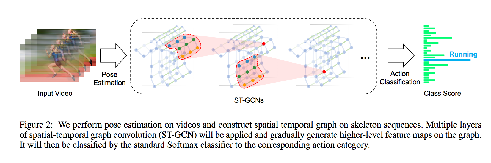

# ST-GCN : 骨格から人物のアクションを検出する機械学習モデル

# ST-GCN : 骨格から人物のアクションを検出する機械学習モデル

[Kazuki Kyakuno](https://kyakuno.medium.com/?source=post_page---byline--af3196e38d1f---------------------------------------)

15 min read

·

Dec 2, 2020

--

Share

[ailia SDK](https://ailia.jp/)で使用できる機械学習モデルである「ST-GCN」のご紹介です。エッジ向け推論フレームワークである[ailia SDK](https://ailia.jp/)と[ailia MODELS](https://github.com/axinc-ai/ailia-models)に公開されている機械学習モデルを使用することで、簡単にAIの機能をアプリケーションに実装することができます。

## ST-GCNの概要

ST-GCNは2018年1月に提案されたモデルで、OpenPoseなどで取得した骨格情報から人物のアクションを検出する機械学習モデルです。

[## Spatial Temporal Graph Convolutional Networks for Skeleton-Based Action Recognition

### Dynamics of human body skeletons convey significant information for human action recognition. Conventional approaches…

arxiv.org](https://arxiv.org/abs/1801.07455?source=post_page-----af3196e38d1f---------------------------------------)

[## yysijie/st-gcn

### ST-GCN has transferred to MMSkeleton, and keep on developing as an flexible open source toolbox for skeleton-based…

github.com](https://github.com/yysijie/st-gcn?source=post_page-----af3196e38d1f---------------------------------------)

NTU RGB-DもしくはKineticsデータセットで学習されており、下記の60カテゴリのアクションを検出可能です。

> The dataset consists of 60 labelled actions. Specifically: drink water, eat meal/snack, brushing teeth, brushing hair, drop, pickup, throw, sitting down, standing up (from sitting position), clapping, reading, writing, tear up paper, wear jacket, take off jacket, wear a shoe, take off a shoe, wear on glasses, take off glasses, put on a hat/cap, take off a hat/cap, cheer up, hand waving, kicking something, put something inside pocket / take out something from pocket, hopping (one foot jumping), jump up, make a phone call/answer phone, playing with phone/tablet, typing on a keyboard, pointing to something with finger, taking a selfie, check time (from watch), rub two hands together, nod head/bow, shake head, wipe face, salute, put the palms together, cross hands in front (say stop), sneeze/cough, staggering, falling, touch head (headache), touch chest (stomachache/heart pain), touch back (backache), touch neck (neckache), nausea or vomiting condition, use a fan (with hand or paper)/feeling warm, punching/slapping other person, kicking other person, pushing other person, pat on back of other person, point finger at the other person, hugging other person, giving something to other person, touch other person’s pocket, handshaking, walking towards each other and walking apart from each other.
>
> 出典：<https://en.m.wikipedia.org/wiki/NTU_RGB-D_dataset>

## ST-GCNの入力と出力

入力は(1, 3, 300, 18, 2)となっており、(batch, channel, frame, joint, person)が対応します。channel=0が-0.5〜0.5で正規化された骨格のx座標、channel=1が骨格のy座標、channel=2がconfidence値となっています。jointは骨格の番号です。personは人物1と人物2になっています。

出力は(batch,class,output\_frame,joint,person)のconfidence値となります。アクションを検出するには、classごとにconfidence値を積算し、もっとも大きいclassを選択します。output\_frameは入力のフレーム数/4となります。

> voting\_label = output.sum(axis=3).sum(axis=2).sum(axis=1).argmax(axis=0)

同時に出力されるfeatureはどのキーポイントが貢献したかを可視化するためのものであり、ビジュアライズのみに使用します。

## ST-GCNのアーキテクチャ

ST-GCNではグラフコンボリューションを使用しています。隣接する骨格の位置関係の時間推移からアクションを推定します。

Press enter or click to view image in full size

出典：<https://arxiv.org/pdf/1801.07455.pdf>

グラフコンボリューションは、ノード間のつながり情報を元に畳み込みを行います。例えば、ノードAにノードBとノードCが接続されている場合、A、B、Cの値に対して畳み込みを行います。これにより、3Dモデルの頂点情報などに対しても機械学習を適用可能になります。グラフコンボリューションは従来のコンボリューションの上位概念にあたり、メッシュ状にノードを接続すると、従来のコンボリューションと等価な演算となります。

ST-GCNは従来の3D Convolutionによるアクション検出に比べて、骨格の情報のみからアクションを推定可能なため、より高速に動作します。また、骨格の情報のみを単に2D Convolutionにかけるよりも、グラフコンボリューションによって骨格のキーポイント間の関係を考慮した畳み込みを行えるため、より高精度になります。

ST-GCNは(batch,channel,fame,joint,person)の5次元を入力とし、NTU-RGB+Dを使用したモデルだと(1,3,300,18,2)を入力とします。

ST-GCNはNTU-RGB+Dにおいて高い性能を発揮します。

Press enter or click to view image in full size

出典：<https://arxiv.org/pdf/1801.07455.pdf>

現在のSOTAは下記で確認できます。

[## Papers with Code - NTU RGB+D Benchmark (Skeleton Based Action Recognition)

### The current state-of-the-art on NTU RGB+D is RNX3D101+MS-AAGCN-C. See a full comparison of 76 papers with code.

paperswithcode.com](https://paperswithcode.com/sota/skeleton-based-action-recognition-on-ntu-rgbd?source=post_page-----af3196e38d1f---------------------------------------)

ST-GCNは推論時も5次元でテンソルを扱う必要があり、5次元テンソルに対応しているフレームワークが必要です。また、einsumオペレータを使用しており、ONNXのopset=12を使用するか、対応オペレータへの書き換えが必要です。

[## Failed to export onnx model · Issue #202 · open-mmlab/mmskeleton

### Dismiss GitHub is home to over 50 million developers working together to host and review code, manage projects, and…

github.com](https://github.com/open-mmlab/mmskeleton/issues/202?source=post_page-----af3196e38d1f---------------------------------------)

## ST-GCNのデータセット

ST-GCNはNTU RGB+Dの3D skeletons (5.8GB)もしくはKineticsのアクション動画データセットからOpenposeでスケルトンを抽出したデータセット（7.5GB）を使用して学習しています。

[## Rapid-Rich Object Search (ROSE) Lab

### This page introduces two datasets: "NTU RGB+D" and "NTU RGB+D 120". "NTU RGB+D" contains 60 action classes and 56,880…

rose1.ntu.edu.sg](http://rose1.ntu.edu.sg/datasets/actionrecognition.asp?source=post_page-----af3196e38d1f---------------------------------------)

[## Kinetics

### A large-scale, high-quality dataset of URL links to approximately 300,000 video clips that covers 400 human action…

deepmind.com](https://deepmind.com/research/open-source/kinetics?source=post_page-----af3196e38d1f---------------------------------------)

学習に使用するデータとラベルはyamlファイルで指定します。

[## yysijie/st-gcn

### You can't perform that action at this time. You signed in with another tab or window. You signed out in another tab or…

github.com](https://github.com/yysijie/st-gcn/blob/master/config/st_gcn/kinetics-skeleton/train.yaml?source=post_page-----af3196e38d1f---------------------------------------)

## 独自のデータセットでの学習

kinetics\_trainフォルダにはポーズのキーポイントが含まれるjsonデータが含まれています。独自のデータセットで学習する場合は、このjsonと同等のファイルをOpenPoseなどを使用して作成します。

## Get Kazuki Kyakuno’s stories in your inbox

Join Medium for free to get updates from this writer.

Subscribe

Subscribe

Remember me for faster sign in

skeletonのposeには18のキーポイントが、xyxy順で格納されています。また、scoreにはconfidence値が格納されています。動画に複数人含まれることを考慮して、skeletonは配列になっています。frame\_indexは1から開始します。なお、dataは300フレーム以下である必要があります。

> {“data”: [{“frame\_index”: 1, “skeleton”: [{“pose”: [0.518, 0.139, 0.442, 0.272, 0.399, 0.288, 0.315, 0.400, 0.350, 0.549, 0.487, 0.264, 0.507, 0.356, 0.548, 0.408, 0.413, 0.584, 0.401, 0.785, 0.383, 0.943, 0.497, 0.582, 0.485, 0.750, 0.479, 0.908, 0.514, 0.119, 0.000, 0.000, 0.483, 0.128, 0.000, 0.000], “score”: [0.305, 0.645, 0.647, 0.865, 0.841, 0.505, 0.361, 0.726, 0.487, 0.708, 0.546, 0.575, 0.695, 0.713, 0.343, 0.000, 0.395, 0.000]}]}, {“frame\_index”: 2, “skeleton”: [{“pose”: [0.516, 0.155, 0.438, 0.272, 0.395, 0.288, 0.315, 0.405, 0.352, 0.552, 0.483, 0.261, 0.505, 0.351, 0.548, 0.416, 0.413, 0.590, 0.401, 0.791, 0.383, 0.946, 0.499, 0.587, 0.487, 0.750, 0.481, 0.910, 0.516, 0.136, 0.000, 0.000, 0.495, 0.141, 0.000, 0.000], “score”: [0.249, 0.678, 0.624, 0.838, 0.858, 0.506, 0.293, 0.706, 0.471, 0.728, 0.567, 0.566, 0.665, 0.719, 0.367, 0.000, 0.593, 0.000]}]}, …, “label”: “jumping into pool”, “label\_index”: 172}

ラベル情報はkinetics\_train\_label.jsonに記載されています。キーがファイル名となり、上記のポーズ情報を読み込みにいきます。label\_indexは0から始まります。

> “ — -QUuC4vJs”: {  
> “has\_skeleton”: true,  
> “label”: “testifying”,  
> “label\_index”: 354  
> },  
> “ — 3ouPhoy2A”: {  
> “has\_skeleton”: true,  
> “label”: “eating spaghetti”,  
> “label\_index”: 116  
> },

学習を行う場合、上記のjsonからnpyファイルを生成します。

> python3 tools/kinetics\_gendata.py — data\_path /dataset/kinetics-skeleton — out\_folder /dataset/kinetics-skeleton

学習を行います。

> python3 main.py recognition -c ../train\_kinetics.yaml — use\_gpu False

学習時のDataLoaderにdrop\_last=Trueが指定されているため、データ量が少ないとLossがNaNになります。そのような場合、設定のyamlファイルのbatch\_sizeを1にします。

## ONNXへのエクスポート

net/utils/tgcn.pyに含まれるeinsumを置き換える必要があります。

> #x = torch.einsum(‘nkctv,kvw->nctw’, (x, A))
>
> x = x.permute(0, 2, 3, 1, 4).contiguous()  
> n, c, t, k, v = x.size()  
> k, v, w = A.size()  
> x = x.view(n \* c \* t, k \* v)  
> A = A.view(k \* v, w)  
> x = torch.mm(x, A)  
> x = x.view(n, c, t, w)

[## Failed to export onnx model · Issue #202 · open-mmlab/mmskeleton

### Dismiss GitHub is home to over 50 million developers working together to host and review code, manage projects, and…

github.com](https://github.com/open-mmlab/mmskeleton/issues/202?source=post_page-----af3196e38d1f---------------------------------------)

また、RuntimeError: Failed to export an ONNX attribute ‘onnx::Gather’, since it’s not constant, please try to make things (e.g., kernel size) static if possibleが発生するため、st\_gcn.pyを書き換えます。

> #x = F.avg\_pool2d(x, x.size()[2:])  
> x = F.avg\_pool2d(x, (75,18))

上記の変更を行うと、下記のコードでエクスポート可能です。extract\_feature関数がエクスポート対象です。

> self.model.eval()  
> class ExportStgcnModel(torch.nn.Module):  
>  def \_\_init\_\_(self, model):  
>  super(ExportStgcnModel, self).\_\_init\_\_()  
>  self.model = model  
> def forward(self, x):  
>  return self.model.extract\_feature(x)
>
> from torch.autograd import Variable  
> x = Variable(torch.randn(1, 3, 300, 18, 2)) # (1, channel, frame, joint, person)  
> output = self.model(x)  
> export\_model = ExportStgcnModel(self.model)  
> torch.onnx.export(export\_model, x, ‘st-gcn\_pytorch.onnx’, verbose=True, opset\_version=10)

torch 1.6.0では内部の最適化処理で下記のエラーが発生するため、エクスポートにはtorch 1.5.0を使用する必要があります。

> # File “/usr/local/lib/python3.7/site-packages/torch/onnx/utils.py”, line 409, in \_model\_to\_graph  
> #\_export\_onnx\_opset\_version)  
> #RuntimeError: expected 1 dims but tensor has 2

## ST-GCNの使用方法

ailia SDKでST-GCNを使用するには、下記のコマンドを使用します。WEBカメラの入力に対してOpenPoseで骨格を検出し、アクションを推定します。

> python3 st-gcn.py -v 0

[## axinc-ai/ailia-models

### Video (Video from https://github.com/yysijie/st-gcn/blob/master/resource/media/skateboarding.mp4) Pose estimate Shape …

github.com](https://github.com/axinc-ai/ailia-models/tree/master/action_recognition/st_gcn?source=post_page-----af3196e38d1f---------------------------------------)

ax株式会社はAIを実用化する会社として、クロスプラットフォームでGPUを使用した高速な推論を行うことができるailia SDKを開発しています。ax株式会社ではコンサルティングからモデル作成、SDKの提供、AIを利用したアプリ・システム開発、サポートまで、 AIに関するトータルソリューションを提供していますのでお気軽に[お問い合わせ](https://axinc.jp/)ください。