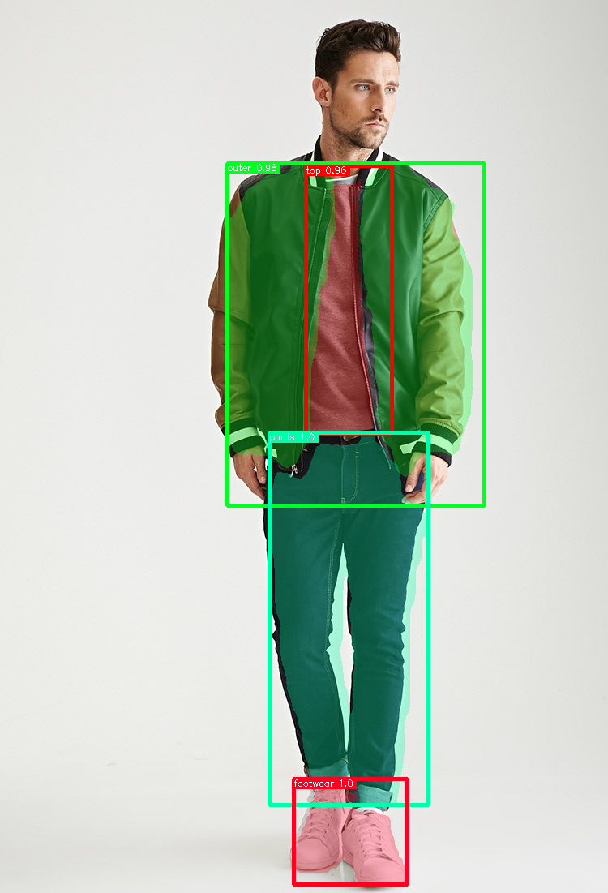

# MMFashion : ファッションをセグメンテーションする機械学習モデル

# MMFashion : ファッションをセグメンテーションする機械学習モデル

[](https://kyakuno.medium.com/?source=post_page---byline--c486af72fdb5---------------------------------------)

[Kazuki Kyakuno](https://kyakuno.medium.com/?source=post_page---byline--c486af72fdb5---------------------------------------)

Jan 12, 2021

--

Share

[ailia SDK](https://ailia.jp/)で使用できる機械学習モデルである「MMFashion」のご紹介です。エッジ向け推論フレームワークである[ailia SDK](https://ailia.jp/)と[ailia MODELS](https://github.com/axinc-ai/ailia-models)に公開されている機械学習モデルを使用することで、簡単にAIの機能をアプリケーションに実装することができます。

## MMFashionの概要

MMFashionはオープンソースのファッション分析に関するツールボックスです。MMFashionの中にはセグメンテーションやランドマークディテクションのモデルが含まれています。本記事ではセグメンテーションについて紹介します。

Press enter or click to view image in full size


出典：<https://arxiv.org/pdf/2005.08847.pdf>

[## MMFashion: An Open-Source Toolbox for Visual Fashion Analysis

### We present MMFashion, a comprehensive, flexible and user-friendly open-source visual fashion analysis toolbox based on…

arxiv.org](https://arxiv.org/abs/2005.08847?source=post_page-----c486af72fdb5---------------------------------------)

[## open-mmlab/mmfashion

### Technical Report] MMFashion is an open source visual fashion analysis toolbox based on PyTorch. It is a part of the…

github.com](https://github.com/open-mmlab/mmfashion?source=post_page-----c486af72fdb5---------------------------------------)

## MMFashionを使用したファッションのセグメンテーション

MMFashionはバックエンドにMMDetectionを使用しています。MMFashionでは、MMDetectionに含まれるMaskRCNNを使用することで、入力した画像に対してセグメンテーションを行うことができます。

## Get Kazuki Kyakuno’s stories in your inbox

Join Medium for free to get updates from this writer.

Subscribe

Subscribe

Remember me for faster sign in

検出可能なカテゴリは下記になります。

```
CATEGORY = (  
    'top', 'skirt', 'leggings', 'dress', 'outer', 'pants', 'bag',  
    'neckwear', 'headwear', 'eyeglass', 'belt', 'footwear', 'hair',  
    'skin', 'face'  
)
```

Press enter or click to view image in full size



出典：<https://github.com/open-mmlab/mmfashion/blob/master/demo/imgs/01_4_full.jpg>

## ONNXへのエクスポート

MMDetectionを使用したモデルをONNXにエクスポートするには少し複雑な操作が必要です。エクスポート方法は下記の記事にまとめていますので、必要に応じて参照してください。

[## MMDetectionのモデルをONNXにエクスポートする

### MMDetectionは、PyTorchに基づくオープンソースのオブジェクト検出ツールボックスです。MMDetectionのモデルをONNXにエクスポートする手順について解説します。

medium.com](https://medium.com/axinc/mmdetection%E3%81%AE%E3%83%A2%E3%83%87%E3%83%AB%E3%82%92onnx%E3%81%AB%E3%82%A8%E3%82%AF%E3%82%B9%E3%83%9D%E3%83%BC%E3%83%88%E3%81%99%E3%82%8B-d2f249ca01be?source=post_page-----c486af72fdb5---------------------------------------)

## MMFashionの使用方法

ailia SDKでMMFashionを使用するには、下記のコマンドを使用します。WEBカメラの入力に対してセグメンテーションを行います。

> python3 mmfashion.py -v 0

[## axinc-ai/ailia-models

### (Image from https://github.com/open-mmlab/mmfashion/blob/master/demo/imgs/01\_4\_full.jpg) Shape : (1, 3, height, width)…

github.com](https://github.com/axinc-ai/ailia-models/tree/master/deep_fashion/mmfashion?source=post_page-----c486af72fdb5---------------------------------------)

実行例です。

MMFashionは背景のない画像で学習を行なっているため、背景画像が含まれる画像に対しては精度が低下します。-ppオプションを使用することで、U2Netで背景切り抜きを行なった後にMMFashionを適用することが可能です。

> python3 mmfashion.py -pp large

ax株式会社はAIを実用化する会社として、クロスプラットフォームでGPUを使用した高速な推論を行うことができるailia SDKを開発しています。ax株式会社ではコンサルティングからモデル作成、SDKの提供、AIを利用したアプリ・システム開発、サポートまで、 AIに関するトータルソリューションを提供していますのでお気軽に[お問い合わせ](https://axinc.jp/)ください。