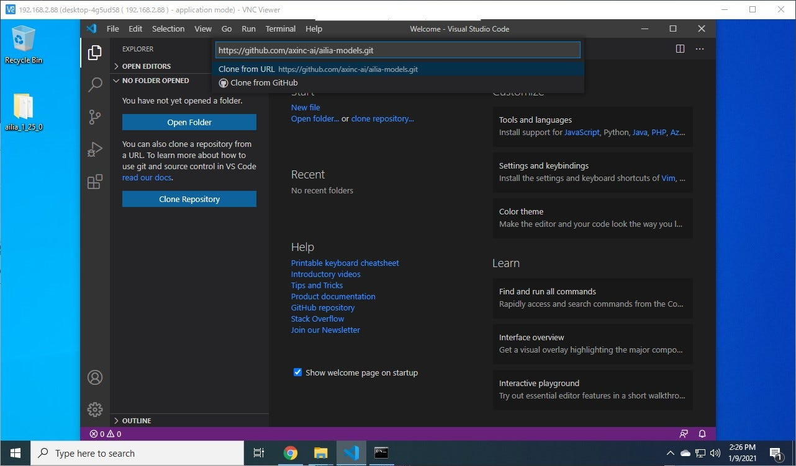
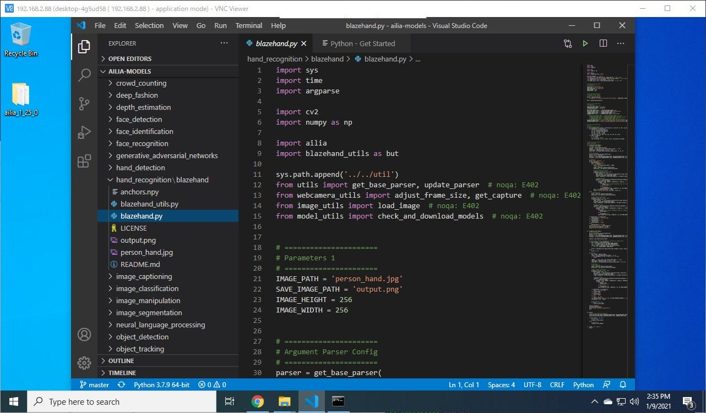
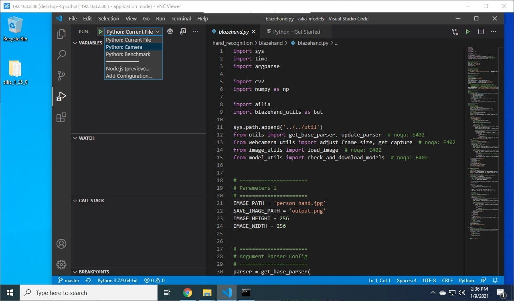
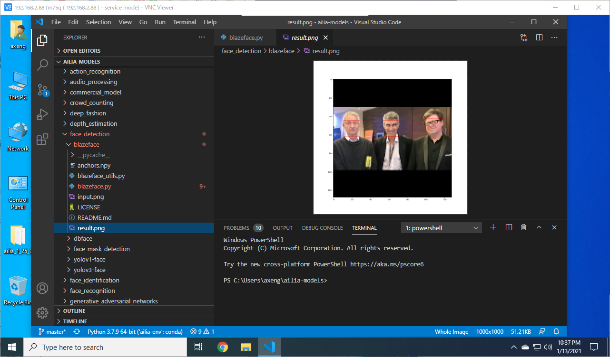
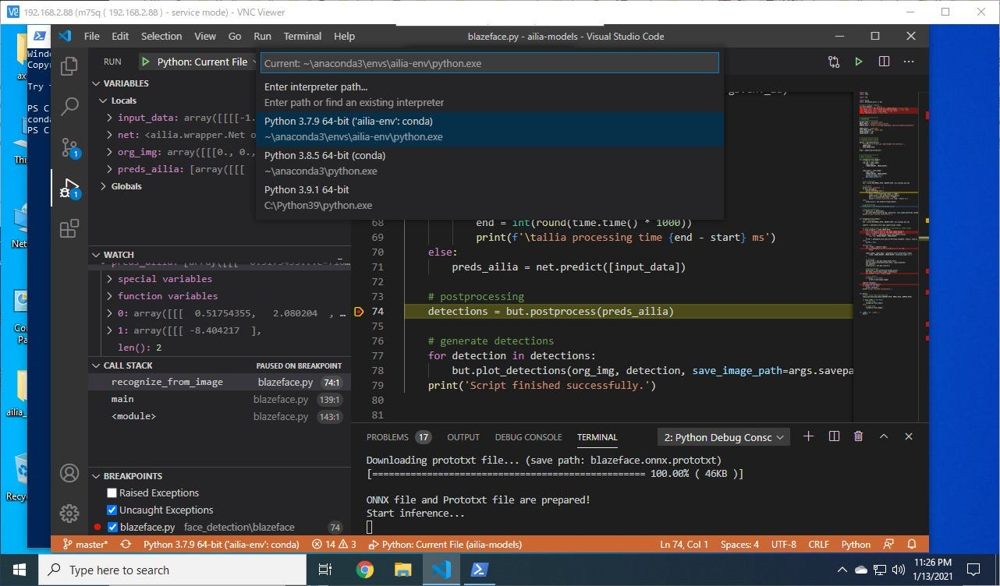

# Visual Studio Codeを活用したailia開発

# Visual Studio Codeを活用したailia開発

[](https://medium.com/@terada_80332?source=post_page---byline--c9b21de1864f---------------------------------------)

[Takehiko TERADA](https://medium.com/@terada_80332?source=post_page---byline--c9b21de1864f---------------------------------------)

Feb 2, 2021

--

Share

高機能なソースコードエディタであるVisual Studio Codeを活用してpythonにてailia SDKの開発を行うチュートリアルです。ailia SDKはC++やpython, C#, JNIを使用してディープラーニングの推論をGPUを使用して高速に行うことができます。ailia SDKについて詳しくは[こちら](https://ailia.jp/)をご覧ください。

Visual Studio Code（以下VSCode）はマイクロソフトが開発した様々なプログラミング言語に対応した非常に高機能なWindows/Linux/macOS用のソースコードエディタです。ソースコード記述時のシンタックスハイライトやコード補完からデバッグ、Gitコントロールなどの機能があります。この記事ではVSCodeを活用してpythonにてailiaの開発を行う方法を示します。まず[こちら](https://medium.com/axinc/ailia-sdk-%E3%83%81%E3%83%A5%E3%83%BC%E3%83%88%E3%83%AA%E3%82%A2%E3%83%AB-python-28379dbc9649)の記事を参照してailiaのpython開発環境を整えてください。

Visual Studio Codeのダウンロードおよび概要については[こちら](https://azure.microsoft.com/ja-jp/products/visual-studio-code/)を参照してください。Visual Studio Codeにはオープンソース版とマイクロソフトから提供されている商用ライセンス版（無償）がありますが、今回はマイクロソフトから提供されているものを使用して解説を行います。VSCodeを立ち上げたらPythonの言語サポートのエクステンションをインストールしてください。

画面はWindows10でキャプチャしていますが、macOS/Linuxでも同様の操作で同じことを実現できます。

Press enter or click to view image in full size



VSCodeではツール上から直接githubのリポジトリーを扱えますので、「Clone Repository」でailia-models（<https://github.com/axinc-ai/ailia-models>）をcloneしてください。

ailia-modelsにはすでにVSCodeの設定ファイルが登録されていますので、リポジトリを開けばすぐにpythonコードでailiaの実行・デバッグが可能です。

Press enter or click to view image in full size



Press enter or click to view image in full size



では試しにailia-models/hand\_recognition/blazehandを動かしてみましょう。VSCodeの左上に縦に並んでいるアイコンから「Run」（初期状態では上から4番目）を選んでください。左上のRUNの右にある緑色の矢印で実行できます。実行する際にAIモデルを画像ファイル・カメラに切り替えて実行ができます。また推論速度を測定するベンチマークモードもあります。

切り替える際は矢印の右のプルダウンメニューで選択します。Webカメラが接続されている場合は「Python: Camera」を選択して実行してみてください。初めて実行する際には自動的にAIモデルのファイルがダウンロードされ、ウィンドウが開き、カメラからの入力動画にblazehandのAIモデルが適用された推論結果が表示されます。なおWebカメラはOpenCVで認識できるID=0のカメラを想定して実行されます。他のIDのカメラに適用したい場合は「ailia-models/.vscode/launch.json」ファイルの「”args”: [“-v 0”],」のの「０」を適切なIDに変更してください。

> {  
>  “name”: “Python: Camera”,  
>  “type”: “python”,  
>  **“args”: [“-v 0”],**  
>  “request”: “launch”,  
>  “program”: “${file}”,  
>  “console”: “integratedTerminal”,  
>  “cwd”: “${fileDirname}”  
> },

Press enter or click to view image in full size



なおblazefaceでファイルに対して実行した際には同じフォルダにある画像「input.png」に対して推論が行われ、結果は「result.png」というファイルに保存されます。VSCode上のツリービューで選択するとツール上で結果を表示して確認することが出来ます。

Press enter or click to view image in full size


VSCodeのソースコードの行番号の左をクリックするとブレークポイントの設定して実行中の変数の内容確認やステップ実行などデバッグ実行が可能です。

## Get Takehiko TERADA’s stories in your inbox

Join Medium for free to get updates from this writer.

Subscribe

Subscribe

Remember me for faster sign in

Windowsでpython環境としてAnacondaを使用されている場合は、PowerShell上からAnacondaが使えるように設定しておく必要があります。

PowerShellを開き以下のように設定ファイルを編集してください。

> notepad $profile

notepadが開いたら以下の内容を記述して保存してください。(Anacondaを標準のフォルダにインストールしたことを想定しています。{ユーザー名｝はご自身のユーザー名に書き換えてください。）

```
# Anaconda  
$Env:Path += ";C:\Users\{ユーザー名}\Anaconda3\Library\bin\"  
$Env:Path += ";C:\Users\{ユーザー名}\Anaconda3\Scripts"
```

次に管理者権限でPowerShellを開いて以下のコマンドを打ち込みます。

```
> Set-ExecutionPolicy RemoteSigned
```

もう一度普通にPowerShellを開き、condaコマンドが実行できれば設定完了です。

```
> conda -V  
conda 4.9.2
```

Press enter or click to view image in full size



VSCodeの一番下の行にある「Python x.x.x」の部分をクリックすると「Enter interpreter path…」が開いて実行環境を選択できますので、作成されたAnacondaのenvを選択すればAnaconda環境で実行ができます。

ax株式会社はAIを実用化する会社として、クロスプラットフォームでGPUを使用した高速な推論を行うことができるailia SDKを開発しています。ax株式会社ではコンサルティングからモデル作成、SDKの提供、AIを利用したアプリ・システム開発、サポートまで、 AIに関するトータルソリューションを提供していますのでお気軽に[お問い合わせ](https://axinc.jp/)ください。

参考記事

[## ailia SDK チュートリアル(Python)

### ailia SDKをPythonで使用するチュートリアルです。Pythonを使用することで様々なモデルの動作を簡単に試すことができます。

medium.com](https://medium.com/axinc/ailia-sdk-%E3%83%81%E3%83%A5%E3%83%BC%E3%83%88%E3%83%AA%E3%82%A2%E3%83%AB-python-28379dbc9649?source=post_page-----c9b21de1864f---------------------------------------)

[## ailia SDK チュートリアル(C++)

### ailia SDKをC++で使用するチュートリアルです。Mac、Windows、Linuxでの利用方法を解説します。

medium.com](https://medium.com/axinc/ailia-sdk-%E3%83%81%E3%83%A5%E3%83%BC%E3%83%88%E3%83%AA%E3%82%A2%E3%83%AB-c-dc949d9dcd28?source=post_page-----c9b21de1864f---------------------------------------)