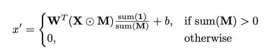
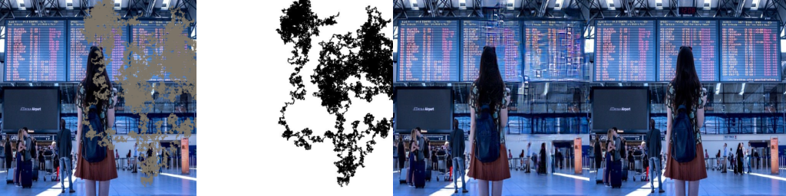

# Inpainting With Partial Conv : 画像の欠損部分を予測して埋める機械学習モデル

# Inpainting With Partial Conv : 画像の欠損部分を予測して埋める機械学習モデル

[](https://kyakuno.medium.com/?source=post_page---byline--9746576e6490---------------------------------------)

[Kazuki Kyakuno](https://kyakuno.medium.com/?source=post_page---byline--9746576e6490---------------------------------------)

Mar 15, 2021

--

Share

[ailia SDK](https://ailia.jp/)で使用できる機械学習モデルである「Inpainting With Partial Conv」のご紹介です。エッジ向け推論フレームワークである[ailia SDK](https://ailia.jp/)と[ailia MODELS](https://github.com/axinc-ai/ailia-models)に公開されている機械学習モデルを使用することで、簡単にAIの機能をアプリケーションに実装することができます。

## Inpainting With Partial Convの概要

Inpaining With Partial Convは2018年12月にNVIDIAが公開したImage Inpaintingのための機械学習モデルです。画像の中で欠損している部分を予測して修復することができます。入力画像とマスク画像を与えると、マスク画像の部分をAIが予測します。


出典：<https://arxiv.org/pdf/1804.07723.pdf>

[## Image Inpainting for Irregular Holes Using Partial Convolutions

### Existing deep learning based image inpainting methods use a standard convolutional network over the corrupted image…

arxiv.org](https://arxiv.org/abs/1804.07723?source=post_page-----9746576e6490---------------------------------------)

## InpaintingWithPartialConvのアーキテクチャ

Inpainting With Partial ConvのモデルアーキテクチャはPConvUNetです。

[## naoto0804/pytorch-inpainting-with-partial-conv

### Unofficial pytorch implementation of 'Image Inpainting for Irregular Holes Using Partial Convolutions' [Liu+, ECCV2018]…

github.com](https://github.com/naoto0804/pytorch-inpainting-with-partial-conv/blob/master/net.py?source=post_page-----9746576e6490---------------------------------------)

PConvUNetでは、UNetのConvの代わりに、マスク値に応じて画素を畳み込み対象に含めるかを決めるPartial Convが使用されています。



出典：<https://arxiv.org/pdf/1804.07723.pdf>

## Get Kazuki Kyakuno’s stories in your inbox

Join Medium for free to get updates from this writer.

Subscribe

Subscribe

Remember me for faster sign in

通常のConvolutionは、入力のXにWeightのWが乗算されます。この場合、欠損している部分の画素も畳み込みに使用してしまい、画質が低下します。PartialConvでは、入力のXのうち、マスクのMが1の画素だけを畳み込みに使用するため、画質が改善します。


出典：<https://arxiv.org/pdf/1804.07723.pdf>

マスクの更新では、1画素でも有効だった場合は畳み込み有効になります。

## Inpainting With Partial Convの使用方法

下記のコマンドで任意の画像に対して適用可能です。マスク画像はmasksフォルダのものを使用します。

```
python3 pytorch-inpainting-with-partial-conv --input IMAGE_PATH --savepath SAVE_IMAGE_PATH
```

[## ailia-models/image\_inpainting/pytorch-inpainting-with-partial-conv at master ·…

### (Image from Places2 dataset http://places2.csail.mit.edu/download.html) Shape : (n, 3, 256, 256) Left to right: input…

github.com](https://github.com/axinc-ai/ailia-models/tree/master/image_inpainting/pytorch-inpainting-with-partial-conv?source=post_page-----9746576e6490---------------------------------------)

実行すると下記のような出力が得られます。左から、入力、マスク、AI出力、正解です。

Press enter or click to view image in full size



出典：<https://pixabay.com/ja/photos/%E7%A9%BA%E6%B8%AF-%E3%83%88%E3%83%A9%E3%83%B3%E3%82%B9%E3%83%9D%E3%83%BC%E3%83%88-%E5%A5%B3%E6%80%A7-2373727/>

アニメ画像に対しても出力が得られます。

Press enter or click to view image in full size


出典：[H2MD CHAN](https://h2md.jp/)

ax株式会社はAIを実用化する会社として、クロスプラットフォームでGPUを使用した高速な推論を行うことができるailia SDKを開発しています。ax株式会社ではコンサルティングからモデル作成、SDKの提供、AIを利用したアプリ・システム開発、サポートまで、 AIに関するトータルソリューションを提供していますのでお気軽に[お問い合わせ](https://axinc.jp/)ください。