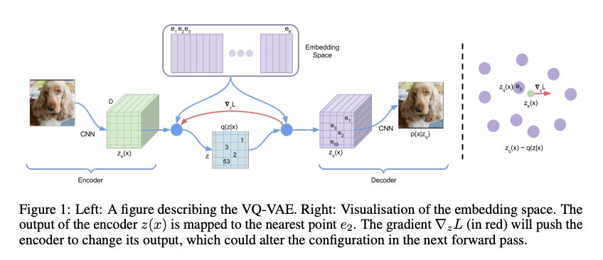
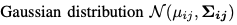
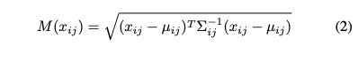
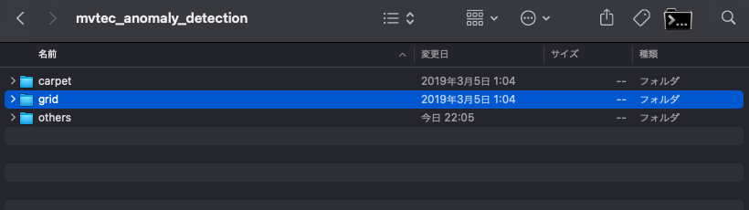
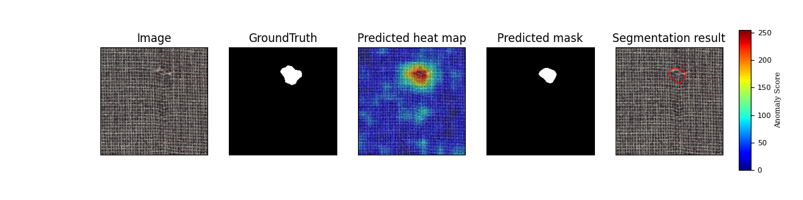
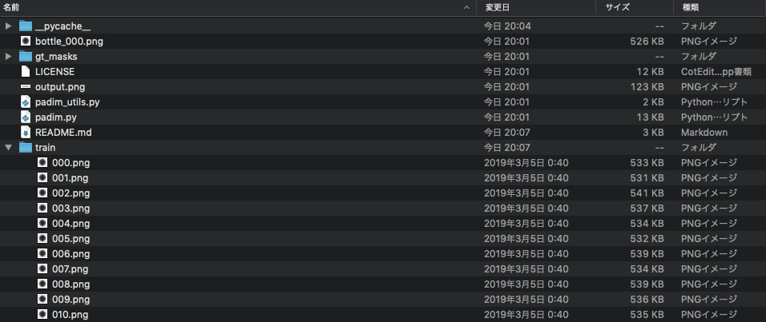
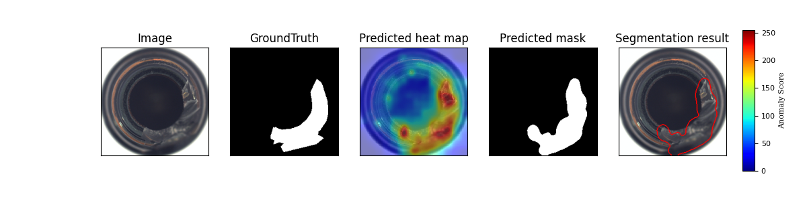
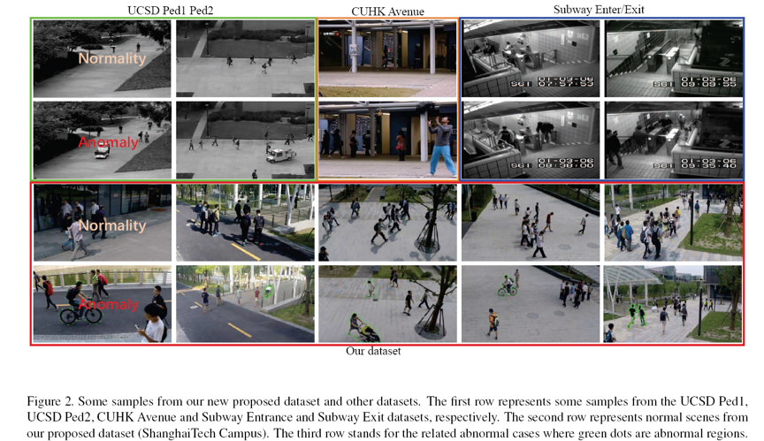

# PaDiM : 再学習不要で不良品検知を行う機械学習モデル

# PaDiM : 再学習不要で不良品検知を行う機械学習モデル

[](https://kyakuno.medium.com/?source=post_page---byline--69add653fbd3---------------------------------------)

[Kazuki Kyakuno](https://kyakuno.medium.com/?source=post_page---byline--69add653fbd3---------------------------------------)

14 min read

·

Mar 25, 2021

--

1

Share

[ailia SDK](https://ailia.jp/)で使用できる機械学習モデルである「PaDiM」のご紹介です。エッジ向け推論フレームワークである[ailia SDK](https://ailia.jp/)と[ailia MODELS](https://github.com/axinc-ai/ailia-models)に公開されている機械学習モデルを使用することで、簡単にAIの機能をアプリケーションに実装することができます。

## PaDiMの概要

PaDiMは2020年11月に発表された、不良品検知を行う機械学習モデルです。正常品のみの画像から再学習不要で不良品検知が実装可能です。不良品検知のデータセットであるMVTec ADでSOTAを達成しています。


出典：<https://arxiv.org/pdf/2011.08785.pdf>

[## PaDiM: a Patch Distribution Modeling Framework for Anomaly Detection and Localization

### We present a new framework for Patch Distribution Modeling, PaDiM, to concurrently detect and localize anomalies in…

arxiv.org](https://arxiv.org/abs/2011.08785?source=post_page-----69add653fbd3---------------------------------------)

## 不良品検知のアーキテクチャ

機械学習で不良品検知を行う方法として、下記の3つの方法があります。

1. 正常品と不良品から学習（正常品、不良品共に10000枚以上必要）
2. 正常品のみから学習（正常品が10000枚以上必要）
3. 正常品のみから画像の特徴量の分布を使って判定（正常品が240枚以上必要）

1.は通常のClassifierのモデルで、正常品と不良品の画像からResNetなどで分類モデルを学習し、不良品検知を行うものです。不良個所の可視化にはGradCamを使用します。また、近年では距離学習も使用されています。しかし、工場のラインでは、正常品の画像は多く取得できますが、不良品の画像はあまり取得できないという課題があります。

2.は、そのような背景で開発されたもので、正常品のみからAutoEncoderなどで学習を行います。AutoEncoderでは、入力された画像を低次元のベクトルに写像し、低次元のベクトルから元の画像を復元するモデルアーキテクチャです。正常品のみから学習したAutoEncoderは、正常品の特徴しか学習していないため、不良品の画像を入れても正常品の画像が出力されます。その特徴を利用して、入力画像とAutoEncoderの復元画像の差分を取ると異常個所を検出できます。近年では、GANも併用されています。しかし、製品ごとに機械学習の再学習が必要で負荷が高いという問題があります。

Press enter or click to view image in full size



出典：<https://arxiv.org/pdf/1711.00937.pdf>

3.は、近年注目されている方法で、機械学習モデルを特徴抽出のみに使用します。ImageNetで学習された機械学習モデルの中間層のデータは、画像の特徴をよく示しています。そこで、入力された画像をResNetなどに通し、中間層のデータを抽出して特徴量とした上で、正常品の特徴量の分布と、評価画像の特徴量の分布の差分を取ることで不良品検知を行います。

PaDiMは3番目のアプローチに属しており、K-NNによるクラスタリングが必要だったSPADEのアーキテクチャを改良し、Gaussian Distributionだけのシンプルなアーキテクチャにも関わらず、SOTAを達成しました。AUROCで計算した精度は97.9です。

Press enter or click to view image in full size


出典：<https://paperswithcode.com/sota/anomaly-detection-on-mvtec-ad>

## PaDiMのアーキテクチャ

PaDiMの学習では、正常品の画像列に対して、WideResNet50を適用し、Feature Mapを計算、特徴ベクトルを計算します。特徴ベクトルの計算においては、layer1〜3の浅い特徴量を使用します。特徴ベクトルは、Feature Mapの画像平面の各画素ごとに計算します。

計算した特徴ベクトルから、正常品の画像群の平均値を計算し、共分散行列を計算します。[共分散行列](https://ja.wikipedia.org/wiki/%E5%88%86%E6%95%A3%E5%85%B1%E5%88%86%E6%95%A3%E8%A1%8C%E5%88%97)は、スカラー値における分散の一般化となります。


共分散行列

平均と共分散行列から、正常品の[N次元正規分布](https://ja.wikipedia.org/wiki/%E6%AD%A3%E8%A6%8F%E5%88%86%E5%B8%83)を計算することができます。



N次元正規分布

下記が特徴ベクトルの計算の図解です。N枚の正常品の画像から、(W,H)=(224,224)の解像度を持つCNNに入力し、Feature Mapの画像平面の各画素ごとに共分散行列Σと平均μを計算します。

学習結果は、共分散行列と平均となります。

Press enter or click to view image in full size


出典：<https://arxiv.org/pdf/2011.08785.pdf>

PaDiMの推論では、テスト用の画像に対して、学習時と同様に特徴ベクトルを計算し、事前に計算しておいた共分散行列と平均から[マハラノビス距離](https://ja.wikipedia.org/wiki/%E3%83%9E%E3%83%8F%E3%83%A9%E3%83%8E%E3%83%93%E3%82%B9%E8%B7%9D%E9%9B%A2)を計算します。マハラノビス距離は、普通の距離を一般化したもので、2つの確率変数ベクトルの非類似性を計算することができます。



マハラノビス距離

各画素ごとにマハラノビス距離を計算し、マハラノビス距離を画像全体で正規化したものがヒートマップ、マハラノビス距離の最大値が異常度になります。これより、異常度が一定異常の場合、異常品と判定します。

## PaDiMの演算量の削減

PaDiMの演算量を削減する方法として、論文では、特徴ベクトルの次元数を削減する方法や、異なるアーキテクチャのCNNを用いることが提案されています。次元数の削減においては、PCA（主成分分析）とランダム抽出を比較し、ランダム抽出の方が性能が高いことが示されています。

## Get Kazuki Kyakuno’s stories in your inbox

Join Medium for free to get updates from this writer.

Subscribe

Subscribe

Remember me for faster sign in

PaDiMの再現実装においては、resnet18では448次元の特徴ベクトルを100次元に、wide\_resnet50\_2では1792次元の特徴ベクトルを550次元に、ランダム抽出によって削減しています。

## 不良品検知のデータセット

不良品検知の評価用のデータセットにはMVTec ADが使用されています。

[## MVTec AD

### MVTec AD is a dataset for benchmarking anomaly detection methods with a focus on industrial inspection. It contains…

www.mvtec.com](https://www.mvtec.com/company/research/datasets/mvtec-ad?source=post_page-----69add653fbd3---------------------------------------)

MVTec ADのデータセットは、trainフォルダのgoodに正常画像、testフォルダのgoodに正常画像、それ以外のフォルダ名に異常画像が格納されています。また、ground\_truthに異常個所のマスクが格納されています。異常個所のマスクはpixel ROCAUCを計算するのに使用します。

Press enter or click to view image in full size


データセットのフォルダ構成

アーキテクチャ上、浅い特徴量を使用するため、大きな位置ずれには弱くなっています。そのため、検出対象画像のセンタリングは必要です。

[## Whether the object position is strictly required to be consistent？ · Issue #1 ·…

### You can't perform that action at this time. You signed in with another tab or window. You signed out in another tab or…

github.com](https://github.com/xiahaifeng1995/PaDiM-Anomaly-Detection-Localization-master/issues/1?source=post_page-----69add653fbd3---------------------------------------)

MVTec ADのデータセットは高精度にセンタリングされているため、論文では、実アプリケーションへの応用に向けて、学習時に256x256から224x224へのRandomCropと、+-10度のRandomRotationを入れる、Modified versionが提案されています。

## PaDiMの使用方法

### Pytorch

PaDiMのリポジトリをCloneします。

[## xiahaifeng1995/PaDiM-Anomaly-Detection-Localization-master

### This is an implementation of the paper PaDiM: a Patch Distribution Modeling Framework for Anomaly Detection and…

github.com](https://github.com/xiahaifeng1995/PaDiM-Anomaly-Detection-Localization-master?source=post_page-----69add653fbd3---------------------------------------)

mvtec\_anomaly\_detectionにデータセットを配置します。

Press enter or click to view image in full size



datasets/mvtec.pyのCLASS\_NAMESを書き換えます。

```
CLASS_NAMES = ['grid']
```

python3 main.pyを実行します。Pytorchの場合、7GB程度、メモリを使用します。MVTec ADのカーペットのデータセット（279枚）を使用して学習を行なった場合、MacBookPro 13で2分程度で学習が完了します。

```
$ python3 main.py   
| feature extraction | train | grid |: 100%|██████| 9/9 [01:30<00:00, 10.08s/it]  
| feature extraction | test | grid |: 100%|███████| 3/3 [00:28<00:00,  9.60s/it]  
image ROCAUC: 0.957  
pixel ROCAUC: 0.965  
Average ROCAUC: 0.957  
Average pixel ROCUAC: 0.965
```

実行が完了すると、mvtec\_resultに検出結果のヒートマップが格納されます。検出結果の例は下記となります。カーペットの不良を検知することができており、不良個所を可視化できています。

Press enter or click to view image in full size


正常品

Press enter or click to view image in full size



異常品

### ailia SDK

ailia MODELSのPaDiMフォルダに移動します。

[## axinc-ai/ailia-models

### (Image from MVTec AD datasets https://www.mvtec.com/company/research/datasets/mvtec-ad/) Shape : (n, 3, 244, 244) Left…

github.com](https://github.com/axinc-ai/ailia-models/tree/master/anomaly_detection/padim?source=post_page-----69add653fbd3---------------------------------------)

trainフォルダに正常品の画像を配置します。この例では、[MVTec AD](https://www.mvtec.com/company/research/datasets/mvtec-ad/)のbottleのgoodフォルダにある画像を使用しています。

Press enter or click to view image in full size



学習用画像の配置

学習作業を行います。

```
python3 padim.py --train_dir train
```

学習結果がtrain.pklに格納されます。Resnet18の場合は127.9MBになります。

学習済みのtrain.pklを使用して、異常検知を行います。

```
python3 pading.py -i input.png -f train.pkl -th 0.5
```

異常度がコンソールに表示されます。この値が大きいほど異常度が高くなります。

```
Anomaly score: 25.189980 #異常品  
Anomaly score: 8.388268 #学習に使用した正常品  
Anomaly score: 11.866211 #学習に使用していない正常品
```

異常箇所がoutput.pngに出力されます。

Press enter or click to view image in full size



異常箇所の出力

異常箇所に関する最適な検出しきい値は、GroundTruthのマスク画像から算出することができます。gt\_masksフォルダに、入力画像の名前に対応するマスク画像を入れておくことで、推奨しきい値が出力されます。

```
INFO padim.py (392) : Optimal threshold: 0.592428
```

GroundTruthのマスク画像が存在しない場合は、output.pngのGroundTruthは空になります。

また、異常箇所については、画素ごとの異常度の最大値で正規化されてるため、正常品の場合は物体全体が異常になるような出力となります。画像全体の異常度が低い場合は異常箇所の画像は無視してください。

なお、入力画像の代わりにフォルダを与えることで、まとめて複数の画像の検証を行うことも可能です。

```
python3 pading.py -i input_folder -s output_folder -f train.pkl -th 0.5
```

実行例です。

## PaDiMのその他の応用

PaDiMは不良品検知の他に監視カメラの異常検知にも応用することが可能です。PaDiMはShanghaiTech Campus datasetで[CAVGA](https://arxiv.org/abs/1911.08616)（Convolutional Adversarial Variational autoencoder with Guided Attention ）の85%を超える91.2%のAUROCスコアを達成しています。

Press enter or click to view image in full size



<https://svip-lab.github.io/dataset/campus_dataset.html>

[## Shanghaitech Vision and Intelligent Perception(SVIP) LAB

### ShanghaiTech Campus dataset (Anomaly Detection) It is desirable that the anomaly detection model trained can be…

svip-lab.github.io](https://svip-lab.github.io/dataset/campus_dataset.html?source=post_page-----69add653fbd3---------------------------------------)

## 関連研究

MahalanobisADではEfficientNet B4の1〜7階層のFeatureMapにGlobalAveragePoolingを適用して取得したFeatureVectorに対してマハラノビス距離を計算します。MahalanobisADでは画像全体で一つのマハラノビス距離を計算します。PaDiMのように画素ごとにマハラノビス距離を計算しているわけではないため、異常箇所の可視化は行えません。異常箇所が必要な場合はGradCAMによってヒートマップを生成します。

[## byungjae89/MahalanobisAD-pytorch

### PyTorch implementation of Modeling the Distribution of Normal Data in Pre-Trained Deep Features for Anomaly Detection…

github.com](https://github.com/byungjae89/MahalanobisAD-pytorch?source=post_page-----69add653fbd3---------------------------------------)

ax株式会社はAIを実用化する会社として、クロスプラットフォームでGPUを使用した高速な推論を行うことができるailia SDKを開発しています。ax株式会社ではコンサルティングからモデル作成、SDKの提供、AIを利用したアプリ・システム開発、サポートまで、 AIに関するトータルソリューションを提供していますのでお気軽に[お問い合わせ](https://axinc.jp/)ください。