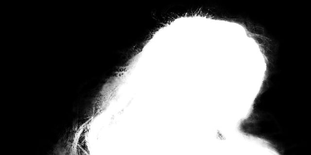

# Pytorchのnn.MaxUnpool2dをONNXにエクスポートする

# Pytorchのnn.MaxUnpool2dをONNXにエクスポートする

[](https://kyakuno.medium.com/?source=post_page---byline--f48deb65580a---------------------------------------)

[Kazuki Kyakuno](https://kyakuno.medium.com/?source=post_page---byline--f48deb65580a---------------------------------------)

May 21, 2021

--

Share

Pytorchのnn.MaxUnpool2dをONNXにエクスポートする方法を紹介します。

## PytorchのMaxUnpool2dとONNXのUnpool2dについて

MaxUnpool2dはMaxPool2dの逆操作です。FeatureMapの解像度を上げるために使用することが可能です。ONNXの対応するオペレータはUnpool2dとなるのですが、Pytorchのものとindicesの仕様が異なっているため、Pytorchからエクスポートすることはできません。

## Get Kazuki Kyakuno’s stories in your inbox

Join Medium for free to get updates from this writer.

Subscribe

Subscribe

Remember me for faster sign in

そのため、MaxUnpool2dを含むモデルをONNXにエクスポートしようとすると、下記のエラーが発生します。

```
RuntimeError: Exporting the operator max_unpool2d to ONNX opset version 11 is not supported. Please open a bug to request ONNX export support for the missing operator.
```

## MaxUnpool2dをエクスポートできるようにする

MaxUnpool2dをエクスポートできるようにするには、Pytorchのnn.MaxUnpool2dをmmeditingの実装に置き換えます。mmeditingの実装においては、symbolic APIが定義されており、ONNXのオペレータの組み合わせでUnpool2dのindicesを計算することができます。

[## open-mmlab/mmediting

### OpenMMLab Image and Video Editing Toolbox. Contribute to open-mmlab/mmediting development by creating an account on…

github.com](https://github.com/open-mmlab/mmediting/blob/master/mmedit/models/backbones/encoder_decoders/decoders/plain_decoder.py?source=post_page-----f48deb65580a---------------------------------------)

上記のコードを使用して、下記のように置き換えます。

```
#self.unpool = nn.MaxUnpool2d(2, 2)  #torch  
self.unpool = MaxUnpool2d(2, 2) #onnx
```

これで、ONNXへのエクスポートが可能になります。

## エクスポート結果の確認

実際にMaxUnpool2dを含むDeep-Image-Matting-Pytorchをエクスポートしてみます。

[## foamliu/Deep-Image-Matting-PyTorch

### Deep Image Matting implementation in PyTorch. Contribute to foamliu/Deep-Image-Matting-PyTorch development by creating…

github.com](https://github.com/foamliu/Deep-Image-Matting-PyTorch?source=post_page-----f48deb65580a---------------------------------------)

上記の修正をmodel.pyに対して適用し、test.pyでエクスポートを行います。

エクスポートしたONNXで同じ推論結果が得られることを確認します。



nn.MaxUnpool2d


ONNX (mmediting.MaxUnpool2d)

ax株式会社はAIを実用化する会社として、クロスプラットフォームでGPUを使用した高速な推論を行うことができるailia SDKを開発しています。ax株式会社ではコンサルティングからモデル作成、SDKの提供、AIを利用したアプリ・システム開発、サポートまで、 AIに関するトータルソリューションを提供していますのでお気軽に[お問い合わせ](https://axinc.jp/)ください。