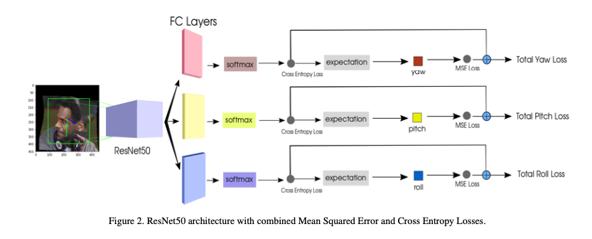
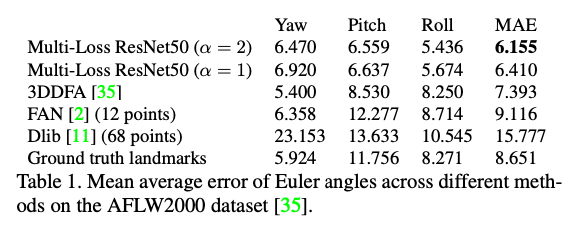

# HOPE-Net : 顔の向きを推定する機械学習モデル

# HOPE-Net : 顔の向きを推定する機械学習モデル

[](https://kyakuno.medium.com/?source=post_page---byline--6db21979f935---------------------------------------)

[Kazuki Kyakuno](https://kyakuno.medium.com/?source=post_page---byline--6db21979f935---------------------------------------)

Jun 14, 2021

--

Share

[ailia SDK](https://ailia.jp/)で使用できる機械学習モデルである「HOPE-Net」のご紹介です。エッジ向け推論フレームワークである[ailia SDK](https://ailia.jp/)と[ailia MODELS](https://github.com/axinc-ai/ailia-models)に公開されている機械学習モデルを使用することで、簡単にAIの機能をアプリケーションに実装することができます。

## HOPE-Netの概要

HOPE-Netは2017年10月に公開された機械学習モデルです。入力された顔から、yaw、pitch、rollの3軸の角度を出力します。

[## Fine-Grained Head Pose Estimation Without Keypoints

### Estimating the head pose of a person is a crucial problem that has a large amount of applications such as aiding in…

arxiv.org](https://arxiv.org/abs/1710.00925?source=post_page-----6db21979f935---------------------------------------)

Press enter or click to view image in full size


難易度の高い顔画像でも検出可能（出典：<https://github.com/natanielruiz/deep-head-pose>）

## HOPE-Netのアーキテクチャ

顔の向きの検出は、視線検出や、注視している物体の認識などで使用される重要な技術です。

従来、顔の向きの検出は、対象となる顔のキーポイントを検出し、標準的な頭部モデルを使用した2D to 3D変換によって実装されていました。しかし、顔のキーポイント検出の性能に精度が依存するという問題や、アドホックなフィッティングが必要という問題がありました。

## Get Kazuki Kyakuno’s stories in your inbox

Join Medium for free to get updates from this writer.

Subscribe

Subscribe

Remember me for faster sign in

HOPE-Netでは、Multi-loss convolutional netral networksによって、シングルショットで顔の向きを検出します。顔検出器で検出した顔を入力として、ResNet50で特徴を抽出、FC Layerでyaw、pitch、rollを計算します。

Press enter or click to view image in full size



出典：<https://arxiv.org/pdf/1710.00925>

HOPE-NetはAFLW2000でSoTAを達成しています。AFLW2000は、AFLWデータセットの最初の2000画像に68 3D landmarksの再アノテーションを行なったデータセットです。



出典：<https://arxiv.org/pdf/1710.00925>

## HOPE-Netの使用方法

HOPE-Netを使用するには下記のコマンドを使用します。WEBカメラから顔の向きを検出することができます。

```
$ python3 hopenet.py -v 0
```

また、下記のコマンドで、ResNet50ではなくShuffleNetV2を使用した高速バージョンも使用可能です。

```
$ python3 blazehand.py --lite -v 0
```

[## axinc-ai/ailia-models

### (Image from https://pixabay.com/photos/person-human-male-face-man-view-829966/) ailia input shape: (1, 3, 128, 128) RGB…

github.com](https://github.com/axinc-ai/ailia-models/tree/master/face_recognition/hopenet?source=post_page-----6db21979f935---------------------------------------)

実行例です。

ax株式会社はAIを実用化する会社として、クロスプラットフォームでGPUを使用した高速な推論を行うことができるailia SDKを開発しています。ax株式会社ではコンサルティングからモデル作成、SDKの提供、AIを利用したアプリ・システム開発、サポートまで、 AIに関するトータルソリューションを提供していますのでお気軽に[お問い合わせ](https://axinc.jp/)ください。