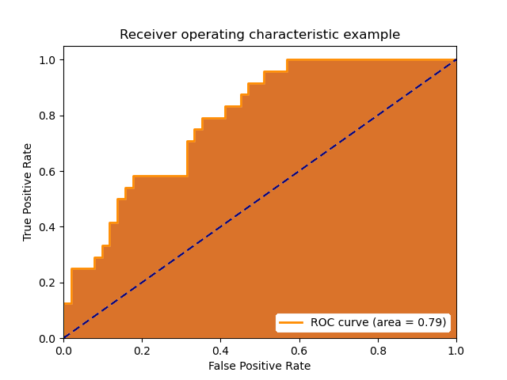

# ROC曲線とAUC：機械学習モデルの評価指標

# ROC曲線とAUC：機械学習モデルの評価指標

[Kazuki Kyakuno](https://kyakuno.medium.com/?source=post_page---byline--6fd98974576c---------------------------------------)

Jun 23, 2021

--

Share

機械学習モデルの評価で使用されるROC曲線とAUCについて解説します。

## ROC曲線について

ROC曲線（Receiver Operating Characteristic Curve）は縦軸にTrue Positive Rate、横軸にFalse Positive Rateを取った二次元の曲線となります。

出典：<https://scikit-learn.org/stable/auto_examples/model_selection/plot_roc.html#sphx-glr-auto-examples-model-selection-plot-roc-py>

ある画像が猫かどうかを判定する機械学習モデルを考えます。機械学習モデルは猫らしさを0〜1.0で出力するとして、指定したthresholdを超えた場合は猫であるとします。

この時、threshold=0とすると、必ず猫と判定されるため、True Positive Rate（猫画像が猫として判定される比率）は1.0、False Positive Rate（猫でない画像が猫として判定される比率）は1.0になります。

次に、threshold=1とすると、必ず猫でないと判定されるため、True Positive Rate（猫画像が猫として判定される比率）は0.0、False Positive Rate（猫でない画像が猫として判定される比率）は0.0となります。

ランダムに猫か猫でないかを判定するモデルを仮定すると、True Positive Rate（猫画像が猫として判定される比率）とFalse Positive Rate（猫でない画像が猫として判定される比率）は同じになります。（図中の青線）

## Get Kazuki Kyakuno’s stories in your inbox

Join Medium for free to get updates from this writer.

Subscribe

Subscribe

Remember me for faster sign in

ROC曲線は機械学習モデルのthresholdを変動させながら、True Positive Rate（猫画像が猫として判定される比率）とFalse Positive Rate（猫でない画像が猫として判定される比率）をプロットすることで計算できます。（図中のオレンジ線）

## AUCについて

AUC（Area Under Curve）はROC曲線の面積を示します。

優秀な機械学習モデルであるほど、ROC曲線は左上にプロットされます。次の図では、オレンジよりも水色の曲線の方が優秀な機械学習モデルになります。

出典：<https://scikit-learn.org/stable/auto_examples/model_selection/plot_roc.html#sphx-glr-auto-examples-model-selection-plot-roc-py>

優秀な機械学習モデルは、猫に対して常に高いConfidence値を、猫以外の画像に対して常に低いConfidence値を出力するため、thresholdを大きくしていく、つまりFalse Positive Rateを小さくしていっても、True Positive Rateは高いまま維持されます。その結果、ROC曲線は左上にプロットされます。

ROC曲線が左上に来ているかを目で見て判断するのは難しく、主観も介在するため、より簡便に評価するためにROC曲線の面積であるAUCが使用されます。

## 単純な精度比較との優位性

ROC曲線を使用せずに機械学習モデルの性能を比較しようとした場合、横軸にthresholdを、縦軸に正解率（TPR/(TPR+FPR))をプロットすることになります。しかし、横軸のthresholdのスケールは機械学習モデルごとに異なるため、機械学習モデル間の比較を行うことができません。横軸をFPRに統一することで、異なる機械学習モデルの比較を行うことができるのがROC曲線を使用するメリットです。

また、thresholdを変動させながら、最も高い正解率を計算して、機械学習モデルの性能とするという方法も考えられます。しかし、現実の応用では入力データは未知であるため、thresholdを適切に決めることは難しいという問題があります。汎化性能の観点では、入力データが変わる、つまり最適なthresholdが変わっても精度が維持できるかは重要です。ROC曲線で評価することで、ROC曲線が左上にあるほど、thresholdの変動に対してロバストであることを保証することができます。

ax株式会社はAIを実用化する会社として、クロスプラットフォームでGPUを使用した高速な推論を行うことができるailia SDKを開発しています。ax株式会社ではコンサルティングからモデル作成、SDKの提供、AIを利用したアプリ・システム開発、サポートまで、 AIに関するトータルソリューションを提供していますのでお気軽に[お問い合わせ](https://axinc.jp/)ください。