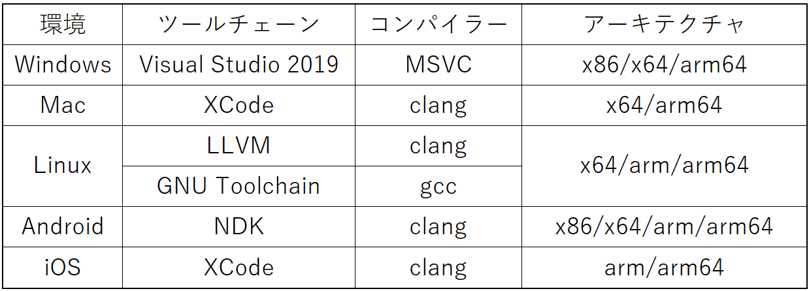
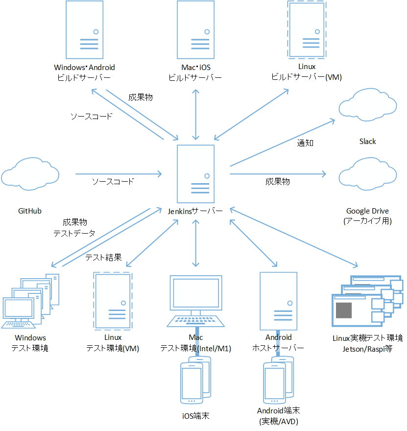
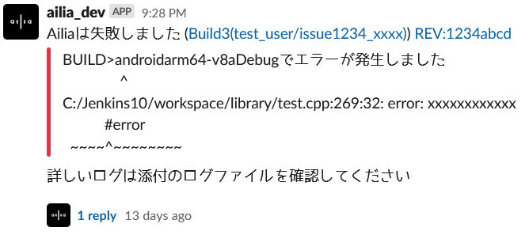

# ailiaのCI環境

# ailiaのCI環境

[Masashi MICHIGAMI](https://michigami.medium.com/?source=post_page---byline--ef6ec7c5b5c6---------------------------------------)

Sep 9, 2021

--

Share

連載記事 ailia SDKの品質を支えるビルド＆テスト環境の第1回目です。

[ailia SDK](https://ailia.jp/)はWindows Mac iOS Android Linuxといった様々な環境に対応する クロスプラットフォーム対応高速CNN推論エンジンです。  
AVXやNEONといった各環境で利用可能なSIMD命令に対応したり、GPGPUの性能を最大限引き出すためcuDNNやMetalの他にVulkanなどにも対応することで各環境での高速推論を実現しております。

## はじめに

本連載では[ailia](https://medium.com/@michigami)の開発を支えるビルドとテスト環境に焦点を当て、いろいろな裏話をできればと思います。

今回は概要として[ailia](https://ailia.jp/)のCI(継続的インテグレーション)環境とテスト環境についてのお話です。

## ailiaの動作環境

[ailia](https://ailia.jp/)はクロスプラットフォーム対応なライブラリです。そのため以下のように様々な環境でそれぞれに合うコンパイラー・ツールチェーンを利用してビルドをする必要があります。

Press enter or click to view image in full size

ailiaの動作環境一覧

同じプログラムのコードでもコンパイラーによってはうまくコンパイルできない、環境によってはうまく動かないなどがあるため、ailiaではCIを活用し、全環境でコンパイルとテストを行っています。

## CI環境

[ailia](https://ailia.jp/)ではCI環境としてJenkinsを採用しています。各環境向けのビルドサーバーと各環境向けのテスト端末をJenkinsサーバーへ接続しています。

Press enter or click to view image in full size

CI環境

基本的には

1. 開発者がGitHub上のリポジトリへコードをコミットする
2. JenkinsサーバーはGitHubを定期的にポーリングし、変更があったブランチのソースコードを取得してビルドキューへ積む
3. ビルドサーバーではJenkinsサーバーからソースコード一式を受け取り、ビルドを行う。ビルドが正常に終了した場合はJenkinsサーバーへ成果物を返す
4. すべてのビルドサーバーでビルドが正常に終了した場合、Jenkinsサーバーはテスト用データを取得してテストキューへ積む
5. テスト環境ではJenkinsサーバーからテスト用データとテスト環境向けの成果物を受け取り単体テストや推論テストを実行し、テスト結果をJenkinsサーバーへ返す
6. すべてのテスト環境でテストが通過した場合、JenkinsサーバーはSlackへ通知する。  
    ビルドを行ったブランチがメインブランチの場合は成果物一式をGoogle Driveへ保存する

という流れになっており、開発者がコードをコミットするだけで、全環境でコンパイルができるか、用意されている単体テストを通過するかなどのテストを行い、問題がある場合はSlack経由で通知する仕組みになっています。

Slack通知イメージ

これにより、開発者が誤ってバグを埋め込んだ場合でもすぐに検知を行い修正ができるような体制を構築しています。

## Get Masashi MICHIGAMI’s stories in your inbox

Join Medium for free to get updates from this writer.

Subscribe

Subscribe

Remember me for faster sign in

また、通常JenkinsではサポートされていないAndroid実機・Android Virtual Device・iOS実機でも自動テストを行うため、専用のシェルを開発したり、単体テストフレームワークを通常とは異なる方法で利用たりしています。（詳細は後日公開予定）

## テスト環境

[ailia](https://ailia.jp/)の単体検証にはBoost Test Libraryを採用しています。開発者が手動で作成した様々なケースを再現する単体テストの他、[ailia](https://ailia.jp/)が対応している100種類以上のONNXレイヤーやCaffe Modelのレイヤーのテストを漏れなく行うため、テスト用モデルファイルの生成からテストコードの自動生成までを自動化しています。(詳細は後日公開予定)

テストモデルとテストコードの自動生成もJenkinsで行っており、テストの定義スクリプトをGitHubへコミットすると、Jenkins環境下でモデルの生成とテスコドードの生成処理を行い、GitHubのテストデータ用リポジトリへコミットします。

また、動作確認済みモデルに関してもBoost Test Libraryで推論が正しく行えるかなどの統合テストを行ったり、動作確認済みモデルを含む複数のモデルで負荷テストを行うテストツールでのテストなども行ったりしています。

ax株式会社はAIを実用化する会社として、クロスプラットフォームでGPUを使用した高速な推論を行うことができる[ailia SDK](https://ailia.jp/)を開発しています。ax株式会社ではコンサルティングからモデル作成、SDKの提供、AIを利用したアプリ・システム開発、サポートまで、 AIに関するトータルソリューションを提供していますのでお気軽に[お問い合わせ](https://axinc.jp/)ください。

[ailia](https://ailia.jp/)は[株式会社アクセル](https://www.axell.co.jp/)の登録商標です。また、本文記載の社名・製品名などは、一般に各社の商標もしくは登録商標です。