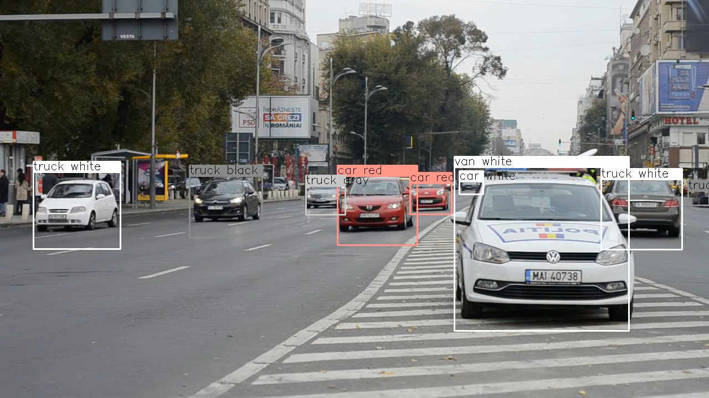
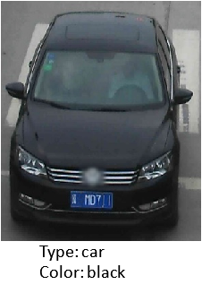
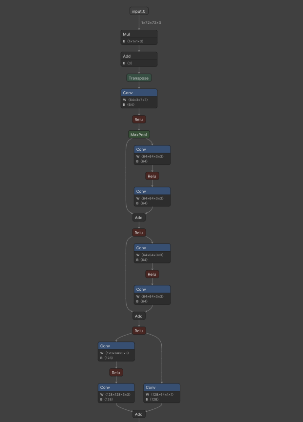

# VehicleAttributeRecognitionBarrier : 車の属性を検出する機械学習モデル

# VehicleAttributeRecognitionBarrier : 車の属性を検出する機械学習モデル

[](https://kyakuno.medium.com/?source=post_page---byline--ee26d1a3e00b---------------------------------------)

[Kazuki Kyakuno](https://kyakuno.medium.com/?source=post_page---byline--ee26d1a3e00b---------------------------------------)

Sep 22, 2021

--

Share

[ailia SDK](https://ailia.jp/)で使用できる機械学習モデルである「VehicleAttributeRecognitionBarrier」のご紹介です。エッジ向け推論フレームワークである[ailia SDK](https://ailia.jp/)と[ailia MODELS](https://github.com/axinc-ai/ailia-models)に公開されている機械学習モデルを使用することで、簡単にAIの機能をアプリケーションに実装することができます。

## VehicleAttributeRecognitionBarrierの概要

VehicleAttributeRecognitionBarrierはIntelの開発した車の属性を識別する機械学習モデルです。車の種類と色を検出可能です。

[## open\_model\_zoo/README.md at master · openvinotoolkit/open\_model\_zoo

### This model presents a vehicle attributes classification algorithm for a traffic analysis scenario. Color average…

github.com](https://github.com/openvinotoolkit/open_model_zoo/blob/master/models/intel/vehicle-attributes-recognition-barrier-0042/README.md?source=post_page-----ee26d1a3e00b---------------------------------------)

Press enter or click to view image in full size



出典：<https://pixabay.com/ja/videos/%E8%AD%A6%E5%AF%9F%E3%81%AE%E8%BB%8A-%E5%B8%82-%E3%83%88%E3%83%A9%E3%83%95%E3%82%A3%E3%83%83%E3%82%AF-6095/>

## VehicleAttributeRecognitionBarrierのアーキテクチャ

VehicleAttributeRecognitionBarrierは車の正面画像を入力して属性を出力します。取得できる属性は色と、車の種類です。



出典：<https://github.com/openvinotoolkit/open_model_zoo/blob/master/models/intel/vehicle-attributes-recognition-barrier-0042/README.md>

色のカテゴリは7つ、車種のカテゴリは4つで、精度は色で82.71%、種類で87.34%となります。


出典：<https://github.com/openvinotoolkit/open_model_zoo/blob/master/models/intel/vehicle-attributes-recognition-barrier-0042/README.md>

## Get Kazuki Kyakuno’s stories in your inbox

Join Medium for free to get updates from this writer.

Subscribe

Subscribe

Remember me for faster sign in

モデルアーキテクチャはResNetライクな構造を持ちます。入力は(1,72,72,3)の画像で、出力は色の確率を示す(1,7)のベクトルと、車の種類を示す(1,4)のベクトルです。



出典：[https://netron.app/?url=https://storage.googleapis.com/ailia-models/vehicle-attributes-recognition-barrier/vehicle-attributes-recognition-barrier-0042.onnx.prototxt](https://netron.app/?url=https%3A%2F%2Fstorage.googleapis.com%2Failia-models%2Fvehicle-attributes-recognition-barrier%2Fvehicle-attributes-recognition-barrier-0042.onnx.prototxt)

制約として、車の正面の画像を与える必要があります。また、遮蔽は50%以下である必要があります。


出典：<https://github.com/openvinotoolkit/open_model_zoo/blob/master/models/intel/vehicle-attributes-recognition-barrier-0042/README.md>

## VehicleAttributeRecognitionBarrierの使用方法

VehicleAttributeRecognitionBarrierを仕様するには、下記のコマンドを使用します。任意の動画に対してYOLOv3で車を検出した後、属性を検出します。

```
$ python3 vehicle-attributes-recognition-barrier.py -v input.mp4
```

実行例です。

[## ailia-models/vehicle\_recognition/vehicle-attributes-recognition-barrier at master ·…

### (Image from…

github.com](https://github.com/axinc-ai/ailia-models/tree/master/vehicle_recognition/vehicle-attributes-recognition-barrier?source=post_page-----ee26d1a3e00b---------------------------------------)

ax株式会社はAIを実用化する会社として、クロスプラットフォームでGPUを使用した高速な推論を行うことができるailia SDKを開発しています。ax株式会社ではコンサルティングからモデル作成、SDKの提供、AIを利用したアプリ・システム開発、サポートまで、 AIに関するトータルソリューションを提供していますのでお気軽に[お問い合わせ](https://axinc.jp/)ください。