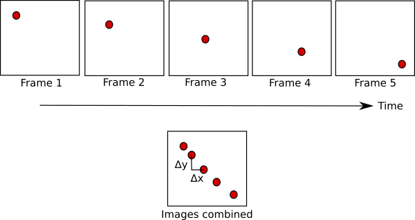
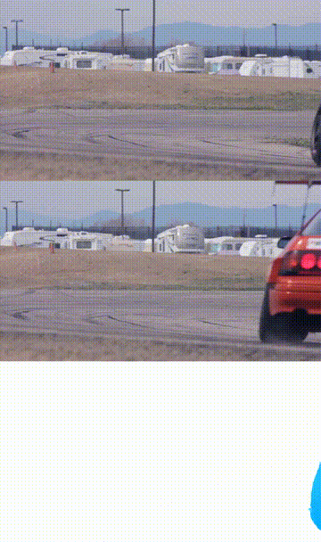
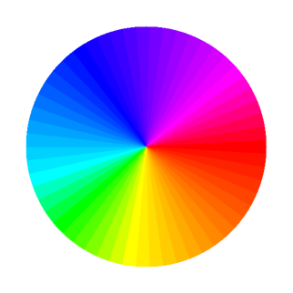
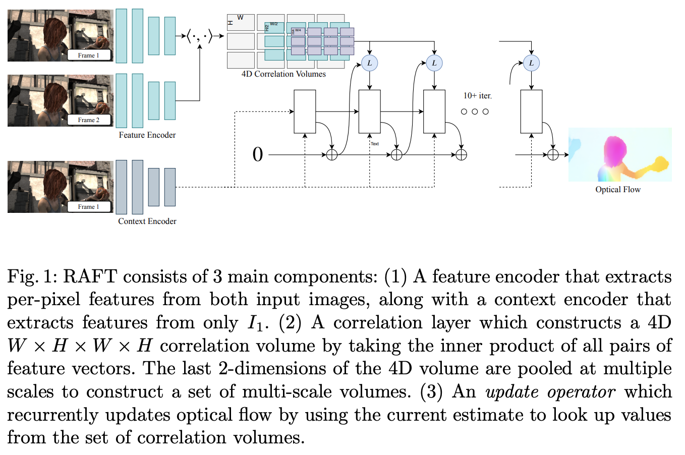
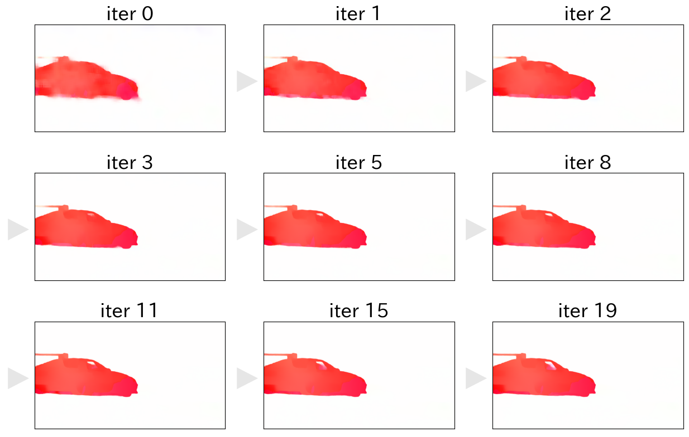
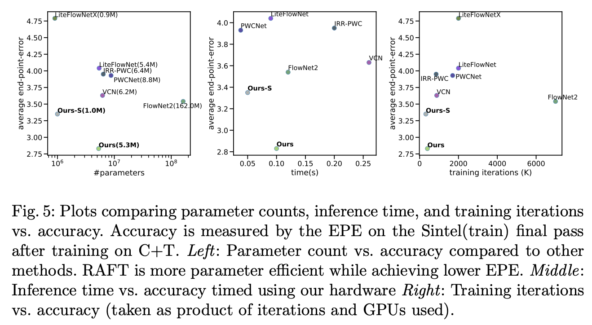

# RAFT: Optical Flowを推定する機械学習モデル

# RAFT: Optical Flowを推定する機械学習モデル

[](https://medium.com/@mucunwuxian?source=post_page---byline--bf898965de05---------------------------------------)

[Taketo Kimura](https://medium.com/@mucunwuxian?source=post_page---byline--bf898965de05---------------------------------------)

12 min read

·

Nov 4, 2021

--

Share

[ailia SDK](https://ailia.jp/)で使用できる機械学習モデルである「RecurrentAll-Pairs Field Transforms（以下、RAFT）」のご紹介です。  
[ailia SDK](https://ailia.jp/)はエッジ向け推論フレームワークであり、[ailia MODELS](https://github.com/axinc-ai/ailia-models)に公開されている機械学習モデルを使用することで、簡単にAIの機能をアプリケーションに実装することができます。

## RAFTの概要

RAFTは、名門プリンストン大学の研究室である[PRINCETON VISION & LEARNING LAB](https://pvl.cs.princeton.edu/)が発表した、最新のオプティカルフロー推定技術です。  
[論文](https://arxiv.org/pdf/2003.12039.pdf)発表時点にて、KITTIやSintelといった有名なデータセットにて、State-Of-The-Art（最先端のパフォーマンス）を実現していたとのことで、世界的な画像処理学会ECCVの2020年開催にて、Best Paperに選出されています。

尚、オプティカルフローとは、動画上の前後2フレーム間について、特定の部分画像の動きを、ベクトル表現にて数値化したものとなります。  
もう少し直感的に表現をすると、動画上の前後2フレーム上に映り込む、物体の動きを表したものです。  
以下の画像が非常に明快であり、イメージが湧きやすいかもしれません。



出典：<https://www.bitcraze.io/2017/11/optical-flow/>

イメージ上の**(⊿x, ⊿y)**が、「Frame 2」から「Frame 3」へと画像が遷移する際に、赤い点が移動した距離の成分となっています。  
オプティカルフローとは、この**(⊿x, ⊿y)**のことになります。

また、RAFTを始めとするDeep Learningでのオプティカルフロー推定については、基本的には画像上の全ピクセルについて、それを行います。  
これは、一般に「Dense（密）なオプティカルフロー推定」と表現されます。  
全ピクセルに対するDenseなオプティカルフロー推定とは、例えば、上記イメージにおける「Frame 2」での赤い点の座標を**(x, y)**とすると、「Frame 3」での赤い点の座標は**(x+⊿x, y+⊿y)**という形になる為、座標**(x, y)**におけるオプティカルフローは**(⊿x, ⊿y)**となります。  
このオプティカルフロー推定を、座標**(x, y)**以外のピクセルについても、実施します。  
座標**(0, 0)**におけるオプティカルフローは**(⊿a, ⊿b)**、座標**(0, 1)**におけるオプティカルフローは**(⊿c, ⊿d)**、…というような要領となります。

一方で、旧来のオプティカルフロー推定は、物体の角や色境界など、見えから強い特徴のとれた特定の画像部位に対してのみに行われていました。  
これは、一般に「Sparse（疎）なオプティカルフロー推定」と表現されます。

以下が、両者の比較イメージとなります。


出典：<https://nanonets.com/blog/optical-flow/>

左側のSparseなオプティカルフロー推定では、画像中における車等の特定部位に対してのみの推定が行われていることが、イメージとして掴めるかと思います。  
前フレームの車の角等が、次フレームでどこに遷移したかという軌跡が、緑色の線によって表現されている形です。  
一方で、道路や建物や空や街路樹などの変動が無い画像部位や、自動車の中でも相対的に見えの特徴が弱い対象については、オプティカルフローが推定されていません。

一方で、右側のDenseなオプティカルフロー推定は、若干分かりづらいですが、全ピクセルに対して推定が行われています。  
左側の図で、緑色の線で表現がされていたものが、右側の図では色味で表現がされています。  
着色箇所が、強いオプティカルフローが推定された箇所であり、黒い部分は、オプティカルフロー推定が弱い箇所となります。

Denseなオプティカルフロー推定について、もう少し分かりやすい表現で示しますと、以下のような形となります。



出典：<https://pixabay.com/videos/car-racing-motor-sports-action-74/>

3段画像がある内の、上段が前フレームで、中断が後フレーム、下段が前後フレーム間におけるオプティカルフローの推定結果となっています。  
つまり、上段の動画よりも、中段の動画の方が、1フレーム先行している形となってます。  
オプティカルフローの推定結果における色表現は、オプティカルフローのベクトルについて、その絶対値が相対的に大きいものを、以下の配色円グラフに従い可視化しているものになります。  
以下の配色円グラフは、ベクトル方向に対応しており、車が左に移動をしている際には水色〜青色、車が右に移動をしている際には赤色という形となっています。



尚、オプティカルフロー推定は、あくまで動画のフレーム間における相対的な物体の動きを追っているもので、現実世界における物体の実際の動きを追っているものではありません。  
その為、以下のような、撮影カメラ側がアングルを動かすようなケースですと、背景に対してオプティカルフローが発生するような推定となります。


出典：<https://pixabay.com/videos/car-racing-motor-sports-action-74/>

そして、上記のオプティカルフローは正に、Githubに公開されている[RAFTリポジトリ](https://github.com/princeton-vl/RAFT)のプログラムにて、推定をしたものになります。  
RAFTとは、このような形で、密なオプティカルフローの推定を行うものとなります。

## RAFTのアーキテクチャ

論文に紹介されている、RAFTのネットワーク構成は以下となっています。

Press enter or click to view image in full size



出典：<https://arxiv.org/pdf/2003.12039.pdf>

大まかに流れを追うと、若干複雑になりますが、以下となります。

> *［１］入力された前後フレーム画像の2枚を、共通のFeature Encoderにかけて、それぞれの画像から計2つの特徴を生成します  
> ［２］［１］で生成した2つの特徴について、全てのピクセル間における特徴ベクトル同士の相関を計算（<･, ･>）し、4D Correlation Volumesを生成します  
> （※見えの似ているピクセル間で高い相関値が計算され、そうでないピクセル間で低い相関値が計算されます）  
> ［３］［２］で生成された4D Correlation Volumesを、average poolingを用いて、縦横方向1/2・1/4・1/8とリサイズ圧縮したものも生成します  
> ［４］［１］〜［３］の流れとは別に、入力された前フレーム画像の1枚を、Context Encoderにかけて、1つの特徴を生成します  
> ［５］［４］で生成した1つの特徴を、channel次元にて2つに分割し、一方にはtanhによる活性化を、もう一方にはreluによる活性化を行います［６］オプティカルフローの推定値を、全ピクセルに対し、初期値として0を設定します*
>
> *［７］直近計算したオプティカルフロー推定値による、画像の移動先を中心とした、縦横周囲±数ピクセルの座標を計算しておきます  
> ［８］［７］で計算した縦横周囲±数ピクセルについて、［３］で生成されたピラミッド状の4D Correlation Volumesの値を、各スケール毎に収集します  
> ［９］直近計算したオプティカルフロー推定値と、［５］で生成した2つの分割特徴と、［８］で収集した4D Correlation Volumesの値との、合計4つの特徴を入力に、オプティカルフロー推定値を更新します  
> （※この際、［５］で生成した特徴の片方、tanhで活性化したものについても、特徴値を更新する）*
>
> *［１０］以降、［７］〜［９］までの処理を任意回数繰り返して、オプティカルフロー推定値を更新していく*

以上です。  
他のDeep Learningアーキテクチャーとは一線を画すような、ユニークなアルゴリズムとなっているかと思われます。

## Get Taketo Kimura’s stories in your inbox

Join Medium for free to get updates from this writer.

Subscribe

Subscribe

Remember me for faster sign in

尚、論文中において、上記の流れを更に抽象化すると、3つの段階に要約できると記載がされています。

> *【１】特徴抽出  
> 【２】視覚的類似性の計算  
> 【３】反復更新*

ここで、少し補足をさせて頂きます。

先ず、１つ目の段階、「【１】特徴抽出」に関しては、一般的なDeep Learningアーキテクチャにて行われていることと、同様の考え方になります。  
目的と関連が深くないであろう、細かい見えの特徴を省きつつ、目的と関連の深そうな、有効な特徴を強調することを試みている形です。

次に、２つ目の段階、「【２】視覚的類似性の計算」についてですが、前後フレーム画像間において、前フレーム画像の特定部位と、後フレームの各部位との類似度を、総当りで計算する形になります。  
計算方法について、論文中に描かれているイメージは以下となります。

Press enter or click to view image in full size


出典：<https://arxiv.org/pdf/2003.12039.pdf>

Deep Learning全般で言えば、推測の拠り所になるであろう特徴抽出方法の探索について、Deep Learningにまるっとお任せしてしまう形で、学習処理を行うことが珍しくありませんが、解こうとする問題が複雑である場合に、上手く学習が捗らないことがあります。  
その際、人間が設計した解釈の補助となる情報を、Deep Learning側に連携をする手立てがあるのですが、このアプローチはその一種かと思われます。  
尚、この手立てによって、高速な小物体を捉えやすくなったり、学習時間も削減されたとのことです。

最後に、３つ目の段階、「【３】反復更新」についてですが、推論を反復的に行うことで、精度を上げていくようなアプローチとなっています。  
つまり、反復計算が少ないと、計算時間は短くて済むものの、比較的精度は低くなり、反復回数が多いと、計算時間はかかるものの、比較的精度は高くなる傾向となります。  
以下は、先程紹介したレーシングカー動画の、特定の2フレームについて、反復計算回数毎のオプティカルフロー推定値を、図示しているものとなります。  
反復回数が多い程、精度が上がっている様子が伺えるかと思います。

Press enter or click to view image in full size



以上のようなアーキテクチャの工夫により、高い精度が引き出すことができたことはSOTAという結果から勿論ですが、高精度に至るまでの学習に要する時間や、推論にかかる処理時間などにおいても、高いコストパフォーマンスを発揮したとのことです。  
以下、論文中に記載の図となります。

Press enter or click to view image in full size



出典：<https://arxiv.org/pdf/2003.12039.pdf>

左中右の全てのグラフにおいて、縦軸はエラーの量を表しています。  
したがって、下に位置する程、高精度という形です。  
左グラフの横軸は、パラメーターの数となります。  
スマホアプリなど、メモリ容量が限定されている媒体などでは、パラメーターの数が少ないことが重宝します。  
中グラフの横軸は、推論にかかる時間になります。  
これが少ない程、よりリアルタイムでの推論が実現できる形となります。  
右グラフの横軸は、推論エンジンを生成するまでに必要な、学習量となります。  
これが少ない程、新たな対象への推論エンジン生成などが容易くなります。

## ailia SDKからの利用

ailia SDKで用意しているvitのプログラムは、以下となります。

[## ailia-models/optical\_flow\_estimation/raft at master · axinc-ai/ailia-models

### （1 frame before） （1 frame after） (from https://pixabay.com/videos/car-racing-motor-sports-action-74/) （estimated…

github.com](https://github.com/axinc-ai/ailia-models/tree/master/optical_flow_estimation/raft?source=post_page-----bf898965de05---------------------------------------)

画像に対して処理を実行するには、下記のコマンドを使用します。

```
$ python3 raft.py --inputs input_before.png input_after.png --savepath output.png
```

実行例が以下です。

Press enter or click to view image in full size


動画に対して処理を実行するには、下記のコマンドを使用します。

```
$ python3 raft.py --video input.mp4 --savepath output.mp4
```

実行例が以下です。


ax株式会社はAIを実用化する会社として、クロスプラットフォームでGPUを使用した高速な推論を行うことができるailia SDKを開発しています。  
ax株式会社ではコンサルティングからモデル作成、SDKの提供、AIを利用したアプリ・システム開発、サポートまで、 AIに関するトータルソリューションを提供していますのでお気軽に[お問い合わせ](https://axinc.jp/)ください