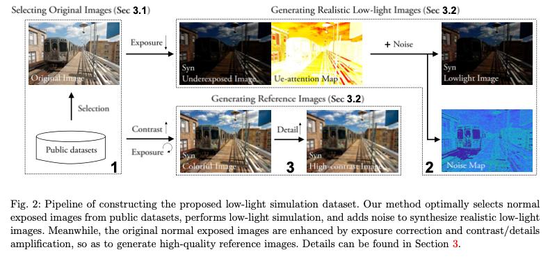
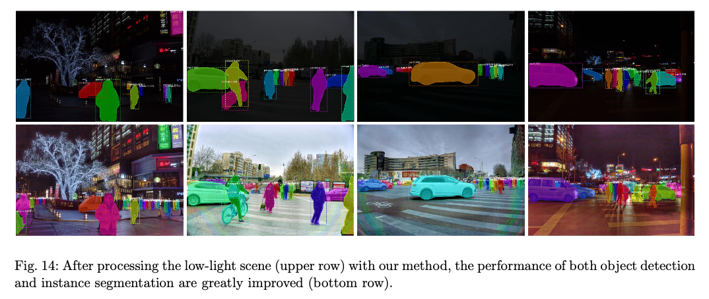

# AGLLNet : 暗い画像を明るくする機械学習モデル

# AGLLNet : 暗い画像を明るくする機械学習モデル

[](https://kyakuno.medium.com/?source=post_page---byline--d59181ad89a9---------------------------------------)

[Kazuki Kyakuno](https://kyakuno.medium.com/?source=post_page---byline--d59181ad89a9---------------------------------------)

Jan 27, 2022

--

Share

[ailia SDK](https://ailia.jp/)で使用できる機械学習モデルである「AGLLNet」のご紹介です。エッジ向け推論フレームワークである[ailia SDK](https://ailia.jp/)と[ailia MODELS](https://github.com/axinc-ai/ailia-models)に公開されている機械学習モデルを使用することで、簡単にAIの機能をアプリケーションに実装することができます。

## AGLLNetの概要

AGLLNetはAttentionを使用して露出補正を行い、暗い画像を明るくする機械学習モデルです。Beihang Universityによって開発され、2019年8月に公開されました。

Press enter or click to view image in full size


出典：<https://arxiv.org/abs/1908.00682>

[## Attention Guided Low-light Image Enhancement with a Large Scale Low-light Simulation Dataset

### Low-light image enhancement is challenging in that it needs to consider not only brightness recovery but also complex…

arxiv.org](https://arxiv.org/abs/1908.00682?source=post_page-----d59181ad89a9---------------------------------------)

[## GitHub - yu-li/AGLLNet: Attention Guided Low-light Image Enhancement with a Large Scale Low-light…

### This is the test code for "Attention Guided Low-light Image Enhancement with a Large Scale Low-light Simulation…

github.com](https://github.com/yu-li/AGLLNet?source=post_page-----d59181ad89a9---------------------------------------)

## AGLLNetのアーキテクチャ

暗い画像を明るくするには、明るさを補正するだけではなく、暗さに隠れている色の歪みやノイズも修正する必要があり、難易度が高いタスクです。シンプルに明るさだけを修正すると、これらの歪みが顕在化します。

本研究では、最初にデータセットを作成します。通常の露光の画像を入力として、暗くなるように露光補正し、ノイズを加えます。その際、露光補正をかけた場所をUe-attention map、ノイズを加えた場所をNoise mapとします。また、コントラスト補正とエッジ補正をかけた画像を復元先画像とします。

Press enter or click to view image in full size



出典：<https://arxiv.org/abs/1908.00682>

AGLLNetでは、end-to-endのattentionを使用したmulti-branchのCNNを使用します。作成した新しいデータセットで明るさの補正とデノイズのための二つのattention mapを学習します。

## Get Kazuki Kyakuno’s stories in your inbox

Join Medium for free to get updates from this writer.

Subscribe

Subscribe

Remember me for faster sign in

最初のattention mapは、露光不足の部分を認識します。二つ目のattention mapは、テクスチャに含まれるノイズを認識します。

これらのattention mapを元に、multi-branchの補正CNNを適用します。

画像が入力されると、Attention-NetとNoise-Netを適用し、attention of exposureとattention of noiseを生成します。次に、Enhancement-NetとRefinforce-Netを使用して補正を行います。Enhancement-Netは、Feature Extraction ModuleとEnhancement Module、Fusion Moduleを含みます。Enhancement-Netには、入力画像と、生成したattention mapを与えます。

Press enter or click to view image in full size


出典：<https://arxiv.org/abs/1908.00682>

提案方式は、従来のSoTAのモデルを定量的に上回ります。


出典：<https://arxiv.org/abs/1908.00682>

提案方式を物体検出の前処理に適用することで、MaskRCNNの検知率を上げることが可能です。

Press enter or click to view image in full size



出典：<https://arxiv.org/abs/1908.00682>

## AGLLNetの使用方法

ailia SDKでAGLLNetを使用するには下記のコマンドを使用します。

```
$ python3 agllnet.py --input input.jpg --savepath outpuut.jpg
```

[## ailia-models/low\_light\_image\_enhancement/agllnet at master · axinc-ai/ailia-models

### (Image from https://github.com/yu-li/AGLLNet/blob/main/input/5047.png) Ailia input shape: (1, 3, 768, 1152)…

github.com](https://github.com/axinc-ai/ailia-models/tree/master/low_light_image_enhancement/agllnet?source=post_page-----d59181ad89a9---------------------------------------)

ax株式会社はAIを実用化する会社として、クロスプラットフォームでGPUを使用した高速な推論を行うことができるailia SDKを開発しています。ax株式会社ではコンサルティングからモデル作成、SDKの提供、AIを利用したアプリ・システム開発、サポートまで、 AIに関するトータルソリューションを提供していますのでお気軽に[お問い合わせ](https://axinc.jp/)ください。