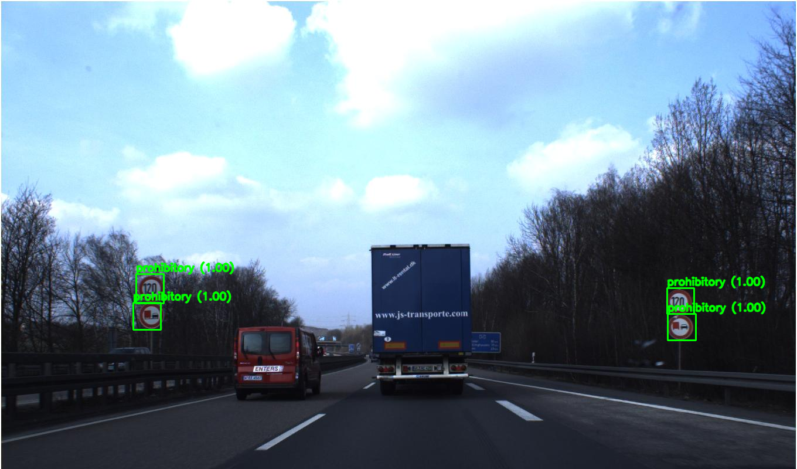

# ailia SDK 1.2.10をリリース

# ailia SDK 1.2.10をリリース

[Kazuki Kyakuno](https://kyakuno.medium.com/?source=post_page---byline--26d751965814---------------------------------------)

Mar 2, 2022

--

Share

クロスプラットフォームで利用できるGPU対応の高速AI推論フレームワークであるailia SDKのバージョン1.2.10のご紹介です。ailia SDKについては[こちら](https://ailia.jp/)をご覧ください。

## ONNXのopset12〜15に対応

ONNXのopset12〜15に対応しました。従来よりも多くのモデルをエクスポート可能になります。関連して、Celu, Einsum, HardSwish, LpNormalization, MeanVarianceNormalization, Triluレイヤーに新規対応しています。

## 圧縮されたモデルの読み込みの高速化

量子化して圧縮されたONNXモデルの読み込み速度を高速化しました。ailia SDK 1.2.9では、Google Pixel6において1345ms必要としていた読み込み時間が、ailia SDK 1.2.10では358msとなり、3.7倍高速化しています。非圧縮の読み込み時間が322msで、圧縮されたモデルでも非圧縮に近い読み込み時間を実現しています。

## 最適化

Transpose、Softmax、Resize、Conv3DのCPUレイヤーの高速化を行いました。また、Matmul、SoftmaxのCUDA高速化と、ResizeのVulkan高速化を行っています。

## Vulkan 1.3に対応したnVIDIAドライバへの対応

Vulkan 1.3に対応した最新のnVIDIAドライバでインスタンス作成に失敗する問題を修正しました。これは、ailia SDKが使用している、khronos/VulkanHeaderに存在していた不具合に起因しており、khronos/VulkanHeaderを最新版にアップデートすることで対応しています。

## WEBドキュメントに対応

WEBドキュメントをベータ版として提供開始しました。WEBサイトからAPI仕様を確認することが可能です。

## Get Kazuki Kyakuno’s stories in your inbox

Join Medium for free to get updates from this writer.

Subscribe

Subscribe

Remember me for faster sign in

Press enter or click to view image in full size

WEBドキュメントの例（<https://axinc-ai.github.io/ailia-sdk/api/python/en/>）

WEBドキュメントは下記から参照いただけます。

[## GitHub - axinc-ai/ailia-sdk: cross-platform high speed inference SDK

### SDK for optimized running of many popular neural networks on multiple platform ailia SDK is a cross-platform high speed…

github.com](https://github.com/axinc-ai/ailia-sdk?source=post_page-----26d751965814---------------------------------------)

## 新しく対応するモデル

ailia SDK 1.2.10で新しく対応するモデルとなります。

### Detic : 21kクラスを高精度にセグメンテーションできる物体検出モデル

Press enter or click to view image in full size

出典：<https://web.eecs.umich.edu/~fouhey/fun/desk/desk.jpg>

[## ailia-models/object\_detection/detic at master · axinc-ai/ailia-models

### (Image from https://web.eecs.umich.edu/~fouhey/fun/desk/desk.jpg, credit David Fouhey) Automatically downloads the onnx…

github.com](https://github.com/axinc-ai/ailia-models/tree/master/object_detection/detic?source=post_page-----26d751965814---------------------------------------)

### Traffic Sign Detection : 交通標識の認識モデル

Press enter or click to view image in full size

出典：<https://github.com/aarcosg/traffic-sign-detection/blob/master/test_images/image2.jpg>

[## ailia-models/object\_detection/traffic-sign-detection at master · axinc-ai/ailia-models

### (Image from https://github.com/aarcosg/traffic-sign-detection/blob/master/test\_images/image2.jpg) Automatically…

github.co](https://github.com/axinc-ai/ailia-models/tree/master/object_detection/traffic-sign-detection?source=post_page-----26d751965814---------------------------------------)

ax株式会社はAIを実用化する会社として、クロスプラットフォームでGPUを使用した高速な推論を行うことができるailia SDKを開発しています。ax株式会社ではコンサルティングからモデル作成、SDKの提供、AIを利用したアプリ・システム開発、サポートまで、 AIに関するトータルソリューションを提供していますのでお気軽に[お問い合わせ](https://axinc.jp/)ください。