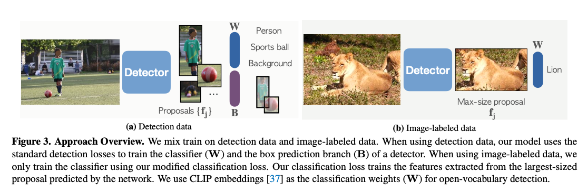
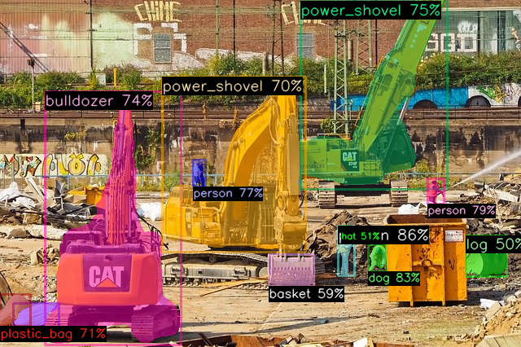
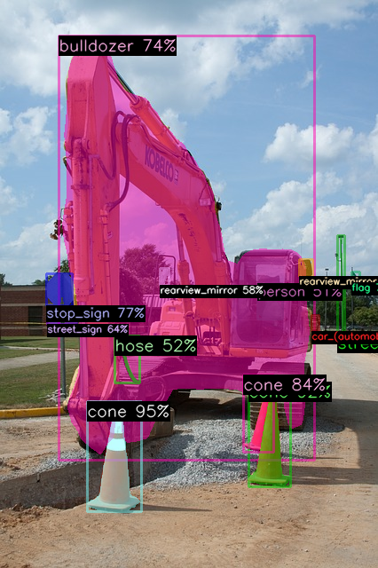

# Detic : 21kクラスを高精度にセグメンテーションできる物体検出モデル

# Detic : 21kクラスを高精度にセグメンテーションできる物体検出モデル

[](https://kyakuno.medium.com/?source=post_page---byline--1b8f777ee89a---------------------------------------)

[Kazuki Kyakuno](https://kyakuno.medium.com/?source=post_page---byline--1b8f777ee89a---------------------------------------)

10 min read

·

Mar 2, 2022

--

Share

[ailia SDK](https://ailia.jp/)で使用できる機械学習モデルである「Detic」のご紹介です。エッジ向け推論フレームワークである[ailia SDK](https://ailia.jp/)と[ailia MODELS](https://github.com/axinc-ai/ailia-models)に公開されている機械学習モデルを使用することで、簡単にAIの機能をアプリケーションに実装することができます。

## Deticの概要

Detic（Detector with Image Classes）は21Kクラスを識別できるセグメンテーションモデルです。FacebookResearchによって開発され、2022年1月に公開されました。YOLOでは今まで検知できなかった物体も再学習不要で高精度に検知することが可能です。また、BoundingBox不要で、画像ラベルのみのアノテーションで学習することが可能です。

Press enter or click to view image in full size


出典：<https://github.com/facebookresearch/Detic>

[## Detecting Twenty-thousand Classes using Image-level Supervision

### Current object detectors are limited in vocabulary size due to the small scale of detection datasets. Image…

arxiv.org](https://arxiv.org/abs/2201.02605?source=post_page-----1b8f777ee89a---------------------------------------)

[## GitHub - facebookresearch/Detic: Code release for "Detecting Twenty-thousand Classes using…

### Detic: A Detector with image c lasses that can use image-level labels to easily train detectors. Detecting…

github.com](https://github.com/facebookresearch/Detic?source=post_page-----1b8f777ee89a---------------------------------------)

## Deticのアーキテクチャ

入力された画像から、BoundingBoxとクラス名を識別することを物体検出（Detection）と呼びます。入力された画像から、クラス名のみを識別することを物体識別（Classification）と呼びます。

従来の物体検出は、BoundingBoxのアノテーションコストが大きいという問題があり、小さなデータセットしか作成できず、限られたクラス数の学習と検出しか行うことができませんでした。

対して物体識別は、画像単位のラベルのアノテーションで良いため、より大きなデータセットを作成することができます。それにより、より多くのクラス数の学習と識別を行うことができますが、データセットにはBoundingBoxが含まれておらず、物体検出の学習には使用できないという問題があります。

Deticでは、物体検出器を物体識別用のデータセットで学習することで、この問題を解決します。

物体検出器をBoundingBoxを使用せずに学習する方法は、Weakly-supervised object deteciton (WSOD)と呼ばれています。DeticではSemi-supervised WSODを使用します。物体識別用のImageNet-21Kデータセットを使用して、物体検出器を学習します。

Press enter or click to view image in full size



出典：<https://arxiv.org/abs/2201.02605>

従来の研究とは異なり、Deticでは、物体検出器のBoundingBoxにクラスラベルを与えません。検出されたBoundingBoxに対して、超大規模データセットで学習されたCLIPのEmbedding Vectorを使用することで、クラス名を識別します。

学習において、画像単位のクラスラベルしか存在しないため、物体検出器が出力したBoundingBoxのうち、最もサイズの大きなBoundingBoxに対してクラス識別を行い、Lossを計算します。Lossが大きい場合、識別器と物体検出器のBoundingBox算出方法が修正されることで、学習が進みます。

## Deticのデータセット

ImageNet21kは物体識別用のデータセットです。画像単位のラベルのみを含みます。21kのクラスラベルを持ち、1400万枚の画像を持ちます。学習に使用します。

## Get Kazuki Kyakuno’s stories in your inbox

Join Medium for free to get updates from this writer.

Subscribe

Subscribe

Remember me for faster sign in

LVISは物体検出用のデータセットです。1000+のクラスラベルを持ち、12万枚の画像を含みます。評価に使用します。

## Deticの学習済みモデル

Deticは複数のBackboneを使用した学習済みモデルが公開されています。

[## Detic/MODEL\_ZOO.md at main · facebookresearch/Detic

### This file documents a collection of models reported in our paper. The training time was measured on Big Basin servers…

github.com](https://github.com/facebookresearch/Detic/blob/main/docs/MODEL_ZOO.md?source=post_page-----1b8f777ee89a---------------------------------------)

例えば、下記のモデルでは、[SwinB（Swin-Transformer）](https://github.com/microsoft/Swin-Transformer)のbackboneと、CenterNet2のDetector, Federated Loss, large-scale jitteringのモデルアーキテクチャを使用し、ImageNet21kの物体識別用のデータセットとCOCOデータセットを使用して学習されています。識別対象のクラスとして、COCOおよびLVISのクラスリストと、COCOおよびImageNet21kのクラスリストを選択可能です。

> Detic\_C2\_SwinB\_896\_4x\_IN-21K+COCO\_lvis.onnx  
> Detic\_C2\_SwinB\_896\_4x\_IN-21K+COCO\_in21k.onnx

下記のモデルでは、ResNet50のbackboneを使用し、ImageNet21kの物体識別用のデータセットを使用して学習されています。SwinBよりもmask mAPは低下しますが、より高速な推論が可能です。

> Detic\_C2\_R50\_640\_4x\_lvis.onnx  
> Detic\_C2\_R50\_640\_4x\_in21k.onnx

## Deticの入力と出力

Deticの入力は下記となります。なお、ONNXはopset=16でGridSamplerを統合したバージョンを使用しています。

> 入力1 (1,3,600,800)：入力画像（NCHW、RGB順のレンジ0–255の画像）  
> 入力2 (2,) = [600, 800]：入力解像度（HW順）

Deticの出力は下記となります。27のところは検出したバウンディングボックスの数が入ります。

> 出力1 (27, 4) : バウンディングボックス（ピクセル座標、x1,y1,x2,y2）  
> 出力2 (27,) : スコア（0–1）  
> 出力3 (27,) : 予測クラス番号  
> 出力4 (27, 600, 800) : ピクセルマスク画像、入力解像度サイズ（0–1）

## Deticの認識例

DeticはYOLOに比べて幅広い領域の物体を再学習不要で認識することができます。SwinB + LVISを使用したDeticの認識例を示します。

### 建機



出典：<https://pixabay.com/photos/construction-site-demolition-work-3688252/>

### 三角コーン



出典：<https://pixabay.com/photos/heavy-equipment-construction-99510/>

### メーター


出典：<https://pixabay.com/photos/car-dashboard-speedometer-speed-2667434/>

### 牛とタグ


出典：<https://pixabay.com/photos/holstein-cattle-cows-heifers-field-2318436/>

### 魚


### シートベルト


出典：<https://pixabay.com/photos/seat-belt-seatbelt-vehicle-4227630/>

## Deticの使用方法

ailia SDKは1.2.10からDeticに対応しています。下記のコマンドで任意の画像に対して認識が可能です。

```
$ python3 detic.py --input input.jpg --savepath output.jpg
```

[## ailia-models/object\_detection/detic at master · axinc-ai/ailia-models

### (Image from https://web.eecs.umich.edu/~fouhey/fun/desk/desk.jpg, credit David Fouhey) Automatically downloads the onnx…

github.com](https://github.com/axinc-ai/ailia-models/tree/master/object_detection/detic?source=post_page-----1b8f777ee89a---------------------------------------)

また、-m R50\_640\_4xオプションを使用することで、SwinBよりも4倍程度高速なResNet50バックボーンを使用した推論も可能です。

```
$ python3 detic.py --input input.jpg --savepath output.jpg -m R50_640_4x
```

ResNet50バックボーンでの推論例は下記となります。SwinBよりは精度が低下しますが、三角コーンも検知可能です。


出典：<https://pixabay.com/photos/heavy-equipment-construction-99510/>

## Deticの応用

Deticは高精度ですが、モデルサイズが551MBと大きいため、エッジ端末で動作させるには負荷が高くなっています。そこで、エッジ端末向けには、Deticでアノテーションデータを作成し、yoloxなどで再学習することで、yoloxの認識カテゴリを拡張するなどすることが望ましいと考えています。ax株式会社ではDeticを使用してyoloxのモデル再学習を自動化するサービスを準備中です。

ax株式会社はAIを実用化する会社として、クロスプラットフォームでGPUを使用した高速な推論を行うことができるailia SDKを開発しています。ax株式会社ではコンサルティングからモデル作成、SDKの提供、AIを利用したアプリ・システム開発、サポートまで、 AIに関するトータルソリューションを提供していますのでお気軽に[お問い合わせ](https://axinc.jp/)ください。