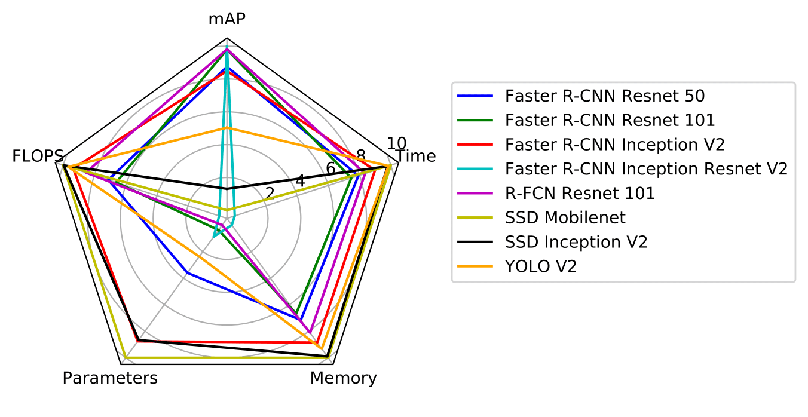
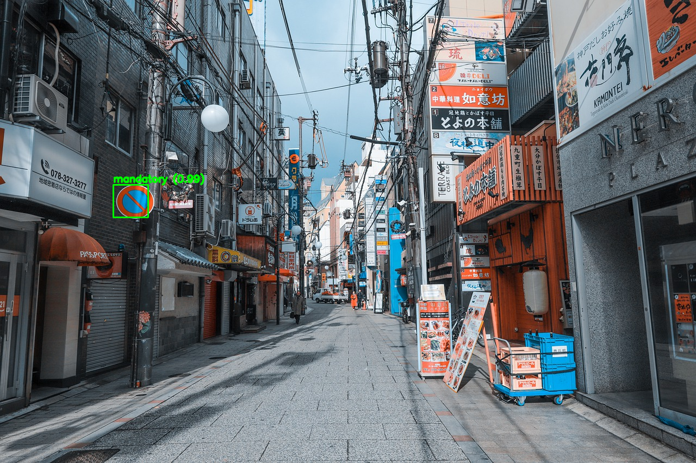
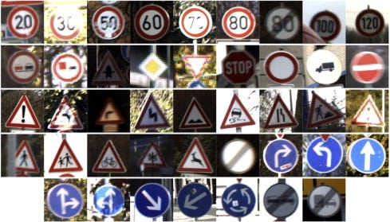

# TrafficSignDetection : 道路標識を検出できる機械学習モデル

# TrafficSignDetection : 道路標識を検出できる機械学習モデル

[](https://kyakuno.medium.com/?source=post_page---byline--d1dc1bd5ff5e---------------------------------------)

[Kazuki Kyakuno](https://kyakuno.medium.com/?source=post_page---byline--d1dc1bd5ff5e---------------------------------------)

Mar 7, 2022

--

Share

[ailia SDK](https://ailia.jp/)で使用できる機械学習モデルである「TrafficSignDetection」のご紹介です。エッジ向け推論フレームワークである[ailia SDK](https://ailia.jp/)と[ailia MODELS](https://github.com/axinc-ai/ailia-models)に公開されている機械学習モデルを使用することで、簡単にAIの機能をアプリケーションに実装することができます。

## TrafficSignDetectionの概要

TrafficSignDetectionは道路標識を検出する機械学習モデルです。2018年11月に公開されました。

Press enter or click to view image in full size


出典：<https://github.com/aarcosg/traffic-sign-detection>

[## GitHub - aarcosg/traffic-sign-detection: Traffic Sign Detection. Code for the paper entitled…

### Traffic Sign Detection. Code for the paper entitled "Evaluation of deep neural networks for traffic sign detection…

github.com](https://github.com/aarcosg/traffic-sign-detection?source=post_page-----d1dc1bd5ff5e---------------------------------------)

## TrafficSignDetectionのアーキテクチャ

TrafficSignDetectionはドイツの交通標識データセットであるGTSDBを使用し、一般的なDetectionのアルゴリズムで学習されています。Detectionでは、Fatser R-CNN、 R-FCN、SSD、YOLOv2のモデルアーキテクチャを使用しており、MS COCOで事前学習した後、GTSDBでFine Tuningを行っています。

[## German Traffic Sign Benchmarks

### 2013-01-07 Unfortunately, the ReadMe.txt in the download package with the GTSDB training data (TrainIJCNN2013.zip)…

benchmark.ini.rub.de](https://benchmark.ini.rub.de/gtsdb_news.html?source=post_page-----d1dc1bd5ff5e---------------------------------------)

Faster R-CNN ResNet50のmAPは91.52となっています。

Press enter or click to view image in full size



出典：<https://github.com/aarcosg/traffic-sign-detection>

検出可能なカテゴリは、prohibitory、mandatory、dangerの三種類です。

## Get Kazuki Kyakuno’s stories in your inbox

Join Medium for free to get updates from this writer.

Subscribe

Subscribe

Remember me for faster sign in

ドイツのデータセットで学習されていますが、規制標識のデザインは日本国内のデザインと共通のものもあるため、国内の道路でもある程度の規制標識の検知に使用することができます。

Press enter or click to view image in full size



出典：<https://pixabay.com/photos/kobe-the-sea-blue-sky-4975863/>

GTSRBデータセットに含まれるドイツの交通標識の例は下記となります。



出典：[https://www.sciencedirect.com/science/article/pii/S0893608012000457?via%3Dihub#f000015](https://www.sciencedirect.com/science/article/pii/S0893608012000457?via%3Dihub=#f000015)

日本国内の道路標識における規制標識の例は下記となります。制限速度や一方通行に関してはドイツのものと近いデザインとなっており、検知が可能です。

Press enter or click to view image in full size


出典：<https://www.mlit.go.jp/road/sign/sign/douro/ichiran.pdf>

## TrafficSignDetectionの使用方法

ailia SDKでは1.2.10からTrafficSignDetectionに対応しています。ailia SDKでTrafficSignDetectionを使用するには下記のコマンドを使用します。

```
$ python3 traffic-sign-detection.py --input input.jpg --savepath output.jpg
```

[## ailia-models/object\_detection/traffic-sign-detection at master · axinc-ai/ailia-models

### (Image from https://github.com/aarcosg/traffic-sign-detection/blob/master/test\_images/image2.jpg) Automatically…

github.com](https://github.com/axinc-ai/ailia-models/tree/master/object_detection/traffic-sign-detection?source=post_page-----d1dc1bd5ff5e---------------------------------------)

ax株式会社はAIを実用化する会社として、クロスプラットフォームでGPUを使用した高速な推論を行うことができるailia SDKを開発しています。ax株式会社ではコンサルティングからモデル作成、SDKの提供、AIを利用したアプリ・システム開発、サポートまで、 AIに関するトータルソリューションを提供していますのでお気軽に[お問い合わせ](https://axinc.jp/)ください。