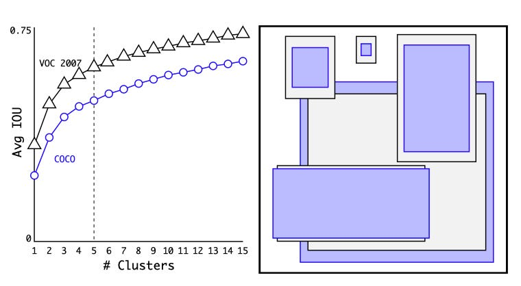
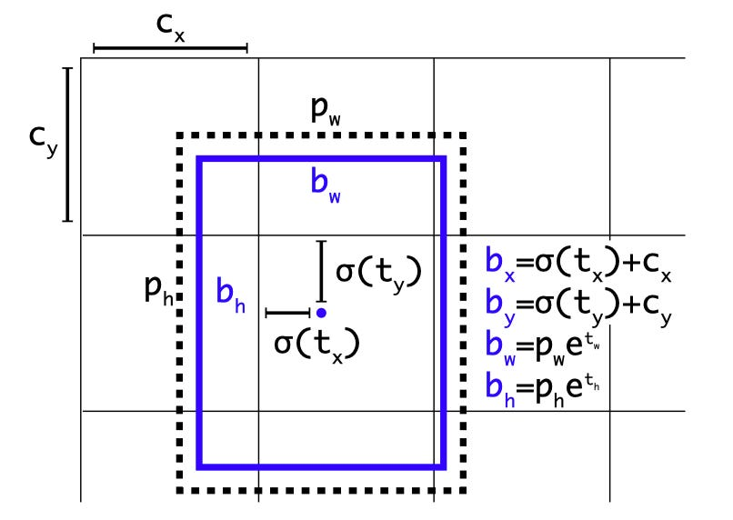
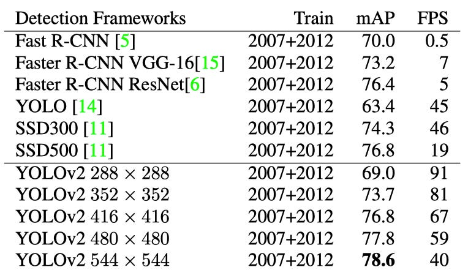
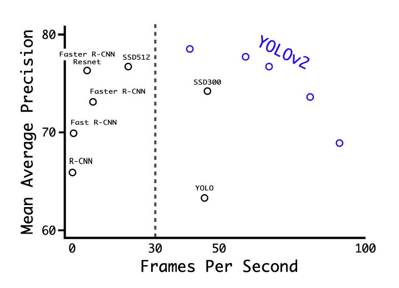
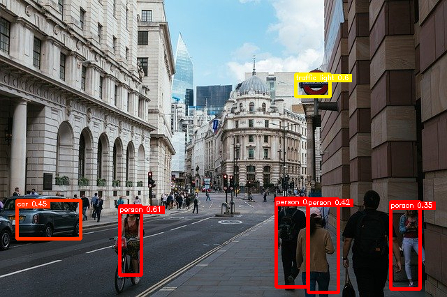

# YOLOv2 : より良く、より速く、より強く

# YOLOv2 : より良く、より速く、より強く

[Takashi Hatakeyama](https://medium.com/@stayhungry.stayfoolish.1990?source=post_page---byline--16e09c11476a---------------------------------------)

Jun 10, 2022

--

Share

[ailia SDK](https://ailia.jp/)で使用できる機械学習モデルである「YOLOv2」のご紹介です。エッジ向け推論フレームワークである[ailia SDK](https://ailia.jp/)と[ailia MODELS](https://github.com/axinc-ai/ailia-models)に公開されている機械学習モデルを使用することで、簡単にAIの機能をアプリケーションに実装することができます。

### YOLOv2の概要

YOLOv1はR-CNN系のモデルと比較して、多くのLocalization Errors（位置推定のミス）を発生させています。  
さらに、Region Proposal-based（領域選定ベース）と比較して、Recall（再現率）が比較的低くなっています。

YOLOv2はこれらの問題を踏まえ、分類の精度を維持しながらRecallとLocalization Errorsの改善に焦点を当てています。

また、速度の改善においてマルチスケールのトレーニングを使用すると、同じYOLOv2モデルをさまざまなサイズで実行できるため、速度と精度のトレードオフが容易になります。

[## YOLO9000: Better, Faster, Stronger

### We introduce YOLO9000, a state-of-the-art, real-time object detection system that can detect over 9000 object…

arxiv.org](https://arxiv.org/abs/1612.08242?source=post_page-----16e09c11476a---------------------------------------)

### YOLOv2のアーキテクチャ

YOLOv1と比べるとかなりの改良点があり、その一つ一つに対してどれほど精度が上がったのかも報告されております。今回は、これらの改良の中でも”アンカーを導入した事によるメリット”について解説します。

**・アンカーの導入**

YOLOv1は、特徴抽出器のトップにある全結合層を使用して、境界ボックスの座標を直接予測します。  
Faster R-CNNのRPN（領域選定ネットワーク）は、畳み込み層のみを使用して、アンカーボックスのオフセットと信頼度を予測します。  
予測レイヤーは畳み込みであるため、RPNはFeature mapのすべての場所でこれらのオフセットを予測します。座標の代わりにオフセットを予測すると、問題が単純化されネットワークの学習が容易になります。

YOLOv2では、Faster R-CNNのRPNのアイデアを取り入れて、アンカーを導入しました。YOLOv1では画像のサイズを１として相対的な矩形領域を予測していましたが、アンカーを取り入れることでアンカーに対しての相対領域を予測すれば良くなり学習がより簡単になると考えたからです。

YOLOv2は、アンカーと畳み込みで物体位置を直接計算するため、YOLOv1で必要だった物体位置の計算をする全結合層が不要となりました。

さらに、YOLOでアンカーボックスを使用するにあたり2つの工夫があります。それは、「①アンカーサイズのクラスタリング」と「②位置推定の計算」です。

**①アンカーサイズのクラスタリング**  
人間が選んだアンカーのサイズを使うよりも、より良いサイズを選定するためにk平均法によるクラスタリングを行いました。よくある形や大きさをアンカーとして提供した方が学習が楽になると考えたからです。

Press enter or click to view image in full size

<https://arxiv.org/pdf/1612.08242.pdf>

左の画像は、kのさまざまな選択肢で得られる平均IOUを示しています。  
 k = 5は、モデルの複雑さに対するRecallの適切なトレードオフを提供することがわかります。  
右の画像は、VOCとCOCOの相対的な重心を示しています。

**②位置推定の計算**  
物体の中心位置の予測を（13×13のグリッドの）セル内に限定しました。Faster R-CNNのやり方だと物体中心の相対位置がセルの外にはみ出てしまう可能性があり、同じ方法をYOLOv2で行おうとすると学習の初期にはなかなか予測が安定しませんでした。

よって、YOLOv2ではシグモイド関数を活性化関数として適用することで0から1の値、つまりはセルの内部の値に限定するようにしました。つまり、YOLOv1の時と同じ考えですが全結合層ではなく畳み込みで計算されています。

## Get Takashi Hatakeyama’s stories in your inbox

Join Medium for free to get updates from this writer.

Subscribe

Subscribe

Remember me for faster sign in

以上によってランダムに初期化された重みを使っていても位置推定の学習が安定するようになりました。

Press enter or click to view image in full size

<https://arxiv.org/pdf/1612.08242.pdf>

ボックスの幅と高さは、クラスターの重心からのオフセットとして予測します。シグモイド関数を使用して、フィルターアプリケーションの位置に対するボックスの中心座標を予測します。

### YOLOv2の性能比較

YOLOv2は、以前の検出方法よりも高速で正確です。

YOLOv2の畳み込みは入力画像を32分の1にするので32の倍数である320×320、352×352、…、608×608の入力画像を使ってYOLOv2を訓練しています。各YOLOv2は、実際には同じトレーニング済みモデルであり、同じ重みで異なるサイズで評価されています。

速度と精度のトレードオフを容易にするために、高解像から低解像まで対応できるモデルになりました。

下図の２つは、Pascal VOC 2007による実験結果です。

Press enter or click to view image in full size

Press enter or click to view image in full size

https://arxiv.org/pdf/1612.08242.pdf

### ailia SDKからの使用

ailia SDKを使用することで、Windows、Mac、iOS、Android、LinuxでPythonやUnityからYOLOv2を使用することができます。

ailia SDKとPythonを使用してYOLOv2を実行するサンプルです。

[## ailia-models/object\_detection/yolov2 at master · axinc-ai/ailia-models

### (Image from…

github.com](https://github.com/axinc-ai/ailia-models/tree/master/object_detection/yolov2?source=post_page-----16e09c11476a---------------------------------------)

下記のコマンドで任意の動画に対してYOLOv2を適用可能です。

> *python3* yolov2.py -v input.mp4

YOLOv2の出力例

ax株式会社はAIを実用化する会社として、クロスプラットフォームでGPUを使用した高速な推論を行うことができるailia SDKを開発しています。ax株式会社ではコンサルティングからモデル作成、SDKの提供、AIを利用したアプリ・システム開発、サポートまで、 AIに関するトータルソリューションを提供していますのでお気軽に[お問い合わせ](https://axinc.jp/)ください。

### 参考記事

[YOLOv3 : 物体の位置と種類を検出する機械学習モデル](https://medium.com/axinc/yolov3-66c9b998c096)

[YOLO v4 : 物体を検出する機械学習モデル](https://medium.com/axinc/yolov4-%E7%89%A9%E4%BD%93%E3%82%92%E6%A4%9C%E5%87%BA%E3%81%99%E3%82%8B%E6%A9%9F%E6%A2%B0%E5%AD%A6%E7%BF%92%E3%83%A2%E3%83%87%E3%83%AB-480f0a635317)