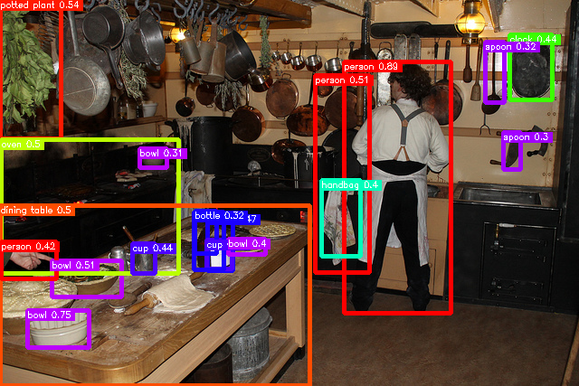
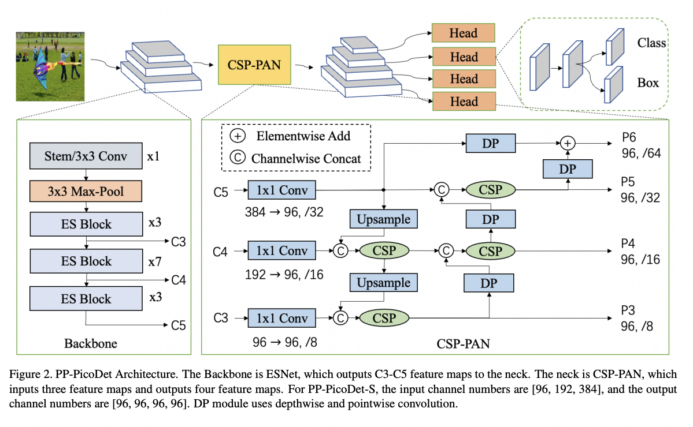
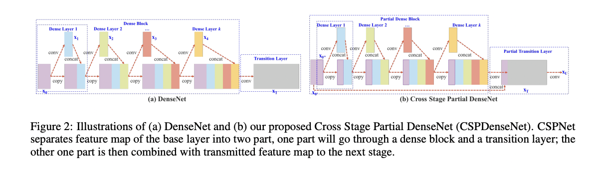
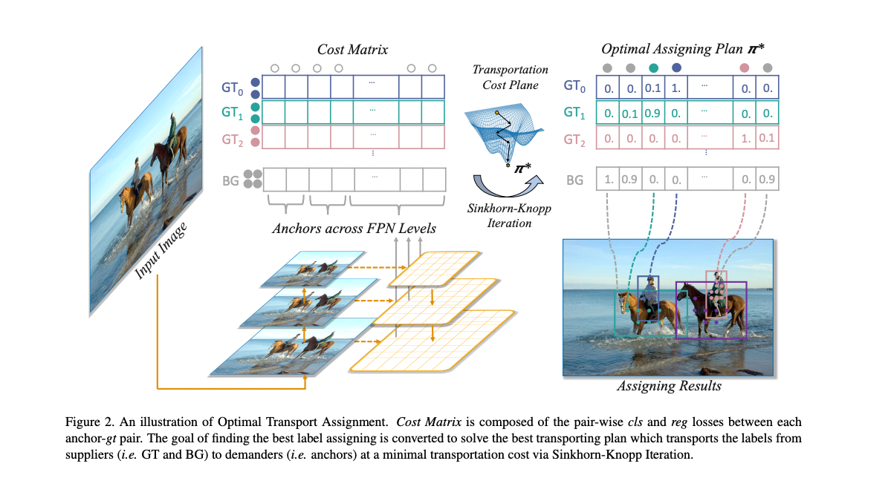
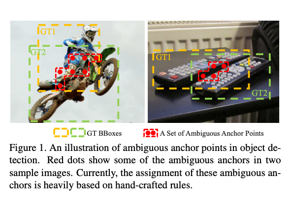
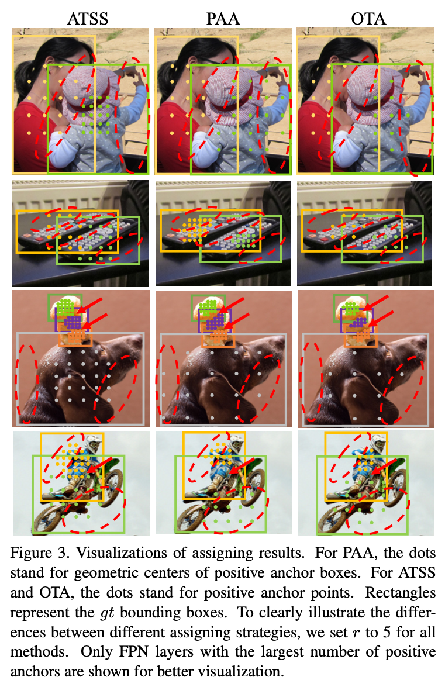
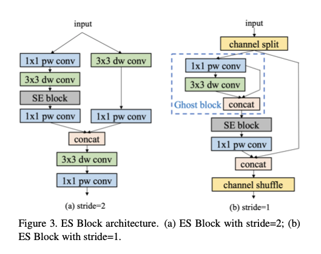
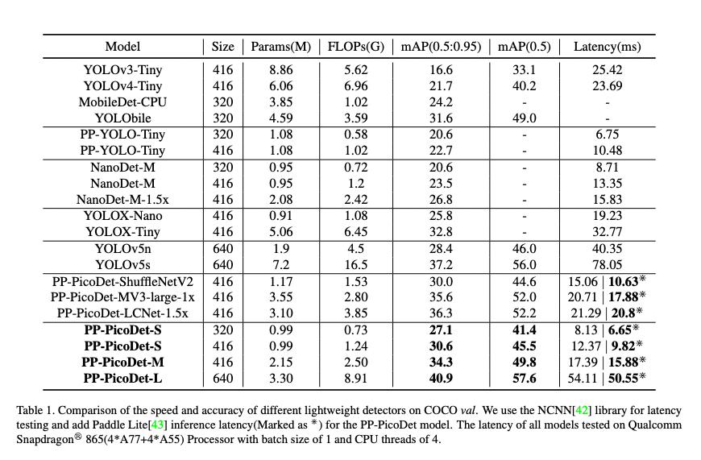

# PicoDet : モバイルCPUに最適化した高速な物体検出モデル

# PicoDet : モバイルCPUに最適化した高速な物体検出モデル

[](https://kyakuno.medium.com/?source=post_page---byline--837ec39ec8e1---------------------------------------)

[Kazuki Kyakuno](https://kyakuno.medium.com/?source=post_page---byline--837ec39ec8e1---------------------------------------)

Jun 13, 2022

--

Share

[ailia SDK](https://ailia.jp/)で使用できる機械学習モデルである「PicoDet」のご紹介です。エッジ向け推論フレームワークである[ailia SDK](https://ailia.jp/)と[ailia MODELS](https://github.com/axinc-ai/ailia-models)に公開されている機械学習モデルを使用することで、簡単にAIの機能をアプリケーションに実装することができます。

## PicoDetの概要

PicoDetは2021年11月に公開された機械学習モデルです。近年の物体検出モデルの研究成果を、モバイルCPU向けの軽量モデルに集約することで、高精度かつ高速な物体検出を実現します。



出典：COCOデータセット

[## PP-PicoDet: A Better Real-Time Object Detector on Mobile Devices

### The better accuracy and efficiency trade-off has been a challenging problem in object detection. In this work, we are…

arxiv.org](https://arxiv.org/abs/2111.00902?source=post_page-----837ec39ec8e1---------------------------------------)

[## GitHub - Bo396543018/Picodet\_Pytorch

### @article{picodet, title={{PP-PicoDet}: A Better Real-Time Object Detector on Mobile Devices}, author={Guanghua Yu…

github.com](https://github.com/Bo396543018/Picodet_Pytorch?source=post_page-----837ec39ec8e1---------------------------------------)

## PicoDetのアーキテクチャ

PicoDetでは、Backboneを軽量な構造とすることで、特徴抽出の速度を改善します。また、loss関数を改良することで、学習の安定性と効率を向上させます。

近年の物体検出では、アンカーフリーの検出器の採用が進んでいます。FCOS（Fully Convolutional One-Stage Object Detection）はGTラベルの重複の問題を解決します。一般的なアンカーボックスでは、各座標ごとに複数のアンカーを持ちますが、FCOSでは、各座標ごとに単一の中心点を持ちます。FCOSを使用したアンカーフリーの手法は、ハイパーパラメータの調整が不要という優位性があります。

しかし、一般的なアンカーフリーの検出器は比較的規模の多いサーバ向けのモデルで使用されています。モバイル向けのアンカーフリーのモデルは、NanoDetやYOLOX-Nanoがある程度です。

軽量なアンカーフリーの検出器は、精度と効率のバランスを取ることが難しいという問題があります。そのため、FCOSとGFL（Generalized Focal Loss）にインスパイアされた、新たな物体検出器としてPicoDetを提案します。

Press enter or click to view image in full size



PicoDet（出典：<https://arxiv.org/pdf/2111.00902.pdf>）

CSPをベースに、CSP-PANを使用したheadを構築します。CSPはResNetのSkip Connectionの進化系であり、Convを通さずに前段のFeature Mapを切り出してConcatする機構を追加することで、逆伝搬を容易にするとともに、演算量を削減します。PicoDetでは、Reception Fieldを拡大するために、3x3 depthwise convを5x5 depthwise convに拡張します。

Press enter or click to view image in full size



CSPNet（出典：<https://arxiv.org/pdf/1911.11929.pdf>）

ラベルアサインのストラテジーを改善するために、SimOTAを採用します。Loss関数には、Varifocal Loss (VFL)とGIoU lossを採用します。

SimOTAはYOLOXでも使用されており、Lossを計算するために、予測した矩形とGTの矩形の対応付けを決定する際に、最も近いGTを割り当てるのではなく、最適化問題を解いてより適切なGTを割り当てることで、有害な勾配の発生を抑制する手法です。OTA（Optimal Transport Assignment）を高速化したのがSimOTAです。

Press enter or click to view image in full size



SimOTA（出典：<https://arxiv.org/pdf/2103.14259.pdf>）

物体検出モデルにおいては、headが予測した矩形に対して、GTとなる矩形を割り当て、GTとのLossを逆伝播することで学習を行います。

## Get Kazuki Kyakuno’s stories in your inbox

Join Medium for free to get updates from this writer.

Subscribe

Subscribe

Remember me for faster sign in

GTの矩形同士が重なっていて、その領域内に予測矩形が存在した場合に、どちらのGTに割り当てるべきか決定できない領域をAmbiguous Anchor（曖昧な領域）と呼んでいます。Ambiguous Anchorの領域にある予測矩形にGTを割り当てて、Loss計算に使用すると、有害な勾配が発生します。OTAは、Ambiguous Anchorに属する矩形をGTに割り当てにくいアルゴリズムになっています。



Ambiguous Anchor（出典：<https://arxiv.org/pdf/2103.14259.pdf>）

OTAによる割り当て結果の例です。画像内の点が予測した矩形の中心点で、割り当ての違いがわかりやすい箇所を赤の楕円で囲っています。OTAでは、Ambiguous Anchorに対応する曖昧な領域には点が存在せず、予測した中心点をGTに割り当てていないことがわかります。

Press enter or click to view image in full size



OTAによる割り当て結果（出典：<https://arxiv.org/pdf/2103.14259.pdf>）

特徴抽出のためのbackboneはShuffleNetV2をベースとしています。ShuffleNetV2はMobile向けに効率的なモデルアーキテクチャです。ShuffleNetはMobileNetのボトルネックであるconv1x1を高速化するために、conv1x1をshuffleとgrouped conv 1x1に分解します。PicoDetでは、ShuffleNetV2を改良したEnhanced ShuffleNetを使用します。



Enhanced ShuffleNet（出典：<https://arxiv.org/pdf/2111.00902.pdf>）

One-Shot Neural Architecture Search (NAS)を導入し、各レイヤの最適なチャンネル数を探索します。探索の結果、チャンネル数を8の倍数にすることが最も推論速度の改善に寄与しました。

総じて、PicoDetはYOLOxと同様に、最新の物体検出の知見を取り入れて、最適化されたモデルとなります。

## PicoDetのパフォーマンス

QualcommのSnapdragon 865のCPUを使用したパフォーマンスは下記となります。YOLOX-TinyをNCNNを使用してCPUで動かすとmAP 32.8で32.77ms必要なところが、PicoDetだとmAP 30.6で12.37ms。mAP 34.3で17.39msで推論が可能です。

Press enter or click to view image in full size



出典：<https://arxiv.org/pdf/2111.00902.pdf>

ただし、この優位性はCPUでの推論におけるものであり、比較的高速なGPUではYOLOX-TinyとPicoDetは同等の速度になる傾向にあります。そのため、JetsonなどではYOLOX-Tiny、RaspberryPiなどではPicoDetが最適であると考えています。

## PicoDetの使用方法

ailia SDKでPicoDetを使用するには下記のコマンドを使用します。WEBカメラを使用してPicoDetの精度と速度を確認することが可能です

```
$ python3 picodet.py -v 0
```

[## ailia-models/object\_detection/picodet at master · axinc-ai/ailia-models

### (Image from https://cocodataset.org/#download) Automatically downloads the onnx and prototxt files on the first run. It…

github.com](https://github.com/axinc-ai/ailia-models/tree/master/object_detection/picodet?source=post_page-----837ec39ec8e1---------------------------------------)

ax株式会社はAIを実用化する会社として、クロスプラットフォームでGPUを使用した高速な推論を行うことができるailia SDKを開発しています。ax株式会社ではコンサルティングからモデル作成、SDKの提供、AIを利用したアプリ・システム開発、サポートまで、 AIに関するトータルソリューションを提供していますのでお気軽に[お問い合わせ](https://axinc.jp/)ください。