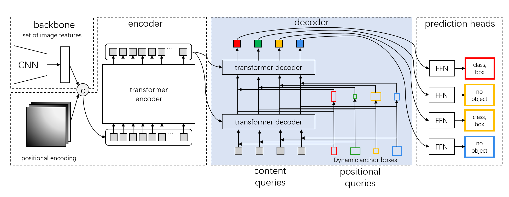

# ailia SDK 1.2.12をリリース

# ailia SDK 1.2.12をリリース

[Kazuki Kyakuno](https://kyakuno.medium.com/?source=post_page---byline--3f98aac6f2a1---------------------------------------)

Jul 29, 2022

--

Share

クロスプラットフォームで利用できるGPU対応の高速AI推論フレームワークであるailia SDKのバージョン1.2.12のご紹介です。ailia SDKについては[こちら](https://ailia.jp/)をご覧ください

ailia SDK 1.2.12の新機能は下記となります。

### 複合アクティベーションの専用処理によるYOLO等の高速化

YOLOXおよびYOLOv5で使用されるSiLUや、YOLOv4で使用されるMishなどの、複合アクティベーションの専用処理による高速化を行いました。対象となるプラットフォームはcuDNNとCPU (SIMD)です。

また、cuDNNにおいては、Resize (Nearest)とTransposeのCUDAで動作する範囲を拡張することで、CPUとGPU間の転送を削減しています。

これらの改良により、cuDNNを使用するJetson NXで、YOLOX tinyが33%、YOLOXが18%、YOLOv5が25%、YOLOv4が15%高速化します。また、SIMDを使用するIntel CPUでは、YOLOX tinyが20%、YOLOXが19%、YOLOv5が23%、YOLOv4が18%高速化します。

### グラフの実行順ソートによるモデル読み込みの高速化

グラフのロード時にノードを実行順にソートする機能を追加し、モデル読み込みの高速化を行いました。これにより、グラフ探索が高速化され、Deticなどの巨大なモデルの読み込みが、30%程度高速化します。

### 新たなレイヤーの対応

CompressおよびDetレイヤーに対応しました。また、CumSumレイヤーの5次元以上の入出力に対応しました。

### FP16の重みを持つONNXへの対応

FP16の重みを持つONNXに対応しました。

### ailia SDK 1.2.12で新たに対応するモデル

ailia SDK 1.2.12で新たに対応するモデルとなります。

## Get Kazuki Kyakuno’s stories in your inbox

Join Medium for free to get updates from this writer.

Subscribe

Subscribe

Remember me for faster sign in

SberSwap：リアルタイムの顔置き換えモデル

[## ailia-models/generative\_adversarial\_networks/sber-swap at master · axinc-ai/ailia-models

### Source image Target image (Image from https://github.com/ai-forever/sber-swap/tree/main/examples/images) Automatically…

github.com](https://github.com/axinc-ai/ailia-models/tree/master/generative_adversarial_networks/sber-swap?source=post_page-----3f98aac6f2a1---------------------------------------)

SwinIR：Transformerベースの超解像モデル

[## ailia-models/super\_resolution/swinir at master · axinc-ai/ailia-models

### In case of classical model. (Image from https://github.com/JingyunLiang/SwinIR/tree/main/testsets) In case of classical…

github.com](https://github.com/axinc-ai/ailia-models/tree/master/super_resolution/swinir?source=post_page-----3f98aac6f2a1---------------------------------------)

DabDetr：Transformerベースの物体検出モデル

Press enter or click to view image in full size

出典：<https://github.com/IDEA-opensource/DAB-DETR>

[## ailia-models/object\_detection/dab-detr at master · axinc-ai/ailia-models

### Ailia input shape: (1, 3, 800, 1199) Automatically downloads the onnx and prototxt files on the first run. It is…

github.com](https://github.com/axinc-ai/ailia-models/tree/master/object_detection/dab-detr?source=post_page-----3f98aac6f2a1---------------------------------------)

### サンプルの拡充

Experimentalとして提供しているailia.audioのUnityおよびC++のサンプルを追加しました。Unityからailia.audioを使用して音声の分類を行うことが可能です。

[## GitHub - axinc-ai/ailia-audio-samples: ailia.audio samples of unity

### Use ailia.audio to perform MelSpectrum conversion of the input audio. Then classify the sound categories with the crnn…

github.com](https://github.com/axinc-ai/ailia-audio-samples?source=post_page-----3f98aac6f2a1---------------------------------------)

### ailia SDKの評価版のダウンロード

ailia SDK 1.2.12の評価版は下記のURLからダウンロード可能です。

[## ax Inc.

### ax株式会社のコーポレートサイトです。あらゆるデバイスにAI が載る未来。そのような未来が来ることを我々は信じています。その未来に向けて我々は高速なSDK を開発し、最新のAI モデルを常に研究し続けます。ax 株式会社は最新のAI…

axinc.jp](https://axinc.jp/trial/?source=post_page-----3f98aac6f2a1---------------------------------------)

ax株式会社はAIを実用化する会社として、クロスプラットフォームでGPUを使用した高速な推論を行うことができるailia SDKを開発しています。ax株式会社ではコンサルティングからモデル作成、SDKの提供、AIを利用したアプリ・システム開発、サポートまで、 AIに関するトータルソリューションを提供していますのでお気軽に[お問い合わせ](https://axinc.jp/)ください。