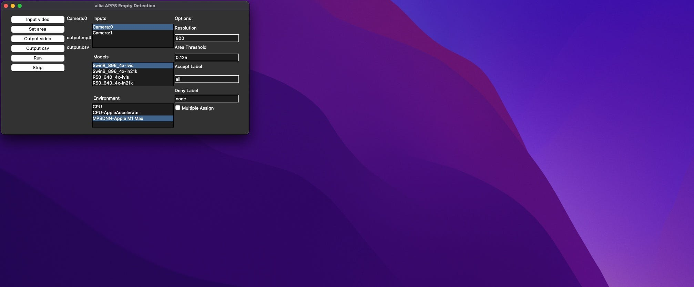
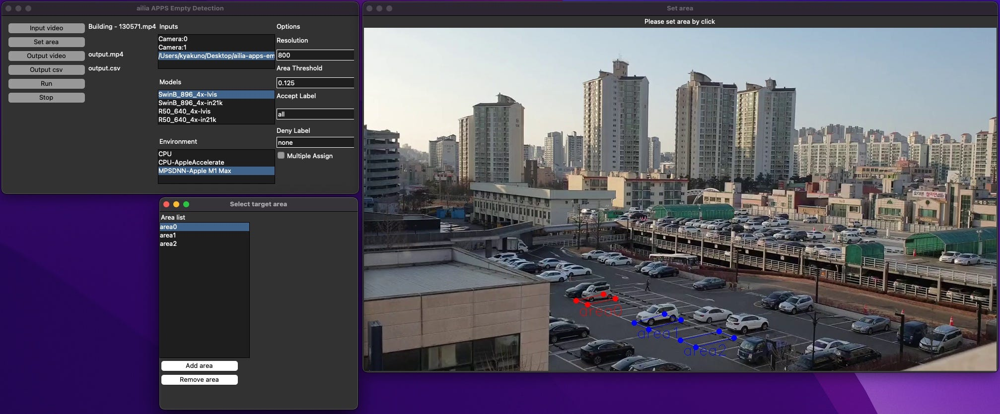
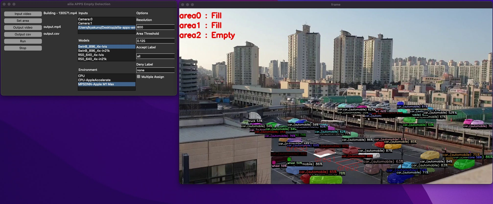
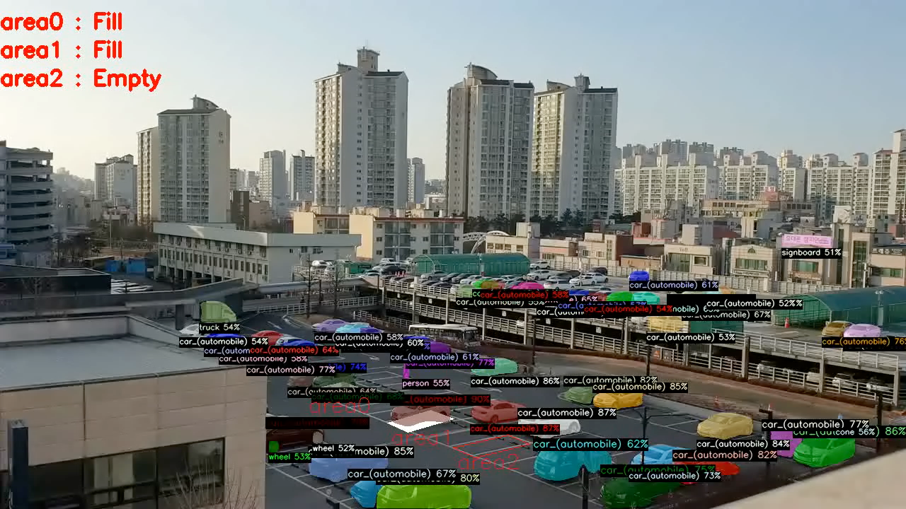
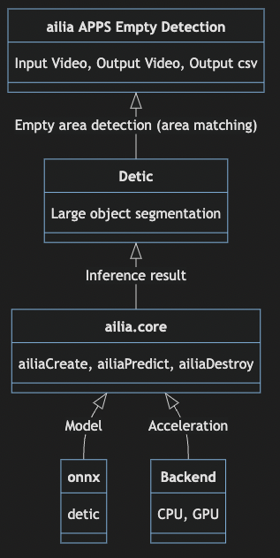
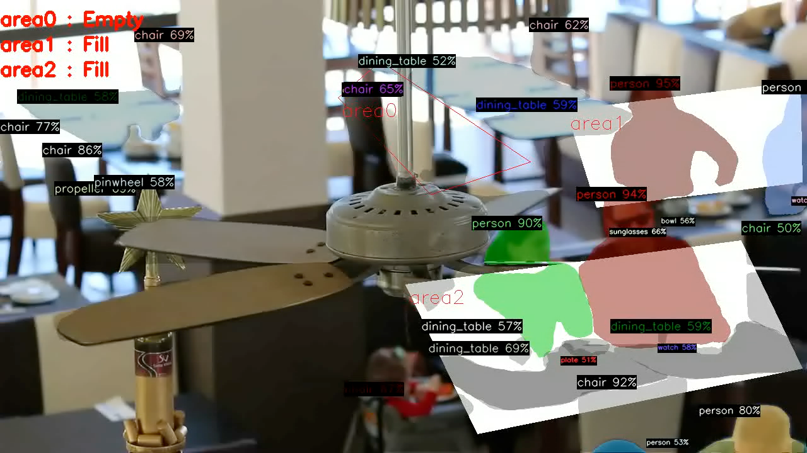

# ailia APPS Empty Detection : 駐車場やレストランの空き状況を確認することができるAIアプリ

# ailia APPS Empty Detection : 駐車場やレストランの空き状況を確認することができるAIアプリ

[](https://kyakuno.medium.com/?source=post_page---byline--a2a7c84a383e---------------------------------------)

[Kazuki Kyakuno](https://kyakuno.medium.com/?source=post_page---byline--a2a7c84a383e---------------------------------------)

8 min read

·

Jan 5, 2023

--

Share

ailia SDKを使用して駐車場やレストランの空き状況を確認することができるailia APPS Empty Detectionのご紹介です。任意の領域をGUIで設定し、そこに物体があるかどうかを検出することができます。

## ailia APPS Empty Detectionについて

ailia APPS Empty Detectionはailia SDKを使用して開発した、指定した任意の領域の空き状況の確認を行うことができるAIアプリです。オープンソースで開発しており、ailia SDKのライセンスがあれば自由に使用することが可能です。

実行例です。指定したエリアに車が存在する場合はFill、存在しない場合はEmptyと表示されます。車に限らず、物品や、人などにも適用可能です。

ailia APPS Empty Detectionの実行例

## ailia APPS Empty Detectionの動作環境

Windows、macOS、Linux、Jetsonで動作します。実行にはPythonが必要です。

## ailia APPS EmptyDetectionの使用方法

ソースコードをcloneします。

```
git clone https://github.com/axinc-ai/ailia-apps-empty-detection
```

[## GitHub - axinc-ai/ailia-apps-empty-detection: Detect empty area from camera

### Detects cars in parking lots, inventory on shelves, etc., and counts vacant information. Empty area detection Export…

github.com](https://github.com/axinc-ai/ailia-apps-empty-detection?source=post_page-----a2a7c84a383e---------------------------------------)

依存ライブラリをインストールします。2023年2月リリース予定のailia SDK 1.2.14以降の場合は不要です。

```
pip3 install torch
```

GUIを起動します。

```
python3 ailia-apps-empty-detection.py
```

Press enter or click to view image in full size



起動したGUI

Input videoボタンを押して動画ファイルを選択します。Set areaボタンを押して、画面を4回クリックすることで、検知領域を設定します。検知領域はAdd areaで増やしたり、Remove areaで削除したりすることができます。また、エリアの名前をダブルクリップすることで、エリアの名前を編集することが可能です。

Press enter or click to view image in full size



検知領域の設定

検知領域は、ウィンドウメニューのFileからjsonに保存することも可能です。

## Get Kazuki Kyakuno’s stories in your inbox

Join Medium for free to get updates from this writer.

Subscribe

Subscribe

Remember me for faster sign in

Runボタンを押して、検知を開始します。指定した検知領域に物体が存在する場合はFill、存在しない場合はEmptyと表示されます。

Press enter or click to view image in full size



実行例

## ailia APPS Empty Detectionの動画出力

Output videoボタンで出力先の動画ファイルを指定することができます。

Press enter or click to view image in full size



動画ファイルの出力例

## ailia APPS Empty DetectionのCSV出力

Output csvボタンで出力先のcsvファイルを指定することができます。CSVファイルの出力の例です。1秒ごとに、物体が存在する場合は1、存在しない場合は0が記載されます。

```
time(sec) , area0 , area1 , area2  
0 , 1 , 1 , 0
```

## ailia APPS Empty Detectionのアーキテクチャ

Deticを使用して物体の位置と領域を取得します。指定したエリアの領域と、物体の領域が、12.5%以上重なっていた場合は、存在すると判定します。Deticを使用しているため、再学習不要で多くの物体を検知可能です。



アーキテクチャ

## ailia APPS Empty Detectionのオプション

### Resolution

Deticの認識解像度を下げることで高速化を行うことができます。

### Area Threshold

どれくらい重なっていた場合に物体が存在すると判定するかどうかの割合を指定します。デフォルト値は12.5%です。

### Accept Label

指定したラベルのみを検知対象とすることで、精度を改善することができます。デフォルト（all）では、全ての物体を検知対象とするため、例えば看板が存在した場合も駐車していると判定します。そこで、Accept Labelにcarと指定しておくことで、看板は検知対象から除外し、車に対してのみ処理を行うことが可能です。Accept Labelはカンマ区切りで複数指定可能です。

### Deny Label

特定のラベルのみを無視することで、精度を改善することができます。例えば、personを指定することで、人がカメラを横切った場合の影響を除去することが可能です。デフォルト（none）では、全ての物体を検知対象とします。

### Multiple Assign

標準では1オブジェクトを最も重なっている1エリアにアサインします。駐車場などでカメラの角度の問題で、車の輪郭が隣のエリアにも重複する場合があり、デフォルト設定では1エリアにアサインすることで、精度を改善しています。

Multiple Assignを有効にすると、1オブジェクトを複数のエリアにアサインすることができます。物品の検知など、細かくエリアを指定し、大きな1オブジェクトが複数のエリアに重なることを前提とするアプリケーションで使用します。

### Models

VisionTransformerを使用した高精度モデルであるSwinBと、伝統的なConvolutionを使用したResNet50を選択可能です。また、1000カテゴリを検知可能なlvisと、21000カテゴリを検知可能なimagenet21kを選択可能です。精度の観点では、SwinBを推奨しています。一般的なオブジェクトではlvisで十分ですが、lvisで検知できないオブジェクトが存在する場合はimagenet21kを使用してください。

## ailia APPS Empty Detectionへの機能追加

ailia APPS Empty DetectionはOSSで開発しているため、自由に機能を拡張することが可能です。また、ax株式会社にご要望いただければ、弊社側で機能を追加することも可能です。

## ailia APPS Empty Detectionの応用

### 駐車場

駐車場の場所ごとの空き状況を利用者にわかりやすく提示することができます。また、駐車場の稼働率をcsvから計算可能です。

### レストラン

テーブルごとに空き状況を利用者にわかりやすく提示することができます。また、テーブルの稼働率をcsvから計算可能です。

Press enter or click to view image in full size



出典：<https://pixabay.com/videos/pub-food-restaurant-eat-beer-33583/>

### 工場

特定のエリアに荷物があるかどうかを検知し、工場内に提示することができます。不要な搬送を抑制することができます。

### 店舗

棚の欠品を検知し、在庫の補充の必要性を確認することができます。

ax株式会社はAIを実用化する会社として、クロスプラットフォームでGPUを使用した高速な推論を行うことができるailia SDKを開発しています。ax株式会社ではコンサルティングからモデル作成、SDKの提供、AIを利用したアプリ・システム開発、サポートまで、 AIに関するトータルソリューションを提供していますのでお気軽に[お問い合わせ](https://axinc.jp/)ください。