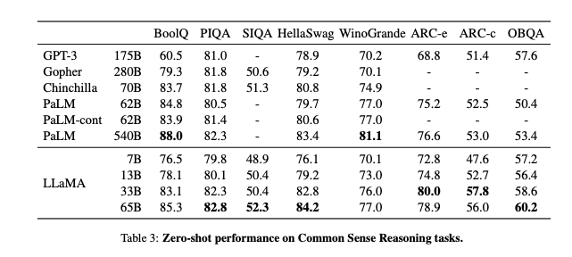

# Llama.cppとLoRAを使用してPC上で日本語LLMモデルを実行する

# Llama.cppとLoRAを使用してPC上で日本語LLMモデルを実行する

[](https://kyakuno.medium.com/?source=post_page---byline--31195fd54737---------------------------------------)

[Kazuki Kyakuno](https://kyakuno.medium.com/?source=post_page---byline--31195fd54737---------------------------------------)

7 min read

·

Apr 11, 2023

--

Share

PC上でLLMモデルを実行できるllama.cppと、LLMモデルをFineTuningするLoRAを使って、日本語でのLLM推論を行う方法を解説します。

## Llamaの概要

LlamaはMetaの開発したLLMモデルです。研究用途向けにモデルが公開されており、PC上で実行することが可能です。

[## GitHub - facebookresearch/llama: Inference code for LLaMA models

### This repository is intended as a minimal, hackable and readable example to load LLaMA ( arXiv) models and run…

github.com](https://github.com/facebookresearch/llama?source=post_page-----31195fd54737---------------------------------------)

Llamaの性能は下記となります。



出典：<https://arxiv.org/pdf/2302.13971v1.pdf>

## Alpacaの概要

Alpacaは、LlamaをベースにStanford大学がFine-Tuningしたモデルです。Llamaと同様、Alpacaの利用は学術目的に限られ、商用利用は禁止されています。

[## GitHub - tatsu-lab/stanford\_alpaca: Code and documentation to train Stanford's Alpaca models, and…

### This is the repo for the Stanford Alpaca project, which aims to build and share an instruction-following LLaMA model…

github.com](https://github.com/tatsu-lab/stanford_alpaca?source=post_page-----31195fd54737---------------------------------------)

## Llama.cppの概要

Llama.cppはC言語で記述されたLLMのランタイムです。重みを4bitに量子化することで、M1 Mac上で現実的な時間で大規模なLLMを推論することが可能です。

[## GitHub - ggerganov/llama.cpp: Port of Facebook's LLaMA model in C/C++

### Inference of LLaMA model in pure C/C++ Hot topics: The main goal is to run the model using 4-bit quantization on a…

github.com](https://github.com/ggerganov/llama.cpp?source=post_page-----31195fd54737---------------------------------------)

## Llama.cppの使用方法

llama.cppをビルドします。

```
git clone git@github.com:ggerganov/llama.cpp.git  
cd llama.cpp  
make
```

モデルファイルをダウンロードします。tokenizer.modelとggml-alpaca-7b-q4.binをダウンロードして、models/alpaca\_7bにコピーします。

[## tokenizer.model · chavinlo/alpaca-native at main

### Upload tokenizer.model with huggingface\_hub 6a18125 This file is stored with Git LFS . It is too big to display, but…

huggingface.co](https://huggingface.co/chavinlo/alpaca-native/blob/main/tokenizer.model?source=post_page-----31195fd54737---------------------------------------)

[## ggml-alpaca-7b-q4.bin · Sosaka/Alpaca-native-4bit-ggml at main

### This file is stored with Git LFS . It is too big to display, but you can still download it. SHA256…

huggingface.co](https://huggingface.co/Sosaka/Alpaca-native-4bit-ggml/blob/main/ggml-alpaca-7b-q4.bin?source=post_page-----31195fd54737---------------------------------------)

モデル形式を最新のものに変換します。Alpaca7Bだと、モデルサイズは4.21GBになります。

```
python3 convert-unversioned-ggml-to-ggml.py models/alpaca_7b models/alpaca_7b/tokenizer.model  
python3 migrate-ggml-2023-03-30-pr613.py models/alpaca_7b/ggml-alpaca-7b-q4.bin models/alpaca_7b/ggml-alpaca-7b-q4.bin.1
```

実行します。promptは-pで与えることができます。

```
./main -m models/alpaca_7b/ggml-alpaca-7b-q4.bin.1 -p "Please convert below python code to c code with include. python code: print('hello');"
```

実行例です。正しく、PythonのコードをCに変換できています。

```
Please convert below python code to c code with include. python code: print('hello'); def main(): print('world'); #include <stdio.h> main() { printf("Hello, World!"); } [end of text]
```

## 日本語LoRAを適用する

LoRAは基盤モデルの一部のレイヤーの重みのみを書き換えることで、FineTuningする仕組みです。StableDiffusionで有名になりました。

## Get Kazuki Kyakuno’s stories in your inbox

Join Medium for free to get updates from this writer.

Subscribe

Subscribe

Remember me for faster sign in

llama.cppでは、下記のPRでLoRAを適用可能です。

[## Add LoRA support by slaren · Pull Request #820 · ggerganov/llama.cpp

### This change allows applying LoRA adapters on the fly without having to duplicate the model files. Instructions: Obtain…

github.com](https://github.com/ggerganov/llama.cpp/pull/820?source=post_page-----31195fd54737---------------------------------------)

PRをビルドします。

```
git clone https://github.com/slaren/llama.cpp/tree/lora  
cd llama.cpp  
make
```

下記から、adapter\_config.jsonとadapter\_model.binをダウンロードして、lora/alpaca\_7bに配置します。

[## kunishou/Japanese-Alpaca-LoRA-7b-v0 at main

### We're on a journey to advance and democratize artificial intelligence through open source and open science.

huggingface.co](https://huggingface.co/kunishou/Japanese-Alpaca-LoRA-7b-v0/tree/main?source=post_page-----31195fd54737---------------------------------------)

LoRAのモデル変換を行います。

```
python3 convert-lora-to-ggml.py lora/alpaca_7b
```

LoRA付きで実行します。

```
./main -m models/alpaca_7b/ggml-alpaca-7b-q4.bin.1 --lora lora/alpaca_7b/ggml-adapter-model.bin -p "下記のPythonのコードをCのコードに変換してください。print('a');"
```

出力例です。

```
下記のPythonのコードをCのコードに変換してください。print('a'); をStringの它に変換します。 print('a')
```

やはり、日本語だと精度が低いので、現状だと、日本語を英語に翻訳してLlamaに入力し、Llamaの出力の英語を日本語に翻訳する方が望ましそうです。

ax株式会社はAIを実用化する会社として、クロスプラットフォームでGPUを使用した高速な推論を行うことができるailia SDKを開発しています。ax株式会社ではコンサルティングからモデル作成、SDKの提供、AIを利用したアプリ・システム開発、サポートまで、 AIに関するトータルソリューションを提供していますのでお気軽に[お問い合わせ](https://axinc.jp/)ください。