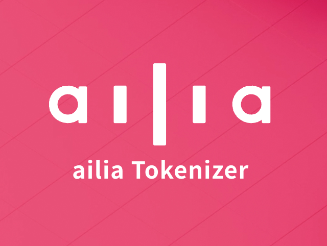
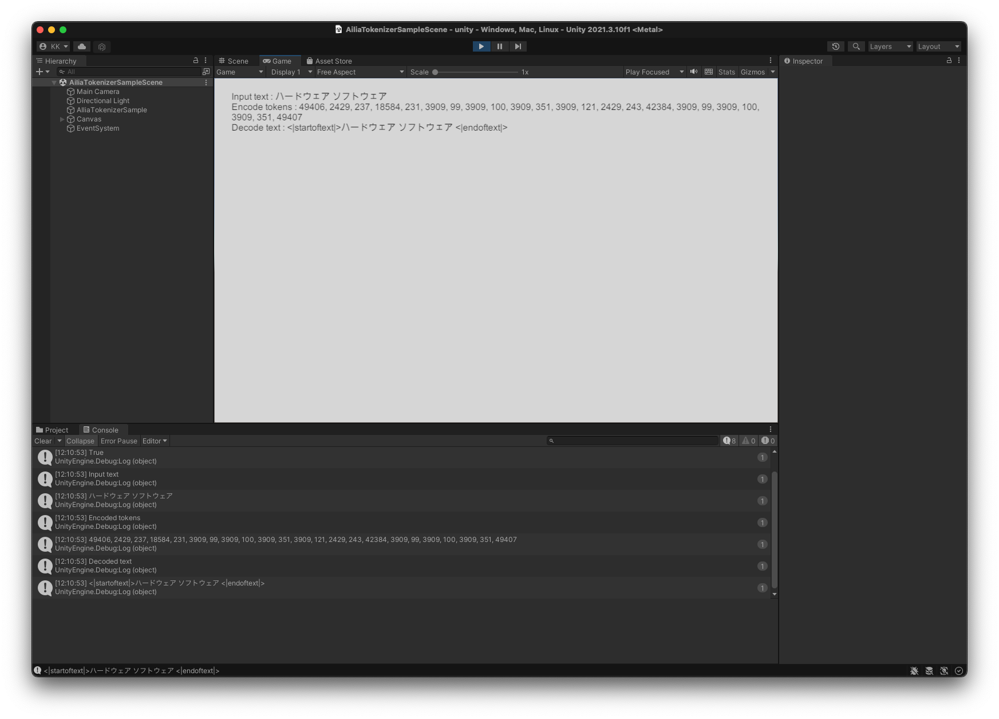

# ailia Tokenizer : UnityやC++から使用できるNLP向けトークナイザ

# ailia Tokenizer : UnityやC++から使用できるNLP向けトークナイザ

[](https://kyakuno.medium.com/?source=post_page---byline--b60b68c46b06---------------------------------------)

[Kazuki Kyakuno](https://kyakuno.medium.com/?source=post_page---byline--b60b68c46b06---------------------------------------)

17 min read

·

May 12, 2023

--

Share

UnityやC++から使用できるNLP向けトークナイザのailia Tokenizerのご紹介です。ailia Tokenizerを使用することで、Python不要で、NLPのトークナイズを行うことが可能です。

## ailia Tokenizerの概要

ailia TokenizerはUnityやC++から使用できるNLP向けトークナイザです。トークナイザは、テキストをAIが扱えるトークン（シンボル列）に変換したり、トークンをテキストに戻したりするためのAPIです。



ailia Tokenizer

従来、トークナイズにはPytorchのTransformersが使用されていました。しかし、TransformersはPythonでしか動作しないため、AndroidやiOSのアプリケーションからトークナイズできないという課題がありました。

ailia Tokenizerでは、PytorchのTransformesを使用せず、直接、NLPのトークナイズを行うことで、この問題を解決します。これにより、AndroidやiOSでもトークナイズを行うことが可能になります。

ailia Tokenizerは、MecabとSentencePieceを内包しているため、BERT JapaneseやSentence Transformerなどの複雑なトークナイズもデバイスで行うことが可能になります。

## ailia Tokenizerの実行例

ailia Tokenizerでは、Whisper、CLIP、XLMRoberta、Marian、BERT Japanese WordPiece、BERT Japanese Character、Roberta、BERT、GPT2、Lllamaのテキストとトークンの相互変換が可能です。

以降、それぞれのトークナイザの実行例を示します。

### Whisper

```
Text ハードウェア ソフトウェア  
Tokens [50258, 15927, 44165, 20745, 28571, 12817, 220, 42668, 17320, 7588, 20745, 28571, 12817, 50257]
```

### CLIP

```
Text ハードウェア ソフトウェア  
Tokens [49406  2429   237 18584   231  3909    99  3909   100  3909   351  3909  
    121  2429   243 42384  3909    99  3909   100  3909   351 49407]
```

CLIPのトークナイザはStableDiffusionと互換性があります。

### XLMRoBERTa

```
Text This is a test.  
Tokens [   0, 3293,   83,   10, 3034,    5,    2]
```

XLMRobertaのトークナイザはSentenceTransformerと互換性があります。

### Marian

```
Text "This is a cat."  
Tokens [183, 30, 15, 11126, 4, 0]
```

```
Tokens [32000,   517,  6044,    68,     6,     0]  
Text これは猫です。
```

MarianのトークナイザはFuguMTと互換性があります。

### BERT Japanese WordPiece

```
Text 太郎は次郎が持っている本を花子に渡した。  
Words ['太郎', 'は', '次郎', 'が', '持っ', 'て', 'いる', '本', 'を', '花', '子', 'に', '渡し', 'た', '。']  
Tokens [2, 5250, 9, 10833, 14, 1330, 16, 33, 108, 11, 1172, 462, 7, 9427, 10, 8, 3]
```

Mecabとipadicを使用しています。

### BERT Japanese Character

```
Text 太郎は次郎が持っている本を花子に渡した。  
Words ['太', '郎', 'は', '次', '郎', 'が', '持', 'っ', 'て', 'い', 'る', '本', 'を', '花', '子', 'に', '渡', 'し', 'た', '。']  
Tokens [2, 529, 644, 12, 357, 644, 20, 313, 30, 18, 19, 11, 77, 15, 814, 163, 8, 735, 16, 9, 10, 3]
```

Mecabとipadicを使用しています。

### Roberta

```
Text 東京タワー  
Tokens [    0, 48414, 15389, 46499, 11582, 49343, 49770, 48438,     2]
```

### BERT

```
Text To be or not to be, that is the question  
Words ['to', 'be', 'or', 'not', 'to', 'be', ',', 'that', 'is', 'the', 'question']  
Tokens [101, 2000, 2022, 2030, 2025, 2000, 2022, 1010, 2008, 2003, 1996, 3160, 102]
```

```
Text To be or not to be, that is the question  
Words ['To', 'be', 'or', 'not', 'to', 'be', ',', 'that', 'is', 'the', 'question']  
Tokens [101, 1706, 1129, 1137, 1136, 1106, 1129, 117, 1115, 1110, 1103, 2304, 102]
```

### GPT2

```
Text Hello world.  
Tokens [15496, 995, 13]
```

### Llama

```
Text Hello world.  
Tokens [1, 15043, 3186, 29889]
```

## ailia TokenizerのC API、C# API

C APIとC# APIのEncodeはTransformersの下記のAPI呼び出しと互換性があります。

```
input_ids = tokenizer(sents, split_special_tokens=True)
```

C APIとC# APIのEncodeWithSpecialTokensはTransformesの下記のAPI呼び出しと互換性があります。

```
input_ids = tokenizer(sents)
```

C APIとC# APIのDecodeはTransformersの下記のAPI呼び出しと互換性があります。

```
tokenizer.decode(input_ids, skip_special_tokens=True)
```

C APIとC# APIのDecdeWithSpecialTokensはTransformersの下記のAPI呼び出しと互換性があります。

```
tokenizer.decode(input_ids)
```

ailia Tokenizerの使用例です。インスタンスを作成し、引数にUTF8の文字列を与えることで、トークンを取得可能です。

## Get Kazuki Kyakuno’s stories in your inbox

Join Medium for free to get updates from this writer.

Subscribe

Subscribe

Remember me for faster sign in

C++

```
#include <stdio.h>  
#include <vector>  
#include <stdint.h>  
#include <stdlib.h>  
  
#include "ailia_tokenizer.h"  
  
int main(int argc, char *argv[]){  
 int32_t type = AILIA_TOKENIZER_TYPE_WHISPER;  
 printf("Tokenizer type %d\n", type);  
 AILIATokenizer *net;  
 ailiaTokenizerCreate(&net, type, AILIA_TOKENIZER_FLAG_NONE);  
 const char * text = u8"ハードウェア ソフトウェア";  
 printf("Input Text : %s\n", text);  
 ailiaTokenizerEncode(net, text);  
 unsigned int count;  
 ailiaTokenizerGetTokenCount(net, &count);  
 std::vector<int> tokens(count);  
 ailiaTokenizerGetTokens(net, &tokens[0], count);  
 ailiaTokenizerDecode(net, &tokens[0], count);  
 printf("Tokens : ");  
 for (int i = 0; i < count; i++){  
  printf("%d ", tokens[i]);  
 }  
 printf("\n");  
 unsigned int len;  
 ailiaTokenizerGetTextLength(net, &len);  
 std::vector<char> out_text(len);  
 char * p_text = &out_text[0];  
 ailiaTokenizerGetText(net, p_text, len);  
 printf("Output Text : %s\n", p_text);  
 return 0;  
}
```

Unity

```
AiliaTokenizerModel model = new AiliaTokenizerModel();  
model.Create(AiliaTokenizer.AILIA_TOKENIZER_TYPE_CLIP, AiliaTokenizer.AILIA_TOKENIZER_FLAG_UTF8_SAFE);  
string text = "ハードウェア ソフトウェア";  
int [] tokens = model.Encode(text);  
string decoded = model.Decode(tokens);  
model.Close();
```

Press enter or click to view image in full size



Unityでの実行例

WhisperとClip以外の、辞書が追加で必要なTokenizerの場合は、インスタンスを作成後、ailiaTokenizerEncodeを呼び出す前に辞書を読み込みます。

C++

```
if (type == AILIA_TOKENIZER_TYPE_BERT_JAPANESE_CHARACTER || type == AILIA_TOKENIZER_TYPE_BERT_JAPANESE_WORDPIECE){  
  status = ailiaTokenizerOpenDictionaryFile(net, "./dict/ipadic");  
  if (status != 0){  
   printf("ailiaTokenizerOpenDictionaryFile error %d\n", status);  
   return -1;  
  }  
  if (type == AILIA_TOKENIZER_TYPE_BERT_JAPANESE_CHARACTER){  
   status = ailiaTokenizerOpenVocabFile(net, "./test/gen/bert_japanese/vocab_character.txt");  
  }else{  
   status = ailiaTokenizerOpenVocabFile(net, "./test/gen/bert_japanese/vocab_wordpiece.txt");  
  }  
  if (status != 0){  
   printf("ailiaTokenizerOpenVocabFile error %d\n", status);  
   return -1;  
  }  
 }  
 if (type == AILIA_TOKENIZER_TYPE_MARIAN || type == AILIA_TOKENIZER_TYPE_XLM_ROBERTA){  
  if (type == AILIA_TOKENIZER_TYPE_MARIAN){  
   status = ailiaTokenizerOpenModelFile(net, "./test/gen/fugumt/source.spm");  
  }else{  
   status = ailiaTokenizerOpenModelFile(net, "./test/gen/sentence-transformer/sentencepiece.bpe.model");  
  }  
  if (status != 0){  
   printf("ailiaTokenizerOpenModelFile error %d\n", status);  
   return -1;  
  }  
 }
```

Unity

```
if (tokenizerModelType == TokenizerModels.sentence_transformer){  
   string model_path = "AiliaTokenizer/sentencepiece.bpe.model";  
   string asset_path = Application.streamingAssetsPath;  
   #if UNITY_ANDROID  
    CopyModelToTemporaryCachePath(model_path);  
    asset_path=Application.temporaryCachePath;  
   #endif  
   status = model.Open(model_path = asset_path+"/"+model_path);  
   if (status == false){  
    Debug.Log("Open error");  
    return;  
   }  
  }
```

## ailia TokenizerのPython API

ailia TokenizerのPython APIは、TransformersのAPIと同じネーミングルールを使用しており、ほとんどのケースで同じ引数で実行可能です。

ailia Tokenizerのメリットとして、TransformersはTensorFlowとTorchに依存していますが、ailia Tokenizerは依存パッケージがありません。そのため、パッケージの読み込みが高速です。

また、TorchのcuDNNを読み込まないため、ailia SDKやONNX RuntimeのcuDNNのバージョンと、TorchのcuDNNのバージョン間の不一致による不具合を抑制することが可能です。

ailia\_tokenizerを使用するには下記のようにします。

```
pip3 install ailia_tokenizer
```

Transformesとailia\_tokenizerを切り替える例です。

```
if args.disable_ailia_tokenizer:  
    from transformers import AutoTokenizer  
    tokenizer = AutoTokenizer.from_pretrained('tokenizer')  
else:  
    from ailia_tokenizer import XLMRobertaTokenizer  
    tokenizer = XLMRobertaTokenizer.from_pretrained('./tokenizer/')  
  
batch_dict = tokenizer(  
    input_texts,  
    max_length=512, padding=True, truncation=True,  
    return_tensors='np')
```

## ailia Tokenizerのアーキテクチャ

ailia Tokenizerでは、内部のfschatとして、BPE (Byte Pair Encoding Tokenizer)、SentencePiece、Mecabに対応しています。

Press enter or click to view image in full size


ailia Tokenizerのアーキテクチャ

### BPE

BPEは、UTF8の文字列を単語ではなくバイトコードのバイグラムで直接扱います。エンコードでは、文字列を指定したパターン（スペースや’llなど）で分割し、UTF8を特殊並びのUTF8にByteEncode、Bigramのパターンを示すmerges.txtに従って、バイトコードを結合していきます。最後に、vocab.txtに従って、Bigramのパターンとトークン列を紐づけます。

文字コードはUTF8に対応しており、正規表現にはUTF8に対応した[srell](https://www.akenotsuki.com/misc/srell/)を使用しています。また、BPEを使用するWHISPERとCLIPは辞書をバイナリに内包しているため、外部ファイルなくトークナイズを実行可能です。

### SentencePiece

SentencePieceを使用するモデルでは、SPM形式のモデルを読み込み、EncodeとDecodeを行います。XLMRoBERTaの場合は、更に、SPMのシーケンスをFAIRSEQ形式に並べ替えます。Marianの場合は、末尾にEOSを追加します。

### Mecab

Mecabを使用するモデルでは、Mecab形式の辞書を読み込み、単語に分割した後、WordPieceもしくはCharacterでサブワード分割を行い、EncodeとDecodeを行います。

## ailia Tokenizerの応用

ailia TokenizerはWhisperを使用した音声認識ライブラリであるailia AI Speechで使用しています。

[## ailia Speech : UnityやC++から使用できるAI音声認識ライブラリ

### UnityやC++から使用できるAI音声認識ライブラリであるailia Speechのご紹介です。ailia Speechを使用することで、簡単にアプリケーションにAI音声認識を実装することが可能です。

medium.com](https://medium.com/axinc/ailia-speech-unity%E3%82%84c-%E3%81%8B%E3%82%89%E4%BD%BF%E7%94%A8%E3%81%A7%E3%81%8D%E3%82%8Bai%E9%9F%B3%E5%A3%B0%E8%AA%8D%E8%AD%98%E3%83%A9%E3%82%A4%E3%83%96%E3%83%A9%E3%83%AA-16a05b5280d2?source=post_page-----b60b68c46b06---------------------------------------)

Whisperの出力はトークン列となるため、これをUTF8の文字列に変換する必要があります。

その際、UTF8はサロゲートペアがあり、複数バイトで1文字を構成します。そのため、Whisperの途中の出力は、UTF8としては不正な文字列になる可能性があります。UTF8として不正な文字を、UnityのTextで画面表示しようとすると、文字全体が表示されなくなります。

ailia Tokenizerでは、AILIA\_TOKENIZER\_FLAG\_UTF8\_SAFEを指定することで、UTF8として正常な文字列のみを出力することが可能です。

また、ailia TokenizerとFuguMTを使用した、英語から日本語への翻訳モデルの実行をailia-models-cppで公開しています。

[## ailia-models-cpp/fugumt/fugumt.cpp at master · axinc-ai/ailia-models-cpp

### C++ version of ailia models repository. Contribute to axinc-ai/ailia-models-cpp development by creating an account on…

github.com](https://github.com/axinc-ai/ailia-models-cpp/blob/master/fugumt/fugumt.cpp?source=post_page-----b60b68c46b06---------------------------------------)

## ailia Tokenizerの評価版のダウンロード

ailia Tokenizerの評価版は下記からダウンロード可能です。

[## AILIA-TOKENIZER 評価ライセンス申し込み

### Edit description

axip-console.appspot.com](https://axip-console.appspot.com/trial/terms/AILIA-TOKENIZER?source=post_page-----b60b68c46b06---------------------------------------)

APIドキュメントは下記です。

C++ API

[## ailia\_tokenizer: ailia Tokenizer SDK Document

### Edit description

axinc-ai.github.io](https://axinc-ai.github.io/ailia-sdk/supplemental/tokenizer/cpp/jp/?source=post_page-----b60b68c46b06---------------------------------------)

Unity API

[## ailia\_tokenizer: ailia Tokenizer Unity Plugin Document

### Edit description

axinc-ai.github.io](https://axinc-ai.github.io/ailia-sdk/supplemental/tokenizer/unity/jp/?source=post_page-----b60b68c46b06---------------------------------------)

Pyhon API

[## ailia Tokenizer Python API document - ailia Tokenizer Python API 1.2.0 documentation

### Edit description

axinc-ai.github.io](https://axinc-ai.github.io/ailia-sdk/supplemental/tokenizer/python/en/?source=post_page-----b60b68c46b06---------------------------------------)

ax株式会社はAIを実用化する会社として、クロスプラットフォームでGPUを使用した高速な推論を行うことができるailia SDKを開発しています。ax株式会社ではコンサルティングからモデル作成、SDKの提供、AIを利用したアプリ・システム開発、サポートまで、 AIに関するトータルソリューションを提供していますのでお気軽に[お問い合わせ](https://axinc.jp/)ください。