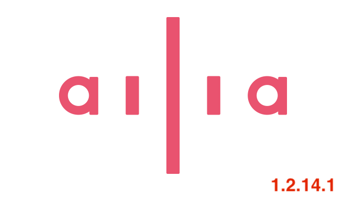

# ailia SDK 1.2.14.1をリリース

# ailia SDK 1.2.14.1をリリース

[Kazuki Kyakuno](https://kyakuno.medium.com/?source=post_page---byline--b4a088f5dba4---------------------------------------)

Jun 6, 2023

--

Share

ailia SDK 1.2.14.0の環境依存の不具合を修正したパッチリリースである、ailia SDKのバージョン1.2.14.1のご紹介です。ailia SDKについては[こちら](https://ailia.jp/)をご覧ください

## ailia SDK 1.2.14.1の概要

ailia SDK 1.2.14.1はailia SDK 1.2.14.0の環境依存の不具合を修正したパッチリリースです。

## Vulkanのインスタンス保持方法を変更

ailia SDK 1.2.14.0までは、ailiaGetEnvironmentもしくはailiaCreateでVulkanのインスタンスの作成と解放を行っていました。

しかし、AMDの2022年6月以前のドライバで、AMDの内蔵グラフィックスと、NVIDIAのGeforceが混在している環境で、OpenGLの初期化時にVulkanのインスタンスが存在していない場合、OpenGLの命令が例外を出す問題が見つかっています。

そこで、ailia SDK 1.2.14.1では、Vulkanのインスタンスをailiaの中で永続的に保持することで、AMDの古いドライバでも、正しくOpenGLが動作するように修正しました。

また、明示的にVulkanのインスタンスを解放したい場合のために、ailiaFinalize APIを追加しています。

今回の改良により、vkCreateInstanceとvkDestroyInstanceを呼び出す回数が減少するため、より安定した動作になります。

## Vulkanで環境に依存して発生する問題を修正

dGPUがVulkan1.0まで対応で、iGPUがVulkan1.1まで対応する場合に、iGPUの方でvulkan.dllが1.1に更新された結果、ailiaからVulkan1.1のAPIを呼び出し、例外が発生する問題を修正しました。

## Get Kazuki Kyakuno’s stories in your inbox

Join Medium for free to get updates from this writer.

Subscribe

Subscribe

Remember me for faster sign in

また、NVIDIAの古いGPUで、Vulkanに対応していないGPUの場合、vkEnumeratePhsicalDevicesがデバイス数0を返すことを期待していますが、vkEnumeratePhsicalDevicesがVK\_ERROR\_INITIALIZATION\_FAILEDを返すために、ailiaGetEnvironmentがエラーを返す問題を修正しています。

## モデル依存の不具合の修正

モデルのパラメータやレイヤーの組み合わせによって、推論結果が不正になる問題を修正しています。

## Visual Studio C#のサンプルの追加

githubでVisual Studio C#からailia SDKを呼び出すためのサンプルを公開しました。業務用アプリなどにAIを取り込むことが容易になります。

[## GitHub - axinc-ai/ailia-csharp: ailia SDK example for Visual Studio C#

### This is a sample to execute ailia's Inference API using C#. Windows 10 VisualStudio 2019 Unity's cs file can be used…

github.com](https://github.com/axinc-ai/ailia-csharp?source=post_page-----b4a088f5dba4---------------------------------------)

## 新たに動作するようになるモデル

yolov8 : 最新の物体検出モデル

[## ailia-models/object\_detection/yolov8 at master · axinc-ai/ailia-models

### (Image from https://ultralytics.com/images/bus.jpg) Automatically downloads the onnx and prototxt files on the first…

github.com](https://github.com/axinc-ai/ailia-models/tree/master/object_detection/yolov8?source=post_page-----b4a088f5dba4---------------------------------------)

yolov8-seg : 高速なセグメンテーションモデル

[## ailia-models/object\_detection/yolov8-seg at master · axinc-ai/ailia-models

### (Image from https://ultralytics.com/images/bus.jpg) Automatically downloads the onnx and prototxt files on the first…

github.com](https://github.com/axinc-ai/ailia-models/tree/master/object_detection/yolov8-seg?source=post_page-----b4a088f5dba4---------------------------------------)

## 今後の予定

2023年夏にリリース予定のailia SDK 1.2.15では、WhisperなどのTransformerモデルにおけるGPU推論の性能改善を予定しています。また、MPSのMTLBuffer対応による、MPSのGPU推論の対応範囲の拡張を予定しています。

ax株式会社はAIを実用化する会社として、クロスプラットフォームでGPUを使用した高速な推論を行うことができるailia SDKを開発しています。ax株式会社ではコンサルティングからモデル作成、SDKの提供、AIを利用したアプリ・システム開発、サポートまで、 AIに関するトータルソリューションを提供していますのでお気軽に[お問い合わせ](https://axinc.jp/)ください。