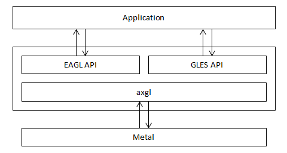
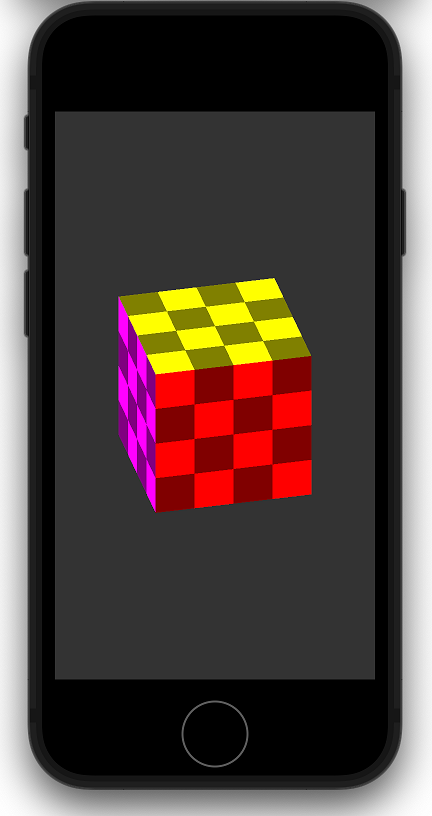

# axglの紹介

# axglの紹介

[](https://medium.com/@kitazume_85961?source=post_page---byline--992fc5e7fc4a---------------------------------------)

[Kitazume](https://medium.com/@kitazume_85961?source=post_page---byline--992fc5e7fc4a---------------------------------------)

Jun 20, 2023

--

Share

Press enter or click to view image in full size


axglは、iOS Metalの上に構築した、OpenGL ESとして機能するソフトウェアレイヤーです。OpenGL ESを使用して作成された既存アプリケーションを、Metal上で動作可能にするためのミドルウェアです。

## axglとは？

iOS Metalの上に、OpenGL ES 2.0/3.0として機能するソフトウェアレイヤーを構築します。



概略ソフトウェアブロック図

axglによって、OpenGL ES のグラフィックスリソース(バッファオブジェクト、テクスチャなど)は、Metal のオブジェクト(MTLBuffer、MTLTextureなど)に変換して作成されます。  
GLSLのシェーダは、glslangとSPIRV-Crossによって MSL に変換し、axgl内部で MTLLibrary を作成します。  
GLESの描画API呼び出しは、Metalのコマンドとして作成/実行されます。

## axglで実現可能になること

OpenGL ESを使用して作成された既存アプリケーションを、再ビルドすることでMetal上で動作可能にすることを目的として開発しています。  
2023年6月現在、iOSにおいてOpenGL ESは非推奨APIとなっています。  
axglを使用することで、アプリケーションは継続してOpenGL ESを使用することが可能となります。

## axglの入手方法

GitHubの下記のページから取得することができます。

[## GitHub - axinc-ai/ax-gfxlib: ax Graphics Library

### ax Graphics Library. Contribute to axinc-ai/ax-gfxlib development by creating an account on GitHub.

github.com](https://github.com/axinc-ai/ax-gfxlib?source=post_page-----992fc5e7fc4a---------------------------------------)

## axglの使用方法

アプリケーションにソースとして組み込む、もしくはライブラリとしてリンクすることで使用できます。GitHubから取得したソースツリーにサンプルがあります。

AXGLExample : ソースとして組み込むサンプル  
XCodeから下記のプロジェクトを開いてビルドします。  
/AXGLExample/AXGLExample.xcodeproj

Press enter or click to view image in full size


XCodeからプロジェクトを開く



サンプルをシミュレータで実行

AXGLExampleSL : ライブラリとしてリンクするサンプル  
XCodeから下記のプロジェクトを開いてビルドします。  
/AXGLExampleSL/AXGLExampleSL.xcodeproj

## Get Kitazume’s stories in your inbox

Join Medium for free to get updates from this writer.

Subscribe

Subscribe

Remember me for faster sign in

※サンプルプログラムの内容はAXGLExampleと同一です。

axglライブラリのXCodeプロジェクトは下記のフォルダに存在しています。既存プロジェクトに追加する場合にお使いいただけます。  
/axgl/build/xcode/axgl.xcodeproj

## アプリケーションのソースコード変更

最小限のソース変更でOpenGL ESから移行することができます。  
AXGLExample 及び AXGLExampleSL のサンプルコードに含まれる MetalView クラスが該当する実装となっています。

**・ヘッダの変更**

ヘッダの include を変更します。  
Apple の EAGL.h との衝突を回避するために、Apple のヘッダよりも前に include 宣言を行ってください。

```
#include <axgl/EAGL.h>  
#include <axgl/EAGLDrawable.h>  
#include <axgl/ES3/gl.h>
```

**・レイヤークラスの変更**

グラフィックスAPIとしてMetalを使用することから、CAEAGLLayerを使用しているレイヤークラスを CAMetalLayer に置き換えます。  
UIView を継承したクラスの layerClass メソッドで CAMetalLayer を返すように変更します。

```
+ (id)layerClass  
{  
 return [CAMetalLayer class];  
}
```

**・レンダーバッファストレージの変更**

オンスクリーンのレンダーバッファは、CAMetalLayer から作成します。  
EAGLContext::renderbufferStorageFromLayer を呼び出すことでレンダーバッファのストレージに指定します。

```
 // GLuint _colorRenderbuffer; // レンダーバッファオブジェクト  
 // EAGLContext* _context;     // コンテキスト  
 // CAMetalLayer* _metalLayer; // Metalのコアアニメーションレイヤー  
 glGenRenderbuffers(1, &_colorRenderbuffer);  
 glBindRenderbuffer(GL_RENDERBUFFER, _colorRenderbuffer);  
 [_context renderbufferStorageFromLayer:GL_RENDERBUFFER fromLayer:_metalLayer];
```

## まとめ

axglを使用することで、既存のOpenGL ESのアプリケーションを簡単にMetalで動作可能にすることが可能です。ぜひ、ご利用ください。

## 商用ライセンス

axglはAGPLと商用ライセンスのデュアルライセンスです。商用ライセンスをお求めの場合は、ax株式会社までお問い合わせください。

ax株式会社はAIを実用化する会社として、クロスプラットフォームでGPUを使用した高速な推論を行うことができるailia SDKを開発しています。また、SIMDやGPGPUなどを使用したコンピューティングの高速化も行っています。ax株式会社ではSIMDやGPGPUを利用したアプリ・システム開発、サポートまで、トータルソリューションを提供していますのでお気軽に[お問い合わせ](https://axinc.jp/)ください。