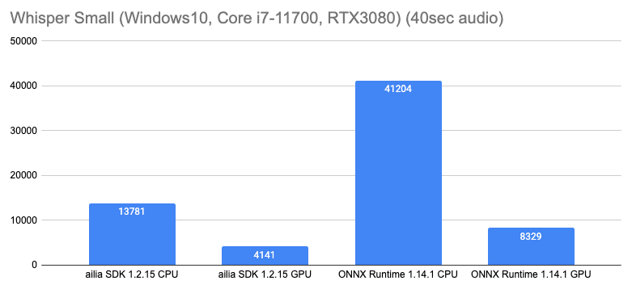
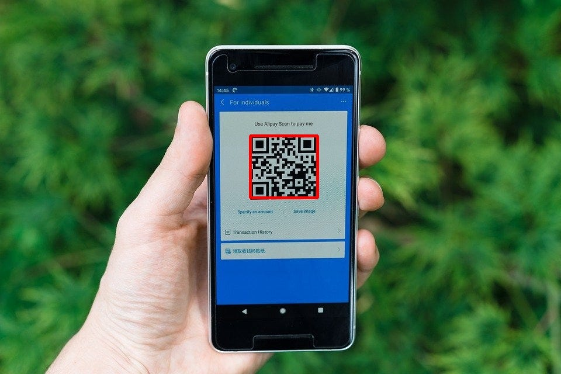
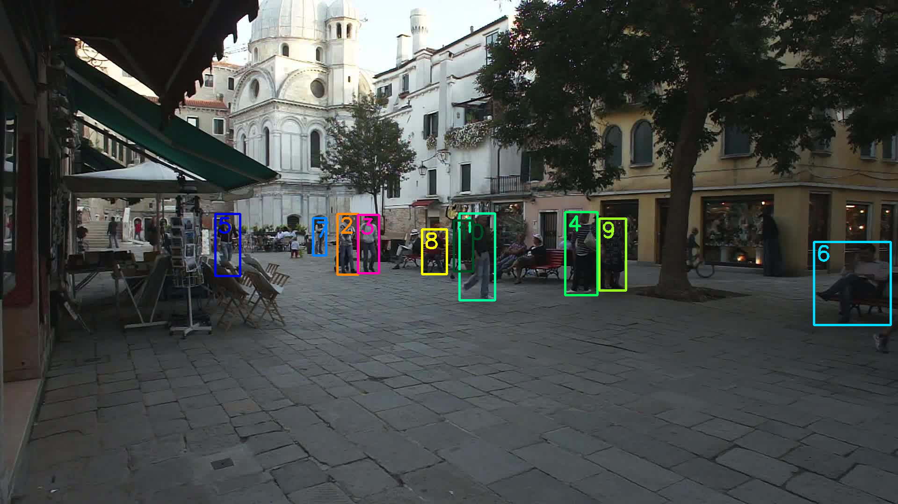

# ailia SDK 1.2.15をリリース

# ailia SDK 1.2.15をリリース

[](https://kyakuno.medium.com/?source=post_page---byline--2e5c58e6c43---------------------------------------)

[Kazuki Kyakuno](https://kyakuno.medium.com/?source=post_page---byline--2e5c58e6c43---------------------------------------)

7 min read

·

Aug 3, 2023

--

Share

TransformerのGPU高速化を行ったailia SDKのバージョン1.2.15のご紹介です。ailia SDKについては[こちら](https://ailia.jp/)をご覧ください

## ailia SDK 1.2.15の概要

ailia SDK 1.2.15は、TransformerのGPU環境での高速化や、BLOBのGPU間転送APIの追加を行なったバージョンとなります。加えて、ailia SDKの将来の発展のため、内部構造の改善を行なっています。


## GPU全般でのTransformerの高速化

Transformerでよく使用されるGELUはONNXでは複数のオペレータに分割されます。ailia SDK 1.2.15ではGELUに対応するオペレータの組み合わせを、再度、Fuseして、一つのオペレータにすることで、メモリのリード・ライトを最小化し、高速化を行なっています。

また、ScatterNDやGather、MeanVarianceNormalizationのGPU対応を行うことで、CPU・GPU間転送の発生を最小化しています。

加えて、StableDiffusion向けにSin、Cos、CastのcuDNN対応や、音声処理向けにcuDNNとVulkan向けのConvolution1D対応を行なっています。

## MetalBuffer対応

iOSとmacOSでは、MPS (MetalPerformanceShader) を使用した推論を行なっていますが、MPSで実装されていないオペレータについてはMetalで実装しています。

MPSは、テンソルをMPSImageという形式で扱いますが、下記に示すように、チャンネル数に応じてデータの並びと型が変化するという複雑な仕様になっています。そのため、チャンネル方向のConcatの実装は、組み合わせが多く、非常に複雑な実装となっています。

```
・4channel以上の場合は32bitのプレーンが確保され1画素のxyzwの各画素にchannel0〜3が入る  
・3channelの場合は24bitのプレーンが確保され、1画素のxyzにchannel0〜2が入る  
・2channelの場合は16bitのプレーンが確保され、1画素のxyにchannel0〜1が入る  
・1channelの場合は8bitのプレーンが確保され、1画素のxにchannel0が入る  
  
・4チャンネル以下の場合はtexture2d  
・5チャンネル以上に場合はtexture2d_array
```

そこで、ailia SDK 1.2.15からは、新たにMetalBufferに対応し、MPSImageとMetalBufferへの動的変換を行うようにしました。これにより、Concatなどのシェーダコードの実装を容易とし、従来よりも多くのカーネルをGPU実行できる構成に変更を行いました。

この変更により、MetalBufferでしか使用できないMPSMatrixMultiplicationが使用できるようになりました。その結果、iOSとmacOSにおいて、GPUを使用した場合のGEMMの速度が改善し、Transformerの速度が大きく改善します。

## CopyBlobData APIの追加

Blob間で直接、メモリ転送できるAPIを追加しました。このAPIは、入力元のBLOBと出力先のBLOBがGPUメモリの場合、CPUを経由せずにGPU転送が可能です。

## CUDA12及びcuDNN8.8に対応

Windows及びLinux環境において、CUDA12及びcuDNN8.8に対応しました。最新のCUDA環境でailia SDKをご利用いただけます。

## パッケージサイズの縮小

cuBLASはCUDA Toolkitに含まれるため、Dynamic Linkにして非同梱にしました。これにより、パッケージサイズが従来の2GBから730MBまで縮小します。

## ビルド環境の更新

各ストアやOS自体のサポート期間終了に合わせて、iOSのiphoneos-version-minを7.0から11.0に、macOSのDEPLOYMENT\_TARGETを10.7から10.13に、Linux (x64)の対応OSをUbuntu 18.04LTSから20.04LTSに変更しています。

## Whisperにおけるベンチマーク

ailia SDK 1.2.15では、WhisperなどのTransformer系のモデルの推論速度が向上しています。

## Get Kazuki Kyakuno’s stories in your inbox

Join Medium for free to get updates from this writer.

Subscribe

Subscribe

Remember me for faster sign in

Windows10環境において、Core i7–11700とRTX3080（cuDNN）を使用した場合、ailia SDKはWhisper SmallをONNX Runtimeよりも高速に推論可能です。

Press enter or click to view image in full size



Whisperにおいて40秒の音声ファイルを推論するのに必要な処理時間

## ailia SDK 1.2.15で新たに対応するモデル

ailia SDK 1.2.15では下記のモデルを新たに使用可能です。

Tacotron2 : 音声合成モデル

[## ailia-models/audio\_processing/tacotron2 at master · axinc-ai/ailia-models

### The collection of pre-trained, state-of-the-art AI models for ailia SDK - ailia-models/audio\_processing/tacotron2 at…

github.com](https://github.com/axinc-ai/ailia-models/tree/master/audio_processing/tacotron2?source=post_page-----2e5c58e6c43---------------------------------------)

SileroVAD : 無音検知モデル

[## ailia-models/audio\_processing/silero-vad at master · axinc-ai/ailia-models

### The collection of pre-trained, state-of-the-art AI models for ailia SDK - ailia-models/audio\_processing/silero-vad at…

github.com](https://github.com/axinc-ai/ailia-models/tree/master/audio_processing/silero-vad?source=post_page-----2e5c58e6c43---------------------------------------)

WeChatQrCode : QRコード認識モデル

Press enter or click to view image in full size



出典：<https://cdn.pixabay.com/photo/2020/07/18/13/52/alipay-5417261_960_720.jpg>

[## ailia-models/object\_detection/qrcode\_wechatqrcode at master · axinc-ai/ailia-models

### The collection of pre-trained, state-of-the-art AI models for ailia SDK …

github.com](https://github.com/axinc-ai/ailia-models/tree/master/object_detection/qrcode_wechatqrcode?source=post_page-----2e5c58e6c43---------------------------------------)

StrongSort : 高精度な物体追跡モデル

Press enter or click to view image in full size



出典：<https://vimeo.com/60139361>

[## ailia-models/object\_tracking/strong\_sort at master · axinc-ai/ailia-models

### The collection of pre-trained, state-of-the-art AI models for ailia SDK - ailia-models/object\_tracking/strong\_sort at…

github.com](https://github.com/axinc-ai/ailia-models/tree/master/object_tracking/strong_sort?source=post_page-----2e5c58e6c43---------------------------------------)

ax株式会社はAIを実用化する会社として、クロスプラットフォームでGPUを使用した高速な推論を行うことができるailia SDKを開発しています。ax株式会社ではコンサルティングからモデル作成、SDKの提供、AIを利用したアプリ・システム開発、サポートまで、 AIに関するトータルソリューションを提供していますのでお気軽に[お問い合わせ](https://axinc.jp/)ください。