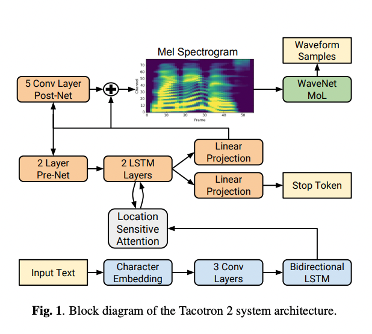

# Tacotron2 : 波形変換をAIで行う高品質な音声合成モデル

# **Tacotron2 : 波形変換をAIで行う高品質な音声合成モデル**

[](https://kyakuno.medium.com/?source=post_page---byline--bc592217a399---------------------------------------)

[Kazuki Kyakuno](https://kyakuno.medium.com/?source=post_page---byline--bc592217a399---------------------------------------)

11 min read

·

Aug 17, 2023

--

Share

波形変換をAIで行う高品質な音声合成モデルの紹介です。Tacotron2を使用することで、任意のテキストでAIに喋らせることが可能です。また、axで学習したモデルを使用することで、日本語にも対応します。

## Tacotron2の概要

Tacotron2はGoogleが開発してNVIDIAが実装を公開している音声合成モデルです。Tacotron2は学習コードが公開されているため、再学習することで日本語に対応可能です。

[## Natural TTS Synthesis by Conditioning WaveNet on Mel Spectrogram Predictions

### This paper describes Tacotron 2, a neural network architecture for speech synthesis directly from text. The system is…

arxiv.org](https://arxiv.org/abs/1712.05884?source=post_page-----bc592217a399---------------------------------------)

[## GitHub - NVIDIA/tacotron2: Tacotron 2 - PyTorch implementation with faster-than-realtime inference

### PyTorch implementation of Natural TTS Synthesis By Conditioning Wavenet On Mel Spectrogram Predictions. This…

github.com](https://github.com/NVIDIA/tacotron2?source=post_page-----bc592217a399---------------------------------------)

## Tacotron2のアーキテクチャ

### 全体構成

TacotronはEncoder-DecoderモデルでテキストからMelspectrumを生成するモデルです。Tacotron2ではさらに、Melapectrumからの波形変換にWaveglowモデルを適用することで、より高品質の音声に変換します。



Tacotron2のアーキテクチャ（出典：<https://arxiv.org/pdf/1712.05884.pdf>）

### トークナイザ

テキストをトークナイザであるtext\_to\_sequenceでトークンに変換します。

トークナイザの入力は、英語だとASCIIテキストです。日本語の場合、openjtalkのg2pで音素を示すテキストに変換して扱います。

```
strs[1] = pyopenjtalk.g2p(strs[1], kana=False)
```

テキストはCleanerで整形されます。Basic Cleanerでは大文字を小文字に変換し、スペースを半角スペースに統一します。English Cleanerでは、さらに、数字は英単語に変換され、Dr.などの略語は通常形に変換されます。

シンボル列の定義は下記のようになっており、アルファベットについてはそのままシンボル値に変換されます。発音記号を含む[CMU形式のArpabet](https://en.wikipedia.org/wiki/ARPABET)が入力された場合、専用のシンボル番号が割り当てられます。

```
_pad        = '_'  
_punctuation = '!\'(),.:;? '  
_special = '-'  
_letters = 'ABCDEFGHIJKLMNOPQRSTUVWXYZabcdefghijklmnopqrstuvwxyz'  
  
# Prepend "@" to ARPAbet symbols to ensure uniqueness (some are the same as uppercase letters):  
_arpabet = ['@' + s for s in cmudict.valid_symbols]  
  
# Export all symbols:  
symbols = [_pad] + list(_special) + list(_punctuation) + list(_letters) + _arpabet
```

シンプルなアルファベットを変換した場合のトークンの例です。

```
入力テキスト ： Hello world.  
トークン : [45 42 49 49 52 11 60 52 55 49 41  7]
```

batch\_size=1の場合はそのまま、batch\_size!=1の場合は最も長いバッチのトークン長まで0パディングします。

### エンコーダ

EncoderではトークンをEmbeddingに変換します。

### デコーダ

Decoderでは、Embeddingと前回の推論結果を入力として、Melspectrumを1列ずつ生成します。一回のDecodeで、(80, 1)のMelspectrumが生成されるため、これをConcatしていくことで、(80, times)のMelspectrumを生成します。gate\_outputの数値が0.6を下回ったらDecodeを終了します。

batch\_size!=1の場合は、パディング領域を無視するため、maskを持ち、トークンごとにTrue/Falseで有効かどうかを入力します。Falseが有効、Trueが無効です。

デコードが終了したMelspectrumに対して、postnetでデノイズを行います。

### MelspectrumからPCM波形への変換

Melspectrumはパワースペクトルであり、位相が含まれていないため、PCM波形に変換するには位相を予測する必要があります。

従来は、反復法である[Griffin-Limのアルゴリズム](https://qiita.com/ma-szk/items/fe5c3d010b281dcd3537)で位相を予測していました。しかし、Griffin-Limのアルゴリズムで予測される位相はノイズが多いため、近年はボコーダが使用されています。

## Get Kazuki Kyakuno’s stories in your inbox

Join Medium for free to get updates from this writer.

Subscribe

Subscribe

Remember me for faster sign in

Tacotron2では、Waveglowと呼ばれるニューラルボコーダが採用されており、位相の予測とPCM変換を同時に行います。Waveglowを使用することで、ノイズの少ないPCM波形を取得することが可能です。

## Tacotron2の学習

学習はTensorFlowとPytorchで行うことができます。ただし、TensorFlow 1.15とNVIDIAのApexなどの各種ライブラリに依存しており、バージョン合わせが複雑です。ax株式会社ではWindowsとPython3.6.8で環境を構築しました。主要なライブラリのバージョンは下記となります。

```
Package              Version  
-------------------- -----------  
apex                 0.1  
gast                 0.2.2  
h5py                 3.1.0  
Keras-Applications   1.0.8  
Keras-Preprocessing  1.1.2  
matplotlib           2.1.0  
numba                0.48.0  
numpy                1.17.0  
onnxruntime          1.10.0  
protobuf             3.19.6  
scikit-learn         0.24.2  
scipy                1.0.0  
soundfile            0.12.1  
tensorboard          1.15.0  
tensorflow           1.15.2  
tensorflow-estimator 1.15.1  
torch                1.7.0+cu110  
torchvision          0.8.1+cu110
```

学習では、テキストと音声ファイルのペアを使用します。使用できる音声ファイルが少ない場合は、大規模なデータセットで事前学習し、転移学習することで音質を変換します。

学習用のデータセットの例です。最初に音声ファイル、次に、テキストの音素を記載します。

> ../datasets/tsukuyomi/meian/VOICEACTRESS100\_001.wav|mata,toojinoyooni,godaimyooootoyobareru,shuyoonamyoooonochuuoonihaisarerukotomoooi.

テキスト部分には任意の音素を定義可能であるため、アクセント記号なども挿入して学習すると、アクセントを反映することも可能です。

なお、Tacotron2だけを再学習した場合、ある程度の声色は再現できますが、ロボっぽい声になる傾向にあります。これは波形の位相がずれていることに起因するようで、Waveglowも再学習することで軽減が可能です。

## 学習したモデルのONNXへの変換

学習したモデルはNVIDIAのサンプルでONNXに変換可能です。Tacotron2のモデルそのままではLSTMのエラーでエクスポートできないため、NVIDIAのサンプルでは、Pytorchでエクスポートできるように、モデル分割が行われます。

```
cd DeepLearningExamples/PyTorch/SpeechSynthesis/Tacotron2/  
mkdir output  
python tensorrt/convert_tacotron22onnx.py --tacotron2 ../../../../models/tacotron2_statedict.pt -o ../../../../onnx/nvidia  
python tensorrt/convert_waveglow2onnx.py --waveglow ../../../../models/nvidia_waveglow256pyt_fp16 --config-file config.json --wn-channels 256 -o output/
```

[## DeepLearningExamples/PyTorch/SpeechSynthesis/Tacotron2/tensorrt at master ·…

### This is subfolder of the Tacotron 2 for PyTorch repository, tested and maintained by NVIDIA, and provides scripts to…

github.com](https://github.com/NVIDIA/DeepLearningExamples/tree/master/PyTorch/SpeechSynthesis/Tacotron2/tensorrt?source=post_page-----bc592217a399---------------------------------------)

変換したONNXは、4つに分かれます。EncoderでテキストからEmbeddingを取得し、Decoderを繰り返し実行してMelapectrumを生成、PostNetでMelapectrumを補正し、最後にWaveglowで音声波形を取得します。

なお、Tacotron2に含まれるWaveglowが、TensorRT向けのコンバータが使用しているWaveglowよりも新しいため、Waveglowを再学習した場合、そのままではCheckpointを読み込むことができません。

新しいバージョンのWaveglowに対応したコンバータは下記に公開しています。

[## GitHub - axinc-ai/DeepLearningExamples: State-of-the-Art Deep Learning scripts organized by models…

### State-of-the-Art Deep Learning scripts organized by models - easy to train and deploy with reproducible accuracy and…

github.com](https://github.com/axinc-ai/DeepLearningExamples?source=post_page-----bc592217a399---------------------------------------)

## ailia SDKから使用する

ailia MODELSでは、NVIDIA公式の英語の音声合成モデルと、axで独自に学習した日本語の音声合成モデルを使用可能です。

[## ailia-models/audio\_processing/tacotron2 at master · axinc-ai/ailia-models

### The collection of pre-trained, state-of-the-art AI models for ailia SDK - ailia-models/audio\_processing/tacotron2 at…

github.com](https://github.com/axinc-ai/ailia-models/tree/master/audio_processing/tacotron2?source=post_page-----bc592217a399---------------------------------------)

英語での推論例です。

```
python3 tacotron2.py -m nvidia -i "Hello wolrd"
```

日本語での推論例です。日本語の音声合成モデルは、[つくよみちゃん](https://tyc.rei-yumesaki.net/)のコーパスを使用していますので、[つくよみちゃんの利用規約](https://tyc.rei-yumesaki.net/about/terms/)に従う必要があります。

```
python3 tacotron2.py -m tsukuyomi -i "こんにちは"
```

日本語の使用には、音素変換に[pyopenjtalk](https://github.com/r9y9/pyopenjtalk)が必要です。

```
# mac OS, Linux  
pip3 install pyopenjtalk  
# Windows  
pip3 install pyopenjtalk-prebuilt
```

## ailia AI Voiceの紹介

ax株式会社では、AI音声合成を簡単に使用するためのライブラリであるailia AI Voiceを開発中です。

Tacotron2を日本語で使用するには、pyopenjtalkが必要であり、iOSやAndroidで動かすことが困難です。

ailia AI Voiceでは、pyopenjtalkを内包した、iOSやAndroid向けのライブラリを提供することで、モバイルデバイスでも音声合成を使用可能とする計画です。

ax株式会社はAIを実用化する会社として、クロスプラットフォームでGPUを使用した高速な推論を行うことができるailia SDKを開発しています。ax株式会社ではコンサルティングからモデル作成、SDKの提供、AIを利用したアプリ・システム開発、サポートまで、 AIに関するトータルソリューションを提供していますのでお気軽に[お問い合わせ](https://axinc.jp/)ください。