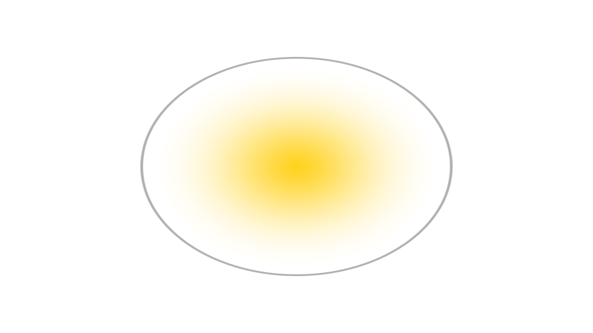
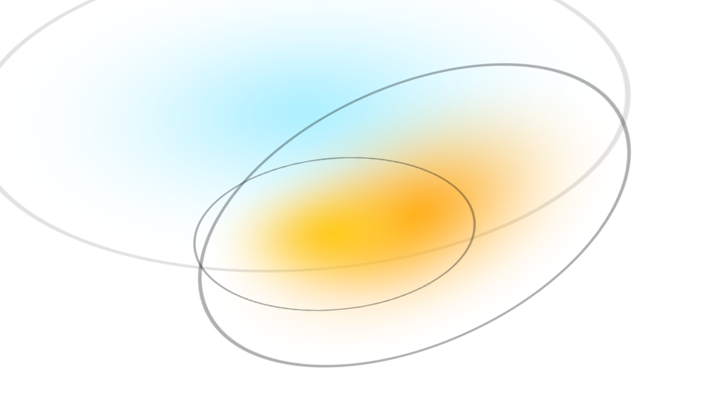
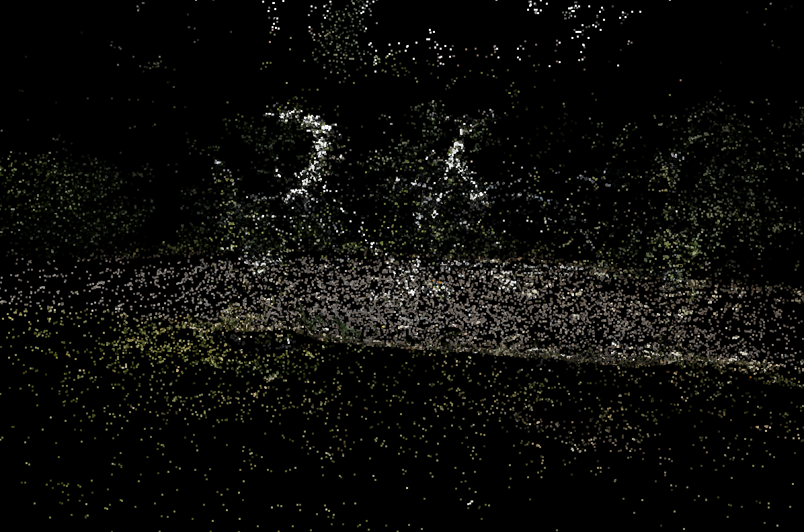
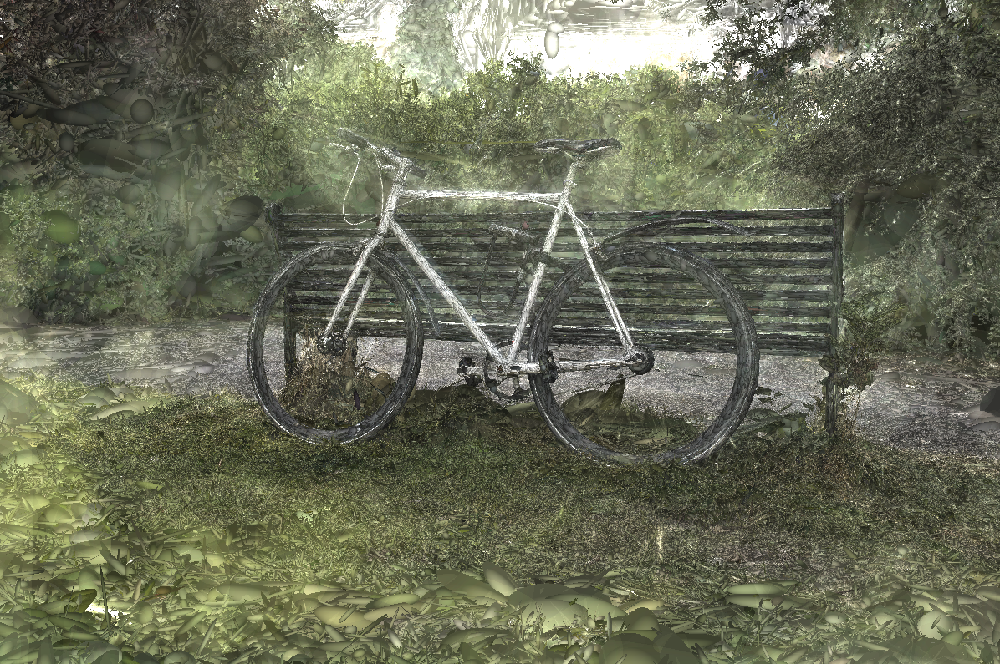

# 3D Gaussian Splatting : 複数視点の画像から3D空間を再現する最新手法

# 3D Gaussian Splatting : 複数視点の画像から3D空間を再現する最新手法

[](https://kyakuno.medium.com/?source=post_page---byline--273ce61200a8---------------------------------------)

[Kazuki Kyakuno](https://kyakuno.medium.com/?source=post_page---byline--273ce61200a8---------------------------------------)

13 min read

·

Sep 26, 2023

--

Share

複数視点の画像から3D空間を再現する最新手法である3D Gaussian Splattingの紹介です。3D Gaussian Splattingを使用することで、3D空間を学習し、リアルタイムにレンダリング可能です。

## 3D Gaussian Splattingの概要

3D Gaussian Splattingは2023年8月に発表された、複数の視点の画像から3D空間を再現する手法です。3D空間をガウシアンの集合として定義し、各ガウシアンのパラメータを機械学習で求めることで、レンダリング時は機械学習を不要とし、高速なレンダリングが可能です。

[## 3D Gaussian Splatting for Real-Time Radiance Field Rendering

### 3D Gaussian Splatting for Real-Time Radiance Field Rendering

3D Gaussian Splatting for Real-Time Radiance Field Renderingrepo-sam.inria.fr](https://repo-sam.inria.fr/fungraph/3d-gaussian-splatting/?source=post_page-----273ce61200a8---------------------------------------)

[## Introduction to 3D Gaussian Splatting

### We're on a journey to advance and democratize artificial intelligence through open source and open science.

huggingface.co](https://huggingface.co/blog/gaussian-splatting?source=post_page-----273ce61200a8---------------------------------------)

## フォトグラメトリーやNERFとの比較

フォトグラメトリーは複数の視点の画像から3Dポリゴンを生成する手法です。物体を一周、回り込むように撮影することで、3Dポリゴンを生成可能です。フォトグラメトリーは物体をスキャンするのに有用な反面、空などの輪郭のないシーンや、遠景の細かいディテールなどを表現できないという問題があります。また、従来型の最適化問題を解く形で最適化されるため、人が映り込んでいる場合などにうまく3Dポリゴンを生成できないという課題があります。

Press enter or click to view image in full size


ポリゴン（出典：<https://huggingface.co/blog/gaussian-splatting>）

これらの問題に対して、近年、[NERF](https://github.com/bmild/nerf)が注目されています。NERFは、複数の視点の画像から、シーンを機械学習モデルの重みに落とし込み、レイトレーシングのような方式で、機械学習モデルにレイを飛ばして画像をレンダリングする方式です。NERFの場合、空などの輪郭のないシーンや、円形の細かいディテールなどを表現でき、また、人が写り込んでいる場合でも最適化問題を解くことができ、人がいないシーンを構成できるという特徴があります。しかし、NERFはレイを飛ばしてレンダリングする方式であるため、レンダリングに時間がかかるという問題があります。

Press enter or click to view image in full size


NERFの概要（出典：<https://github.com/bmild/nerf>）

NERFを高速化する手法として、事前に複数の方向でレイを飛ばした結果をボリュームテクスチャにベイクしておくことで、リアルタイム処理可能にした[MERF](https://arxiv.org/abs/2302.12249)が提案されています。しかし、MERFは512x512x512などのボリュームテクスチャと2048x2048の高解像度テクスチャにベイクするため、細かい形状が失われるという問題があります。


MERFの概要（出典：<https://arxiv.org/pdf/2302.12249.pdf>）

そこで、NERFとは違う形式でこの問題を解いたのが3D Gaussian Splattingです。NERFがレイトレーシングだとすると、3D Gaussian Splattingはリアルタイムレンダリングに近い手法です。最初に複数の視点の画像をポイントクラウドに変換し、ポイントクラウドをパラメータを持ったガウシアンに変換、そのパラメータを機械学習によって学習します。

Press enter or click to view image in full size



ガウシアン（出典：<https://huggingface.co/blog/gaussian-splatting>）

学習時は機械学習が必要ですが、レンダリング時はパラメータを使用してレンダリングするだけになるため、高速なレンダリングが可能です。

Press enter or click to view image in full size



ガウシアンのレンダリング（出典：<https://huggingface.co/blog/gaussian-splatting>）

## 3D Gaussian Splattingのアーキテクチャ

3D Gaussian Splattingのアーキテクチャは下記となります。COLMAPを使用して取得したポイントクラウドをベースに、3D Gaussiansのパラメータを、カメラ画像を元に最適化します。

Press enter or click to view image in full size


アーキテクチャ（出典：<https://repo-sam.inria.fr/fungraph/3d-gaussian-splatting/3d_gaussian_splatting_low.pdf>）

3D Gaussian Splattingでは、最初にCOLMAPを使用して、入力画像からポイントクラウドを生成します。この処理は数十秒で終わる処理です。入力画像から、入力画像間の画素のマッチングによってカメラの外部パラメータ（傾きや位置）が推定され、そのパラメータをもとにポイントクラウドが計算されます。ここでは、機械学習ではない最適化問題によって処理されます。

Press enter or click to view image in full size



ポイントクラウド（出典：<https://huggingface.co/blog/gaussian-splatting>）

次に、Pytorchを使用した機械学習によって、各ガウシアンのパラメータが最適化されます。各ガウシアンは下記のパラメータを持っています。

- Position: where it’s located (XYZ)
- Covariance: how it’s stretched/scaled (3x3 matrix)
- Color: what color it is (RGB)
- Alpha: how transparent it is (α)

最適化では、実際にCOLMAPで推定した各カメラ位置でレンダリングし、元画像に近くなるようにパラメータが決定されます。そのため、3D Gaussian Splattingの出力は、撮影したカメラ位置では元の写真に近い映像を得ることができます。最適化のためのレンダリングには、微分可能レンダラが使用されており、レンダラを微分可能にすることで、Pytorchによる最適化が可能になっています。

そうして作られたGaussianをレンダリングすると下記のようになります。

Press enter or click to view image in full size


レンダリング画像（出典：<https://huggingface.co/blog/gaussian-splatting>）

ここで、アルファ値を無視して、ガウシアンをレンダリングすると下記のようになります。楕円の集合であることがわかります。

Press enter or click to view image in full size



不透明レンダリング画像（出典：<https://huggingface.co/blog/gaussian-splatting>）

学習時間ごとの精度の比較です。[A6000](https://www.nvidia.com/ja-jp/design-visualization/rtx-a6000/) GPUを使用して、7Kは5分、30Kは35分で学習されています。学習に時間を使用するほど高精度なGaussianが構成されます。

Press enter or click to view image in full size


イテレーション回数と精度（出典：<https://repo-sam.inria.fr/fungraph/3d-gaussian-splatting/3d_gaussian_splatting_low.pdf>）

## 3D Gaussian Splattingの高精度化

COLMAPは3D Gaussian Splattingの学習のための入力データの作成であるため、例えば、カメラリグを使っていて、カメラ位置が既知であったり、正確なカメラの内部パラメータが分かるのであれば、より正確なポイントクラウドを生成可能で、最終的な精度を上げることができる可能性があります。

## Get Kazuki Kyakuno’s stories in your inbox

Join Medium for free to get updates from this writer.

Subscribe

Subscribe

Remember me for faster sign in

ただ、試した限りでは、そこまでこだわらなくても、iPhoneのカメラで撮影したレベルでも実用的な3Dシーンが生成され、その手軽さも3D Gaussian Splattingの魅力であると考えています。

## 3D Gaussian SplattingをWindowsで使用する

### インストール

Windowsでの環境構築は下記のBLOGを参考にさせていただきました。

[## 3D Gaussian Splattingの使い方 (Windows環境構築)

### NeRFとは異なる、新たなRadiance Fieldの技術「3D Gaussian Splatting for Real-Time Radiance Field…

lilea.net](https://lilea.net/lab/how-to-setup-3d-gaussian-splatting/?source=post_page-----273ce61200a8---------------------------------------)

VisualStudio2019のインストールされているPCで、公式のリポジトリをcloneします。submoduleでいくつかの外部モジュールが使用されているため、recursiveを付与します。

```
git clone https://github.com/graphdeco-inria/gaussian-splatting --recursive
```

recursiveは非常に重要で、submoduleの下でさらにsubmoduleが使用されているため、recursiveを付与していない場合、diff-gaussian-rasterizationでglm.h not foundというエラーが発生します。

次に、condaで環境を作成します。最初にvcvars64.batでMSVCのcl.exeへのパスを通します。次に、必要なバイナリを含む仮想環境を構築します。

```
"C:\Program Files (x86)\Microsoft Visual Studio\2019\Professional\VC\Auxiliary\Build\vcvars64.bat"  
SET DISTUTILS_USE_SDK=1 # Windows only  
conda env create --file environment.yml  
conda activate gaussian_splatting
```

もし、diff-gaussian-rasterizationのビルドでエラーが出た場合は、下記のコマンドで仮想環境を削除してやり直します。

```
conda remove -n gaussian_splatting --all
```

もしくは、仮想環境に入って、submoduleを明示的にインストールします。

```
conda activate gaussian_splatting  
cd <dir_to_repo>/gaussian-splatting  
pip install submodules\diff-gaussian-rasterization  
pip install submodules\simple-knn
```

COLMAPをダウンロードします。

[## Releases · colmap/colmap

### COLMAP - Structure-from-Motion and Multi-View Stereo - Releases · colmap/colmap

github.com](https://github.com/colmap/colmap/releases?source=post_page-----273ce61200a8---------------------------------------)

ビルド済みのビューワをダウンロードします。

[## GitHub — graphdeco-inria/gaussian-splatting: Original reference implementation of “3D Gaussian…

### Original reference implementation of “3D Gaussian Splatting for Real-Time Radiance Field Rendering” — GitHub …

github.com](https://github.com/graphdeco-inria/gaussian-splatting?source=post_page-----273ce61200a8---------------------------------------#pre-built-windows-binaries)

### 画像の準備

iPhoneで撮影したビデオを連番jpgに変換します。変換したファイルはgaussian-splatting/Data/inputに配置します。

```
ffmpeg -i face.MOV %06d.jpg
```

Press enter or click to view image in full size


学習用データセット

### COLMAPの実行

下記のコマンドでCOLMAPを実行します。538枚程度の画像で、18秒程度で完了します。

```
python convert.py --colmap_executable "C:\Users\kyakuno\Desktop\gaussian\COLMAP-3.8-windows-cuda\COLMAP-3.8-windows-cuda\COLMAP.bat" -s "C:\Users\kyakuno\Desktop\gaussian\gaussian-splatting\Data"
```

### 学習

下記のコマンドで学習を行います。7000イタレーション21時間程度かかります。VRAMが12GBのRTX3080でも学習可能です。

```
python train.py -s "C:\Users\kyakuno\Desktop\gaussian\gaussian-splatting\Data"
```

### 閲覧

下記のコマンドで学習済みのデータを閲覧します。

```
SIBR_gaussianViewer_app.exe -m "C:\Users\kyakuno\Desktop\gaussian\gaussian-splatting\output\c1d627ca-d"
```

Yキーを押すと、マウスで視点を操作可能です。

フィギュアを3D Gaussian Splattingで学習して表示した例

ax株式会社はAIを実用化する会社として、クロスプラットフォームでGPUを使用した高速な推論を行うことができるailia SDKを開発しています。ax株式会社ではコンサルティングからモデル作成、SDKの提供、AIを利用したアプリ・システム開発、サポートまで、 AIに関するトータルソリューションを提供していますのでお気軽に[お問い合わせ](https://axinc.jp/)ください。