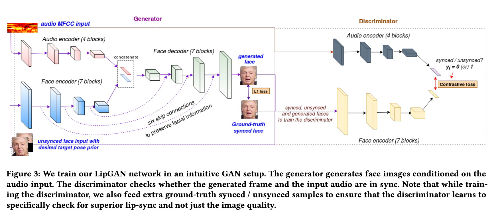
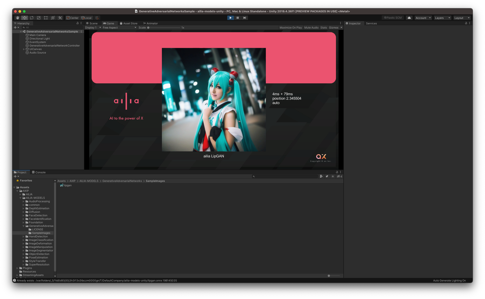

# LipGAN : リップシンク動画を生成する機械学習モデル

# LipGAN : リップシンク動画を生成する機械学習モデル

[](https://kyakuno.medium.com/?source=post_page---byline--57511508eaff---------------------------------------)

[Kazuki Kyakuno](https://kyakuno.medium.com/?source=post_page---byline--57511508eaff---------------------------------------)

6 min read

·

Oct 3, 2023

--

Share

リップシンク動画を生成する機械学習モデルであるLipGANのご紹介です。LipGANを使用することで、音声と動画からリップシンク動画を生成することが可能です。

## LipGANの概要

LipGANはリップシンク動画を生成する機械学習モデルです。2019年10月に公開されました。音声ファイルと動画ファイル、もしくは静止画を入力として、音声に合わせてリップシンクする動画を出力することが可能です。LipGANはWav2Lipの前バージョンで、Wav2Lipに比べて使用しやすいライセンス（MIT）となっています。分野としてはTalkingFaceGenerationとなります。

[## GitHub - Rudrabha/LipGAN: This repository contains the codes for LipGAN. LipGAN was published as a…

### This repository contains the codes for LipGAN. LipGAN was published as a part of the paper titled "Towards Automatic…

github.com](https://github.com/Rudrabha/LipGAN?source=post_page-----57511508eaff---------------------------------------)

[## Towards Automatic Face-to-Face Translation

### The Centre for Visual Information Technology (CVIT) is a research centre at the International Institute of Information…

cvit.iiit.ac.in](https://cvit.iiit.ac.in/research/projects/cvit-projects/facetoface-translation?source=post_page-----57511508eaff---------------------------------------)

## LipGANのアーキテクチャ

LipGANでは、音声ファイルを入力として、MFCCを計算し、Audio Encoderに通すとともに、顔画像からFace EncoderでEmbeddingを計算、それらの特徴を合わせてFace Decoderに通すことで出力画像を得ます。

Press enter or click to view image in full size



LipGANのアーキテクチャ（出典：<https://cdn.iiit.ac.in/cdn/cvit.iiit.ac.in/images/Projects/facetoface_translation/paper.pdf>）

実装はKerasで行われています。顔検出にはDlibを使用しています。

MFCCの計算はオリジナルではMatlabを使用していましたが、fully\_pythonicブランチで[librosa](https://github.com/Rudrabha/LipGAN/blob/fully_pythonic/audio.py)を使用したMelSpecturmを使用したバージョンも公開されています。

顔画像の入力は96x96画素で6channelです。最初の3channelにはBGR順で0–1のレンジの顔画像を、後半の3channelには顔の下半分を0で埋めた画像を与えます。 出力は96x96画素で3channelです。


LipGANの入力1、LipGANの入力2、LipGANの出力

音声の入力は、オーバラップした27要素（337ms相当）のMelSpectrumです。

## Get Kazuki Kyakuno’s stories in your inbox

Join Medium for free to get updates from this writer.

Subscribe

Subscribe

Remember me for faster sign in

デフォルトの生成フレームレートは25fpsです。処理はフレーム独立となっています。

## LipGANのデータセット

LipGANの学習では、LRS2 datasetを使用しています。LRS2 datasetには、29時間のtalking facesのデータが含まれています。

[## Lip Reading Sentences 2 (LRS2) dataset

### The dataset consists of thousands of spoken sentences from BBC television. Each sentences is up to 100 characters in…

www.robots.ox.ac.uk](https://www.robots.ox.ac.uk/~vgg/data/lip_reading/lrs2.html?source=post_page-----57511508eaff---------------------------------------)

## LipGANの使用方法

ailia SDKを使用することで、下記のコマンドで、input.jpgとinput.wavからリップシンク動画のoutput.mp4を出力可能です。

```
$ python3 lipgan.py --input input.jpg --audio input.wav --savepath output.mp4
```

ffmpegが必要ですが、音声付きの動画を生成する場合は、merge\_audioオプションを使用します。

```
$ python3 lipgan.py --input input.jpg --audio input.wav --savepath output.mp4 --merge_audio
```


LipGANの出力例

LipGANの出力は96x96画素のため、顔が大きい場合にぼやけるという課題があります。realesrganオプションを使用することで超解像を併用することも可能です。

```
$ python3 lipgan.py --input input.jpg --audio input.wav --savepath output.mp4 --realesrgan
```

## UnityからLipGANを使用する

Unityとailia SDKを使用して、AudioClipと静止画、もしくはビデオからLipGANを使用してリップシンクを行うサンプルを提供しています。

Press enter or click to view image in full size



LipGANをUnityで使用する例

[## ailia-models-unity/Assets/AXIP/AILIA-MODELS/GenerativeAdversarialNetworks at master ·…

### Unity version of ailia models repository. Contribute to axinc-ai/ailia-models-unity development by creating an account…

github.com](https://github.com/axinc-ai/ailia-models-unity/tree/master/Assets/AXIP/AILIA-MODELS/GenerativeAdversarialNetworks?source=post_page-----57511508eaff---------------------------------------)

ax株式会社はAIを実用化する会社として、クロスプラットフォームでGPUを使用した高速な推論を行うことができるailia SDKを開発しています。ax株式会社ではコンサルティングからモデル作成、SDKの提供、AIを利用したアプリ・システム開発、サポートまで、 AIに関するトータルソリューションを提供していますのでお気軽に[お問い合わせ](https://axinc.jp/)ください。