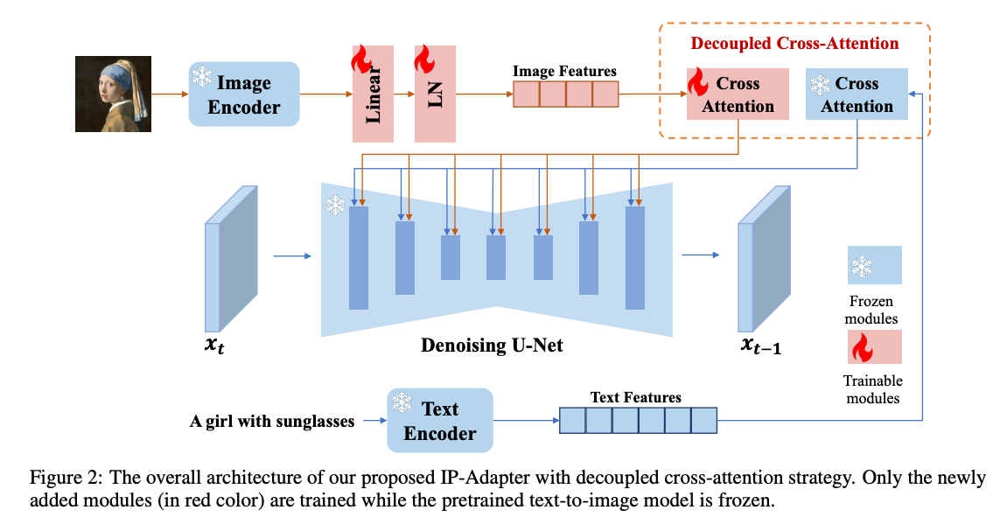
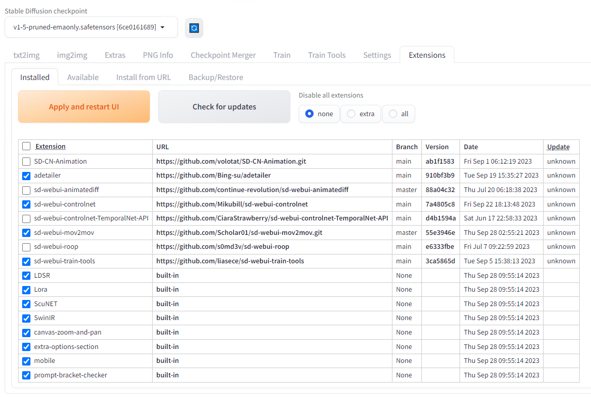
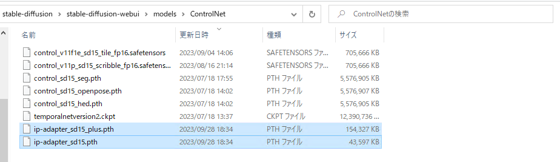
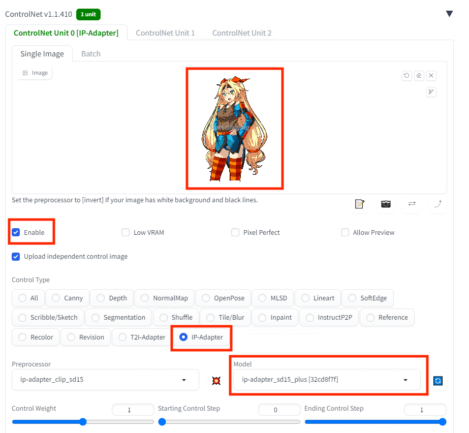
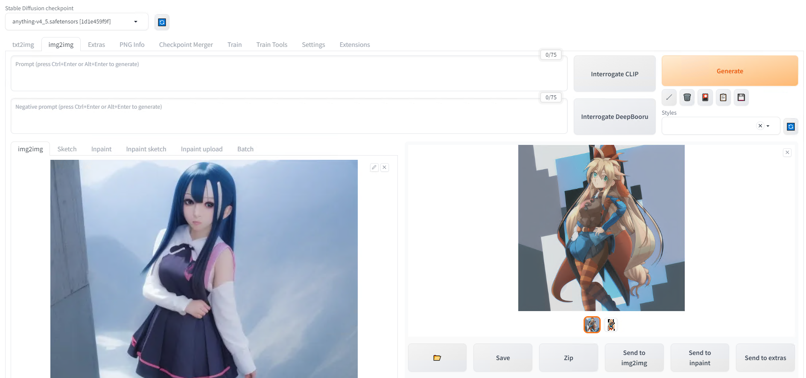
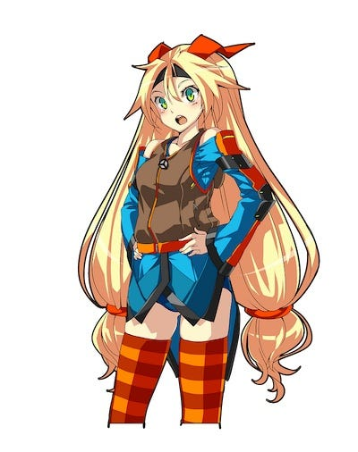
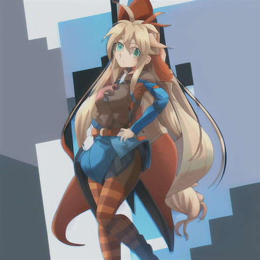
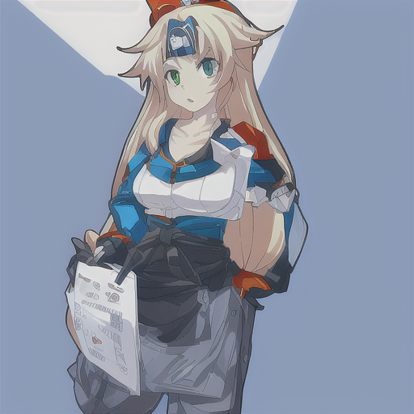

# IP AdapterとStable Diffusion WebUIを使用してキャラクターを固定した画像を生成する

# IP AdapterとStable Diffusion WebUIを使用してキャラクターを固定した画像を生成する

[](https://kyakuno.medium.com/?source=post_page---byline--878e9159869d---------------------------------------)

[Kazuki Kyakuno](https://kyakuno.medium.com/?source=post_page---byline--878e9159869d---------------------------------------)

7 min read

·

Oct 6, 2023

--

Share

IP AdapterとStable Diffusion WebUIを使用してキャラクターを固定した画像を生成する方法を解説します。

## IP Adapterの概要

IP Adapterは、キャラクターなどを固定した画像を生成する新しい手法になります。2023年8月にTencentにより発表されました。画像を入力として、画像を表すPromptを内部的に生成することで、1枚の参照画像を入力して、Reference Onlyよりも忠実度の高い画像を出力することが可能です。

[## GitHub - tencent-ailab/IP-Adapter: The image prompt adapter is designed to enable a pretrained…

### The image prompt adapter is designed to enable a pretrained text-to-image diffusion model to generate images with image…

github.com](https://github.com/tencent-ailab/IP-Adapter?source=post_page-----878e9159869d---------------------------------------)

[## IP-Adapter: Text Compatible Image Prompt Adapter for Text-to-Image Diffusion Models

### Recent years have witnessed the strong power of large text-to-image diffusion models for the impressive generative…

arxiv.org](https://arxiv.org/abs/2308.06721?source=post_page-----878e9159869d---------------------------------------)

## LoRAやReference Onlyとの違い

キャラクターを固定する方法として、従来、LoRAやReference Onlyが使用されていました。LoRAは少数の画像で再学習することで、キャラクターを固定します。Reference OnlyはControlNetに1枚の画像を与えることで、キャラクターを固定します。

CLIPのテキストプロンプトのEmbeddingがCross Attention LayerのKeyとValueに入力されるように、Stable Diffusionの画風はAttention LayerのKeyとValueにどのような値を入れるかで決まります。

Attention LayerのKeyとValueはテーブル参照のようなもので、QueryとKeyを内積したものにValueを乗算するので、QueryとKeyの距離が近いものに対応するValueが出力されます。これは、Queryを入力としてValueを出力するテーブル参照のようなものです。そのため、Valueを特定のキャラクターの画像の特徴ベクトルの集合のようなものにすれば、特定のキャラクターが生成されやすくなります。

LoRAはAttention LayerのKeyとValueを学習で書き換えることで、キャラクターを固定します。Reference Onlyは、入力画像を推論した際のSelf Attention LayerのKeyとValueを、ターゲットのSelf Attention LayerのKeyとValueを上書きすることで、キャラクターを固定します。

今回のIP Adapterは、従来、テキストのPromptを入力して、テキストをEmbeddingして、Cross Attention LayerのKeyとValueに与えていたところを、画像を入力して、画像をEmbeddingして、Cross Attention LayerのKeyとValueに変換する仕組みになっています。

Press enter or click to view image in full size



IP Adapterの概要（出典：<https://arxiv.org/abs/2308.06721>）

実体としては、画像に対応する正確なテキストのPromptを出力していることと等価になります。おそらく、IP AdapterのIはImageで、PはPromptを示しているものと思われます。IP AdapterとIP Adapter Plusの違いは、画像のEmbeddingのネットワークの違いになります。Plusの方が、より深いネットワークになっています。

## Get Kazuki Kyakuno’s stories in your inbox

Join Medium for free to get updates from this writer.

Subscribe

Subscribe

Remember me for faster sign in

Stable Diffusionにおいて、各モジュールがどのように作用するかについて、下記のBLOGが非常にまとまっています。

[## Stable Diffusionの画像条件付けまとめ｜gcem156

### Stable Diffusionの画像生成を画像によって条件づける方法をまとめていきます。といっても実装とかを全部見たわけではないので、多少間違っている部分もあるかもしれませんが、まあイメージはあってるっしょ。 手法の分類…

note.com](https://note.com/gcem156/n/n8db22e841673?source=post_page-----878e9159869d---------------------------------------)

## IP Adapterのインストール

StableDiffusionWebUIのExtensionを最新版にアップデートします。

```
https://github.com/Mikubill/sd-webui-controlnet  
main  
7a4805c8  
Fri Sep 22 18:13:48 2023
```

Press enter or click to view image in full size



モデルをダウンロードし、models/ControlNetフォルダに配置します。

```
ip-adapter_sd15.pth  
ip-adapter_sd15_plus.pth
```

[## lllyasviel/sd\_control\_collection at main

### We're on a journey to advance and democratize artificial intelligence through open source and open science.

huggingface.co](https://huggingface.co/lllyasviel/sd_control_collection/tree/main?source=post_page-----878e9159869d---------------------------------------)

Press enter or click to view image in full size



## IP Adapterの利用

ControlNetでIP-Adapterを選択し、参照画像を設定します。

Press enter or click to view image in full size



今回はimg2imgで生成します。

Press enter or click to view image in full size



img2imgの入力画像です。


入力画像

IP Adapterの参照画像です。この画像からテキストPromptが内部的に生成されるイメージです。



参照画像となるUnityChan（© Unity Technologies Japan/UCL）

出力画像です。img2imgの入力画像の特徴を残しつつ、IP Adapterで指定したキャラクターが出力されます。



IP Adapterの出力画像

比較用にReferenceOnlyを使用した場合の出力画像です。ReferenceOnlyよりも、IP Adapterの方が忠実度が高いことがわかります。



Reference Onlyの出力画像

## まとめ

IP Adapterを使用することで、Reference Onlyよりも高精度にキャラクターを固定できることを確認しました。

ax株式会社はAIを実用化する会社として、クロスプラットフォームでGPUを使用した高速な推論を行うことができるailia SDKを開発しています。ax株式会社ではコンサルティングからモデル作成、SDKの提供、AIを利用したアプリ・システム開発、サポートまで、 AIに関するトータルソリューションを提供していますのでお気軽に[お問い合わせ](https://axinc.jp/)ください。