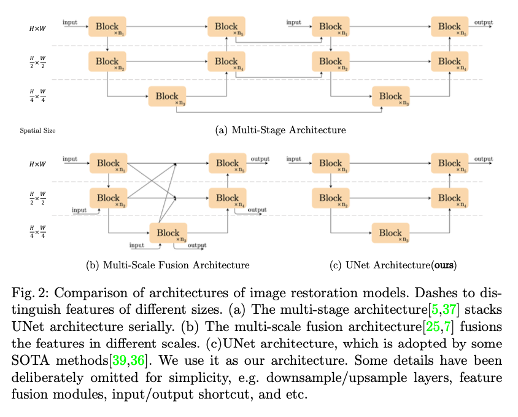

# NAFNET : 画像のブラーを除去する機械学習モデル

# NAFNET : 画像のブラーを除去する機械学習モデル

[](https://kyakuno.medium.com/?source=post_page---byline--b8547fd67597---------------------------------------)

[Kazuki Kyakuno](https://kyakuno.medium.com/?source=post_page---byline--b8547fd67597---------------------------------------)

7 min read

·

Dec 13, 2023

--

Share

画像のブラーを除去する機械学習モデルであるNAFNETのご紹介です。

## NAFNETの概要

NAFNETは中国のMEGVII Technologyによって2022年4月に公開されたImage Restorationのベースラインとなるモデルです。画像からのデブラーとデノイズに対応しています。

Press enter or click to view image in full size


ブラー画像（出典：https://github.com/megvii-research/NAFNet/blob/main/demo/denoise\_img.png）

Press enter or click to view image in full size


モデルの出力（出典：https://github.com/megvii-research/NAFNet/blob/main/demo/denoise\_img.png）

[## Simple Baselines for Image Restoration

### Although there have been significant advances in the field of image restoration recently, the system complexity of the…

arxiv.org](https://arxiv.org/abs/2204.04676?source=post_page-----b8547fd67597---------------------------------------)

[## GitHub - megvii-research/NAFNet: The state-of-the-art image restoration model without nonlinear…

### The state-of-the-art image restoration model without nonlinear activation functions. - GitHub - megvii-research/NAFNet…

github.com](https://github.com/megvii-research/nafnet?source=post_page-----b8547fd67597---------------------------------------)

## NAFNETのアーキテクチャ

NAFNETは、画像修復のためのベースラインを構築するための計算効率の良いシンプルなベースラインを提案しています。

そのために、ReLUやGELUなどの非線形活性化関数を除去した、シンプルなNonlinear Activation Free Network (NAFNet)を提案しています。これにより、従来の半分の計算コストで、高い性能を発揮しています。

BatchNormalizationは、小さなバッチサイズで不安定になる問題があるため、Transformerでよく使用されているLayer Normalizationを使用します。

## Get Kazuki Kyakuno’s stories in your inbox

Join Medium for free to get updates from this writer.

Subscribe

Subscribe

Remember me for faster sign in

モデルアーキテクチャです。従来使用されていたGELUを、シンプルな乗算に置き換えています。また、Layer Normalizationを使用しています。

Press enter or click to view image in full size


NAFNETのアーキテクチャ（出典：<https://arxiv.org/abs/2204.04676>）

モデル構造はUNetを使用しています。

Press enter or click to view image in full size



NAFNETのアーキテクチャ（出典：<https://arxiv.org/abs/2204.04676>）

バッチサイズは64、エポック数は400Kを使用、ランダムクロップを使用した学習されています。

## NAFNETの精度

NAFNETでは、画像のデブラーのためにGoProおよびREDSのデータセットを、画像ノイズ除去のためにSIDDデータセットを使用します。NAFNETは、従来技術よりも少ない演算量（MACs）で高い画質（PSNR）を獲得しています。

Press enter or click to view image in full size


画像のデブラーの例です。強いブラーが除去できていることがわかります。

Press enter or click to view image in full size


NAFNETの出力（出典：<https://arxiv.org/abs/2204.04676>）

画像のデノイズの例です。

Press enter or click to view image in full size


NAFNETの出力（出典：<https://arxiv.org/abs/2204.04676>）

## NAFNETのモデルの種類

NAFNETには、学習に使用したデータセットに応じて、複数のモデルが存在します。widthはレイヤーブロックの積層数を示し、32よりも64の方が負荷が高い分、性能も高くなっています。また、REDSデータセットで学習されたモデルを使用した場合、JPEGのノイズも除去されます。

Press enter or click to view image in full size


モデルの種類（出典：<https://github.com/megvii-research/NAFNet/tree/main>）

## NAFNETの使用方法

ailia SDKでデブラーのモデルを使用するには下記のように実行します。

```
python3 nafnet.py --arch NAFNet-REDS-width64 -i input.jpg
```

デノイズのモデルを実行するには下記のように実行します。

```
python3 nafnet.py --arch NAFNet-SIDD-width32 -i input.jpg
```

モデルアーキテクチャは下記から選択可能です。

```
BLUR_LISTS = ['Baseline-GoPro-width32' ,'NAFNet-GoPro-width32', 'NAFNet-REDS-width64', 'Baseline-GoPro-width64','NAFNet-GoPro-width64']  
NOISE_LISTS = ['Baseline-SIDD-width32', 'NAFNet-SIDD-width64', 'Baseline-SIDD-width64' ,'NAFNet-SIDD-width32']
```

[## ailia-models/image\_restoration/nafnet at master · axinc-ai/ailia-models

### The collection of pre-trained, state-of-the-art AI models for ailia SDK - ailia-models/image\_restoration/nafnet at…

github.com](https://github.com/axinc-ai/ailia-models/tree/master/image_restoration/nafnet?source=post_page-----b8547fd67597---------------------------------------)

## WEBカメラでのテスト

実際に、WEBカメラの前でiPhoneを激しく動かすような手ブレに対しても、有効に動作しました。そのため、一般的な用途でも効果がありそうです。

```
python3 nafnet.py --arch NAFNet-REDS-width64 -i iphone.jpg
```


入力画像


出力画像

ax株式会社はAIを実用化する会社として、クロスプラットフォームでGPUを使用した高速な推論を行うことができるailia SDKを開発しています。ax株式会社ではコンサルティングからモデル作成、SDKの提供、AIを利用したアプリ・システム開発、サポートまで、 AIに関するトータルソリューションを提供していますのでお気軽に[お問い合わせ](https://axinc.jp/)ください。