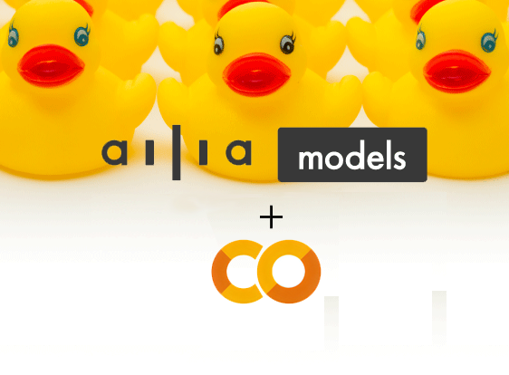
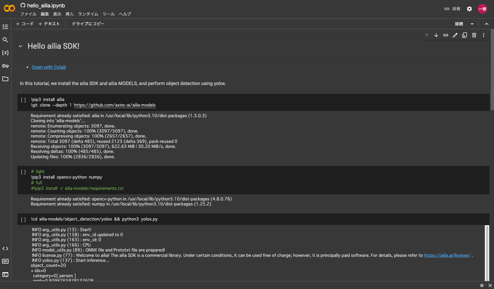
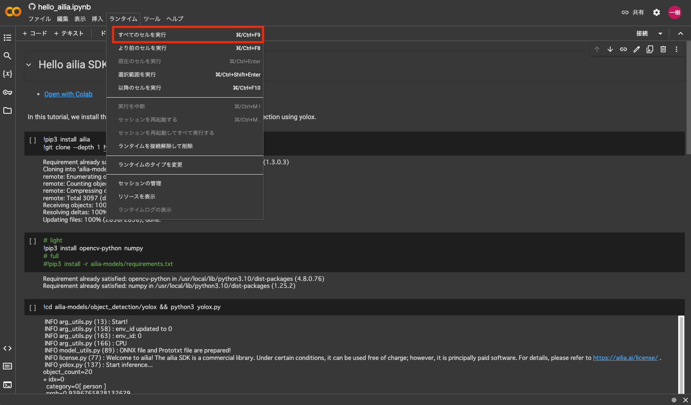
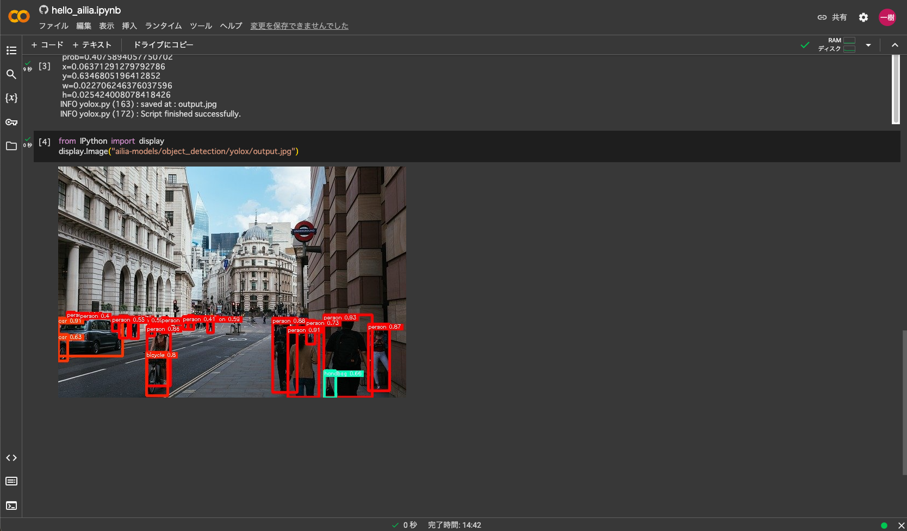
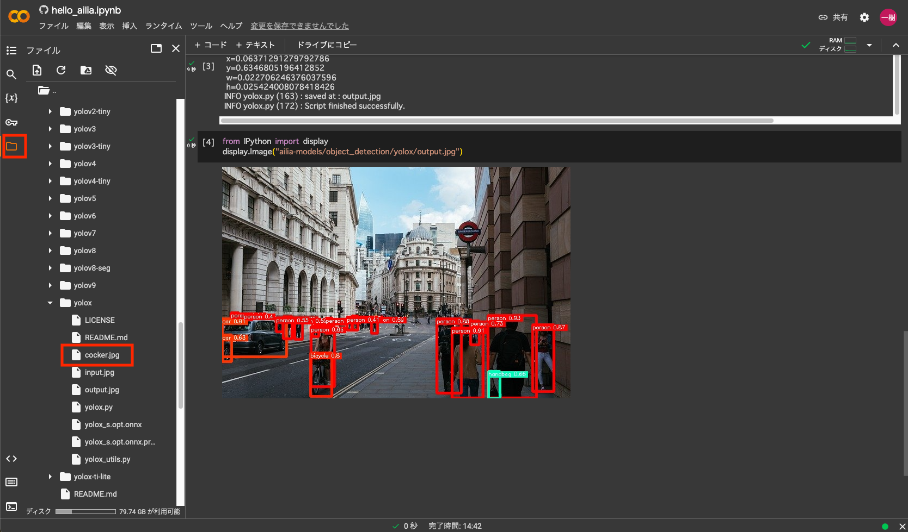
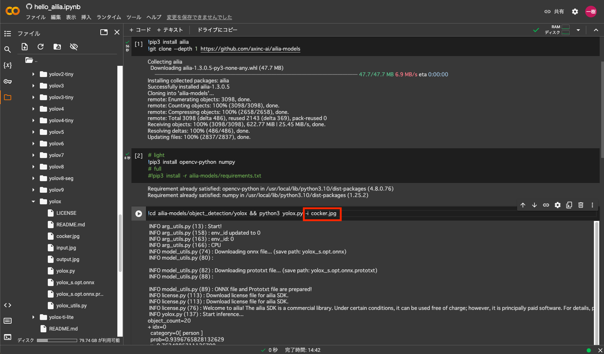
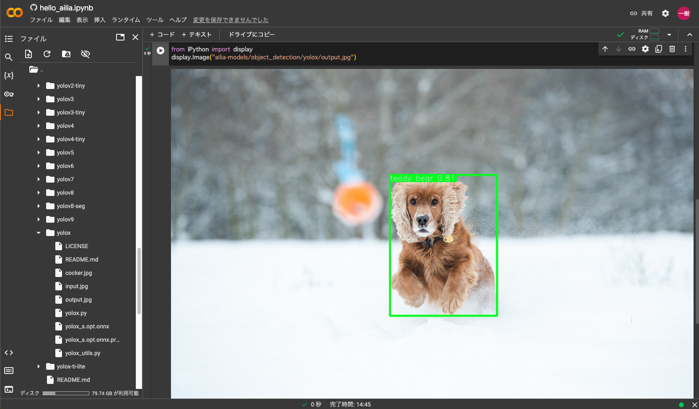
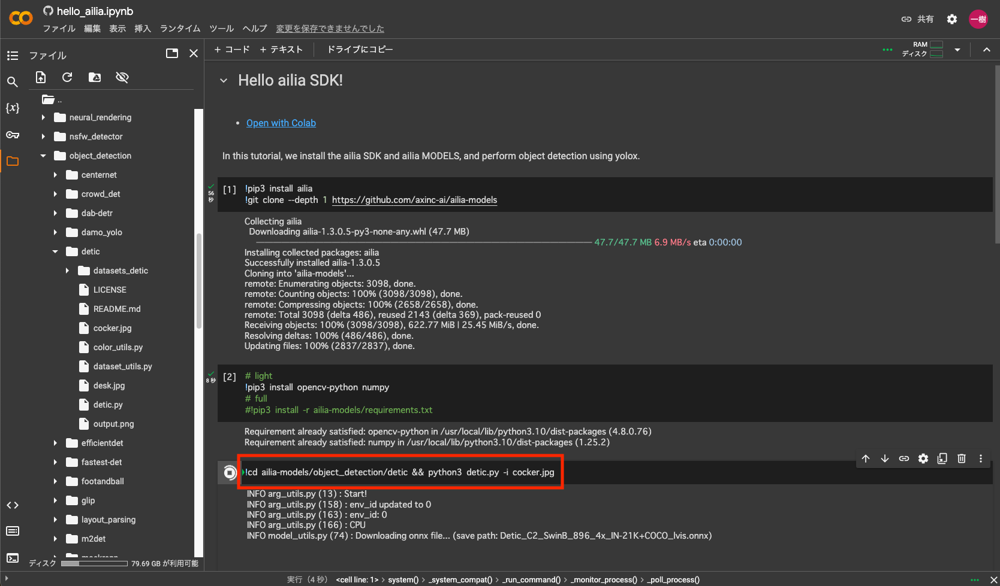
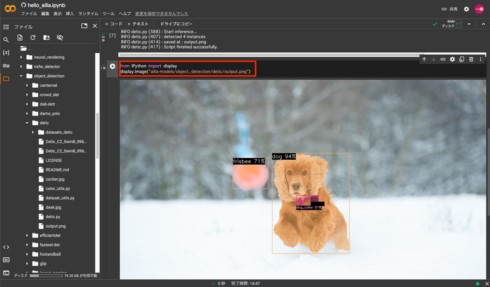
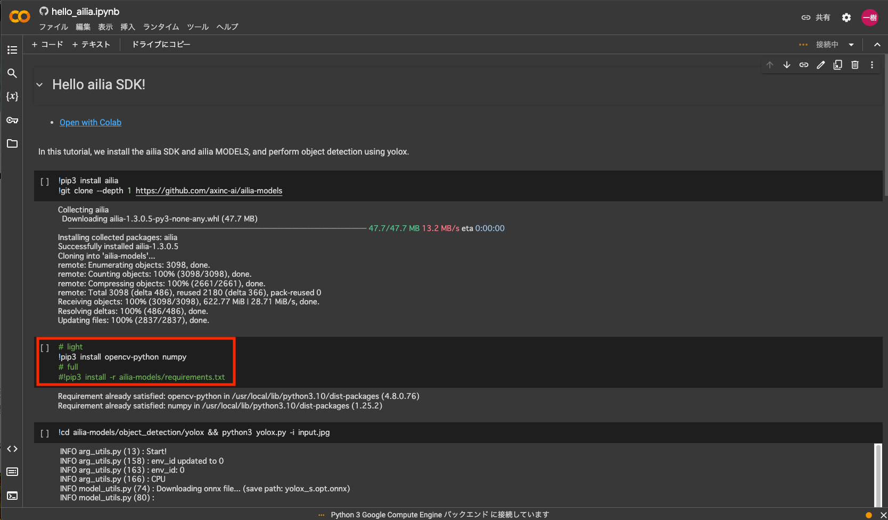

# Google Colaboratoryとailia MODELSを使用してブラウザだけでAI処理を行う

# Google Colaboratoryとailia MODELSを使用してブラウザだけでAI処理を行う

[Kazuki Kyakuno](https://kyakuno.medium.com/?source=post_page---byline--230222eace55---------------------------------------)

Apr 15, 2024

--

Share

Google Colaboratoryとailia MODELSを使用してブラウザだけで簡単にAI処理を実行する方法を解説します。

ailia models x google colaboratory

## Google Colaboratoryについて

Google Colaboratoryはブラウザ上でPythonを実行できる仮想環境です。無料でサーバ上でAIモデルを実行することが可能です。

## ailia MODELSについて

ailia MODELSはax株式会社の提供するAIモデルのライブラリです。300種類以上のモデルをAI使用して、さまざまなAI処理を実行することが可能です。

[## GitHub - axinc-ai/ailia-models: The collection of pre-trained, state-of-the-art AI models for ailia…

### The collection of pre-trained, state-of-the-art AI models for ailia SDK - axinc-ai/ailia-models

github.com](https://github.com/axinc-ai/ailia-models?source=post_page-----230222eace55---------------------------------------)

## Google Colaboratoryとailia MODELSとの連携について

ailia MODELSにはGoogle Colaboratory向けのサンプルプログラムが含まれています。これを使用することで、簡単にGoogle Colaboratory上でAI処理を実行可能です。

## Google ColaboratoryでのAIモデルの実行

下記のURLからサンプルプログラムを開きます。

[## Google Colaboratory

### Edit description

colab.research.google.com](https://colab.research.google.com/github/axinc-ai/ailia-models/blob/master/hello_ailia.ipynb?source=post_page-----230222eace55---------------------------------------)

起動すると下記の画面になります。

Press enter or click to view image in full size

起動画面

ウィンドウメニューから全てのセルを実行を選択します。

Press enter or click to view image in full size

AI処理の実行

処理に必要なailia SDKとailia MODELSをダウンロードし、AI処理を行い、AI処理結果が表示されます。

Press enter or click to view image in full size

Ai処理結果

## Get Kazuki Kyakuno’s stories in your inbox

Join Medium for free to get updates from this writer.

Subscribe

Subscribe

Remember me for faster sign in

## Google Colaboratoryで他の画像を使用する

他の画像で推論するには、Google Colaboratoryのファイルメニューから、ailia-models/object\_detection/yoloxを選択し、画像をドロップしてアップロードします。

Press enter or click to view image in full size

ファイルのアップロード

今回はPixabayの下記の画像をcocker.jpgとしてアップロードしました。

Press enter or click to view image in full size

入力画像（出典：<https://pixabay.com/ja/photos/%E3%82%B3%E3%83%83%E3%82%AB%E3%83%BC-%E3%82%B9%E3%83%91%E3%83%8B%E3%82%A8%E3%83%AB-%E7%8A%AC-5996316/>）

スクリプトのinput.jpgをアップロードしたファイル名のcocker.jpgに変更します。

Press enter or click to view image in full size

入力ファイル名の変更

この行の再生ボタンを押して実行した後、次の画像表示の行の再生ボタンを押すと、結果が表示されます。

Press enter or click to view image in full size

cocker.jpgに変更したyoloxの出力結果

## Google Colaboratoryで他のモデルを使用する

ailia-models/object\_detection/yolox && python3 yolox.pyの部分を別のモデルに変えることで、他のモデルも実行可能です。今回は、ailia-models/object\_detection/detic && python3 detic.pyを使用します。前回と同様に、cocker.jpgをアップロードしておきます。使用するコマンドは下記です。

> cd ailia-models/object\_detection/detic && python3 detic.py -i cocker.jpg

Press enter or click to view image in full size

Deticの実行コマンドに変更

この実行結果を見ると、このモデルの出力ファイル名はoutput.pngとなっています。出力のファイル名を、ailia-models/object\_detection/detic/output.pngに変更して実行すると、結果が表示されます。

Press enter or click to view image in full size

Deticの実行結果

## 全ての依存ライブラリのインストール

デフォルトでは、opencv-pythonとnumpyのみをインストールしています。実行時にエラーが発生した場合は、pip3 install -r ailia-models/requirements.txtをコメントアウトして実行してください。

Press enter or click to view image in full size

全ての依存ライブラリのインストール

ax株式会社はAIを実用化する会社として、クロスプラットフォームでGPUを使用した高速な推論を行うことができるailia SDKを開発しています。ax株式会社ではコンサルティングからモデル作成、SDKの提供、AIを利用したアプリ・システム開発、サポートまで、 AIに関するトータルソリューションを提供していますのでお気軽に[お問い合わせ](https://axinc.jp/)ください。