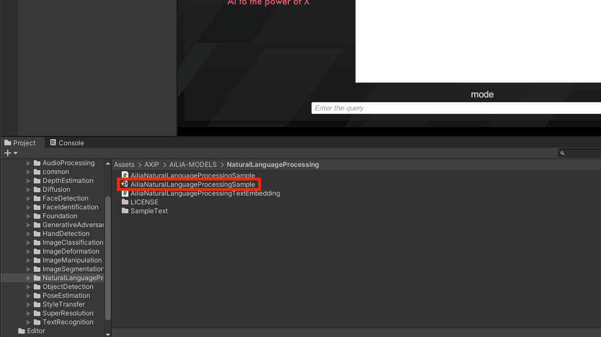
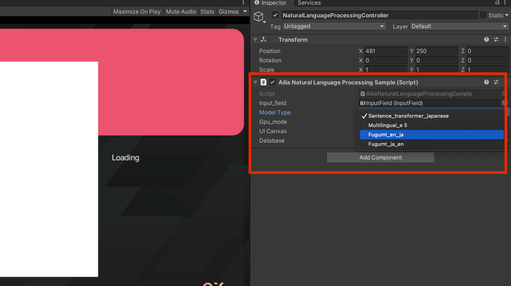

# ailia SDKのインストール方法

# ailia SDKのインストール方法

[](https://kyakuno.medium.com/?source=post_page---byline--ad66647de967---------------------------------------)

[Kazuki Kyakuno](https://kyakuno.medium.com/?source=post_page---byline--ad66647de967---------------------------------------)

9 min read

·

May 31, 2024

--

Share

ailia SDKのインストール方法と、サンプルの実行方法を解説します。Python、Unity、Flutter、C++について順番に説明します。

## ailia SDKについて

ailia SDKはクロスプラットフォームのAI推論ライブラリです。ailia SDKと、ailia MODELSを使用して、簡単にアプリケーションにAI機能を組み込むことが可能です。

Press enter or click to view image in full size


## プラットフォーム別のインストール方法

### Python

Pythonのインストールされている環境で下記のコマンドを実行し、ailia SDKをインストールします。

```
pip3 install ailia
```

ailia MODELSのリポジトリをCloneします。

```
git clone https://github.com/ailia-ai/ailia-models.git
```

[## GitHub - axinc-ai/ailia-models: The collection of pre-trained, state-of-the-art AI models for ailia…

### The collection of pre-trained, state-of-the-art AI models for ailia SDK - axinc-ai/ailia-models

github.com](https://github.com/axinc-ai/ailia-models?source=post_page-----ad66647de967---------------------------------------)

依存ライブラリをインストールします。

```
pip3 install -r requirements.txt
```

ランチャーを起動します。

```
python3 launchar.py
```

実行したいモデルを選択し、Run modelボタンを押すと、モデルを実行可能です。

Press enter or click to view image in full size


チュートリアルは下記となります。

[## ailia SDK チュートリアル(Python)

### ailia SDKをPythonで使用するチュートリアルです。Pythonを使用することで様々なモデルの動作を簡単に試すことができます。

medium.com](https://medium.com/axinc/ailia-sdk-%E3%83%81%E3%83%A5%E3%83%BC%E3%83%88%E3%83%AA%E3%82%A2%E3%83%AB-python-28379dbc9649?source=post_page-----ad66647de967---------------------------------------)

ブラウザだけで使用することも可能です。

[## Google Colaboratoryとailia MODELSを使用してブラウザだけでAI処理を行う

### Google Colaboratoryとailia MODELSを使用してブラウザだけで簡単にAI処理を実行する方法を解説します。

medium.com](https://medium.com/axinc/google-colaboratory%E3%81%A8ailia-models%E3%82%92%E4%BD%BF%E7%94%A8%E3%81%97%E3%81%A6%E3%83%96%E3%83%A9%E3%82%A6%E3%82%B6%E3%81%A0%E3%81%91%E3%81%A7ai%E5%87%A6%E7%90%86%E3%82%92%E8%A1%8C%E3%81%86-230222eace55?source=post_page-----ad66647de967---------------------------------------)

### Unity

ailia MODELS UnityのリポジトリをCloneします。

```
git clone https://github.com/ailia-ai/ailia-models-unity.git
```

[## GitHub - axinc-ai/ailia-models-unity: Unity version of ailia models repository

### Unity version of ailia models repository. Contribute to axinc-ai/ailia-models-unity development by creating an account…

github.com](https://github.com/axinc-ai/ailia-models-unity?source=post_page-----ad66647de967---------------------------------------)

Unityで開いて実行します。Package Manager経由で自動的にailia SDKがダウンロードされます。

sceneはカテゴリ別に格納されています。

Press enter or click to view image in full size



sceneを開いた後、AIモデルはControllerのInspectorで変更可能です。

Press enter or click to view image in full size



sceneを実行します。

Press enter or click to view image in full size


音声認識の実行例

チュートリアルは下記となります。

[## ailia SDKがUnity Package Managerでインストール可能に

### ailia SDKのUnity Package Managerでの提供を開始しました。これにより、従来よりも簡単にailia SDKをUnityのアプリケーションに取り込むことが可能になります。

medium.com](https://medium.com/axinc/ailia-sdk%E3%81%8Cunity-package-manager%E3%81%A7%E3%82%A4%E3%83%B3%E3%82%B9%E3%83%88%E3%83%BC%E3%83%AB%E5%8F%AF%E8%83%BD%E3%81%AB-0ecce0f2ab38?source=post_page-----ad66647de967---------------------------------------)

### Flutter

ailia MODELS FlutterのリポジトリをCloneします。

```
git clone https://github.com/ailia-ai/ailia-models-flutter.git
```

[## GitHub - axinc-ai/ailia-models-flutter: ONNX Model Library for Flutter

### ONNX Model Library for Flutter. Contribute to axinc-ai/ailia-models-flutter development by creating an account on…

github.com](https://github.com/axinc-ai/ailia-models-flutter?source=post_page-----ad66647de967---------------------------------------)

VSCodeでプロジェクトを開き、flutter pub getを実行します。pubspec.yaml経由で自動的にailia SDKがダウンロードされます。

## Get Kazuki Kyakuno’s stories in your inbox

Join Medium for free to get updates from this writer.

Subscribe

Subscribe

Remember me for faster sign in

サンプルを実行して、モデルを選択し、プラスボタンでAIを実行します。

Press enter or click to view image in full size


モデルの選択

Press enter or click to view image in full size


Whisperの実行例

チュートリアルは下記となります。

[## ailia SDKがFlutterのpubspecからインストール可能に

### ailia SDKがFlutterのpubspecを使用したインストールに対応しました。これにより、Flutterのアプリケーションに簡単にailia SDKを取り込み可能です。

medium.com](https://medium.com/axinc/ailia-sdk%E3%81%8Cflutter%E3%81%AEpubspec%E3%81%8B%E3%82%89%E3%82%A4%E3%83%B3%E3%82%B9%E3%83%88%E3%83%BC%E3%83%AB%E5%8F%AF%E8%83%BD%E3%81%AB-f008229f7862?source=post_page-----ad66647de967---------------------------------------)

### C++

ailia MODELS cppのリポジトリをCloneします。

```
git clone https://github.com/ailia-ai/ailia-models-cpp.git
```

[## GitHub - axinc-ai/ailia-models-cpp: C++ version of ailia models repository

### C++ version of ailia models repository. Contribute to axinc-ai/ailia-models-cpp development by creating an account on…

github.com](https://github.com/axinc-ai/ailia-models-cpp?source=post_page-----ad66647de967---------------------------------------)

ailia SDKをsubmodule経由でダウンロードします。

```
git subomdule init  
git submodule update
```

ailia SDKのライセンスファイルをダウンロードします。

```
cd ailia  
python3 download_license.py
```

macOSの場合、brewでcmakeとopencvをインストールします。

```
brew install cmake  
brew install opencv
```

ビルドします。

```
cmake .  
cmake --build .
```

実行します。

```
cd object_detection/yolox  
./yolox.sh
```

-v 0オプションを付与すると、WEBカメラも使用可能です。

```
cd object_detection/yolox  
./yolox.sh -v 0
```

## 追加情報

### ailia SDKのライセンス

ailia SDKのライセンス情報は下記を参照ください。

[## ailia SDK License

### ailia SDK License Information [Japanese] [English] About license 【使用上のご注意】…

ailia.ai](https://ailia.ai/license/?source=post_page-----ad66647de967---------------------------------------)

### その他の環境向け

Rust、MSVC C#、Kotlin向けのサンプルは下記を参照してください。

Rust

[## GitHub - axinc-ai/ailia-models-rust

### Contribute to axinc-ai/ailia-models-rust development by creating an account on GitHub.

github.com](https://github.com/axinc-ai/ailia-models-rust?source=post_page-----ad66647de967---------------------------------------)

MSVC C#

[## GitHub - axinc-ai/ailia-csharp: ailia SDK example for Visual Studio C#

### ailia SDK example for Visual Studio C#. Contribute to axinc-ai/ailia-csharp development by creating an account on…

github.com](https://github.com/axinc-ai/ailia-csharp?source=post_page-----ad66647de967---------------------------------------)

Kotlin

[## GitHub - axinc-ai/ailia-android-studio-kotlin: Sample project of kotlin

### Sample project of kotlin. Contribute to axinc-ai/ailia-android-studio-kotlin development by creating an account on…

github.com](https://github.com/axinc-ai/ailia-android-studio-kotlin?source=post_page-----ad66647de967---------------------------------------)

### cuDNNの利用

ailia SDKは初期状態でVulkanを使用したGPU推論が可能です。NVIDIAの環境でCUDAを使用したい場合は、下記の手順に従ってCUDAとcuDNNをインストールしてください。

[## Windows PCにCUDA ToolkitとcuDNNを導入する

### Windows PCにCUDA ToolkitとcuDNNを導入する方法を解説します。

medium.com](https://medium.com/axinc/windows-pc%E3%81%ABcuda-toolkit%E3%81%A8cudnn%E3%82%92%E5%B0%8E%E5%85%A5%E3%81%99%E3%82%8B-2018c8edb2db?source=post_page-----ad66647de967---------------------------------------)

ax株式会社はAIを実用化する会社として、クロスプラットフォームでGPUを使用した高速な推論を行うことができるailia SDKを開発しています。ax株式会社ではコンサルティングからモデル作成、SDKの提供、AIを利用したアプリ・システム開発、サポートまで、 AIに関するトータルソリューションを提供していますのでお気軽に[お問い合わせ](https://axinc.jp/)ください。