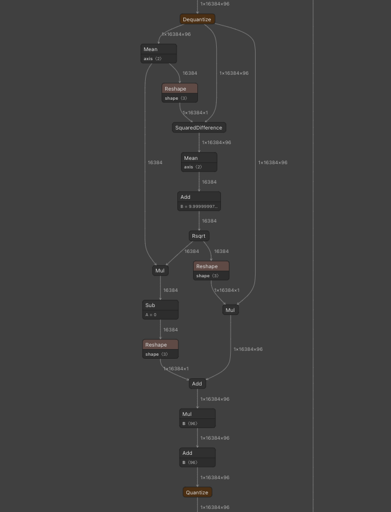
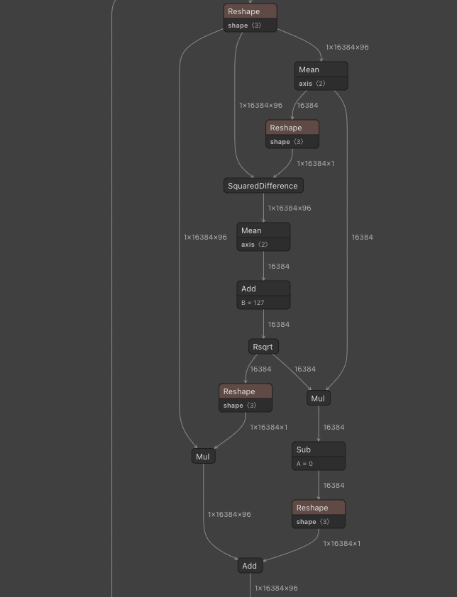
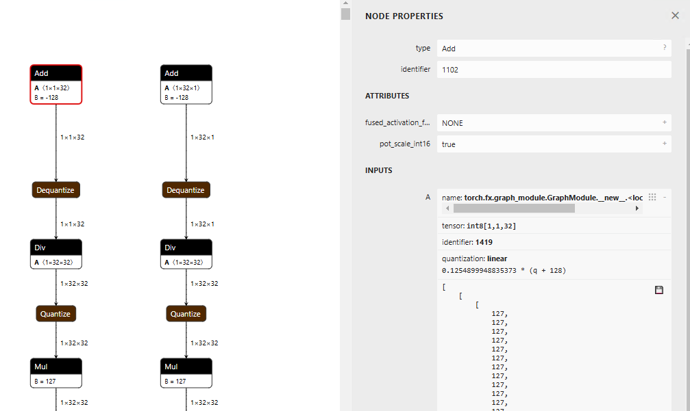

# ai-edge-torchでPytorchからtfliteに変換する

# ai-edge-torchでPytorchからtfliteに変換する

[](https://kyakuno.medium.com/?source=post_page---byline--376be7dc5619---------------------------------------)

[Kazuki Kyakuno](https://kyakuno.medium.com/?source=post_page---byline--376be7dc5619---------------------------------------)

26 min read

·

Aug 13, 2024

--

Share

ai-edge-torchを使用して、Pytorchからダイレクトにtfliteを出力する方法を解説します。

## ai-edge-torchについて

ai-edge-torchはGoogleが開発し、2024年5月に公開された、Pytorchからtfliteを出力するためのツールキットです。

Press enter or click to view image in full size


出典：<https://developers.googleblog.com/ja/ai-edge-torch-high-performance-inference-of-pytorch-models-on-mobile-devices/>

[## GitHub - google-ai-edge/ai-edge-torch: Supporting PyTorch models with the Google AI Edge TFLite…

### Supporting PyTorch models with the Google AI Edge TFLite runtime. - google-ai-edge/ai-edge-torch

github.com](https://github.com/google-ai-edge/ai-edge-torch?source=post_page-----376be7dc5619---------------------------------------)

[## AI Edge Torch: モバイル デバイスでの PyTorch モデルの高速推論

### Released today, AI Edge Torch enables support for PyTorch, JAX, Keras, and Tensorflow with TFLite.

developers.googleblog.com](https://developers.googleblog.com/ja/ai-edge-torch-high-performance-inference-of-pytorch-models-on-mobile-devices/?source=post_page-----376be7dc5619---------------------------------------)

従来、Pytorchからtfliteを出力する場合、ONNXを経由し、onnx2tensorflowなどでsaved\_modelに変換し、tfliteに出力していました。

しかし、ONNXを経由する方法では、Pytorch標準のChannelFirstと、TensorFlow標準のChannelLastの変換で、Transposeが頻繁に挿入され、推論速度が低下するという課題がありました。また、ONNXからTensorFlowのsaved\_modelへの変換で、変換エラーが多く発生していました。

ai-edge-torchは、Pytorchから直接、tfliteを出力することで、これらの問題を解消します。

## ai-edge-torchのインストール

ai-edge-torchは、下記のコマンドでインストールします。

```
pip3 install ai-edge-torch
```

## ResNet18からtflite (float) への変換

ResNet18からFloatのtfliteを出力するには下記のようにします。Torchのモデルを、ai\_edge\_torch.convertに入力することで、tfliteへの変換が可能です。

```
import torch  
import torchvision  
import ai_edge_torch  
  
resnet18 = torchvision.models.resnet18(torchvision.models.ResNet18_Weights.IMAGENET1K_V1)  
sample_inputs = (torch.randn(1, 3, 224, 224),)  
edge_model = ai_edge_torch.convert(resnet18.eval(), sample_inputs)  
edge_model.export("resnet18.tflite")
```

出力されたモデルです。不要なTransposeがなく、非常に綺麗です。

Press enter or click to view image in full size


推論例です。正しく、時計を認識することができます。

```
=============================================================  
class_count=3  
+ idx=0  
  category=892[wall clock ]  
  prob=13.361162185668945  
  value=13.361162185668945  
+ idx=1  
  category=409[analog clock ]  
  prob=12.400266647338867  
  value=12.400266647338867  
+ idx=2  
  category=426[barometer ]  
  prob=10.935765266418457  
  value=10.935765266418457  
Script finished successfully.
```

## ResNet18からtflite (int8) への変換（量子化）

ai-edge-torchでは、量子化もサポートしています。量子化するには、pt2e\_quantizerを使用します。キャリブレーションは、prepare\_pt2eとconvert\_pt2eの間で推論することで行います。このサンプルでは、1枚の画像を使用しますが、実際にはキャリブレーション用の複数の画像で推論します。

```
import torch  
import torchvision  
import ai_edge_torch  
  
from ai_edge_torch.quantize import pt2e_quantizer  
from ai_edge_torch.quantize import quant_config  
from torch.ao.quantization import quantize_pt2e  
  
resnet18 = torchvision.models.resnet18(torchvision.models.ResNet18_Weights.IMAGENET1K_V1)  
sample_inputs = (torch.randn(1, 3, 224, 224),)  
  
quantizer = pt2e_quantizer.PT2EQuantizer().set_global(  
    pt2e_quantizer.get_symmetric_quantization_config()  
)  
model = torch._export.capture_pre_autograd_graph(resnet18, sample_inputs)  
model = quantize_pt2e.prepare_pt2e(model, quantizer)  
  
import cv2  
import numpy  
img = cv2.imread("clock.jpg")  
img = cv2.resize(img, (224, 224))  
img = numpy.expand_dims(img, 0)  
img = numpy.transpose(img, (0, 3, 1, 2))  
img = img / 255.0  
img = img.astype(numpy.float32)  
model(torch.from_numpy(img)) # calibration  
  
model = quantize_pt2e.convert_pt2e(model, fold_quantize=False)  
  
with_quantizer = ai_edge_torch.convert(  
    model,  
    sample_inputs,  
    quant_config=quant_config.QuantConfig(pt2e_quantizer=quantizer),  
)  
with_quantizer.export("resnet18_int8.tflite")
```

モデルの量子化はtorch.ao.quantizationが実行しています。ai-edge-torchは、Torchで量子化済みのモデルを、tfliteに変換します。

[## Quantization in PyTorch 2.0 Export Tutorial - PyTorch Tutorials 2.0.1+cu117 documentation

### Note Quantization in PyTorch 2.0 export is still a work in progress. Today we have FX Graph Mode Quantization which…

pytorch.org](https://pytorch.org/tutorials/prototype/quantization_in_pytorch_2_0_export_tutorial.html?source=post_page-----376be7dc5619---------------------------------------)

このサンプルは、下記のテストコードをベースに作成しました。

[## ai-edge-torch/test/test\_quantize.py at main · google-ai-edge/ai-edge-torch

### Supporting PyTorch models with the Google AI Edge TFLite runtime. - ai-edge-torch/test/test\_quantize.py at main ·…

github.com](https://github.com/google-ai-edge/ai-edge-torch/blob/main/test/test_quantize.py?source=post_page-----376be7dc5619---------------------------------------)

出力されたモデルです。入出力がint8になっています。

Press enter or click to view image in full size


推論例です。Floatと同様に、時計を正しく時計と認識可能です。

```
=============================================================  
class_count=3  
+ idx=0  
  category=892[wall clock ]  
  prob=13.09241008758545  
  value=123  
+ idx=1  
  category=409[analog clock ]  
  prob=12.106959342956543  
  value=109  
+ idx=2  
  category=426[barometer ]  
  prob=10.980731010437012  
  value=93
```

## 大規模なモデルの変換

ai-edge-torchは、LLMモデルの変換を想定して開発されたため、大規模なモデルも変換可能です。今回は、GFPGANを変換してみます。

[## GitHub - TencentARC/GFPGAN: GFPGAN aims at developing Practical Algorithms for Real-world Face…

### GFPGAN aims at developing Practical Algorithms for Real-world Face Restoration. - TencentARC/GFPGAN

github.com](https://github.com/TencentARC/GFPGAN?source=post_page-----376be7dc5619---------------------------------------)

Floatの変換のコード例です。

```
import torch  
import ai_edge_torch  
  
import os  
model_name = "GFPGANv1.3"  
model_path = os.path.join('experiments/pretrained_models', model_name + '.pth')  
upscale = 2  
arch = 'clean'  
channel_multiplier = 2  
from gfpgan import GFPGANer  
restorer = GFPGANer(  
    model_path=model_path,  
    upscale=upscale,  
    arch=arch,  
    channel_multiplier=channel_multiplier,  
    bg_upsampler=None,  
    device="cpu")  
model = restorer.gfpgan  
model.eval()  
  
sample_inputs = (torch.randn(1, 3, 512, 512),)  
edge_model = ai_edge_torch.convert(model, sample_inputs)  
edge_model.export("gfpgan_float.tflite")
```

Floatの出力です。tfliteはLeakyReluをサポートしていないので、Gather、Mul、Selectに変換されます。

Press enter or click to view image in full size


torch.randnはSTABLEHLO\_RNG\_BIT\_GENERATORという新しいオペレータに変換されます。そのため、TensorFlow 2.12.0だとエラーになります。TensorFlow 2.17.0だと正常に推論可能です。


GFPGANの入力画像（テスト画像：<https://github.com/TencentARC/GFPGAN/blob/master/inputs/whole_imgs/10045.png>）


GFPGANの出力画像（テスト画像：<https://github.com/TencentARC/GFPGAN/blob/master/inputs/whole_imgs/10045.png>）

## tflite変換のオプション

### Flexオペレータに対応する

Relu6など、TFLITE\_BUILDINには含まれておらず、Flexのオペレータが必要なものを変換しようとすると、下記のエラーが発生します。

```
Some ops are not supported by the native TFLite runtime, you can enable TF kernels fallback using TF Select. See instructions: https://www.tensorflow.org/lite/guide/ops_select  
TF Select ops: Relu6
```

その場合、\_ai\_edge\_converter\_flagsを使用することで、Flexのオペレータを有効にすることが可能です。

```
 import ai_edge_torch  
 import tensorflow as tf  
 sample_inputs = (input_image,)  
 tfl_converter_flags = {'target_spec': {'supported_ops': [tf.lite.OpsSet.TFLITE_BUILTINS, tf.lite.OpsSet.SELECT_TF_OPS]}}  
 edge_model = ai_edge_torch.convert(self.model, sample_inputs, _ai_edge_converter_flags=tfl_converter_flags)  
 edge_model.export("image_encoder.tflite")
```

[## ai-edge-torch/docs/pytorch\_converter/README.md at main · google-ai-edge/ai-edge-torch

### Supporting PyTorch models with the Google AI Edge TFLite runtime. - ai-edge-torch/docs/pytorch\_converter/README.md at…

github.com](https://github.com/google-ai-edge/ai-edge-torch/blob/main/docs/pytorch_converter/README.md?source=post_page-----376be7dc5619---------------------------------------)

### Dynamic Shapeに対応する

デフォルトでは、すべてのShapeはStaticで出力されます。Dynamic Shapeを使用するには、torch.dynamoの機能を使用して、Dynamic Shapeに指定します。dynamoでは、グラフのTraceでShapeが正しいかのValidationが走ります。そのため、4096の倍数などの制約がある場合は、変数を定義した上で、\* 4096などの制約をかけて定義する必要あがります。

```
import ai_edge_torch  
import tensorflow as tf  
sample_inputs = (current_vision_feats[0], memory_1, memory_2, current_vision_pos_embeds[0], memory_pos_embed_1, memory_pos_embed_2)  
tfl_converter_flags = {'target_spec': {'supported_ops': [tf.lite.OpsSet.TFLITE_BUILTINS]}}  
n_1 = torch.export.Dim("n_1", min=1, max=256)  
n_4096 = n_1 * 4096  
n_2 = torch.export.Dim("n_2", min=1, max=256)  
n_4 = n_2 * 4  
dynamic_shapes={  
    'curr': None,  
    'memory_1': {0: n_4096},  
    'memory_2': {0: n_4},  
    'curr_pos': None,  
    'memory_pos_1': {0: n_4096},  
    'memory_pos_2': {0: n_4}  
}  
edge_model = ai_edge_torch.convert(self.memory_attention, sample_inputs, _ai_edge_converter_flags=tfl_converter_flags, dynamic_shapes=dynamic_shapes)  
edge_model.export("model/memory_attention_"+model_id+".tflite")
```

[## [PT2] Failed to capture graph in export with dynamic shape inputs for LLM models · Issue #117477 ·…

### 🐛 Describe the bug We aim to apply pt2e quantization for LLM models, but encounter challenges in capturing graphs with…

github.com](https://github.com/pytorch/pytorch/issues/117477?source=post_page-----376be7dc5619---------------------------------------)

ただし、TensorFlow Liteのランタイム側のDynamic Shape対応が不十分で、Dynamic Shapeのモデルは推論エラーになることが多いです。そのため、Static Shapeを推奨します。

### TensorFlowで量子化する

デフォルトではtorchのquantizerを使用して量子化しますが、\_ai\_edge\_converter\_flagsを使用することで、TensorFlowを使用して量子化することも可能です。

[## Supporting LayerNorm Quantization · Issue #345 · google-ai-edge/ai-edge-torch

### Description of the bug: I am trying to run the ConvNeXt-tiny model on an edge device, which requires full int8…

github.com](https://github.com/google-ai-edge/ai-edge-torch/issues/345?source=post_page-----376be7dc5619---------------------------------------)

具体的に、下記のように、supported\_opsにTFLITE\_BUILTINS\_INT8を指定した上で、representative\_datasetとしてキャリブレーションデータを与えます。

```
sample_inputs = (torch.randn(32, 128),)  
  
def representative_dataset():  
    for _ in range(100):  
      data = np.random.rand(32, 128)  
      yield [data.astype(np.float32)]  
  
tfl_converter_flags = {  
    'optimizations': [tf.lite.Optimize.DEFAULT],  
    'representative_dataset': representative_dataset,  
    'target_spec.supported_ops': [tf.lite.OpsSet.TFLITE_BUILTINS_INT8],  
    'inference_input_type': tf.int8,  
    'inference_output_type': tf.int8,  
}  
  
tfl_fullint_model = ai_edge_torch.convert(  
    model, sample_inputs, _ai_edge_converter_flags=tfl_converter_flags  
)  
  
tfl_fullint_model.export('layernorm.tflite')
```

torchで量子化すると、layer\_normの前後にDequantize、Quantizeが挟まり、Floatで実行されます。



torchでlayer\_normを量子化

TensorFlowで量子化すると、全てInt8のモデルを構築することが可能です。



TensorFlowでlayer\_normを量子化

## まとめ

ai-edge-torchの登場により、Torchからtfliteへの変換と、デバイスへのデプロイが容易になりました。バックエンドで使用されている[STABLEHLO](https://github.com/openxla/stablehlo)は、Jaxでの使用も想定されているようなので、Googleとしては、Pytorch、Jaxで学習したモデルを、tfliteでデバイスにデプロイすることを想定しているようです。

## トラブルシューティング

### Unknown PJRT\_DEVICE ‘CUDA’が発生する

CUDAのない環境でCPU実行するには、export PJRT\_DEVICE=CPUを実行しておきます。

### torch.\_dynamo.exc.Unsupported: call\_function ConstantVariableが発生する

TensorのShapeからバッチサイズを取得する際にsize(0)を使用するとこのエラーになるようです。shape[0]に置き換えると動作します。

### 量子化時にreset\_histogramのtype errorが発生する

torch.histcのCPU実装はfloatしか対応していません。そのため、グラフ内のテンソルにint64のテンソルが含まれると下記のエラーになります。

```
torch.histogram: input tensor and hist tensor should have the same dtype, but got input long int and hist float
```

この問題を解消するには、torch/ao/quantization/observer.pyのreset\_histogramを書き換えます。

```
    def reset_histogram(self, x: torch.Tensor, min_val: torch.Tensor, max_val: torch.Tensor) -> None:  
        self.min_val.resize_(min_val.shape)  
        self.min_val.copy_(min_val)  
        self.max_val.resize_(max_val.shape)  
        self.max_val.copy_(max_val)  
        assert (  
            min_val.numel() == 1 and max_val.numel() == 1  
        ), "histogram min/max values must be scalar."  
        if x.dtype != torch.float32: # 追加  
            x = x.float() # 追加  
        torch.histc(  
            x, self.bins, min=min_val, max=max_val, out=self.histogram  # type: ignore[arg-type]  
        )
```

### 量子化時にdtypeエラーが発生する

量子化時に下記のようなdtypeエラーが発生する場合があります。

```
  File "/home/kyakuno/.local/lib/python3.10/site-packages/torch/_subclasses/fake_tensor.py", line 1757, in _dispatch_impl  
    r = func(*args, **kwargs)  
  File "/home/kyakuno/.local/lib/python3.10/site-packages/torch/_ops.py", line 667, in __call__  
    return self_._op(*args, **kwargs)  
  File "/home/kyakuno/.local/lib/python3.10/site-packages/torch/ao/quantization/fx/_decomposed.py", line 81, in quantize_per_tensor_meta  
    assert input.dtype == torch.float32, f"Expecting input to have dtype torch.float32, but got dtype: {input.dtype}"  
torch._dynamo.exc.TorchRuntimeError: Failed running call_function quantized_decomposed.quantize_per_tensor.default(*(FakeTensor(..., size=(), dtype=torch.int64), 0.007843137718737125, -128, -128, 127, torch.int8), **{}):  
Expecting input to have dtype torch.float32, but got dtype: torch.int64
```

これは、量子化対象のグラフの入力テンソルがfloat32でないといけないのに対して、torch.arrangeを使用した場合に、torch.arrangeの出力がint64のconstantになり、グラフの入力として内部的に定義されるために発生します。

Press enter or click to view image in full size



そのため、torch.arrangeの出力に対して演算をした結果をfloat32に変換してfloat32の定数として持つことで問題を解消することができます。

## Get Kazuki Kyakuno’s stories in your inbox

Join Medium for free to get updates from this writer.

Subscribe

Subscribe

Remember me for faster sign in

なお、Full Integer Quantization（テンソルも演算もInt8）ではなくなり、Dynamic Quantizationn（テンソルはFloat、ウエイトはInt8）になりますが、get\_symmetric\_quantization\_configの引数にis\_dynamic=Trueを与えることでも、エクスポートは成功します。

```
quantizer = pt2e_quantizer.PT2EQuantizer().set_global(  
    pt2e_quantizer.get_symmetric_quantization_config(is_dynamic=True)  
)  
model = torch._export.capture_pre_autograd_graph(self.model, sample_inputs)  
model = quantize_pt2e.prepare_pt2e(model, quantizer)  
model(input_image) # calibration (you need to edit reset_histogram function)  
model = quantize_pt2e.convert_pt2e(model, fold_quantize=False)
```

### error: redefinition of symbol named ‘gelu\_decomp\_0’が発生する

ai-edge-torchはtf-nightly>=2.18.0.dev20240607が必要です。pip3 install tensorflowなどをしてしまうと、tf-nightlyではなく通常のtensorflowに戻ってしまうので、pip3 uninstall tf-nightlyした後、pip3 install tf-nightlyしてください。

[## Bug: redefinition of symbol named 'gelu\_decomp\_0' · Issue #38 · google-ai-edge/ai-edge-torch

### Description of the bug: When trying to convert a huggingface-based whisper pytorch model, the error msg error…

github.com](https://github.com/google-ai-edge/ai-edge-torch/issues/38?source=post_page-----376be7dc5619---------------------------------------)

また、現在は、tensorflow==2.18.0が正式にリリースされたため、tf-nightlyではなく、tensorflow==2.18.0を使用するのが良いと思います。

### AttributeError: ‘OptimizeLayoutTransposesPass’ object has no attribute ‘get\_paired\_q\_dq\_ops’が発生する

ai-edge-torchのTransposeの挿入アルゴリズムのエラーになります。デフォルトではMINCUTになっているので、GREEDYにすると改善する場合があります。

```
export AIEDGETORCH_LAYOUT_OPTIMIZE_PARTITIONER=GREEDY
```

## ailia TFLite Runtimeの紹介

ax株式会社では、Android環境でNNAPIとNPUを使用した高速推論を行える、ailia TFLite Runtimeを提供しています。ai-edge-torchを使用することで、今までよりも多くのモデルのtfliteへの変換が可能になり、Androidや組み込み環境でのNPU推論が使いやすくなることが期待されます。ぜひ、お気軽にお問い合わせください。

[## ailia TFLite Runtime : NonOSやRTOSにAIを実装できるランタイム

### NonOSやRTOSにAIを実装できるランタイムであるailia TFLite Runtimeのご紹介です。ailia TFLite Runtimeを使用することで、リソースの限られた組込機器にAIを実装することが可能です。

medium.com](https://medium.com/axinc/ailia-tflite-runtime-nonos%E3%82%84rtos%E3%81%ABai%E3%82%92%E5%AE%9F%E8%A3%85%E3%81%A7%E3%81%8D%E3%82%8B%E3%83%A9%E3%83%B3%E3%82%BF%E3%82%A4%E3%83%A0-db089c961547?source=post_page-----376be7dc5619---------------------------------------)

ax株式会社はAIを実用化する会社として、クロスプラットフォームでGPUを使用した高速な推論を行うことができるailia SDKを開発しています。ax株式会社ではコンサルティングからモデル作成、SDKの提供、AIを利用したアプリ・システム開発、サポートまで、 AIに関するトータルソリューションを提供していますのでお気軽に[お問い合わせ](https://axinc.jp/)ください。