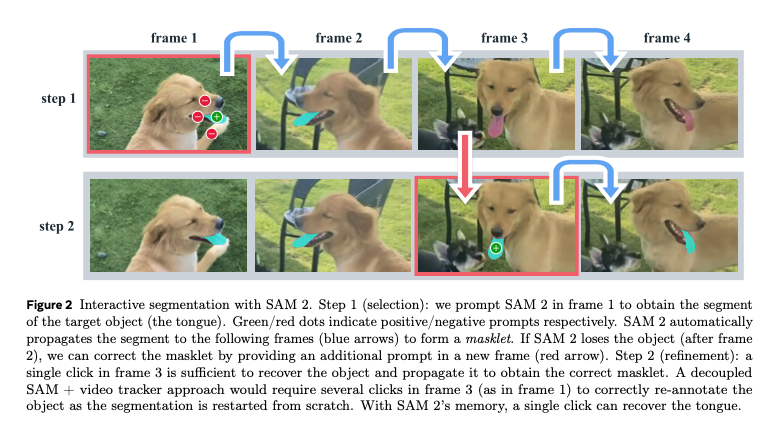
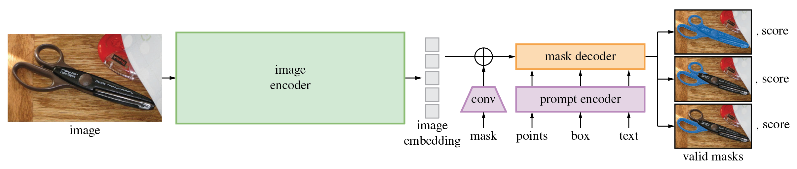
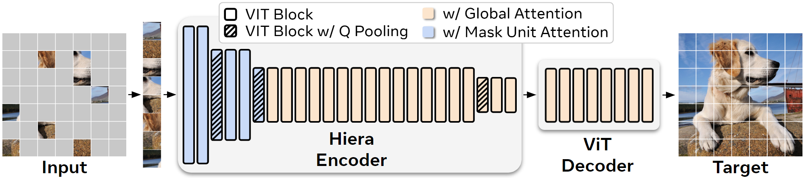
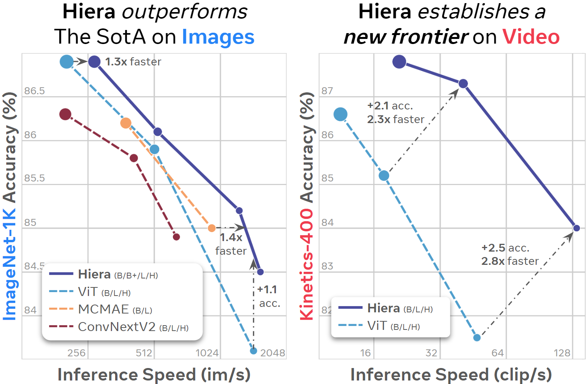
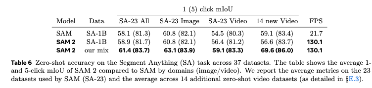
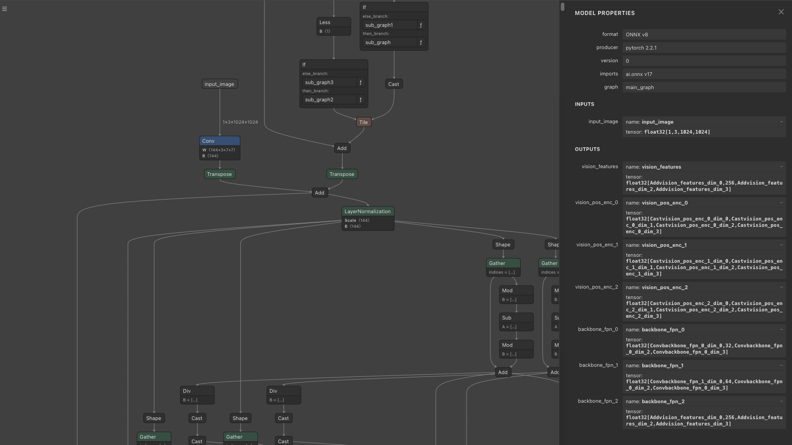
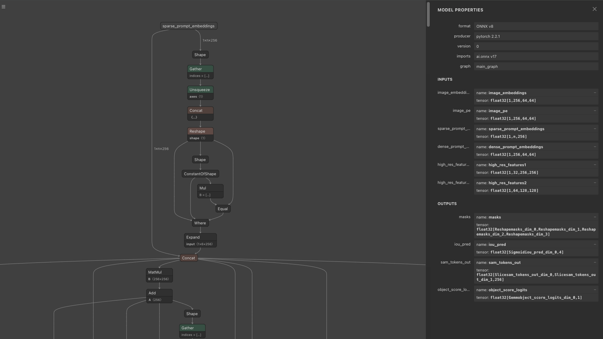

# SegmentAnyhing2 : 動画に対応した任意物体のセグメンテーションモデル

# SegmentAnyhing2 : 動画に対応した任意物体のセグメンテーションモデル

[](https://kyakuno.medium.com/?source=post_page---byline--425ff2ae14a4---------------------------------------)

[Kazuki Kyakuno](https://kyakuno.medium.com/?source=post_page---byline--425ff2ae14a4---------------------------------------)

17 min read

·

Aug 27, 2024

--

Share

動画に対応した任意物体のセグメンテーションモデルであるSegmentAnything2の紹介です。

## SegmentAnything2の概要

SegmentAnything2はMetaが開発して2024年7月に公開したセグメンテーションモデルの新バージョンです。2023年4月に公開されたSegmentAnythingよりも高精度化した上で、動画への適用も可能になっています。

Press enter or click to view image in full size


出典：<https://github.com/facebookresearch/segment-anything-2>

[## GitHub - facebookresearch/segment-anything-2: The repository provides code for running inference…

### The repository provides code for running inference with the Meta Segment Anything Model 2 (SAM 2), links for…

github.com](https://github.com/facebookresearch/segment-anything-2?source=post_page-----425ff2ae14a4---------------------------------------)

[## SAM 2: Segment Anything in Images and Videos

### We present Segment Anything Model 2 (SAM 2 ), a foundation model towards solving promptable visual segmentation in…

ai.meta.com](https://ai.meta.com/research/publications/sam-2-segment-anything-in-images-and-videos/?source=post_page-----425ff2ae14a4---------------------------------------)

## SegmentAnything2のアーキテクチャ

下記がSegmentAnything2のアーキテクチャです。静止画モードでは、画像をImage EncoderでEmbeddingした後、Prompt Encoderでプロンプトをベクトル化、Mask Decoderでマスク画像を生成します。SegmentAnything2では、セグメンテーションの領域を、mask、points、boxで指定することが可能です。

Press enter or click to view image in full size


出典：<https://github.com/facebookresearch/segment-anything-2>

動画モードでは、現在のフレームのEmbeddingと、過去および未来のフレームのEmbeddingを元に、Memory AttentionでEmbeddingを補正します。また、ステップ1で動画をセグメンテーションした後、セグメンテーションできなかった部分のキーポイントを追加してステップ2で改善するような処理にも対応しています。

Press enter or click to view image in full size



出典：<https://ai.meta.com/research/publications/sam-2-segment-anything-in-images-and-videos/>

比較用のSegmentAnything1のアーキテクチャです。動画用にMemory AttentionとMemory Encoderが追加された以外は、SegmentAnythingと近しい構成になっています。なお、SegmentAnything2では、SegmentAnything1で論文上は対応していたtextは非対応になっています。ただし、SegmentAnything1でもtextの実装は公開されていませんでした。

Press enter or click to view image in full size



出典：<https://github.com/facebookresearch/segment-anything>

SegmentAnything1のImage EncoderはVITでしたが、SegemenyAnything2のImage EncoderはHieraを使用しています。HieraはMetaが開発した、階層型のVision Transformerです。VITは、ネットワーク内で空間解像度が変化しません。しかし、最初の方のレイヤーではそんなに多くの特徴量は不要で、逆に後のレイヤーではそんなに多くの空間解像度が不要であり、非効率です。Heraでは、ResNetのように、段階的に空間解像度を下げるアーキテクチャになっています。

Press enter or click to view image in full size



Hieraのアーキテクチャ（出典：<https://github.com/facebookresearch/hiera>）

HieraはVITに比べて、高速に推論することが可能です。そのため、SegmentAnything1よりもSegmentAnything2の方が高速に推論が可能です。

Press enter or click to view image in full size



Hieraの精度（出典：<https://github.com/facebookresearch/hiera>）

[## GitHub - facebookresearch/hiera: Hiera: A fast, powerful, and simple hierarchical vision…

### Hiera: A fast, powerful, and simple hierarchical vision transformer. - facebookresearch/hiera

github.com](https://github.com/facebookresearch/hiera?source=post_page-----425ff2ae14a4---------------------------------------)

## データセット

SegmentAnything2は、SA-VというSegmentAnything2のために作成された動画データセットを使用してます。このデータセットは、50.9Kのビデオと、642.6Kのマスクで構成されます。

Press enter or click to view image in full size


SA-Vデータセット（出典：<https://ai.meta.com/research/publications/sam-2-segment-anything-in-images-and-videos/>）

SegmentAnything1はSA-1Bデータセットを使用しており、1100万枚の静止画像と10億のマスクで学習されていますが、SegmentAnything2は、SA-1BとSA-Vをミックスして学習しています。

## 精度

静止画モードの精度です。SegmentAnything2は、SegmentAnythingよりも高精度かつ高速になっています。our mixでは、SA-1Bデータセットと、SA-Vデータセットをミックスして学習することで、精度が改善していることがわかります。

Press enter or click to view image in full size



出典：<https://ai.meta.com/research/publications/sam-2-segment-anything-in-images-and-videos/>

動画モードの精度です。SegmentAnything2は、動画のセグメンテーションタスクで最も高い性能を持っています。

Press enter or click to view image in full size


出典：<https://ai.meta.com/research/publications/sam-2-segment-anything-in-images-and-videos/>

## 静止画モードの動作

Image Encoderにおいて、入力画像は、sam2/utils/transforms.pyで前処理され、RGB順で、mean = [0.485, 0.456, 0.406]、std = [0.229, 0.224, 0.225]で正規化されます。処理対象の画像サイズは1024x1024になります。リサイズではアスペクト比を保持しません。変換後の入力画像のShapeは(1, 3, 1024, 1024)になります。

Image Encoderの出力は、vision\_features（最終層の特徴量）、vision\_pos\_enc（最終層を含む3階層）、backbone\_fpn（最終層の3階層を含む特徴量、最終層はvision\_featuresと等価）になります。このデータを、\_prepare\_backbone\_featuresの後処理に通すことで、3階層のEmbeddingに変換します。上層をhigh\_res\_featsと呼び、下層をimage\_embedと呼びます。high\_res\_feats = [(1, 32, 256, 256), (1, 64, 128, 128)]、image\_embed = (1, 256, 64, 64)のShapeを持ちます。

Press enter or click to view image in full size



ImageEncoder

Prompt Encoderの出力は、sparse\_embeddingsとdense\_embeddingsになります。sparse\_embeddingsは、pointsとboxから計算されます。dense\_embeddingsは、maskから計算されます。sparse\_embeddingsのShapeは(1, N, 256)、dense\_embeddingsのShapeは(1, 256, 64, 64)です。

Press enter or click to view image in full size


PromptEncoder

Mask Decoderの出力は、multi\_mask\_output = Trueの場合は3枚の256x256解像度のマスク画像と確信度になります。low\_res\_masksのShapeは(1, 3, 256, 256)、iou\_predictionsのShapeは(1, 3)となります。low\_res\_masksは-32〜32のレンジでClampされます。デフォルトのmask\_thresholdは0であるため、low\_res\_masksが0以下の場合は0、low\_res\_masksが0より大きい場合は1に2値化します。multi\_mask\_output = Falseの場合は1枚の256x256解像度のマスク画像と確信度になります。モデルとしては4枚の画像を出力しており、multi\_mask\_output = Falseの場合は最初の1枚を、multi\_mask\_output = Trueの場合は最初を除く3枚を出力します。

Press enter or click to view image in full size



MaskDecoder

オプションでmax\_hole\_areaやmax\_sprinkle\_areaを有効にすると、マスク画像を穴埋めするように補正するアルゴリズムが適用されます。デフォルトでは無効になっています。

## Get Kazuki Kyakuno’s stories in your inbox

Join Medium for free to get updates from this writer.

Subscribe

Subscribe

Remember me for faster sign in

Prompt EncoderではPositionEmbeddingRandomを使用して、乱数で位置情報を符号化しています。Prompt Encoderに与えるPosition Embeddingの配列と、Mask Decoderに与えるPosition Embeddingの配列は一致させる必要があります。PositionEmbeddingのShapeは(1, 256, 64, 64)です。

## 動画モードの動作

動画モードでは、静止画モードに加えて、Memory Attentionが有効になります。

静止画モードと動画モードでは、Mask Decoderに与えるfeaturesを作成するロジックが異なります。静止画モードでは、現在のフレームのImage EncoderのBackboneの出力をMask Decoderに与えます。動画モードでは、静止画モードと同じ現在のフレームのImage EncoderのBackboneの出力であるcurrent\_vision\_featsと、memoryに保存しておいた以前のフレームのfeatsから、MemoryAttentionを適用することで、最終的なfeaturesを生成します。memoryにはプロンプト対象の1フレームと、現在のフレームの直前のNフレーム（最大6フレーム）が格納されます。

MemoryAttentionは2フレーム目から使用されます。2フレーム目の入力はcurr = (4096, 1, 256)、curr\_pos = (4096, 1, 256)、memory = (4100, 1, 64)、memory\_pos = (4100, 1, 64)になります。3フレーム目の入力はcurr = (4096, 1, 256)、curr\_pos = (4096, 1, 256)、memory = (8200, 1, 64)、memory\_pos = (8200, 1, 64)になります。

memoryには、cond\_framesとして(4096, 64)のEmbeddingを最大でnum\_maskmem = 7まで詰め込んだ後、(4, 64)のEmbeddingを最大でnum\_obj\_ptrs\_in\_encoder = 16まで詰め込みます。重要なフレームのEmbeddingは多く、それ以外の過去のフレームのEmbeddingは圧縮して詰め込む形になります。

MemoryAttentionにおいては、RoPE Attentionを使用しており、AttentionのQueryとKeyの各要素に対して、回転行列を適用することで、Position Embeddingを行います。RoPE AttentionのPosition Embeddingはcond\_framesの領域（4096の倍数の領域）のみに適用します。RoPE Attentionの回転行列は4096要素分のみ用意されており、Key = memoryの長さの方が大きいため、repeatして拡張して使用します。Query = current\_vision\_featsの要素数は常に4096です。

[## GitHub - naver-ai/rope-vit: [ECCV 2024] Official PyTorch implementation of RoPE-ViT "Rotary…

### ECCV 2024] Official PyTorch implementation of RoPE-ViT "Rotary Position Embedding for Vision Transformer" …

github.com](https://github.com/naver-ai/rope-vit?source=post_page-----425ff2ae14a4---------------------------------------)

MemoryAttentionの中では、\_forward\_saでSelf Attentionが、\_forward\_caでCross Attentionが計算されます。Self Attentionでは、current\_vision\_featsに対して処理が行われます。Cross Attentionでは、Self Attentionの結果とmemoryに対して処理が行われます。

MemoryAttentionの出力と、PromptEncoderの出力を、MaskDecoderに与えて、マスクを生成します。

生成したマスクは、次のフレームの処理のためにEmbeddingを計算して保存します。具体的に、現在のフレームのImageEncoderの出力と生成したマスクにMemoryEncoderを適用して計算したEmbeddingを保存しておき、次のフレームのMemoryAttentionに使用します。

## 画像認識解像度の変更

下記のIssueで、推論の解像度を1024から512に下げるすることで高速化したり、4096に上げることでPixel Perfectに近いマスクを取得する手法が議論されています。

[## Change image resolution · Issue #138 · facebookresearch/segment-anything-2

### Similar to SAM 1, SAM 2 was trained on 1024x1024 images. I'm wondering whether it's possible to adapt SAM 2 to 512x512…

github.com](https://github.com/facebookresearch/segment-anything-2/issues/138?source=post_page-----425ff2ae14a4---------------------------------------)

解像度を512x512に下げると、Image EncoderのEmbeddingの次元数は4096から1024に削減されます。

## ONNXへの出力

Memory AttentionをONNXに変換するためには、RoPE AttentionのComplex Tensorを2次元のTensorに置き換える必要があります。

[## export memory\_attention module to onnx failed with RuntimeError: ScalarType ComplexFloat is an…

### I am trying to export various model modules of sam2 to onnx for use on c++, but I encountered an error exporting the…

github.com](https://github.com/facebookresearch/segment-anything-2/issues/186?source=post_page-----425ff2ae14a4---------------------------------------)

## SegmenyAnthing 2.1

2024/09/30にSAM2.1が公開されました。SAM2.1はSAM2と同じモデルアーキテクチャで、モデルの重みが更新されています。

また、cfgファイルにおいて、add\_tpos\_enc\_to\_obj\_ptrsとproj\_tpos\_enc\_in\_obj\_ptrsがtrueになっています。

これは、MemoryAttentionの入力となる、圧縮した過去フレーム情報であるobj\_ptrsに対するposition\_embeddingであるobj\_posに影響します。  
SAM2ではこの値は0ですが、SAM2.1ではSinによるposition\_embeddingをnn.Linearでプロジェクションした値になります。

## SegmentAnything2の使用方法

ailia SDKで静止画に対してSegmentAnyting2を使用するには下記のコマンドを使用します。posにはセグメンテーション対象の座標を指定します。

```
python3 segment-anything-2.py --pos 500 375 -i truck.jpg
```

WEBカメラや動画に対してSegmentAnything2を使用するには下記のコマンドを使用します。

```
python3 segment-anything-2.py --pos 960 540 -v 0
```

デモ動画に対してSegmentAnything2を使用するには下記のコマンドを使用します。

```
python3 segment-anything-2.py -v demo
```

SegmentAnything2.1を使用するには、versionに2.1を与えます。デフォルトのバージョンは2になります。

```
python3 segment-anything-2.py -v demo --version 2.1
```

[## ailia-models/image\_segmentation/segment-anything-2 at master · axinc-ai/ailia-models

### The collection of pre-trained, state-of-the-art AI models for ailia SDK …

github.com](https://github.com/axinc-ai/ailia-models/tree/master/image_segmentation/segment-anything-2?source=post_page-----425ff2ae14a4---------------------------------------)

Press enter or click to view image in full size


出力例

ax株式会社はAIを実用化する会社として、クロスプラットフォームでGPUを使用した高速な推論を行うことができるailia SDKを開発しています。ax株式会社ではコンサルティングからモデル作成、SDKの提供、AIを利用したアプリ・システム開発、サポートまで、 AIに関するトータルソリューションを提供していますのでお気軽に[お問い合わせ](https://axinc.jp/)ください。