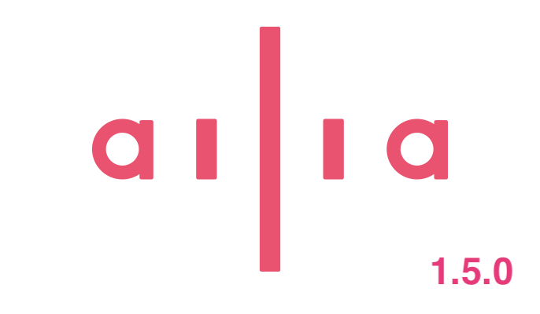
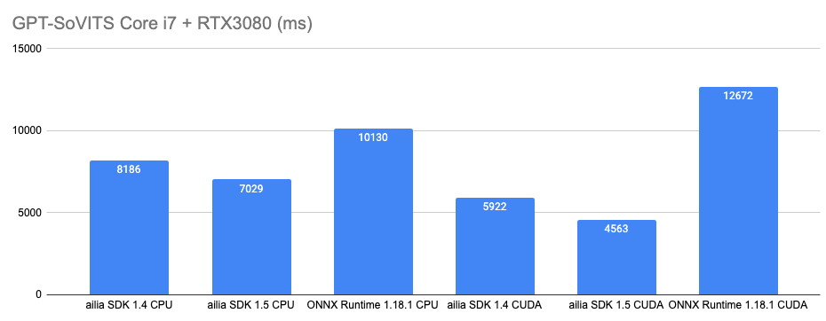
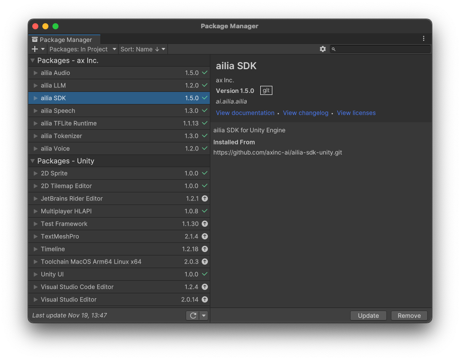

# ailia SDK 1.5をリリース

# ailia SDK 1.5をリリース

[Kazuki Kyakuno](https://kyakuno.medium.com/?source=post_page---byline--22b1f06fc0b2---------------------------------------)

Nov 19, 2024

--

Share

Transformerモデルの高速化を行ったailia SDK 1.5.0の紹介です。

ailia SDK 1.5.0

## Transformerモデルの高速化

Transformerモデルで使われているAttentionの高速化を行いました。AttentionはONNXに変換すると複数のオペレータに分解されますが、ailia SDKはランタイムで結合し、Attentionを高速化します。

ailia SDK 1.5.0では、CPU（AVX、NEON）とGPU（cuDNN）のAttentionの高速化を行なっています。今後、他の環境への適用も進めていく計画です。

GPT-SoVITSにおける音声合成の速度比較です。ailia SDKは、CPUおよびCUDAの両方で、ONNX Runtimeよりも高速に推論可能です。特に、ONNX RuntimeのCUDAバックエンドは、動的にShapeが変化するモデルを苦手としているため、CPUの方が高速に動作しますが、ailia SDKのCUDAバックエンドの場合は、動的にShapeが変化するモデルも高速に推論可能です。

Press enter or click to view image in full size

## VK\_KHR\_cooperative\_matrix対応

Transformerモデルで使われているMatMulを高速化するため、VulkanのVK\_KHR\_cooperative\_matrixに対応しました。

VK\_KHR\_cooperative\_matrixは、IntelのXMXや、NVIDIAのTensorCoreに代表される行列計算器に対応するAPIで、専用ハードウェアで処理するため、シェーダで行列積を計算するよりも高速に推論可能です。

## Get Kazuki Kyakuno’s stories in your inbox

Join Medium for free to get updates from this writer.

Subscribe

Subscribe

Remember me for faster sign in

VK\_KHR\_cooperative\_matrixは、Vulkan (FP16) バックエンドを選択することで使用可能です。

## opset = 20対応

opsetの対応範囲を20まで拡張しました。これにより、LivePortraitなど、opset = 20でしかエクスポートできないモデルに対応します。

## Jetpack 6.0及び6.1対応

Jetsonにおいて、Jetpack 6.0 + cuDNN 8.9.4と、Jetpack 6.1 + cuDNN 9.0.0に対応しました。最新のJetpackでも、簡単にailia SDKが使用可能になります。

## numpy2.0対応

Python Bindingでnumpy2.0に対応しました。ailia SDKは、numpy1系でも、numpy2系でも、共通のバイナリで使用することができ、安定した運用が可能です。

## ailia SDK 1.4から1.5への更新方法

### Python

pipコマンドで更新してください。ailia SDK 1.4までは、全プラットフォームで共通のWheelでしたが、ailia SDK 1.5からはプラットフォーム別のWheelがダウンロードされます。

> pip3 install -U ailia

SDKパッケージからは下記のように更新可能です。

> python3 bootstrap.py  
> pip3 install .

### Unity

Package ManagerからUpdateをしてください。

Press enter or click to view image in full size

Unityでのailia SDKのアップデート

正式版の場合、Unity Packageからインストール可能です。

### Flutter

pub upgradeコマンドで更新してください。

> flutter pub upgrade

正式版の場合、ライセンスロックされているailia.dll、libailia.so、libailia.dylibでパッケージ内のライブラリを置き換えます。

## 新しく対応するモデル

### Live Portrait（静止画を動かすモデル）

1枚の静止画をアニメーションすることが可能です。

[## ailia-models/generative\_adversarial\_networks/live\_portrait at master · axinc-ai/ailia-models

### The collection of pre-trained, state-of-the-art AI models for ailia SDK …

github.com](https://github.com/axinc-ai/ailia-models/tree/master/generative_adversarial_networks/live_portrait?source=post_page-----22b1f06fc0b2---------------------------------------)

出典：<https://github.com/KwaiVGI/LivePortrait>

### Qwen2VL（日本語も使えるVision Language Model）

任意の画像に日本語でクエリすることが可能です。

[## ailia-models/vision\_language\_model/qwen2\_vl at master · axinc-ai/ailia-models

### The collection of pre-trained, state-of-the-art AI models for ailia SDK - ailia-models/vision\_language\_model/qwen2\_vl…

github.com](https://github.com/axinc-ai/ailia-models/tree/master/vision_language_model/qwen2_vl?source=post_page-----22b1f06fc0b2---------------------------------------)

Press enter or click to view image in full size

出典：<https://github.com/QwenLM/Qwen2-VL>

ax株式会社はAIを実用化する会社として、クロスプラットフォームでGPUを使用した高速な推論を行うことができるailia SDKを開発しています。ax株式会社ではコンサルティングからモデル作成、SDKの提供、AIを利用したアプリ・システム開発、サポートまで、 AIに関するトータルソリューションを提供していますのでお気軽に[お問い合わせ](https://axinc.jp/)ください。