# Gemma3 : マルチモーダルに対応した最新のローカルLLM

# Gemma3 : マルチモーダルに対応した最新のローカルLLM

[](https://kyakuno.medium.com/?source=post_page---byline--aee9ef03e1e1---------------------------------------)

[Kazuki Kyakuno](https://kyakuno.medium.com/?source=post_page---byline--aee9ef03e1e1---------------------------------------)

22 min read

·

Mar 20, 2025

--

Share

マルチモーダルに対応した最新のローカルLLMであるGemma3の紹介です。

## Gemma3の概要

Gemma3はGoogleが2025年3月12日に公開した最新のローカルLLMです。140言語に対応しており、1B、4B、12B、27Bのモデルが提供されています。Gemma3は新たに128kトークンのロングコンテキストに対応しています。

Press enter or click to view image in full size

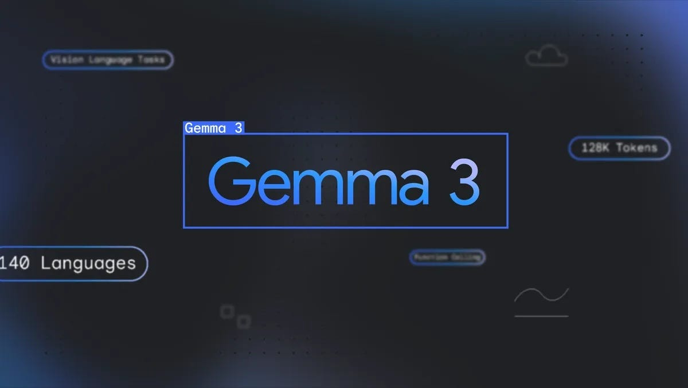

Gemma3（出典：<https://blog.google/technology/developers/gemma-3/>）

Gemma3の27Bのモデルは、Deepseek-v3の671Bを上回る性能を持っていおり、Gemini-1.5-Proに匹敵する性能を持っています。また、Gemma3の4Bのモデルは、Gemma2の27Bに匹敵する性能を持っています。

Press enter or click to view image in full size

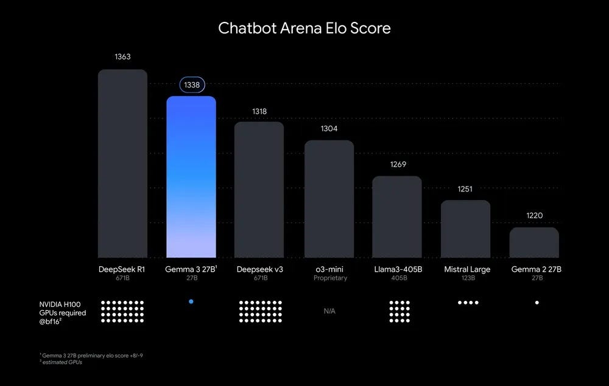

ELOスコア（出典：<https://blog.google/technology/developers/gemma-3/>）

また、マルチモーダルに対応しており、画像を入力することが可能です。

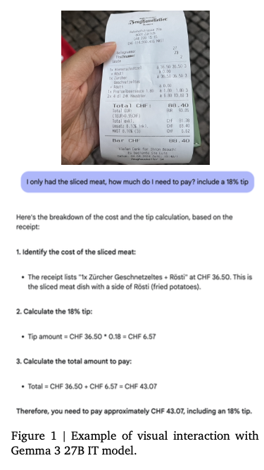

マルチモーダル対応の例（出典：<https://blog.google/technology/developers/gemma-3/>）

Gemma3のBLOG

[## Introducing Gemma 3: The most capable model you can run on a single GPU or TPU

### Today, we're introducing Gemma 3, our most capable, portable and responsible open model yet.

blog.google](https://blog.google/technology/developers/gemma-3/?source=post_page-----aee9ef03e1e1---------------------------------------)

Gemma3のテクニカルレポート

[Gemma 3 Technical Report](https://storage.googleapis.com/deepmind-media/gemma/Gemma3Report.pdf)

## Gemma3のアーキテクチャ

### Vision Encoder

Gemma3は画像のエンコードにSigLIPを使用しています。SigLIPはCLIPの派生モデルであり、CLIPのSoftmaxをSigmoidに置き換えることで、入力するテキストが一つでも確率を計算できるようにしたモデルです。

[## Sigmoid Loss for Language Image Pre-Training

### We propose a simple pairwise Sigmoid loss for Language-Image Pre-training (SigLIP). Unlike standard contrastive…

arxiv.org](https://arxiv.org/abs/2303.15343?source=post_page-----aee9ef03e1e1---------------------------------------)

画像は896x896の固定解像度で扱います。高解像度の画像が与えられた場合、高解像度の画像のエンコードの結果に対してAverage Poolingを行い、896x896相当の特徴ベクトルに削減します。

また、アスペクト比が正方形でない画像や、高解像度の画像に対しては、オプションでパン＆スキャンを適用可能です。パン＆スキャンは、Llavaにインスピレーションを得てGemma3で新しく提案された手法で、画像を等しいサイズの重ならないクロップに分解し、それらを896x896解像度にリサイズして、バッチ方向に並べてエンコードした上で、複数の画像扱いでトークナイズします。

パン＆スキャンは下記で実装されています。

```
    def pan_and_scan(  
        self,  
        image: np.ndarray,  
        pan_and_scan_min_crop_size: int,  
        pan_and_scan_max_num_crops: int,  
        pan_and_scan_min_ratio_to_activate: float,  
        data_format: Optional[Union[str, ChannelDimension]] = None,  
        input_data_format: Optional[Union[str, ChannelDimension]] = None,  
    ):  
        """  
        Pan and Scan and image, by cropping into smaller images when the aspect ratio exceeds  
        minumum allowed ratio.  
  
        Args:  
            image (`np.ndarray`):  
                Image to resize.  
            pan_and_scan_min_crop_size (`int`, *optional*):  
                Minimum size of each crop in pan and scan.  
            pan_and_scan_max_num_crops (`int`, *optional*):  
                Maximum number of crops per image in pan and scan.  
            pan_and_scan_min_ratio_to_activate (`float`, *optional*):  
                Minimum aspect ratio to activate pan and scan.  
            data_format (`str` or `ChannelDimension`, *optional*):  
                The channel dimension format of the image. If not provided, it will be the same as the input image.  
            input_data_format (`ChannelDimension` or `str`, *optional*):  
                The channel dimension format of the input image. If not provided, it will be inferred.  
        """  
        height, width = get_image_size(image)  
  
        # Square or landscape image.  
        if width >= height:  
            # Only apply PaS if the image is sufficiently exaggerated  
            if width / height < pan_and_scan_min_ratio_to_activate:  
                return []  
  
            # Select ideal number of crops close to the image aspect ratio and such that crop_size > min_crop_size.  
            num_crops_w = int(math.floor(width / height + 0.5))  # Half round up rounding.  
            num_crops_w = min(int(math.floor(width / pan_and_scan_min_crop_size)), num_crops_w)  
  
            # Make sure the number of crops is in range [2, pan_and_scan_max_num_crops].  
            num_crops_w = max(2, num_crops_w)  
            num_crops_w = min(pan_and_scan_max_num_crops, num_crops_w)  
            num_crops_h = 1  
  
        # Portrait image.  
        else:  
            # Only apply PaS if the image is sufficiently exaggerated  
            if height / width < pan_and_scan_min_ratio_to_activate:  
                return []  
  
            # Select ideal number of crops close to the image aspect ratio and such that crop_size > min_crop_size.  
            num_crops_h = int(math.floor(height / width + 0.5))  
            num_crops_h = min(int(math.floor(height / pan_and_scan_min_crop_size)), num_crops_h)  
  
            # Make sure the number of crops is in range [2, pan_and_scan_max_num_crops].  
            num_crops_h = max(2, num_crops_h)  
            num_crops_h = min(pan_and_scan_max_num_crops, num_crops_h)  
            num_crops_w = 1  
  
        crop_size_w = int(math.ceil(width / num_crops_w))  
        crop_size_h = int(math.ceil(height / num_crops_h))  
  
        # Don't apply PaS if crop size is too small.  
        if min(crop_size_w, crop_size_h) < pan_and_scan_min_crop_size:  
            return []  
  
        crop_positions_w = [crop_size_w * i for i in range(num_crops_w)]  
        crop_positions_h = [crop_size_h * i for i in range(num_crops_h)]  
  
        if input_data_format == ChannelDimension.LAST:  
            image_crops = [  
                image[pos_h : pos_h + crop_size_h, pos_w : pos_w + crop_size_w]  
                for pos_h, pos_w in itertools.product(crop_positions_h, crop_positions_w)  
            ]  
        else:  
            image_crops = [  
                image[:, pos_h : pos_h + crop_size_h, pos_w : pos_w + crop_size_w]  
                for pos_h, pos_w in itertools.product(crop_positions_h, crop_positions_w)  
            ]  
  
        return image_crops
```

[## transformers/src/transformers/models/gemma3/image\_processing\_gemma3.py at…

### 🤗 Transformers: State-of-the-art Machine Learning for Pytorch, TensorFlow, and JAX. …

github.com](https://github.com/huggingface/transformers/blob/9be4728af8bec48073ae841881d7f4e2ac3521d1/src/transformers/models/gemma3/image_processing_gemma3.py?source=post_page-----aee9ef03e1e1---------------------------------------#L132)

クロップをエンコードしたトークンは、下記でプロンプトに並べられます。

```
        image_inputs = {}  
        if images is not None:  
            batched_images = make_nested_list_of_images(images)  
            image_inputs = self.image_processor(batched_images, **output_kwargs["images_kwargs"])  
  
            # Create empty text to be replaced with placeholders  
            if not text:  
                text = [" ".join([self.boi_token] * len(images)) for images in batched_images]  
  
            if len(batched_images) != len(text):  
                raise ValueError(  
                    f"Received inconsistently sized batches of images ({len(batched_images)}) and text ({len(text)})."  
                )  
  
            # Replace image tokens by the full expanded sequence  
            batch_num_crops = to_py_obj(image_inputs.pop("num_crops"))  
            for batch_idx, (prompt, images, num_crops) in enumerate(zip(text, batched_images, batch_num_crops)):  
                image_indexes = [m.start() for m in re.finditer(self.boi_token, prompt)]  
  
                if len(images) != len(image_indexes):  
                    raise ValueError(  
                        f"Prompt contained {len(image_indexes)} image tokens but received {len(images)} images."  
                    )  
  
                # Insert additional image tokens for Pan-and-Scan crops  
                for num, idx in reversed(list(zip(num_crops, image_indexes))):  
                    if num:  
                        formatted_image_text = (  
                            f"Here is the original image {self.boi_token} and here are some crops to help you see better "  
                            + " ".join([self.boi_token] * num)  
                        )  
                        prompt = prompt[:idx] + formatted_image_text + prompt[idx + len(self.boi_token) :]  
                        text[batch_idx] = prompt  
  
            # Expand placeholder image tokens to the full image token sequence  
            text = [prompt.replace(self.boi_token, self.full_image_sequence) for prompt in text]
```

[## transformers/src/transformers/models/gemma3/processing\_gemma3.py at…

### 🤗 Transformers: State-of-the-art Machine Learning for Pytorch, TensorFlow, and JAX. …

github.com](https://github.com/huggingface/transformers/blob/9be4728af8bec48073ae841881d7f4e2ac3521d1/src/transformers/models/gemma3/processing_gemma3.py?source=post_page-----aee9ef03e1e1---------------------------------------#L116)

Vison Encoderのモデルサイズは、417Mパラメータで固定されています。

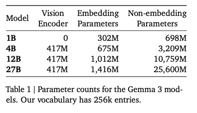

各モデルのパラメータ数（出典：<https://blog.google/technology/developers/gemma-3/>）

### Long Context

128kのロングコンテキストに拡張すると、KVキャッシュのメモリ消費量が膨大になるという問題があります。

KVキャッシュは、AttentionのQとK、QKとVの内積の結果を保存しておくことで、計算量を削減するアルゴリズムです。Deep Seekでは、このKVキャッシュを圧縮して持つという手法を採用していますが、Gemma3では、グローバルのAttentionとローカルのAttentionに分割し、ローカルのAttentionのトークン長を1024に保つことで、メモリ消費量を抑制しています。

Press enter or click to view image in full size

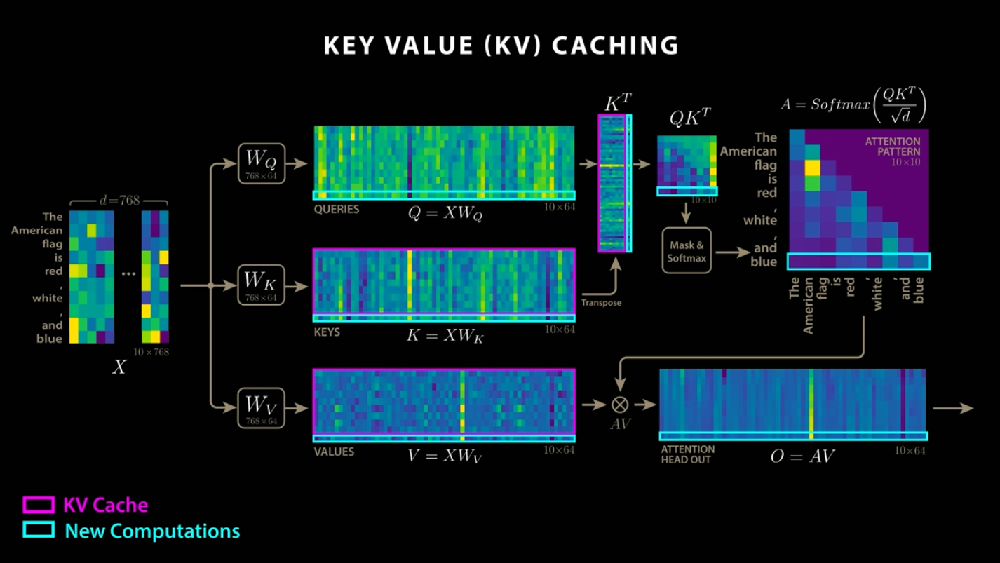

KVキャッシュ（出典：<https://www.youtube.com/watch?app=desktop&v=0VLAoVGf_74>）

ローカルのAttentionの位置情報の符号化に使用するROPEの周波数は10k、グローバルのAttentionのROPEの周波数は1Mに増やすことで、ロングコンテキストに対応しています。

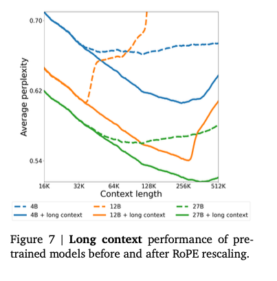

ROPEの周波数の変更による性能変化（出典：<https://storage.googleapis.com/deepmind-media/gemma/Gemma3Report.pdf>）

### Tokenizer

TokenizerはGemma2と同じです。数字の分割、空白の保持、バイトレベルのエンコーディングを行うSentence Pieceトークナイザで、262,000のボキャブラリーを持ちます。このトークナイザは、英語以外の言語に対して、よりバランスの取れたものになります。

### 学習

27Bでは14Tトークン、12Bでは12Tトークン、4Bでは4Tトークン、1Bでは2Tトークンを使用して学習しています。Gemma2と同様、Gemma3は蒸留を使用しており、大規模モデルのトークンの確率値の分布をターゲットに学習をしています。

## Get Kazuki Kyakuno’s stories in your inbox

Join Medium for free to get updates from this writer.

Subscribe

Subscribe

Remember me for faster sign in

学習には、NVIDIAのGPUではなく、Googleの開発したASICであるTPUv4、TPUv5e、TPUv5pを使用しています。


学習インフラ（出典：<https://storage.googleapis.com/deepmind-media/gemma/Gemma3Report.pdf>）

### 量子化

Gemma3は公式で量子化モデルを提供しています。量子化モデルの作成にはQATを使用しており、モデルを微調整しています。QATでは、事前トレーニングおよび事後トレーニングの確率分布に一致させるように、5000ステップのトレーニングを行っています。

## Gemma3の性能

Gemma3は、Gemma2を大幅に超える性能を持っており、27BでGemini 1.5 Flashよりも高い性能を持っています。

Press enter or click to view image in full size

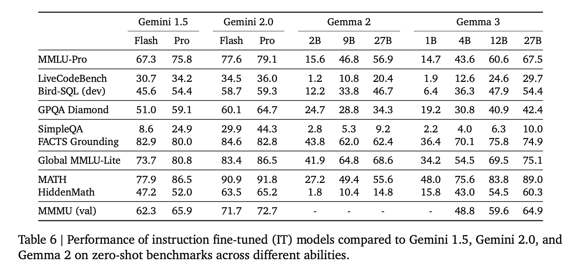

ベンチマーク（出典：<https://storage.googleapis.com/deepmind-media/gemma/Gemma3Report.pdf>）

Gemma2と比較すると、全てのスコアでGemma3はGemma2を上回っています。

Press enter or click to view image in full size


ベンチマーク（出典：<https://storage.googleapis.com/deepmind-media/gemma/Gemma3Report.pdf>）

## Qwen2VLとの比較

文字や表組に対する質問のデータセットであるDocVQA、インフォグラフィックスに対する質問のデータセットであるInfoVQA、自然画像に対する質問のデータセットであるTextVQAのスコアの比較です。

マルチモーダルの性能という観点では、Qwen2-VLの方が性能が高くなっています。

Press enter or click to view image in full size

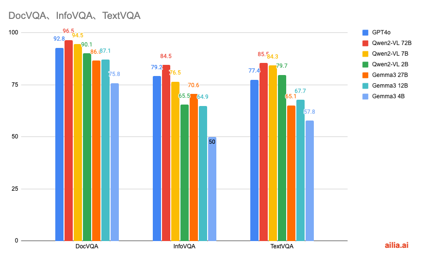

マルチモーダル性能の比較

各データセットの例は下記となります。

Press enter or click to view image in full size

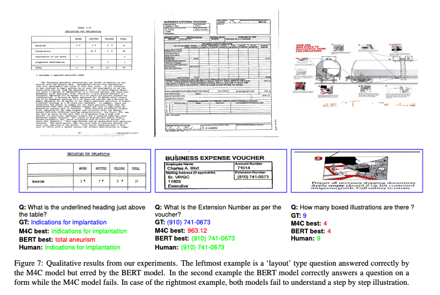

DocVQAの例（出典：<https://arxiv.org/abs/2007.00398>）

Press enter or click to view image in full size

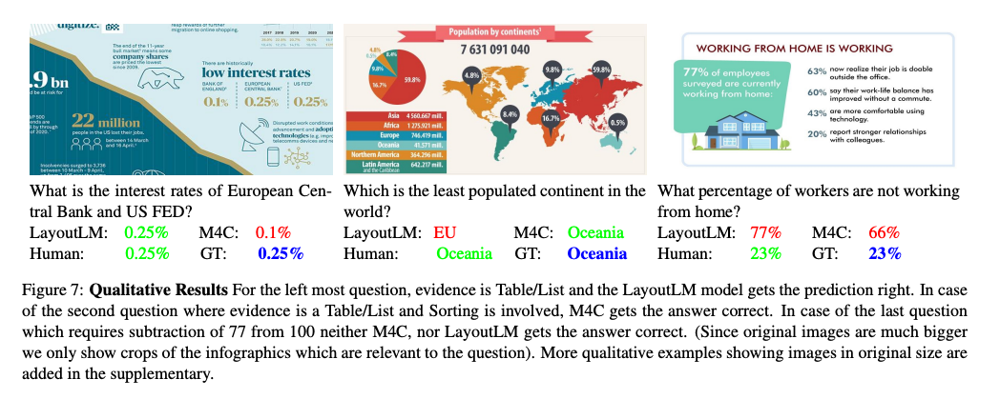

InfoVQAの例（出典：<https://arxiv.org/abs/2104.12756>）

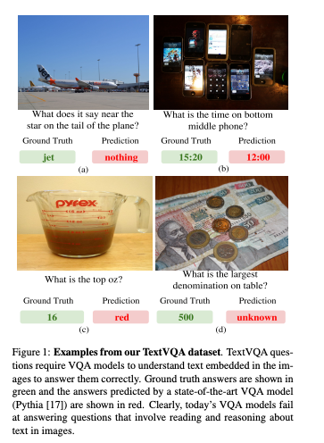

TextVQAの例（出典：<https://arxiv.org/abs/1904.08920>）

グラフの元データとなります。

Press enter or click to view image in full size


Qwen2VL（出典：<https://arxiv.org/abs/2409.12191>）


Gemma3（出典：<https://storage.googleapis.com/deepmind-media/gemma/Gemma3Report.pdf>）

Press enter or click to view image in full size


DeepSeek VL2（出典：<https://arxiv.org/abs/2412.10302>）

## llama.cppの対応

llama.cpp向けの量子化されたモデルは下記で公開されています。

[## ggml-org (ggml.ai)

### Org profile for ggml.ai on Hugging Face, the AI community building the future.

huggingface.co](https://huggingface.co/ggml-org?source=post_page-----aee9ef03e1e1---------------------------------------)

llama.cppはb4875以降のバージョンでGemma3に対応しています。

[## Release b4875 · ggml-org/llama.cpp

### LLM inference in C/C++. Contribute to ggml-org/llama.cpp development by creating an account on GitHub.

github.com](https://github.com/ggml-org/llama.cpp/releases/tag/b4875?source=post_page-----aee9ef03e1e1---------------------------------------)

llama.cppは下記のPRで画像入力にも対応しています。

[## clip : Experimental support for Gemma 3 vision by ngxson · Pull Request #12344 · ggml-org/llama.cpp

### What is this? Follow up the text-only PR: #12343 Note: Vision capability is available on these model sizes: 4b, 12b and…

github.com](https://github.com/ggml-org/llama.cpp/pull/12344?source=post_page-----aee9ef03e1e1---------------------------------------)

## ailia LLMの対応

ailia LLMはFlutterやUnityからllama.cppを使用可能にするライブラリです。ailia LLM 1.3.1からGemma3に対応しています。

Pythonでの実行方法は下記となります。macOS、Windows、Linuxで動作します。初回は4GBのモデルダウンロードを行うため、少し時間がかかります。

```
pip3 install ailia-llm
```

```
import ailia_llm  
  
import os  
import urllib.request  
  
model_file_path = "gemma-3-4b-it-Q4_K_M.gguf"  
if not os.path.exists(model_file_path):  
 print("begin model download")  
 urllib.request.urlretrieve(  
  "https://storage.googleapis.com/ailia-models/gemma/gemma-3-4b-it-Q4_K_M.gguf",  
  model_file_path  
 )  
 print("end model download")  
  
model = ailia_llm.AiliaLLM()  
model.open(model_file_path)  
  
messages = []  
messages.append({"role": "system", "content": "語尾に「わん」をつけてください。"})  
messages.append({"role": "user", "content": "あなたの名前は何ですか？"})  
  
stream = model.generate(messages)  
  
text = ""  
for delta_text in stream:  
 text = text + delta_text  
print(text)  
  
if model.context_full():  
 raise Exception("Context full")  
  
messages.append({"role": "assistant", "content": text})
```

[## ailia LLM : エッジデバイスにLLMを実装できるライブラリ

### エッジデバイスにLLMを実装するためのライブラリであるailia LLMの紹介です。

medium.com](https://medium.com/axinc/ailia-llm-%E3%82%A8%E3%83%83%E3%82%B8%E3%83%87%E3%83%90%E3%82%A4%E3%82%B9%E3%81%ABllm%E3%82%92%E5%AE%9F%E8%A3%85%E3%81%A7%E3%81%8D%E3%82%8B%E3%83%A9%E3%82%A4%E3%83%96%E3%83%A9%E3%83%AA-45bc982d0f3f?source=post_page-----aee9ef03e1e1---------------------------------------)

## ailia DX Insightの対応

ailia DX InsightはローカルLLMを簡単に動かせるGUIツールです。ailia DX Insight 1.2.1のベータ版からGemma3に対応しています。

Press enter or click to view image in full size

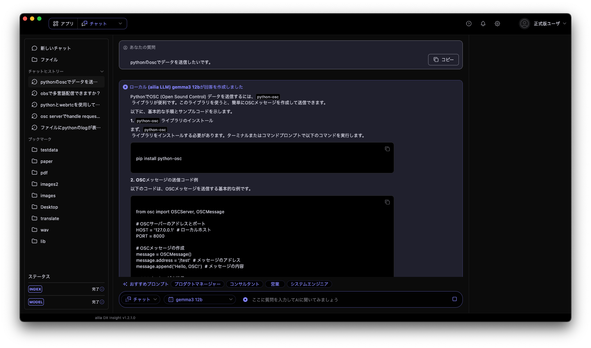

ailia DX InsightでGemma3 12bを動作させている例

ailia DX Insight 1.2.1は4月末に一般公開予定で、現在はベータ版を提供しています。ベータ版をご利用になりたい方は弊社まで[お問い合わせ](https://www.ailia.ai/contact_ax)ください。

ax株式会社はAIを実用化する会社として、クロスプラットフォームでGPUを使用した高速な推論を行うことができるailia SDKを開発しています。ax株式会社ではコンサルティングからモデル作成、SDKの提供、AIを利用したアプリ・システム開発、サポートまで、 AIに関するトータルソリューションを提供していますのでお気軽に[お問い合わせ](https://www.ailia.ai/contact_ax)ください。

AIで、しごとするなら『[ailia.ai（アイリア ドット エーアイ](https://blog.ailia.ai/)）』は、AIの開発を行う企業、株式会社アクセルおよびax株式会社が展開するAI専門メディアです。ビジネスやライフスタイルを取り巻く最新のAI関連製品やサービスを深く読み解くとともに、ailiaブランドが展開する最新のサービスや、AIの活用・開発・導入を加速させるための情報を幅広く網羅。  
近い未来、AIが私たちにもたらすであろう“本質的な自由“について、さまざまな角度から情報を発信します。