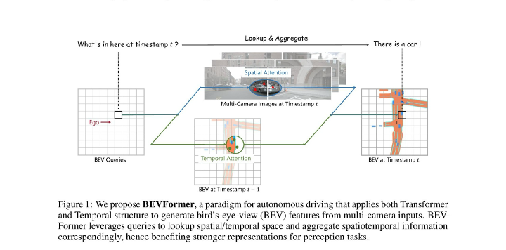
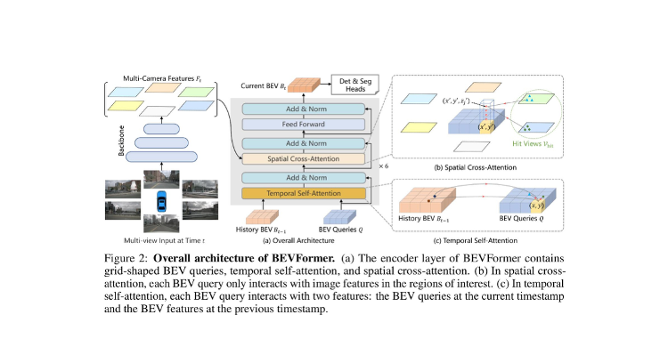
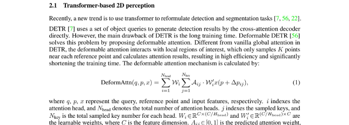
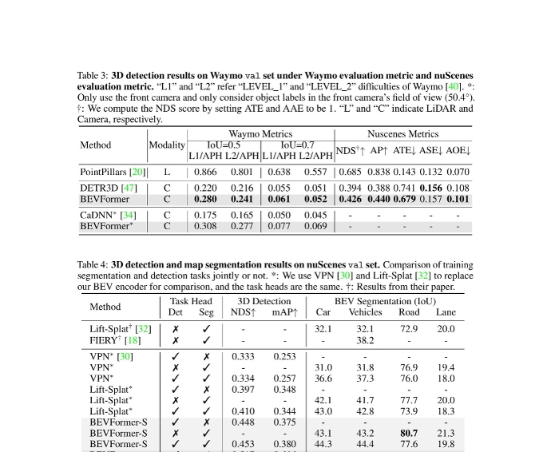
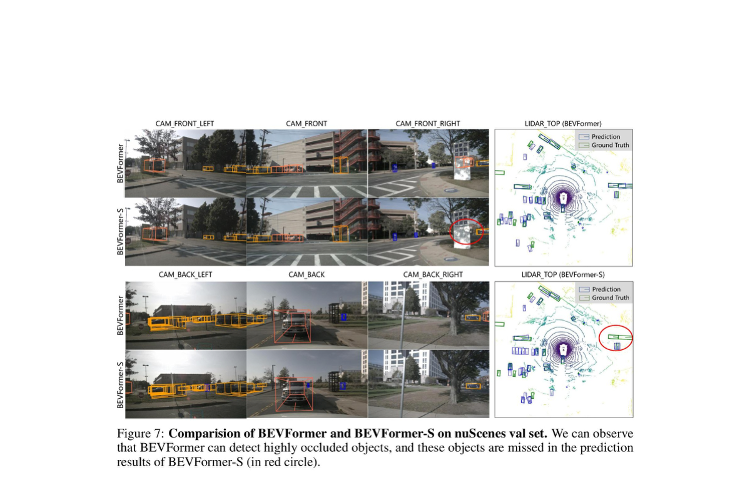
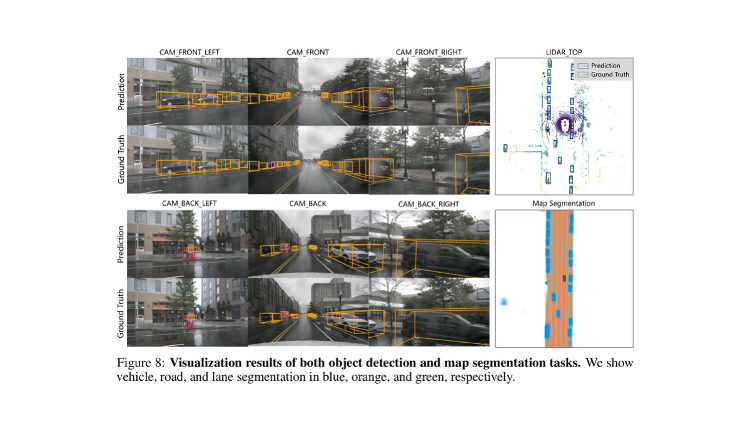
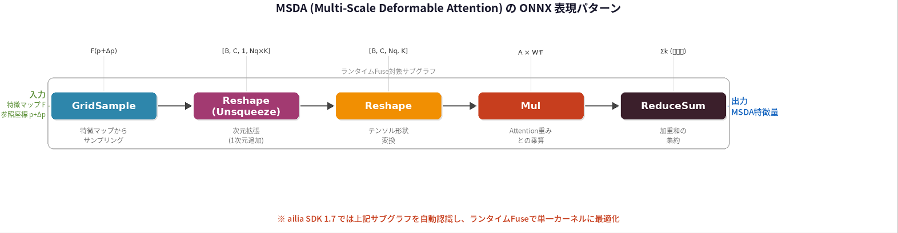

# BEVFormer : マルチカメラ画像からBEV表現を生成するAIモデル

# BEVFormer : マルチカメラ画像からBEV表現を生成するAIモデル

[Kazuki Kyakuno](https://kyakuno.medium.com/?source=post_page---byline--66ec76dd3a70---------------------------------------)

23 min read

·

Apr 2, 2026

--

Share

自動運転のE2Eモデルの基盤としてBEV表現が広く採用されています。マルチカメラ画像からBEV表現を生成するAIモデルであるBEVFormerを紹介します。

## 1. はじめに

自動運転システムにおいて、周囲環境の正確な3D認識は最も重要な技術課題の一つです。車両に搭載された複数のカメラから取得した画像をもとに、周囲の物体を3Dで検出し、道路構造を把握する必要があります。従来、このような3D認識にはLiDAR（Light Detection and Ranging）が広く用いられてきましたが、LiDARは高価であり、悪天候時の性能低下や点群データの疎密の問題があります。

近年、カメラのみを用いた3D認識手法が急速に発展しており、そのコストの低さとデータの密度の高さから注目を集めています。その中でも、Bird’s-Eye-View（BEV）表現は、自動運転における統一的な空間表現として広く採用されています。BEV表現は、車両を上空から俯瞰した視点で周囲環境を表現するもので、複数カメラの情報を一つの座標系に統合でき、後段の予測・計画モジュールとの連携が容易です。

BEVFormerは、2022年にECCV（European Conference on Computer Vision）で発表された論文で提案されたフレームワークで、時空間Transformer（Spatiotemporal Transformer）を用いて、マルチカメラ画像から統一的なBEV表現を学習します。nuScenes benchmarkにおいて、NDS（nuScenes Detection Score）56.9%を達成し、カメラのみの手法として当時のState-of-the-Artを大幅に更新しました。この性能は、LiDARベースの手法に匹敵するレベルです。

Press enter or click to view image in full size

*Figure 1: BEVFormerの概念図。BEVクエリがSpatial Attentionでマルチカメラ画像から空間情報を、Temporal Attentionで過去のBEV特徴から時間情報を収集する。（出典: Li et al., ECCV 2022）*

本記事では、BEVFormerのアーキテクチャとそのコア技術であるDeformable Attentionについて詳しく解説し、さらにailia SDKにおけるONNXエクスポートと高速推論の実装について紹介します。

[## GitHub - fundamentalvision/BEVFormer: [ECCV 2022] This is the official implementation of BEVFormer…

### ECCV 2022] This is the official implementation of BEVFormer, a camera-only framework for autonomous driving perception…

github.com](https://github.com/fundamentalvision/bevformer?source=post_page-----66ec76dd3a70---------------------------------------)

[## BEVFormer: Learning Bird's-Eye-View Representation from Multi-Camera Images via Spatiotemporal…

### 3D visual perception tasks, including 3D detection and map segmentation based on multi-camera images, are essential for…

arxiv.org](https://arxiv.org/abs/2203.17270?source=post_page-----66ec76dd3a70---------------------------------------)

## 2. 自動運転におけるBEV表現の重要性

### 2.1 BEV表現とは

Bird’s-Eye-View（BEV）表現とは、自動運転車の周囲環境を上空から俯瞰した2D平面上に投影した表現形式です。各カメラが異なる視点から撮影した画像を、車両中心の統一座標系に変換することで、空間的に一貫した環境表現が得られます。

BEV表現の最大の利点は、3D物体検出、セマンティックマップ生成、軌道予測、経路計画といった自動運転の各タスクに共通して利用できる統一的な中間表現である点です。これにより、パーセプション（知覚）からプランニング（計画）までのEnd-to-Endパイプラインを構築しやすくなります。

### 2.2 End-to-End自動運転とBEVFormer

BEVFormerが自動運転分野で特に注目される理由の一つは、CVPR 2023でBest Paper Awardを受賞したUniAD（Planning-oriented Autonomous Driving）のBEVエンコーダとして採用されていることです。

[## UniAD : End2Endの自動運転の基本となるモデル

### UniAD ...

tech.ailia.ai](/uniad-end2end%E3%81%AE%E8%87%AA%E5%8B%95%E9%81%8B%E8%BB%A2%E3%81%AE%E5%9F%BA%E6%9C%AC%E3%81%A8%E3%81%AA%E3%82%8B%E3%83%A2%E3%83%87%E3%83%AB-39339e6e277b?source=post_page-----66ec76dd3a70---------------------------------------)

UniADは、知覚（Tracking・Mapping）、予測（Motion Prediction・Occupancy Prediction）、計画（Planning）を統合したEnd-to-End自動運転モデルであり、BEVFormerで生成されたBEV特徴量をベースに全てのダウンストリームタスクが動作します。

UniADの学習では、まずBEVFormerの事前学習済み重みをロードし、TrackFormerとMapFormerを学習する第1ステージ、その後全モジュールをEnd-to-Endで学習する第2ステージという2段階の学習戦略が採用されています。BEVFormerが生成するBEV特徴量の品質が、下流タスク全体の精度に直接影響するため、高品質なBEV表現の学習が極めて重要です。

また、BEVFormerはUniAD以外にも、[VAD（Vectorized Autonomous Driving）](https://github.com/hustvl/VAD)や[Bench2Drive](https://github.com/Thinklab-SJTU/Bench2Drive)など、多数のEnd-to-End自動運転フレームワークのBEVバックボーンとして広く利用されており、自動運転認識パイプラインの事実上の標準コンポーネントとなっています。

## 3. BEVFormerのアーキテクチャ

BEVFormerは、マルチカメラ画像から統一的なBEV特徴量を生成するTransformerベースのエンコーダです。以下の3つの主要コンポーネントで構成されます。

Press enter or click to view image in full size

*Figure 2: BEVFormerの全体アーキテクチャ。(a) エンコーダ層は、BEVクエリ、Temporal Self-Attention、Spatial Cross-Attentionで構成。(b) Spatial Cross-Attentionの詳細。© Temporal Self-Attentionの詳細。（出典: Li et al., ECCV 2022）*

### 3.1 グリッド形状BEVクエリ

BEVFormerでは、BEV平面上にグリッド状に配置された学習可能なクエリ（BEV Queries）を定義します。各クエリは、BEV空間上の特定の位置に対応しており、その位置に関連する空間的・時間的情報を、Attention機構を通じて収集します。

例えば、BEV空間を200×200のグリッドで表現する場合、40,000個のBEVクエリが存在し、それぞれがBEV空間の特定領域に対応する特徴量を保持します。これらのクエリは、エンコーダの各層で空間情報と時間情報を段階的に集約していきます。

### 3.2 ResNetバックボーンとマルチスケール特徴抽出

BEVFormerの画像特徴抽出には、ResNet-101に DCN（Deformable Convolution Networks）を組み合わせたバックボーンが使用されています。インフェレンス時には、タイムスタンプtのマルチカメラ画像（nuScenesの場合、6台のカメラ画像）をResNet-101に入力し、各カメラビューの特徴マップF\_t = {F\_t^i} (i=1,…,N\_view)を取得します。

ResNetの各ステージ（C3, C4, C5）から異なる解像度の特徴マップが抽出され、FPN（Feature Pyramid Network）を用いてマルチスケール特徴マップとして統合されます。これにより、原画像の1/16、1/32などの異なる解像度の特徴マップが得られ、Spatial Cross-AttentionのMulti-Scale Deformable Attentionに入力されます。

マルチスケール特徴抽出の流れは次の通りです。まず入力画像（例: 6枚×900×1600ピクセル）がResNet-101に入力され、各ステージの出力がFPNで統合されます。FPNの出力は複数レベルの特徴マップであり、これがSpatial Cross-Attentionにおいて参照されます。DCNの導入により、特徴抽出段階でも物体の形状に適応的な受容野を実現し、特に不規則な形状の物体（歩行者、自転車など）の検出精度が向上します。

UniADでは、BEVFormerのバックボーンとしてResNet-101の他に、VoVNet 2–99も使用可能です。VoVNetを使用したUniAD-Lはより高精度なBEV特徴を生成できますが、その分計算コストも増大します。

### 3.3 Spatial Cross-Attention（空間クロスアテンション）

空間クロスアテンションは、各BEVクエリが対応する3D空間の柱（Pillar）状の領域から、マルチカメラの特徴マップ上の関連領域を参照して空間特徴を取得するモジュールです。

具体的には、各BEVクエリに対応するBEV座標から、3D空間の複数の高さのポイント（3D Reference Points）を生成します。これらの3Dポイントをカメラの内部・外部パラメータを用いて各カメラの2D画像座標に投影し、投影されたポイントが画像内に含まれるカメラビューのみから特徴量を取得します。このとき、特徴量の取得にはDeformable Attention機構が用いられ、投影された参照点の周辺から学習されたオフセットに基づいて少数のサンプリングポイントの特徴量を効率的に集約します。

### 3.4 Temporal Self-Attention（時間セルフアテンション）

時間セルフアテンションは、過去のタイムスタンプで生成されたBEV特徴量を現在のBEV特徴量と融合するモジュールです。自車両の移動量（Ego-motion）を考慮して過去のBEV特徴量を現在の座標系にアライメントし、Deformable Attentionを用いて過去と現在の特徴量を融合します。

時間情報の融合は再帰的（Recurrent）に行われ、各タイムスタンプで前フレームのBEV特徴量のみを参照します。これにより、長期的な時間情報を少ない計算コストで蓄積でき、移動物体の速度推定や、一時的に遮蔽されたオブジェクトの検出精度が向上します。

### 3.5 検出ヘッド

BEVFormerで生成されたBEV特徴量は、Deformable DETRベースの3D物体検出ヘッドに入力されます。Deformable DETRのデコーダにおいて、Object QueryかBEV特徴量からオブジェクト情報を抽出し、3Dバウンディングボックス（位置、サイズ、向き、速度）とクラスラベルを予測します。同様に、セマンティックマップセグメンテーション用のヘッドを接続することで、車線や走行可能エリアの推定も可能です。

### 3.6 学習データとLiDARの関係

BEVFormerは「camera-only」手法として位置づけられており、学習時・推論時ともにモデルへの入力はカメラ画像のみです。LiDARの点群データはモデルの入力としては一切使用されません。

ただし、学習の教師データ（Ground Truth）の作成にはLiDARが間接的に関与しています。BEVFormerが学習に使用するnuScenesデータセットでは、3Dバウンディングボックスのアノテーション（物体の3D位置・サイズ・向き）は、人間のアノテータがLiDAR点群データを参照しながら作成しています。つまり、正解ラベルの精度がLiDARの3D計測精度に依存しているといえます。

この構造を整理すると、モデル入力はカメラ画像のみ（LiDAR不使用）、教師ラベルはnuScenesの3Dアノテーション（LiDAR点群を参照して人手で作成）、推論時はカメラ画像のみ（LiDAR不要）となります。これはBEVFormerに限らず、カメラベースの3D物体検出手法全般に共通する特徴です。

## Get Kazuki Kyakuno’s stories in your inbox

Join Medium for free to get updates from this writer.

Subscribe

Subscribe

Remember me for faster sign in

LiDARなしでデプロイできるためコスト面で大きな利点がありますが、学習時の教師信号の品質はLiDARベースのアノテーションに依存しているというトレードオフがあります。なお、論文の性能比較においてBEVFormerの精度がLiDARベースの手法（PointPillars等）に匹敵するレベルに達していることは、カメラのみの入力でも時空間Transformerによる特徴抽出が極めて有効であることを示しています。

## 4. Deformable Attentionの詳細

### 4.1 標準Attentionの課題

標準的なTransformer Attentionは、全てのKey要素に対してAttention重みを計算するため、画像特徴マップのような大量のピクセルを扱う場合、計算量がピクセル数の2乗に比例して増大します（O(N²)の計算量）。また、初期化時にはAttention重みがほぼ均一に分散するため、意味のある疎な位置に注目するまでに長い学習期間（DETRでは500エポック）が必要です。

### 4.2 Deformable Attentionの仕組み

Deformable Attention（Deformable DETR, ICLR 2021で提案）は、Deformable Convolutionの発想をTransformer Attentionに取り入れたものです。全ピクセルではなく、参照点（Reference Point）の周囲に学習されたオフセットで配置された少数のサンプリングポイント（通常K=4個）のみから特徴量を取得します。

BEVFormerの論文では、Deformable Attentionの数式が以下のように定義されています。

Press enter or click to view image in full size

*Deformable Attentionの数式定義。参照点pの周囲に学習されたオフセットΔpで配置された少数のサンプリングポイントから特徴量を取得する。（出典: Li et al., ECCV 2022）*

各クエリ要素z\_qに対し、参照点p\_qを中心として、M個のAttentionヘッドそれぞれでK個のサンプリングポイントを生成します。各サンプリングポイントの位置は、参照点p\_qにクエリから予測されたオフセットΔp\_mqkを加算して決定されます。Attention重みA\_mqkは、クエリ特徴量から線形変換とSoftmaxを通じて算出されます。

### 4.3 Multi-Scale Deformable Attention（MSDA）

BEVFormerでは、さらにMulti-Scale Deformable Attention（MSDA）が採用されています。これは、複数のスケール（解像度）の特徴マップに対して同時にDeformable Attentionを適用するもので、異なるスケールの特徴間で情報交換が可能になります。マルチスケール対応により、小さなオブジェクト（遠方の車両や歩行者）と大きなオブジェクト（近傍のトラック）の両方を効果的に検出できます。

MSDAの計算量はO(2N\_q C² + min(HWC², N\_q KC²))であり、標準Attentionと比較して大幅に効率的です。

### 4.4 BEVFormerにおけるDeformable Attentionの役割

BEVFormerでは、Deformable Attentionが2つの場面で重要な役割を果たしています。Spatial Cross-Attentionでは、3D参照点がカメラ座標に投影された位置を参照点として、その周辺のサンプリングポイントから画像特徴を取得します。Temporal Self-Attentionでは、現在のBEVクエリ位置を参照点として、アライメントされた過去のBEV特徴マップからサンプリングを行います。いずれの場合も、少数のサンプリングポイントで効率的に特徴量を集約できるため、高解像度のBEV表現を低い計算コストで実現しています。

## 5. 性能評価

BEVFormerは、大規模自動運転データセットであるnuScenesおよびWaymoにおいて評価されています。nuScenes test setにおいて、NDS 56.9%を達成し、従来のカメラのみのState-of-the-Art手法を9.0ポイント上回りました。特に、時間情報の融合による速度推定精度の向上と、低可視性条件下でのオブジェクト検出再現率の改善が顕著です。

*Table 3・4: WaymoおよびnuScenes val setでの3D検出・マップセグメンテーション結果。BEVFormerはカメラのみの手法でLiDARベースの手法に迫る性能を達成。（出典: Li et al., ECCV 2022）*

また、マルチタスク学習（3D物体検出とマップセグメンテーションの同時学習）においても、BEVFormerは既存のBEVエンコーダ（Lift-Splatなど）を大幅に上回る性能を示しています。

## 6. 可視化結果

BEVFormerの検出結果の可視化例を示します。以下の図では、BEVFormer（時間情報あり）とBEVFormer-S（時間情報なし）の検出結果を比較しています。時間情報を活用するBEVFormerは、遮蔽されたオブジェクトも検出できていることが確認できます。

Press enter or click to view image in full size

*Figure 7: BEVFormerとBEVFormer-SのnuScenes val setでの比較。赤丸で示された遮蔽物体をBEVFormerは検出できているが、BEVFormer-Sでは検出漏れが発生。（出典: Li et al., ECCV 2022）*

次の図では、3D物体検出とマップセグメンテーションの両方の結果を可視化しています。6台のカメラからの入力画像に対して、Prediction（予測）とGround Truth（正解）が並べて表示されており、高い検出精度が確認できます。

Press enter or click to view image in full size

*Figure 8: 3D物体検出とマップセグメンテーションの可視化結果。車両（青）、道路（オレンジ）、車線（緑）。（出典: Li et al., ECCV 2022）*

## 7. ONNXエクスポートとailia SDKによる実装

### 7.1 ailia-modelsへの登録

BEVFormerは、ailia SDKの公式モデルライブラリであるailia-modelsに登録されています。ailia-modelsでは、PyTorchで学習された公式モデルをONNX形式にエクスポートし、ailia SDKで高速推論を行うためのコードが提供されています。

[## ailia-models/autonomous\_driving/bevformer at master · ailia-ai/ailia-models

### The collection of pre-trained, state-of-the-art AI models for ailia SDK - ailia-models/autonomous\_driving/bevformer at…

github.com](https://github.com/ailia-ai/ailia-models/tree/master/autonomous_driving/bevformer?source=post_page-----66ec76dd3a70---------------------------------------)

### 7.2 MSDeformableAttentionのONNX対応問題

BEVFormerのONNXエクスポートにおいて最も大きな課題は、MSDeformableAttention（Multi-Scale Deformable Attention）オペレータです。このオペレータはPyTorchのカスタムCUDAカーネルとして実装されており、ONNXの標準オペレータセットには含まれていません。そのため、torch.onnx.exportを直接適用しても、MSDeformableAttentionノードはONNXの標準オペレータとして出力できません。

この問題を解決するため、ailia-modelsのエクスポートスクリプトでは、MSDeformableAttentionの処理をONNXの標準オペレータであるGridSample（grid\_sample）を用いて再実装しています。GridSampleは、入力特徴マップ上の任意の座標から双線形補間（Bilinear Interpolation）によって特徴量をサンプリングするオペレータであり、Deformable Attentionのサンプリング操作を代替できます。

エクスポートスクリプト: <https://github.com/ailia-ai/ailia-models/tree/master/autonomous_driving/bevformer/export>

GridSampleによる実装では、参照点（Reference Points）にオフセットを加算したサンプリング座標を計算し、それを特徴マップの正規化座標系（-1〜1）に変換した上でGridSampleに入力します。Attention重みとの加重和もONNXの標準演算で実装できるため、完全にONNX互換なモデルとしてエクスポートが可能になります。

ONNX上ではMSDAは以下のオペレータパターンで表現されます。GridSampleで特徴マップからサンプリングした後、Reshape（Unsqueeze）で次元を拡張し、さらにReshapeでテンソル形状を変換します。続いてMulでAttention重みと乗算し、最後にReduceSumでサンプリングポイント方向の加重和を計算します。

Press enter or click to view image in full size

*MSDAのONNX表現パターン。GridSample → Reshape(Unsqueeze) → Reshape → Mul → ReduceSum のサブグラフがailia SDK 1.7でランタイムFuseの対象となる。*

### 7.3 ailia SDK 1.7におけるMSDAランタイムFuse

開発中のailia SDK 1.7では、GridSampleベースで実装されたMSDA（Multi-Scale Deformable Attention）のサブグラフを自動認識し、ランタイムFuse（演算融合）を行うことで推論を高速化します。

通常のONNXランタイムでは、GridSampleの前後に挿入される座標変換、Reshape、Transpose、加重和などの複数の演算がそれぞれ個別のカーネルとして実行されます。ailia SDK 1.7のMSDAランタイムFuseでは、これらの一連の演算を一つの最適化されたカーネルにまとめて実行します。これにより、カーネル起動のオーバーヘッドやGPUメモリの中間転送が削減され、推論速度が向上します。

### 7.4 FP16推論における参照座標の問題と対策

BEVFormerをFP16（半精度浮動小数点）で推論する際に、重大な問題が発生します。MSDAの参照座標（Reference Coordinates）が、FP16の表現可能な範囲（およそ±65,504）を超える値になる場合があるのです。FP16では、この範囲を超えた値はinf（無限大）として扱われ、以降の演算が全て破綽してしまいます。

この問題は、BEVFormer特有の3D参照点の計算に起因します。BEV空間から3D空間、さらに各カメラの2D座標への変換過程で、カメラの視野外に投影される参照点の座標が極端に大きな値になることがあります。FP32（単精度）ではこのような値もそのまま扱えますが、FP16では表現範囲を超えてオーバーフローします。

ailia SDK 1.7では、この問題に対してMSDAのShader（GPUの計算シェーダー）レベルでのClamp処理を導入しています。具体的には、参照座標がGridSampleに入力される前に、Shader内で座標値をFP16の有効範囲内にClampします。GridSampleの入力座標は-1〜1の正規化座標で指定されるため、この範囲外の座標はいずれにしてもパディング値（ゼロ）が返されます。したがって、極端に大きな座標をClampしても推論結果に影響はなく、FP16でも正常に動作させることができます。

これにより、FP32と比較してメモリ使用量を約半分に削減しつつ、GPUによる高速推論を実現しています。モバイルデバイスや組み込みプラットフォームなど、メモリが限られた環境でのデプロイにおいて特に有効です。

## 8. まとめ

BEVFormerは、時空間Transformerを用いてマルチカメラ画像から高品質なBEV表現を学習するフレームワークであり、自動運転認識パイプラインにおける事実上の標準コンポーネントとなっています。Deformable Attentionにより効率的な空間特徴集約を実現し、Temporal Self-Attentionによる時間情報の融合で、速度推定や遮蔽物体検出の精度を向上させています。

UniADをはじめとする多数のEnd-to-End自動運転モデルがBEVFormerをベースとして採用しており、その重要性は今後も増すと考えられます。

ailia SDKへの実装では、ONNXが標準で対応していないMSDeformableAttentionをGridSampleベースで再実装し、さらに会八つ中のailia SDK 1.7のランタイムFuseによる高速化と、MSDAのShaderレベルのClampによるFP16対応を実現しています。これにより、BEVFormerをGPUアクセラレーション付きでクロスプラットフォームにデプロイすることが可能です。

アイリア株式会社はAIを実用化する会社として、クロスプラットフォームでGPUを使用した高速な推論を行うことができるailia SDKを開発しています。アイリア株式会社ではコンサルティングからモデル作成、SDKの提供、AIを利用したアプリ・システム開発、サポートまで、 AIに関するトータルソリューションを提供していますのでお気軽に[お問い合わせ](https://ailia.ai/contact/)ください。