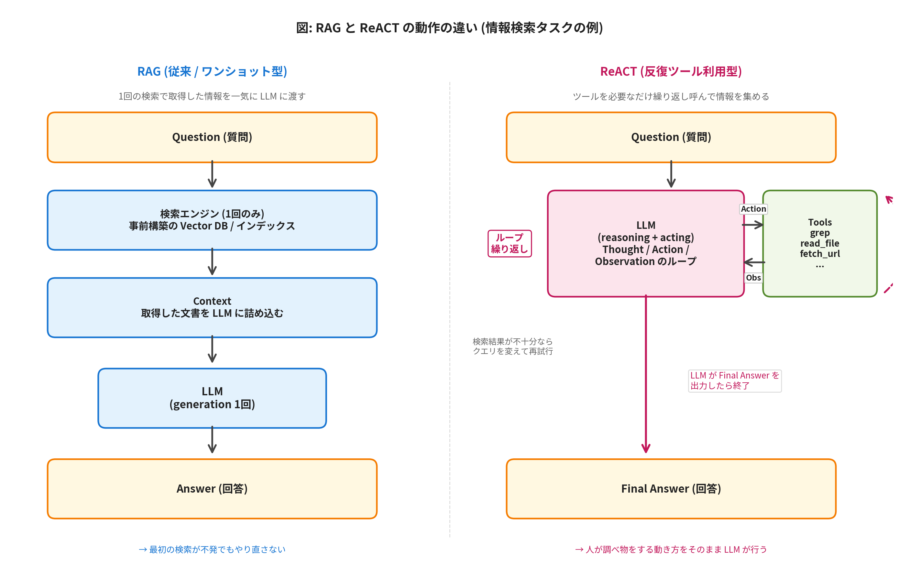
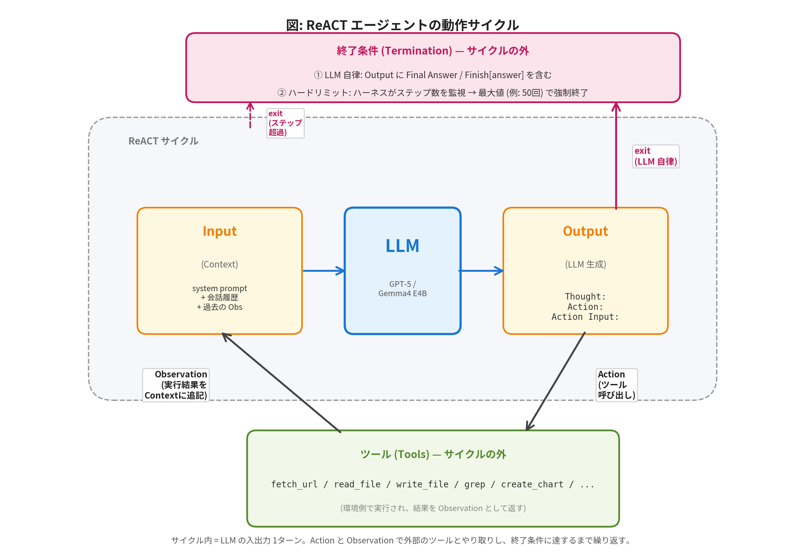
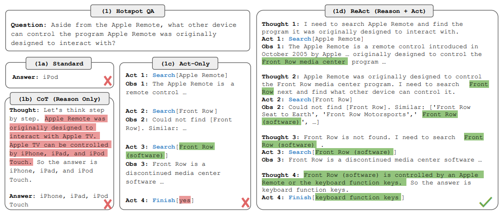
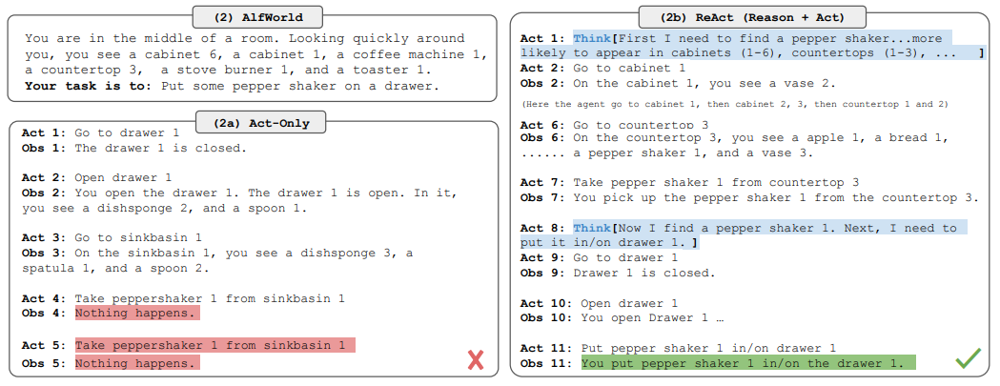
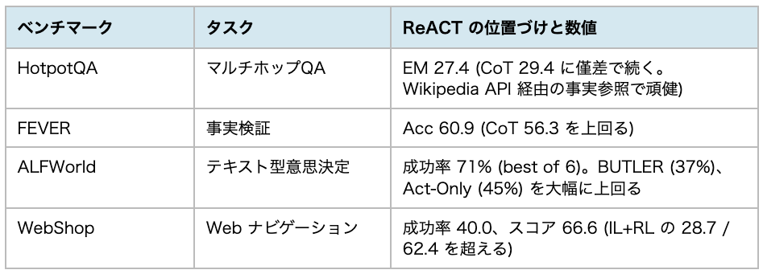
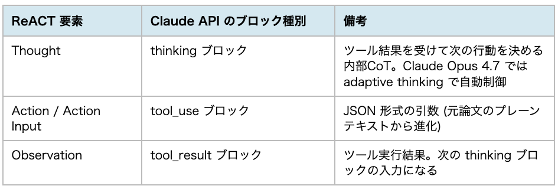
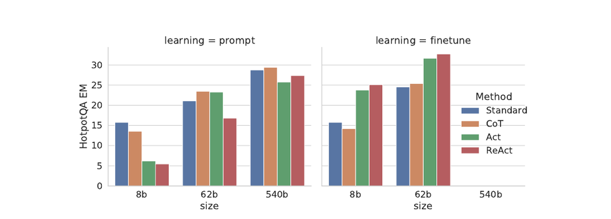
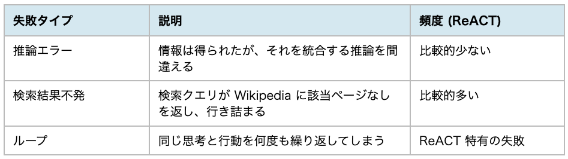
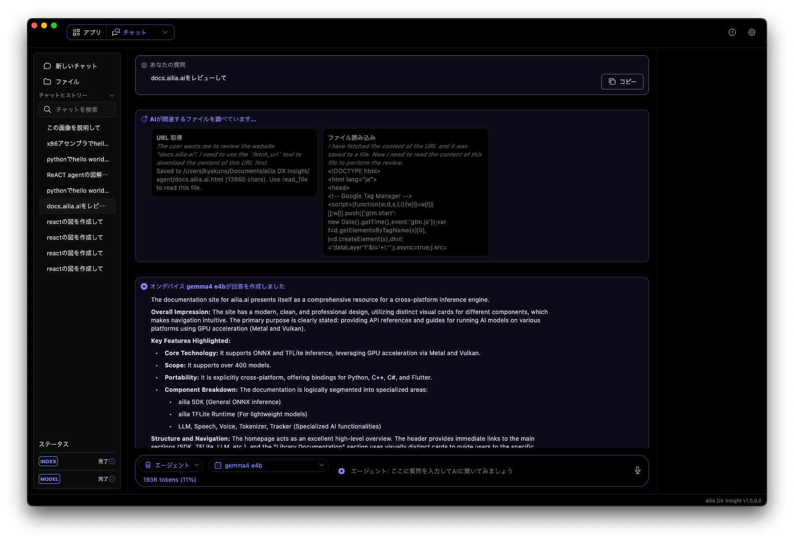
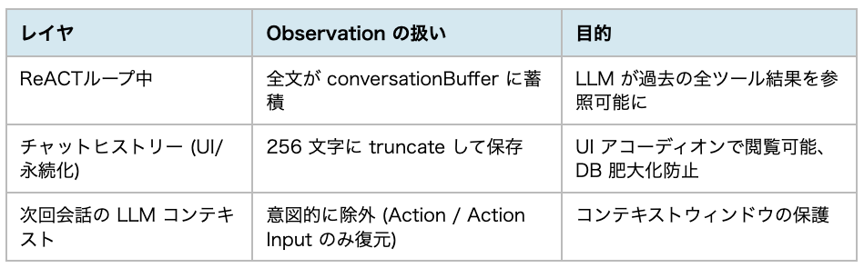

# ReACT : 推論と行動を融合するAIエージェントの基本パラダイム

# ReACT : 推論と行動を融合するAIエージェントの基本パラダイム

[](/@kyakuno?source=post_page---byline--212788dc72c0---------------------------------------)

[Kazuki Kyakuno](/@kyakuno?source=post_page---byline--212788dc72c0---------------------------------------)

40 min read

·

1 day ago

--

Share

ReACTは、現在のAIエージェント設計の出発点とも言える基本パラダイムです。本記事では、公式論文の詳細解説と、ローカルLLMでのReACTエージェント実装ノウハウを紹介します。

---

## 1. はじめに

2022年に発表された ReACT (Reasoning and Acting) は、現在のAIエージェント設計の出発点とも言える基本パラダイムです。ChatGPT登場以降のあらゆるエージェント実装 （LangChain、LangGraph、AutoGPT）、そして Claude Code のような最新のコーディングエージェントに至るまで 、 ReACT の「思考と行動を交互に繰り返す」という考え方を使用しています。

[## ReAct: Synergizing Reasoning and Acting in Language Models

### While large language models (LLMs) have demonstrated impressive capabilities across tasks in language understanding and…

arxiv.org](https://arxiv.org/abs/2210.03629?source=post_page-----212788dc72c0---------------------------------------)

ReACT が具体的に何をするものか、情報検索タスクの例で見てみましょう。

従来の RAG (Retrieval Augmented Generation) は、質問の処理を 「1 回」 で完結させる仕組みでした。質問が入ると、事前に構築された検索エンジン (ベクトル DB など) で関連文書を 1 回引いてきて、コンテキストに詰め込み、LLM に答えを生成させる — というワンショットの流れです。

これに対して ReACT は、LLM に grep や read\_file のような 「ツール」 を渡し、目的の情報に辿り着くまで何度でも検索を繰り返させます。最初の検索クエリで十分な情報が得られなければ、得られた手がかりから次の検索クエリを LLM 自身が考え直し、もう一度検索する。読み込んだファイルの一部だけが必要なら、grep で必要箇所だけを抜き出す。 — このように、人間が調べ物をするときの動き方をそのまま LLM に行わせるのが ReACT の本質です。

Press enter or click to view image in full size



*図: RAG (1回の検索で完結) と ReACT (ツールを繰り返し使う) の動作の違い*

本記事では、まず ReACT の公式論文 (Yao et al., ICLR 2023) を、論文の図を引用しながら詳細に解説します。その後、Claude Code を例に、現代のエージェント実装でなぜ 「ハーネス (harness) 」 と呼ばれる足回りの実装こそがプロダクトの差を決めるのかを解説します。最後に、ローカルLLMで ReACT エージェントを実装する過程で得られた、実装ノウハウを共有します。

## 2. ReACT 論文の詳細解説

### 2.1. 論文の位置づけ

ReACT は、Shunyu Yao 氏ら (Princeton University/ Google Research) が ICLR 2023 で発表した論文 **“ReAct: Synergizing Reasoning and Acting in Language Models”** ([arXiv:2210.03629](https://arxiv.org/abs/2210.03629)) で提案された手法です。当時のLLM研究では、**推論能力 (Reasoning)** と **行動能力 (Acting)** が別々のテーマとして発展していました。

推論能力の代表例は Chain-of-Thought (CoT) プロンプティング ([Wei et al., 2022](https://arxiv.org/abs/2201.11903)) です。「Let’s think step by step.」のように思考過程を言語化させることで、算術・常識・記号推論などのタスクで精度が向上することが知られていました。しかし CoT は静的なブラックボックスであり、モデルの内部表現のみで推論を行うため、外部世界と接続されておらず、知識の更新や事実検証ができません。結果として、もっともらしいが誤った情報を生成する 「ハルシネーション」 や、推論の途中で間違いが連鎖する 「エラー伝播」 が起きやすいという欠点がありました。

一方、行動能力の代表例は WebGPT、SayCan、ACT-1 などです。これらは事前学習済みLLMをプランニングや行動生成に使うアプローチで、テキストゲーム、Webナビゲーション、ロボティクスなどの環境でアクションを生成します。しかし、抽象的な高レベルゴールについて推論する仕組みや、長期にわたる行動を支えるワーキングメモリを持っていませんでした。

ReACT の核心的なアイデアは、この 2 つを 「同一プロンプトの中で交互に行わせる」 ことで、両者の弱点を相補的に克服することです。推論は行動計画の立案・更新・例外処理を助け、行動は外部知識へのアクセスを可能にして推論を地に足のついたものにします (reason to act / act to reason)。

### 2.2. ReACT の動作原理

ReACT エージェントは、形式的には以下のように定義できます。エージェントが環境と相互作用するタスク設定を考えます。 時刻 t において、エージェントは環境から観測 o\_t を受け取り、ある方策 π(a\_t|c\_t) に従って行動 a\_t を取ります。ここで c\_t = (o\_1, a\_1, …, o\_{t-1}, a\_{t-1}, o\_t) はエージェントのコンテキストです。

ReACT のシンプルですが本質的な拡張は、行動空間を A から Â = A ∪ L へと拡張することです。ここで L は言語空間であり、L から取られる行動 â\_t は 「思考(thought)」 または 「推論トレース(reasoning trace)」 と呼ばれます。思考は外部環境に影響を与えないため、観測フィードバックも生まれません。代わりに、現在のコンテキスト c\_t について推論し、有用な情報を構成してコンテキストを更新します(c\_{t+1} = (c\_t, â\_t))。

実装上は、毎ターン以下の 3 要素が生成されます:

- Thought: 何をすべきかの推論 (モデルの内部状態のみ更新)
- Action: 外部に対して取る行動 (ツール名)
- Action Input: 行動の引数 (URL、検索クエリ、ファイルパスなど)

これに対して環境(Environment)から Observation: (観測結果) が返り、それを次ターンの入力に含めて再度 Thought から生成する、というループを回します。

ループの終了条件は2つあります。

**(1) LLM 自律的な完了判断:** LLM 自身が 「もう十分な情報が集まった」 と判断したとき、Action として Finish[answer] (元論文の HotpotQA / FEVER) や Final Answer: を出力して、ループに完了を通知する。これは ReACT の本質的な設計で、停止のタイミングを LLM 自身に委ねる。

**(2) 最大ステップ数による強制終了:** 無限ループや暴走を防ぐため、ハーネス側で最大反復回数 (例: 50回) を設定し、それを超えたら強制終了する。論文の HotpotQA 実験では7ステップ、FEVER 実験では5ステップが上限として設定されていた (CoT-SC へのフォールバック条件) 。

(1) は 「タスクが解けたから終わる」 という正常終了、(2) は 「タスクが解けなかったから打ち切る」 という安全機構です。実装上はこの2つを組み合わせることで、エージェントが自律的に動きながらも暴走しない仕組みを作ります。

論文では PaLM-540B モデルを凍結したまま、few-shot in-context examples で ReACT のフォーマットを教え込む形式が中心です。つまり、追加の学習なしに、プロンプトの工夫だけでエージェント的振る舞いを引き出せる点が ReACT の大きな魅力です。

Press enter or click to view image in full size



*図: ReACT エージェントの動作サイクル。サイクル内では LLM の入出力 (Input → LLM → Output) が1ターン分。Action でサイクル外のツールを呼び出し、Observation を Context に追記して次のターンへ。終了条件はサイクルの外側で、(1) LLMが Final Answer を出力すれば正常終了、(2) ハーネスがステップ数を監視し最大値 (例: 50回) で強制終了します。*

重要なのは、 終了判定の責務が LLM 側とハーネス側に分離されている 点です。LLM は 「いつ完了とするか」 という意味的な判断 (Final Answer の発行) を担い、ハーネスは 「いくらなんでもこれ以上は続けない」 という機構的な保証 (ステップ数のカウント) を担います。この責務の分離が、エージェントを 「自律的に動くが暴走しない」 状態に保つための基本構造になっています。

### 2.3. 知識集約タスクでの応用 — HotpotQA と Figure 1 の詳細解説

ReACT 論文の最も有名な図が、Figure 1 (1) の HotpotQA タスクにおける 4 手法の比較です。HotpotQA は複数の Wikipedia 記事を組み合わせて答えるマルチホップ質問応答ベンチマークで、外部知識への正確なアクセスと多段階推論の両方が要求されます。

使われている質問は以下の通りです:

**Question:** Aside from the Apple Remote, what other device can control the program Apple Remote was originally designed to interact with?

(訳: Apple Remote以外で、Apple Remoteの操作対象のソフトウェアを、操作できる他のデバイスは何ですか？)

正解は keyboard function keys (キーボードのファンクションキー) です。Apple Remote は元々 Front Row というメディアセンターソフトウェアを操作するために設計されましたが、Front Row は Apple Remote 以外にもキーボードのファンクションキーで操作できます。

Press enter or click to view image in full size



*Figure 1 (1): HotpotQA における 4 手法の比較。Yao et al., “ReAct: Synergizing Reasoning and Acting in Language Models” (arXiv:2210.03629), Figure 1 より引用。*

(1a) Standard prompting

回答: 「iPod」。ファインチューニングや CoT なしで直接回答させた場合のベースラインです。完全に間違った答えを生成しています。

(1b) Chain-of-Thought (CoT, Reason Only)

推論のみのアプローチです。「Let’s think step by step」と促して内部知識で推論しますが、「Apple Remote was originally designed to interact with Apple TV」という事実誤認(ハルシネーション)を含んでしまっています(図中の赤色部分)。CoT は外部世界に接続されていないため、誤った前提を訂正する手段がなく、最終的に「iPhone, iPad, iPod Touch」という間違った答えに到達します。これは CoT の本質的弱点 — 内部知識のみに依存することで起きるハルシネーションとエラー伝播 — を象徴的に示しています。

(1c) Act-Only

行動のみのアプローチで、Wikipedia API (Search[entity], Lookup[keyword], Finish[answer]) を使えますが、思考(Thought)は生成しません。Apple Remote, Front Row, Front Row (software) と検索を続けて Front Row の情報には到達しますが、推論ステップがないため、得た情報をどう統合して最終回答に至るかが分からず、最終的に Finish[yes] という的外れな答えを出してしまいます。つまり、行動だけでは複数ステップの情報を統合する力が弱いことが示されています。

(1d) ReAct (Reason + Act) — 提案手法

ReACT は思考と行動を交互に行います。クエリに対する実際のチャットヒストリーは以下のようになっています。

```
Question : Aside from the Apple Remote, what other device can control the program Apple Remote was originally designed to interact with?  
  
Thought 1: I need to search Apple Remote and find the program  
it was originally designed to interact with.  
Act 1: Search[Apple Remote]  
  
Obs 1: The Apple Remote is a remote control introduced in October  
2005 by Apple … originally designed to control the  
Front Row media center program …  
Thought 2: Apple Remote was originally designed to control the  
Front Row media center program. I need to search  
Front Row next and find what other device can  
control it.  
Act 2: Search[Front Row]  
  
Obs 2: Could not find [Front Row]. Similar: ['Front Row Seat  
to Earth', 'Front Row Motorsports', 'Front Row  
(software)', …]  
Thought 3: Front Row is not found. I need to search  
Front Row (software).  
Act 3: Search[Front Row (software)]  
  
Obs 3: Front Row is a discontinued media center software …  
Thought 4: Front Row (software) is controlled by an Apple Remote  
or the keyboard function keys. So the answer is  
keyboard function keys.  
Act 4: Finish[keyboard function keys]
```

```
質問：Apple Remote以外で、Apple Remoteの操作対象のソフトウェアを、操作できる他のデバイスは何ですか？  
  
思考1：Apple Remoteを検索して、もともとそれと連携するように設計されたプログラムを見つける必要がある。    
行動1：Search[Apple Remote]  
  
観察1：Apple Remoteは、Appleによって2005年10月に導入されたリモコンであり、もともとFront Rowメディアセンター・プログラムを操作するために設計された。    
思考2：Apple RemoteはもともとFront Rowメディアセンター・プログラムを操作するために設計された。次にFront Rowを検索して、それを操作できる他のデバイスを見つける必要がある。    
行動2：Search[Front Row]  
  
観察2：[Front Row]が見つからなかった。類似項目：['Front Row Seat to Earth', 'Front Row Motorsports', 'Front Row (software)', …]    
思考3：Front Rowが見つからない。Front Row (software)を検索する必要がある。    
行動3：Search[Front Row (software)]  
  
観察3：Front Rowは廃止されたメディアセンター・ソフトウェアである。    
思考4：Front Row（ソフトウェア）はApple Remoteまたはキーボードのファンクションキーで操作される。したがって答えはキーボードのファンクションキーである。    
行動4：Finish[keyboard function keys]
```

特に注目すべきポイントは以下の3つです:

1. Thought 1 で「Apple Remote と、それが当初操作するプログラムを調べる必要がある」と計画を立てている。これにより最初の検索クエリが定まる。

2. Obs 2 で「Front Row」が見つからず、似た候補のリストが返ってきている。Thought 3 でこれを観測し、「Front Row (software)」へクエリを修正する例外処理を行う。これは推論なしの Act-Only では難しい挙動。

3. Obs 3 で得た本文情報から、Thought 4 で「Front Row は Apple Remote とキーボードのファンクションキーで操作できる」と推論し、正解にたどり着く。

ReACT の真価は、外部観測(Obs)に対して動的に推論(Thought)を更新できる点にあります。 検索が失敗したら検索クエリを修正する、新しい情報が得られたら計画を立て直す — これらの 「人間のような探索的思考」 が、 Thought: の一行を挟むだけのプロンプト工夫で実現されています。

### 2.4. 意思決定タスクでの応用 — ALFWorld と WebShop

ReACT は知識集約タスクだけでなく、長期にわたる意思決定タスクでも有効性が示されています。論文では2つのインタラクティブな意思決定ベンチマークが用いられました。

### ALFWorld — テキストベースの家事タスク

ALFWorld ([Shridhar et al., 2020b](https://arxiv.org/abs/2010.03768)) は、家庭内環境を模した合成テキストゲームで、「机のランプの下で紙を調べる」「ペッパーシェーカーを引き出しに置く」など、6種類の高レベルゴールが与えられます。エージェントはテキストアクション (例: go to coffeetable 1, take paper 2, use desklamp 1) で環境を操作します。1 タスク内に 50 以上の場所があり、エキスパート方策でも 50 ステップ以上を要するため、エージェントには 「サブゴール分解」 と 「探索戦略」 の両方が要求されます。

Press enter or click to view image in full size



*Figure 1 (2): ALFWorld における Act-only と ReAct の比較。Yao et al., “ReAct: Synergizing Reasoning and Acting in Language Models” (arXiv:2210.03629), Figure 1 より引用。*

Figure 1 (2) では、「ペッパーシェーカーを引き出しに置く」というタスクが与えられています。

### (2a) Act-Only での失敗

Act-Only エージェントは drawer 1 を開け、sinkbasin 1 を調べ、そこから pepper shaker を取ろうとしますが、シンクには pepper shaker が無いため Nothing happens. が返ります。それでもエージェントは同じ行動を繰り返してしまい(Act 5: Take peppershaker 1 from sinkbasin 1)、無限ループ的な失敗をします。

### (2b) ReAct での成功

ReAct エージェントは最初に Think[First I need to find a pepper shaker…more likely to appear in cabinets (1–6), countertops (1–3), …] という疎な思考トレースを生成し、ペッパーシェーカーが置かれていそうな場所の候補を 「常識推論」 で絞り込みます。

そのうえで cabinet 1 → 2 → 3 → countertop 1 → 2 → countertop 3 と探索を進め、countertop 3 で pepper shaker を発見します。ペッパーシェーカーを取った後、Think[Now I find a pepper shaker. Next, I need to put it in/on drawer 1.] と次のサブゴールに進み、最終的にタスクを完了します。

**意思決定タスクの設計思想:** 論文では QA タスクと違い、思考トレースを「疎に」挿入しています。毎ステップ思考を挟むと冗長になり、行動だけ続けると道を見失うというトレードオフの中で、「いつ思考しいつ行動するか」 を LLM 自身に判断させる設計です。これは現在のエージェント実装の標準的なパターンになっています。

### WebShop — 実世界のWeb環境

WebShop ([Yao et al., 2022](https://arxiv.org/abs/2207.01206)) は Amazon の商品 1.18M 件と人間のショッピング指示 12K 件からなる、より現実的なオンラインショッピング環境です。エージェントはユーザーの指示 (例: 「引き出し付きのナイトスタンドが欲しい。ニッケル仕上げで $140 以下」) を受けて、検索・商品選択・オプション選択・購入のWebインタラクションを行います。

ReACT は購入条件の解析と探索計画に推論を活用します。例えば 「’space-saving ottoman bench for living room’ という指示に対して、利用可能なオプションは ‘39x18x18inch’ と ‘blue’ で良さそうだ」 のような推論を挟むことで、Act-Only や IL/IL+RL ベースラインを成功率で +10% 上回りました。

### 2.5. 評価結果のまとめ

論文では4つのベンチマークで定量的な評価が行われました。代表的な結果を以下にまとめます:

Press enter or click to view image in full size



重要な点は、ReACT はわずか 1〜2 例の few-shot プロンプトでこの精度を達成していることです。ALFWorld では 10³〜10⁵ 件の訓練データで学習された模倣学習・強化学習ベースラインを大きく上回っており、プロンプトの工夫だけでベースモデルからエージェント的振る舞いを引き出せるという ReACT の強みが端的に示されています。

### 2.6. ReACT と CoT のハイブリッド戦略

### 2.6.1. 論文オリジナルのハイブリッド戦略

論文の見落とされがちな貢献の一つに、 ReACT と CoT-SC (Self-Consistency) の組み合わせ戦略があります。HotpotQA の結果を子細に見ると、ReACT (27.4) と CoT (29.4) は僅差で、それぞれ得意・不得意があります。

そこで論文では以下の2つのハイブリッド戦略が提案されています:

1. **ReAct → CoT-SC:** ReACTを所定ステップ数 (HotpotQAで7、FEVERで5) 実行しても答えに到達できない場合、CoT-SC にフォールバック。

2. **CoT-SC → ReAct:** CoT-SC で n 個のサンプルを生成し、多数派の答えが n/2 未満しか出ない場合 (= 内部知識で確信が持てない場合)、ReAct にフォールバック。

これらのハイブリッド戦略により、HotpotQA で 34.2、FEVER で 64.6 と、単独手法よりさらに高い精度を達成しました。「内部知識で十分なときは推論、不確実なときは外部参照」という切り替え戦略は、現在のRAG (Retrieval Augmented Generation) システム設計にも通じる重要な視点です。

### 2.6.2. 現代の主流: 「思考をツール呼び出しの間に挟む」インターリーブ型

論文発表から3年が経過した2026年現在、ReACT と CoT の組み合わせは「現代エージェント実装のデファクトスタンダード」になっています。ただしオリジナル論文のような「フォールバック型」ではなく、「Thought (CoT的推論) と Action (ツール呼び出し) を交互に挟むインターリーブ型」として実装されているのがポイントです。これは原論文で提示された ReACT のフォーマット (Thought: → Action: → Action Input:) と本質的に同じ思想ですが、実装レイヤがプロンプトからモデルAPIに上がっています。

**業界の収束点:** 現代の主要なエージェント実装は、ほぼ例外なく 「ツール呼び出しの間に推論ステップ (CoT) を挟む」 形に収束しています。 これは ReACT 論文のシンプルなアイデアが、近年の Reasoning Model (思考特化モデル) の登場により再びスポットライトを浴びている形です。

### 2.6.3. Claude Code の場合: Extended / Adaptive Thinking + Interleaved Thinking

Claude Code は Anthropic の **Extended Thinking / Adaptive Thinking** 機能を活用しており、これがまさに ReACT + CoT のハイブリッドそのものです。[Claude 4 系のモデル](https://platform.claude.com/docs/ja/build-with-claude/extended-thinking)は **インターリーブ思考 (Interleaved Thinking)** をサポートしており、ツール呼び出しと次のツール呼び出しの間に thinking ブロックを挟んで内部推論を行えます。

Claude API のレスポンス構造を見ると、ReACT の3要素がモデルAPIレベルで第一級にサポートされていることが分かります:

Press enter or click to view image in full size



Adaptive Thinking モードでは、Claude がリクエストの複雑さを評価して 「思考すべきか / どこまで深く思考すべきか」 を自動判断します。これは原論文 ALFWorld で議論された 「思考トレースを疎に挿入する」 という設計思想を、モデル側に内在化したものと見ることができます。つまり Claude Code のハーネスは、ReACT ループのうち 「いつ Thought を生成するか」 をモデル自身に委ねている、という新しいデザインを採用しています。

### 2.6.4. Anthropic の “think” ツール: ReACT ループ内に明示的な CoT ステップ

より明示的なハイブリッド実装として、Anthropic は “think” ツールというパターンを推奨しています。これは Claude が応答生成中に立ち止まって考えるためのツールで、長いツールチェーンや複数ステップ会話で特に有効です。

Anthropic の社内ベンチマーク τ-bench での結果が興味深く、航空会社ドメインのタスクで “think” ツールと最適化プロンプトを組み合わせると、ベースラインの 0.370 から 0.570 へと 54% の相対的改善が報告されています。これはまさに 「ReACT ループの中に明示的な CoT ステップを差し込む」 ことの効果を、現代のモデルで再確認した結果と言えます (出典: [Anthropic Engineering Blog: The “think” tool](https://www.anthropic.com/engineering/claude-think-tool)) 。

**Extended Thinking と “think” ツールの違い:** Extended Thinking は応答生成 「前」 の深い計画 (タスク開始時の planning に近い) 。 一方 “think” ツールは応答生成 「中」 にループの一ステップとして発火する CoT (ReACT の Thought に近い) 。 Claude Code は両方を併用することで、長期タスクと短期判断の両方をカバーしています。

### 2.6.5. LangGraph の場合: function\_calling 型 ReAct

LangGraph (LangChain) の [create\_react\_agent](https://reference.langchain.com/python/langgraph.prebuilt/chat_agent_executor/create_react_agent) は、現代では原論文の Thought:/Action:/Observation: プロンプト形式から、OpenAI / Anthropic の function calling (tool calling) ベースの実装に進化しています。第一世代の ReAct エージェントが Thought / Action / Observation のプロンプト技法を使っていたのに対し、現代のエージェントは function calling で think-act-observe ループを実装するのが主流です。

推論モデル (Claude Sonnet 4.6 や Opus 4.7、OpenAI o1 など) を LangGraph で使う場合、関数呼び出しの間にモデル内蔵の推論プロセスが自動的に走るため、実質 ReACT + CoT のハイブリッドが透過的に実現されます。LangGraph 側はツール呼び出しのループ制御、状態管理、永続化、人間介入 (human-in-the-loop) などを担当し、CoT 部分はモデルに任せるという 「役割分担」 ができています。

### 2.7. ファインチューニング結果

論文の後半では、ReACT 形式の対話履歴でLLMをファインチューニングする実験も行われています。Figure 3 はその結果で、PaLM-8B / 62B / 540B でプロンプティングとファインチューニングの両方を比較しています。

Press enter or click to view image in full size



*Figure 3: HotpotQA における ReACT とベースラインのスケーリング結果。Yao et al., “ReAct: Synergizing Reasoning and Acting in Language Models” (arXiv:2210.03629), Figure 3 より引用。*

特筆すべき発見は以下の通りです。

- プロンプティングのみの場合: 小モデル (8B) ではすべての手法で精度が低く、ReACT も Act もほぼ機能しない。モデルサイズ 540B でようやくCoT/ReACTの差が見えてくる。
- ファインチューニングの場合: ReACT はすべてのモデルサイズで他手法を上回る。62B の ReACT-finetuned は 540B の prompted モデルを上回る精度を出している。
- 結論: ReACTフォーマットは構造化されているため、ファインチューニング時の学習効率が高い。少数の高品質トラジェクトリで小モデルを賢いエージェントに変えられる。

なお、この研究は2022年のものであり、近年のモデルは、ReACTに近いフォーマットも事前学習に含まれていると考えられ、ファインチューニングの効果は薄いと考えられます。また、近年の8Bモデルは精度が大幅に改善しているため、ReACTを動かすことも可能になってきています。

## 2.8. ReACT の限界と失敗モード

論文には率直に失敗例も掲載されています。HotpotQA における主要な失敗モードは以下の通りです。

Press enter or click to view image in full size



また、ReACT は few-shot プロンプティングで動かす手法のため、タスクごとに 「人間が手で書いた理想的な思考と行動のトラジェクトリ」 をプロンプトに数個含める必要があります。例えば HotpotQA 用、ALFWorld 用、業務ドメイン X 用といったように、タスクが変わるたびに人間が Thought の中身を言語化して書き起こす作業が必要で、これがプロンプト設計コスト (現代的に言えばプロンプトエンジニアリングの工数) として発生します。

一方で論文は前向きな解釈も提示しています。ReACT のフォーマットは人間が容易に検査・修正できるため、思考の数行を書き換えるだけでエージェントの挙動を補正できる、という新しい可能性です。

## 3. なぜ今 「ハーネス」 が重要なのか — Claude Code に見るハーネス重視の潮流

### 3.1. LLM 競争構造の変化とオープンモデルの追従

LLM 開発のフロンティアは、依然として激しい競争状態にあります。OpenAI、Anthropic、Google を中心に、数千億ドル規模の投資が続いており、新規参入の障壁は高いままです。

しかしフロンティアの背後で起きている重要な変化が、 「オープンモデルの追従」 です。

- Gemma (Google)、Qwen (Alibaba)、DeepSeek 系のオープンモデルが、フロンティアモデル発表から半年〜1年遅れで実用水準の精度に到達してきている
- 実用領域 (コーディング、QA、要約、エージェント的タスク) では、最新オープンモデルがフロンティアの数世代前と十分肩を並べる
- ローカル実行を選べばランニングコストはほぼゼロ。エッジで動かす選択肢も現実的になりつつある

この構造から見えるのは、 「フロンティアモデルそのもので勝負するのは難しいが、追従してくるオープンモデルを活用してドメイン特化のハーネス層を設計するところには、大きなビジネスチャンスがある」 という構図です。具体的には以下のような領域:

- オフライン / エッジ / プライバシー要件のあるエンタープライズ用途
- 業務固有のツール統合 (社内システム、CRM、設計ツール、業界特化ワークフロー)
- デバイス実装 (産業機器、車載、ロボット)

これらは、フロンティアモデル単体では解けず、ハーネス層の作り込みで初めて実用化される領域です。本記事で取り上げる Claude Code (フロンティアモデル + 高度なハーネス) は、コーディングというドメインに特化し、この機会を取りに行っている代表例だと考えられます。

### 3.2. Claude Code は 「ハーネス」 が強い

Claude Code は Anthropic の Claude モデル向けに最適化されたコーディングエージェントですが、強さの源泉は、モデルだけでなく、その周りの ハーネス(harness) にあります。ハーネスとは、LLM という「エンジン」を実際に走らせるための車体・ステアリング・ブレーキ・燃料系・ダッシュボード — つまりエージェントを実用化するための足回り全体を指します。

Claude Code が高品質に動作する理由として、以下のようなハーネス側の作り込みが指摘されています。特に、LLM はコンテキスト長に制限があるため、いかにコンテキストを減らすかが現代エージェント設計の中心テーマになっています。

- **ツール出力の容量管理**: MCP ツール出力には既定で 25,000 トークンの上限が設けられ、10,000 トークンで警告が出る。大きな結果はディスクに永続化してコンテキストには乗せない。
- **自動コンパクション**: コンテキストが約 98% に達した段階で、過去履歴を要約して空きを作る。
- **サブエージェント**: 依存関係のないタスクをサブエージェントに移譲し、メインのコンテキスト増加を抑える。
- **Skill**: 豊富なプリセットコマンドをオンデマンドで読み込む仕組み。MCP ツール定義が常にコンテキストを占める問題を解消する。
- **プランニング**: コード変更前にプランを生成して見通しを立てる。これはコンテキスト削減とは別軸ですが、長期タスクを構造化することで後段のサブステップが過去の試行を読み返さずに済む副次効果もある。
- **権限境界・ツール dispatch・反復回数の上限**: エージェントが暴走しないためのガードレール。

### 3.3. これからのエージェント開発: モデル選定 → ハーネス設計

オープンモデルの追従によってエッジデバイスでのエージェントの実用化が可能にあると、開発者の関心は次のような点に移ります:

- ツール呼び出しの形式をどう統一するか (JSON vs プレーンテキスト、tool\_use vs プロンプト形式)
- 巨大な観測結果 (HTML、ログ、コードベース) をコンテキストに溢れさせない仕組み
- パースエラー・実行エラーをどうリトライ可能なObservationに変換するか
- マルチターン会話の履歴を、必要な情報だけ残してどう truncate するか
- ローカル LLM のフォーマット逸脱をどうフィルタ・補正するか
- 複数のLLM (クラウド/ローカル) を切り替えるとき、プロキシ層を介在させるかどうか
- ユーザに進捗をリアルタイムで可視化する UX

これらは ReACT の 「Thought / Action / Observation」 というシンプルなループを実装に落とした時のエンジニアリング課題です。

次章では、アイリア株式会社が ailia DX Insight に ReACT エージェントを実装する過程で実際に遭遇した課題と、その対策を共有します。

## 4. ailia DX Insight における ReACT エージェント実装ノウハウ

ailia DX Insight は、ChatGPT・Gemini などのクラウド LLM と、ailia LLM によるローカル LLM を組み合わせて使える Windows / macOS 向けの DX ネイティブアプリです (<https://ailia.ai/dx/>) 。

ailia DX Insightは、2026年夏にReACTエージェント機能の搭載を予定しており、ChatGPT5とGemma4 E4Bの両方で統一的にReACTを実装しました。LLM間の違いを吸収するために、Function Callではなく、元論文に近いプロンプトベースでReACTを実装しています。

Press enter or click to view image in full size



Gemma4 E4BでReACTエージェントを実行する例、ユーザのリクエストに対して、fetch\_urlを自律的に実行し、回答を生成する

ローカルLLMでReACTを動かすための実装のポイントを解説します。

### (1) ツール引数の入力形式: プレーンテキスト vs JSON

ReACT の元論文ではツール引数をプレーンテキストで渡しますが、実装では引数のパースが曖昧になります。例えば fetch\_url の引数を文字列にすると、LLM が URL の後ろにコメントを付加してパースエラーになります。

```
# NG: プレーンテキスト - LLM が URL の後にコメントを付けてしまう  
Action Input: https://example.com (this is the target URL)  
# OK: JSON - 構造が明確でパースが確実  
Action Input: {"url": "https://example.com"}
```

**対策:** LangGraph 等のフレームワークに合わせ、ツール引数を JSON 形式に統一しました。

### (2) fetch\_url のコンテキスト溢れ

fetch\_url で Web ページの内容を直接 Observation として返すと、HTML が巨大すぎてコンテキストが溢れます。

**対策:** fetch\_url は HTML をファイルに保存し、ファイルパスのみを Observation として返す方式に変更。エージェントは必要に応じて read\_file や grep で必要部分だけを読みます。

```
# 変更前: Observation に HTML 全文が入りコンテキスト圧迫  
Observation: <html>…(数万文字のHTML)…</html>  
# 変更後: ファイルパスのみ返し、必要な部分だけ read_file で読む  
Observation: Saved to /agent_dir/example_com.html  
→ エージェントが read_file で必要箇所のみ読み込む
```

### (3) エージェントがユーザに確認ばかりする

LLM が 「〜してもよいですか？」 とユーザに確認を求めるだけで、自律的に作業を進めない問題がありました。

**対策:** システムプロンプトに自律動作の指示を明記しました。

```
- Do NOT ask the user questions. Complete the task autonomously.
```

### (4) エラー時にループが停止する

ツール実行エラーや空レスポンスが発生すると、そこでエージェントが停止してしまいます。

**対策:** エラーを Observation として LLM に返し、LLM 自身にリトライさせます。例外を投げず、エラーメッセージを会話バッファに追記してループを継続します。

```
// ツール実行エラー → Observation として返す  
conversationBuffer.writeln('Observation: Error: Tool execution failed: $e');  
continue; // ← ループは停止せず継続  
  
// 空レスポンス → LLM にリトライを促す  
conversationBuffer.writeln(  
'Observation: Error: LLM returned empty response. Please try again.');  
continue;
```

### (5) パースエラー時の処理

LLM の応答が ReACT フォーマットに従わない場合、Final Answer として扱ってしまうと中途半端な出力がユーザに返されてしまいます。

**対策:** パースエラーを Observation として返し、正しいフォーマット例を添えてリトライさせます。

```
// パースエラー → フォーマット修正を促すメッセージを Observation として返す  
final parseErrorMessage =  
'Error: ${step.content}\n'  
'You must use exactly this format:\n'  
'Thought: your reasoning\n'  
'Action: tool_name\n'  
'Action Input: {"key": "value"}';  
conversationBuffer.writeln('Observation: $parseErrorMessage');  
continue;
```

### (6) チャットヒストリーのコンテキスト不足

チャットヒストリーに read\_file 等の Observation 全文を含めると、数ターンでコンテキストウィンドウが溢れます。

**対策:** チャットヒストリーの再構築時に Observation を除外し、Action / Action Input のみを復元。DB 永続化時は 256 文字に truncate します。

### (7) LLM が生成する JSON の不正エスケープ

LLM が write\_file で SVG や HTML を出力する際、JSON 文字列値内の特殊文字 (<, >, “, 改行等) をエスケープし忘れて jsonDecode が失敗します。

**対策:** JSON 解析失敗時にフォールバックパースを実行。キー位置ベースの逆方向探索で値の終端を特定し、値の中身を jsonEncode で正しくエスケープし直します。

```
// JSON パース失敗 → 自動エスケープ補正してリトライ  
try {  
  return jsonDecode(input);  
} catch (_) {  
  // キー位置を正規表現で特定し、値を jsonEncode で再エスケープ  
  final escaped = _escapeJsonValues(input);  
  return jsonDecode(escaped);  
}
```

### (8) ファイルパスの補完

LLM がファイル名のみ (パスなし) を指定した場合、ツールがファイルを見つけられない問題がありました。

**対策:** 全ツールでファイル名のみの場合に、エージェントの作業ディレクトリを自動補完します。

### (9) 処理中ステップの可視化

ReACT は複数ステップを順に実行するため時間がかかります。ユーザは現在何をしているのか分からず不安になります。

**対策:** 各ステップ (Thought / Action / Observation / Compaction / Parse Error) をリアルタイムで UI のアコーディオンカードに表示。コンテキスト使用率とステップ数もクエリバーに表示します。

```
Step 3 / Context: 45% (12,000 chars) ← クエリバー表示
```

### (10) ツール呼び出し形式の逸脱

Gemma4 等のローカル LLM が Action: ではなく call:tool\_name{…} や <tool\_call> タグでツールを呼び出してしまう問題がありました。

**対策:** 2つのアプローチで対処しました。

1. **システムプロンプトの強化:** 禁止する形式を明示し、具体的なフォーマット例を記載

2. **ストリームフィルタ:** LLM の出力ストリームから <|tool\_call> タグを除去 (タグのみ除去し中身は保持)

```
## Rules (システムプロンプトより)  
- Do NOT use function call syntax like `call:tool_name{…}` or `<tool_call>`.  
- Do NOT wrap your response in XML tags or markdown code blocks.
```

### (11) フォーマット遵守能力の限界

小規模 LLM は ReACT フォーマット (Thought: → Action: → Action Input:) に正確に従えないことがあります。

**対策:** システムプロンプトを小規模 LLM でも従いやすいよう強化。ルールをシンプルかつ明示的に記述し、具体例を含めます。パースエラー時のリトライで正しいフォーマットを再提示します。

```
## Response Format  
  
To use a tool, respond with EXACTLY these three lines:  
Thought: <your reasoning>  
Action: <tool_name>  
Action Input: <JSON object>  
  
Example:  
Thought: I need to write the content to a file.  
Action: write_file  
Action Input: {"path": "example.md", "content": "Hello, World!"}
```

### 4.4. コンテキスト管理の三層構造

ailia DX Insight の ReACT エージェントでは、Observation の扱いを以下の三層に分けて管理しています。これによりLLMコンテキストの肥大化と、UI の利便性、DB 肥大化の防止を両立しています。

Press enter or click to view image in full size



## 5. まとめ

本記事では、ReACT の公式論文を詳細に解説した上で、フロンティアモデル + ハーネスの代表例として Claude Code、オープンモデルを含む ローカルLLM断 + ハーネスの実装例として ailia DX Insight を取り上げました。

- ReACT は 「Thought → Action → Observation」 のシンプルなループ
- 論文の核心は CoT のハルシネーション問題と Act-Only の推論不足を相補的に解決した点。さらに ReACT + CoT-SC ハイブリッド、ファインチューニング戦略、人間整合の視点なども提示している
- ReACT + CoT のハイブリッドは現代エージェント実装のデファクトスタンダードになっており、Claude Code の interleaved thinking、Anthropic の “think” ツール、LangGraph の function calling 型 ReAct がその代表例。Thought ステップが 「プロンプト」 から 「モデルAPIの thinking ブロック」 へとレイヤを上げて実装されている
- 2026年現在、エージェント開発の主戦場は 「どの LLM を選ぶか」 単体ではなく、 「フロンティアまたは追従するオープンモデルをどう走らせるか (=ハーネス設計)」 に重みが移っている
- Claude Code はこの潮流を最も象徴する例で、コンパクション、出力サイズ管理、サブエージェント、権限境界などのハーネス側の作り込みが品質を決めている
- Gemma4 E4BクラスでもReACTループを実装可能になってきており、エッジデバイスへの実装に実現性が出てきている

---

AI エージェントを業務に組み込みたい、ローカル LLM で動くエージェントを構築したい、既存のエージェントの安定性や応答品質を改善したい — そういったご相談がありましたら、ぜひ アイリア株式会社 まで[お問い合わせ](https://ailia.ai/contact/)ください。 ReACT ループ実装、コンテキスト管理、ローカル LLM 対応、ツール統合、可視化 UX など、エージェントハーネスの設計・実装ノウハウをもとに、お客様のユースケースに最適なソリューションをご提案いたします。

---

アイリア株式会社はAIを実用化する会社として、クロスプラットフォームでGPUを使用した高速な推論を行うことができるailia SDKを開発しています。アイリア株式会社ではコンサルティングからモデル作成、SDKの提供、AIを利用したアプリ・システム開発、サポートまで、 AIに関するトータルソリューションを提供していますのでお気軽に[お問い合わせ](https://ailia.ai/contact/)ください。